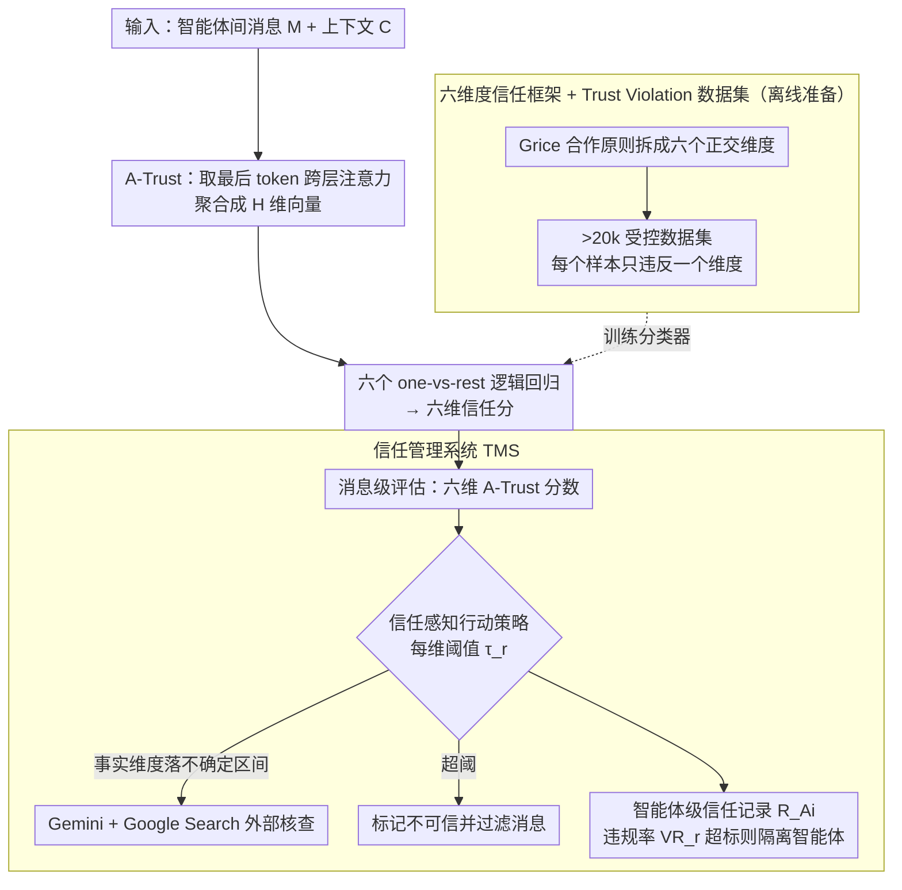

# To Trust or Not to Trust: Attention-Based Trust Management for LLM Multi-Agent Systems

**会议**: ACL 2026  
**arXiv**: [2506.02546](https://arxiv.org/abs/2506.02546)  
**代码**: [GitHub](https://anonymous.4open.science/r/multi-com-1808)  
**领域**: 可解释性 / 多智能体安全  
**关键词**: LLM多智能体信任管理, 注意力模式分析, 信任度评估, 恶意消息检测, 可信通信

## 一句话总结

本文为 LLM 多智能体系统（LLM-MAS）提出首个全面的"可信度"定义（基于 Grice 合作原则的六个正交维度），发现 LLM 的注意力模式可区分不同类型的可信度违规，据此设计了轻量级的 A-Trust 评估方法和端到端的信任管理系统（TMS），在多种攻击下将恶意消息检测率提升至 77-90%。

## 研究背景与动机

**领域现状**：LLM 多智能体系统在代码生成、数学推理、科学模拟等任务上展现了强大能力，Agent2Agent (A2A) 协议日趋流行。然而，LLM agent 对所有输入信息不加区分地接受——缺乏人类通常具备的信息审查能力。

**现有痛点**：(1) LLM-MAS 极易被恶意消息攻击——包括通信拦截攻击（AiTM）、自动注入攻击（AutoInject）、网络安全攻击（NetSafe）等；(2) 现有工作仅关注单一方面的可信度（如事实正确性或逻辑一致性），缺乏系统化的多维度评估框架；(3) 基于提示的信任评估受幻觉影响，外部验证工具引入延迟且依赖外部数据质量。

**核心矛盾**：LLM 的注意力模式实际上已经"感知"到了不可信信息（注意力权重显著升高），但模型的最终输出未能利用这一信号——注意力模式与输出之间存在失配（一种幻觉形式）。

**本文目标**：(1) 建立多维度的可信度定义框架；(2) 利用 LLM 内部注意力信号进行高效的可信度评估；(3) 构建端到端的信任管理系统。

**切入角度**：从 Grice 合作原则出发定义六个信任维度，发现不同维度的违规在 LLM 注意力模式上产生独特的 pattern——某些注意力头专门对特定违规类型敏感。

**核心 idea**：从 LLM 的多头注意力权重中提取跨层聚合的特征向量，训练轻量级逻辑回归模型对六个信任维度分别评分，构建消息级+智能体级的信任管理系统。

## 方法详解

### 整体框架

系统分三层：(1) **信任维度定义 + Trust Violation 数据集**——六维度框架和 >20k 样本的受控数据集；(2) **A-Trust 评估**——基于注意力向量的轻量级分类器；(3) **TMS 信任管理**——消息级评估 → 信任感知行动策略 → 智能体级信任记录。

### 关键设计

**1. 六维度信任框架 + Trust Violation 数据集：先把「可信」拆成互不重叠的六件事，再造出能逐维分析的数据**

现有信任评估的最大麻烦是数据里的不可信样本往往同时违反好几个维度，导致没法说清「模型到底对哪种问题敏感」。本文从 Grice 合作原则出发，把可信度拆成六个正交维度——事实准确性、逻辑一致性、相关性、偏见、语言质量、清晰度，并构建一个 >20k 样本的受控数据集，关键约束是**每个不可信样本只违反一个维度**。其中事实维度复用 FEVER、偏见维度复用 StereoSet，其余四个维度用 GPT-4o 生成。正因为做到了单维度违规，后续「哪个注意力头对应哪个维度」的分析才有干净的因变量，否则混杂违规会让任何注意力归因都无法解释。

**2. A-Trust 注意力信任评估：不信模型嘴上说什么，只读它内部注意力分给了哪里**

基于提示的信任评估会被幻觉污染，外部验证又慢又依赖数据质量，而本文发现一个更可靠的内部信号——LLM 读到不可信消息时会给它分配显著更高的注意力。A-Trust 把这个观察变成特征：对消息 $M$ 和上下文 $C$，取最后一个 token 对消息 token 的注意力权重，沿层维度聚合成每个头一个标量

$$Attn^h(M) = \text{Mean}(\{Attn^{l,h}(M)\}_{l=1}^{L}),$$

拼成一个 $H$ 维特征向量后，对六个维度分别训练 one-vs-rest 逻辑回归分类器 $(f_{\text{fact}}, \dots, f_{\text{clarity}})$，每个输出落在 $[0,1]$ 作为该维度的信任分。之所以用逻辑回归而非更重的模型，是因为分析显示特定注意力头本就对特定维度专门化（head 2 管相关性、head 21 管清晰度、head 27 管质量），信号已经很线性可分，轻量分类器就够且能实时部署。

**3. 信任管理系统（TMS）：把单条消息的打分，升级成能过滤消息、还能隔离智能体的闭环**

光有一条消息的可信度分数不足以保护整个系统，TMS 用三个组件把它接成端到端防御。其一是**消息级评估**，对每条智能体间消息算出六维 A-Trust 分数；其二是**信任感知行动策略**，为每个维度设阈值 $\tau_r$，超阈即标记为不可信并过滤，其中事实维度采用双阈值——落在不确定区间时再调用 Gemini-2.0-flash + Google Search 做外部核查；其三是**智能体级信任记录**，为每个智能体维护带时间戳的记录 $R_{A_i}$，按时间窗口统计违规率 $VR_r$ 做周期性评估。消息级负责实时拦截，智能体级负责长期画像，两者叠加才能既挡住单条恶意消息、又把屡次作恶的智能体直接隔离出网络。

### 一个完整示例：一条恶意消息如何被拦下

假设某智能体 $A_3$ 在 Chain 拓扑里发出一条被 AiTM 攻击篡改过的消息。TMS 先把这条消息连同上下文喂给 LLaMA3.1-8B，取出最后 token 的跨层注意力，得到 $H$ 维向量；六个逻辑回归分类器分别打分，发现「事实准确性」维度得分落在不确定区间，于是触发双阈值策略，调 Gemini + Google Search 核查后确认事实错误，这条消息被标记不可信并过滤，不会进入下游智能体的上下文。与此同时，这次违规写进 $A_3$ 的信任记录 $R_{A_3}$；当时间窗口内 $A_3$ 的违规率 $VR_r$ 持续超标，智能体级评估就把它判为恶意智能体并隔离——论文中这一级在所有攻击上做到了 100% 的恶意智能体检测率（ADR）。

### 损失函数 / 训练策略

A-Trust 用逻辑回归，无需复杂训练。每个维度按 one-vs-rest 采样 1500 个正例加等量负例，注意力矩阵由 LLaMA3.1-8B-Instruct 提取。

## 实验关键数据

### 主实验

**恶意消息检测率 MDR（Chain 拓扑，%）**

| 数据集 | 方法 | AiTM ↑ | AutoTrans ↑ | AutoInj ↑ | NetSafe ↑ | Clean ↓ |
|--------|------|--------|------------|----------|----------|---------|
| MMLUPhy | A-Trust | **84.3** | **77.5** | **90.1** | **79.6** | 7.1 |
| | PPL | 43.1 | 51.8 | 57.9 | 50.5 | 4.8 |
| | Prompt | 52.9 | 57.7 | 55.3 | 50.3 | 9.4 |
| MATH | A-Trust | **84.1** | **79.3** | **85.6** | **80.4** | 7.3 |
| | PPL | 52.4 | 54.2 | 53.1 | 57.3 | 4.7 |
| | Prompt | 62.9 | 60.7 | 61.8 | 64.9 | 7.5 |

**攻击成功率 ASR（Chain 拓扑，%，↓更好）**

| 数据集 | 配置 | Clean | AiTM | AutoTrans | AutoInj | NetSafe |
|--------|------|-------|------|-----------|---------|---------|
| MMLUPhy | No trust | 41.7 | 92.5 | 69.3 | 62.6 | 67.7 |
| | A-Trust TMS | 43.8 | **14.1** | **51.4** | **47.1** | **46.4** |
| MATH | No trust | 47.6 | 93.6 | 69.8 | 67.2 | 68.2 |
| | A-Trust TMS | 50.6 | **18.4** | **54.2** | **55.2** | **59.2** |

### 消融实验

- 智能体级信任记录策略在所有攻击上实现 100% 的恶意智能体检测率（ADR）
- A-Trust 在六个维度上都展现了清晰的违规/非违规分离，prompt-based 方法在多个维度上几乎无法区分（存在幻觉）
- 在 Chain/Complete/Tree 三种拓扑结构下，A-Trust 均大幅领先 PPL 和 Prompt 基线

### 关键发现

- LLM 对不可信消息的注意力显著高于正常消息——模型"感知"到了异常但未能利用
- 特定注意力头对特定信任维度有专业化响应（head 2→相关性，head 21→清晰度，head 27→质量）
- Prompt-based 信任评估存在严重幻觉——注意力内部信号比模型输出更可靠
- AiTM 攻击的 ASR 从 92.5% 降至 14.1%，降幅最大，证明 DoS 类攻击的消息模式最容易被注意力识别

## 亮点与洞察

- "LLM 已感知到不可信但未能利用"的发现揭示了注意力机制与输出之间的失配——这是一种新的幻觉形式
- 基于 Grice 合作原则的六维度框架为 LLM-MAS 安全研究提供了标准化的评估语言
- 逻辑回归 + 注意力向量的极简设计优于 GPT-4o 的提示评估——简单方法胜于复杂 prompting

## 局限与展望

- Trust Violation 数据集由 GPT-4o 生成（四个维度），可能存在分布偏差
- 自适应攻击者可能学会规避特定注意力模式，鲁棒性需进一步评估
- 阈值策略相对简单，未考虑维度间的相关性
- 仅在 LLaMA3.1-8B 上训练 A-Trust，跨模型泛化性未充分验证

## 相关工作与启发

- **vs 困惑度评估**: 困惑度是单一标量，无法区分不同类型的可信度违规；A-Trust 提供六维度细粒度评估
- **vs Prompt-based 评估**: 受 LLM 幻觉影响，在多个维度上无法区分违规与正常消息
- **vs FEVER/StereoSet**: 这些数据集仅覆盖事实/偏见单一维度；Trust Violation 数据集是首个六维度受控基准
- **vs NetSafe**: NetSafe 关注攻击方法，本文关注防御——两者互补

## 评分

- 新颖性: ⭐⭐⭐⭐⭐ 首个基于注意力模式的 LLM-MAS 信任管理框架，六维度定义填补空白
- 实验充分度: ⭐⭐⭐⭐⭐ 4种攻击×4个数据集×3种拓扑+对比3种基线+智能体级评估+MetaGPT案例
- 写作质量: ⭐⭐⭐⭐ 框架完整，注意力分析可视化有说服力
- 价值: ⭐⭐⭐⭐⭐ 为 LLM-MAS 安全提供了实用且可部署的解决方案，A2A 协议时代尤其重要

<!-- RELATED:START -->

## 相关论文

- [\[ACL 2026\] Conjunctive Prompt Attacks in Multi-Agent LLM Systems](conjunctive_prompt_attacks_in_multi-agent_llm_systems.md)
- [\[ACL 2026\] CIA: Inferring the Communication Topology from LLM-based Multi-Agent Systems](cia_inferring_the_communication_topology_from_llm-based_multi-agent_systems.md)
- [\[ACL 2026\] SILO-BENCH: A Scalable Environment for Evaluating Distributed Coordination in Multi-Agent LLM Systems](silo-bench_a_scalable_environment_for_evaluating_distributed_coordination_in_mul.md)
- [\[ACL 2026\] MASFactory: A Graph-centric Framework for Orchestrating LLM-Based Multi-Agent Systems with Vibe Graphing](masfactory_a_graph-centric_framework_for_orchestrating_llm-based_multi-agent_sys.md)
- [\[ACL 2026\] LLM-Based Human-Agent Collaboration and Interaction Systems: A Survey](llm-based_human-agent_collaboration_and_interaction_systems_a_survey.md)

<!-- RELATED:END -->
