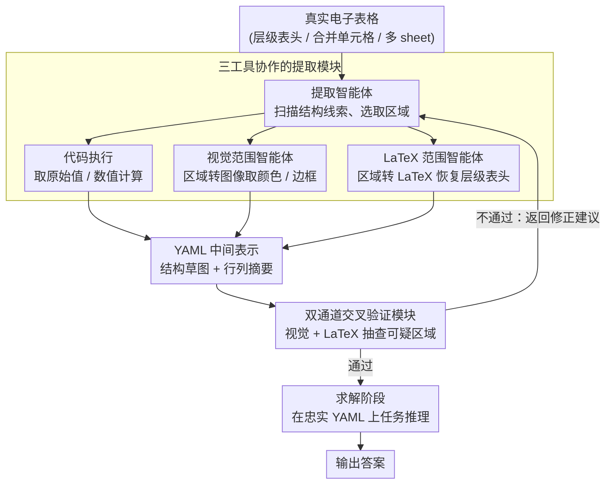

# Towards Robust Real-World Spreadsheet Understanding with Multi-Agent Multi-Format Collaboration

**会议**: ACL 2026  
**arXiv**: [2604.12282](https://arxiv.org/abs/2604.12282)  
**代码**: [github](https://github.com/renhouxing/SpreadsheetAgent)  
**领域**: LLM / 自然语言处理  
**关键词**: 电子表格理解, 多智能体框架, 多格式推理, 结构化信息提取, 渐进式阅读

## 一句话总结

提出 SpreadsheetAgent，一种两阶段多智能体框架，通过代码执行、视觉和 LaTeX 三种格式的渐进式区域读取与交叉验证，在不超出 LLM 上下文限制的前提下实现鲁棒的真实世界电子表格理解。

## 研究背景与动机

**领域现状**：电子表格是企业报告、财务审计、科学数据管理中最常用的数据格式。LLM 在表格理解方面已有 Chain-of-Table、TableGPT、SheetAgent 等工作，但大多将表格视为纯文本（Markdown/HTML/LaTeX），忽略了布局语义。

**现有痛点**：(1) 真实电子表格包含层级表头、多 sheet、字体颜色、合并单元格等丰富视觉线索，纯文本格式无法完整捕获；(2) 实际电子表格规模巨大（数千行列），超出 LLM 的有效上下文处理能力；(3) 现有方法在一次性加载整个表格时容易丢失结构信息。

**核心矛盾**：电子表格的结构复杂性和规模都远超 LLM 的单次处理能力，如何在有限上下文预算下忠实保留布局语义。

**本文目标**：设计一种渐进式阅读-推理范式，通过多智能体协作逐步解析电子表格。

**切入角度**：采用"提取-验证"迭代循环——提取智能体通过代码执行/视觉/LaTeX 三种工具增量解析局部区域，验证智能体通过视觉和 LaTeX 两个通道交叉验证提取结果的忠实性。

**核心 idea**：用 YAML 格式作为中间表示保留结构语义，通过多格式冗余验证减少错误传播，使下游推理基于忠实的结构化表示进行。

## 方法详解

### 整体框架

SpreadsheetAgent 是一个两阶段框架。**结构提取阶段（Structure Extraction Stage）**：提取智能体（Extraction Agent）扫描表格、识别层级表头/合并单元格/多 sheet 等结构线索，并借助代码执行、视觉范围智能体、LaTeX 范围智能体三种工具增量解析选定的局部区域，把内容与布局压缩成 YAML 格式的结构草图（structural sketch）和行列摘要。其间双通道交叉验证模块只对不确定或结构复杂的区域抽查，发现错误就返回修正建议，与提取构成「提取-验证-修正」迭代循环，直到表示足够忠实。**求解阶段（Solving Stage）**：把验证通过的 YAML 中间表示注入下游上下文，进行任务驱动推理得到答案。整套流程不一次性加载整张表，因而在 LLM 上下文预算内仍能保留布局语义。

### 关键设计

1. **三工具协作的提取模块**：提取智能体拥有三种辅助工具——代码执行（精确解析原始值和数值计算）、视觉范围描述智能体（将选定区域转为图像，用 VLM 提取颜色/边框等视觉线索）、LaTeX 范围描述智能体（将区域转为 LaTeX 表格，恢复层级表头和对齐结构）。通过分工协作产生紧凑的中间表示。

2. **双通道交叉验证模块**：验证智能体不是重新处理整个表格，而是选择性关注不确定或结构复杂的区域。视觉验证智能体将区域渲染为图像，检查提取结果是否匹配视觉布局；LaTeX 验证智能体将区域渲染为 LaTeX，检查结构忠实度。两通道都通过后返回验证通过，否则返回修正建议进入下一轮提取。

3. **YAML 中间表示**：选择 YAML 格式（而非 JSON 或自由文本）输出结构化提取结果，因为 YAML 人类可读、支持嵌套结构且解析简单。实验发现输出格式显著影响下游性能——YAML 比 JSON 减少歧义、稳定解析、提升与任务推理器的兼容性。

### 损失函数 / 训练策略

本文为推理框架，不涉及训练。使用 GLM-4.5V 作为 VLM、Qwen3-Coder-480B 作为 LLM，贪心解码（temperature=0），每轮最大 4K token 上下文，最多 20 轮工具调用。

## 实验关键数据

### 主实验（SpreadsheetBench）

| 模型 | Soft Cell | Soft Sheet | Soft Overall | Hard Cell | Hard Sheet | Hard Overall |
|---|---|---|---|---|---|---|
| GPT-4o | 13.49 | 22.51 | 16.96 | 10.52 | 17.66 | 13.27 |
| ChatGPT Agent | 38.27 | 30.48 | 35.27 | - | - | - |
| GPT-OSS-120B | 30.78 | 27.64 | 29.57 | 24.96 | 23.93 | 24.56 |
| + SpreadsheetAgent | **41.30** | **33.14** | **38.16** | **32.80** | **29.34** | **31.47** |
| Qwen3-Coder-480B | 30.36 | 31.05 | 30.63 | 22.82 | 27.07 | 24.45 |
| + SpreadsheetAgent | **45.63** | **35.33** | **41.67** | **36.90** | **31.05** | **34.65** |
| Human Performance | 75.56 | 65.00 | 71.33 | 66.67 | 55.00 | 62.00 |

### 消融实验（Qwen3-30B）

| 配置 | Soft Overall | Hard Overall |
|---|---|---|
| SpreadsheetAgent (完整) | 22.37 | 18.42 |
| w/o Tools & Verify | 20.18 | 16.01 |
| w/ JSON (替代 YAML) | 20.76 | 16.34 |
| w/o Structure | 19.70 | 15.46 |
| w/o Verify | 21.45 | 17.54 |
| w/o Vision Tool | 21.45 | 16.89 |
| w/o LaTeX Tool | 20.32 | 16.23 |
| w/o All (baseline) | 16.41 | 12.83 |

### 关键发现

- SpreadsheetAgent 使 GPT-OSS-120B 超越 ChatGPT Agent 2.89 个绝对百分点（38.16% vs 35.27%）
- Qwen3-Coder-480B + SpreadsheetAgent 达到最高 41.67%，但仍远低于人类的 71.33%
- 验证模块贡献约 1 个百分点提升，结构提取贡献约 2.7 个百分点
- LaTeX 工具比视觉工具贡献更大（移除后分别下降 2.05 vs 0.92）
- YAML 比 JSON 格式提升 1.61 个百分点

## 亮点与洞察

- **渐进阅读范式**：区别于一次性加载，通过迭代的区域读取解决规模问题，同时保留布局语义
- **验证比解决更容易**：验证模块的设计哲学——让模型检查既有结果比从头生成更可靠
- **多格式冗余**：代码/视觉/LaTeX 三种格式互补，任一单一格式都无法完整捕获电子表格语义

## 局限与展望

- 与人类的 71.33% 仍有巨大差距，表明电子表格理解远未解决
- 多轮工具调用带来较高的计算开销
- 验证模块的修正建议质量依赖 VLM/LLM 的能力上限
- 未来可探索强化学习优化工具调用策略

## 相关工作与启发

- SheetAgent、SheetMind 等多智能体电子表格框架的系统性改进
- Chain-of-Table 的逐步推理思想在结构提取阶段的体现
- 验证模块的设计可推广到其他需要忠实性保证的信息提取任务

## 评分

- **新颖性**: ⭐⭐⭐⭐ 多格式渐进阅读 + 交叉验证的框架设计新颖且合理
- **实验充分度**: ⭐⭐⭐⭐ 多模型对比、详细消融、多 benchmark 验证充分
- **写作质量**: ⭐⭐⭐⭐ 框架描述清晰，算法伪代码规范
- **价值**: ⭐⭐⭐⭐ 对真实世界电子表格理解的实际需求有重要推动作用

<!-- RELATED:START -->

## 相关论文

- [\[CVPR 2026\] MOTOR-Bench: A Real-world Dataset and Multi-agent Framework for Zero-shot Human Mental State Understanding](../../CVPR2026/multi_agent/motor-bench_a_real-world_dataset_and_multi-agent_framework_for_zero-shot_human_m.md)
- [\[ICLR 2026\] UIS-Digger: Towards Comprehensive Research Agent Systems for Real-world Unindexed Information Seeking](../../ICLR2026/multi_agent/uis-digger_towards_comprehensive_research_agent_systems_for_real-world_unindexed.md)
- [\[ICML 2025\] Is Your LLM-Based Multi-Agent a Reliable Real-World Planner? Exploring Fraud Detection in Travel Planning](../../ICML2025/multi_agent/is_your_llm-based_multi-agent_a_reliable_real-world_planner_exploring_fraud_dete.md)
- [\[ACL 2026\] Scaling External Knowledge Input Beyond Context Windows of LLMs via Multi-Agent Collaboration](scaling_external_knowledge_input_beyond_context_windows_of_llms_via_multi-agent_.md)
- [\[CVPR 2026\] Visual Document Understanding and Reasoning: A Multi-Agent Collaboration Framework with Agent-Wise Adaptive Test-Time Scaling](../../CVPR2026/multi_agent/visual_document_understanding_and_reasoning_a_multi-agent_collaboration_framewor.md)

<!-- RELATED:END -->
