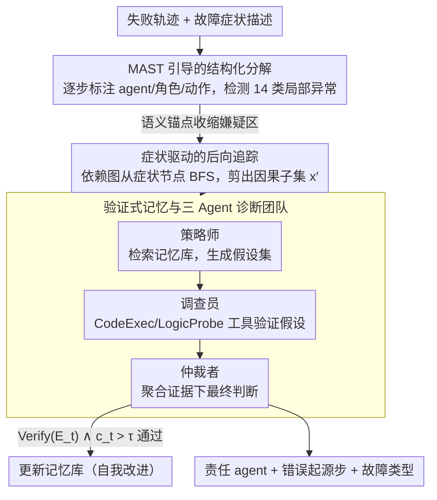

# Towards Self-Improving Error Diagnosis in Multi-Agent Systems

**会议**: ACL 2026 Findings  
**arXiv**: [2604.17658](https://arxiv.org/abs/2604.17658)  
**代码**: 无  
**领域**: LLM评测  
**关键词**: 多智能体故障归因, 错误定位, 自改进诊断, 验证记忆, 后向追踪

## 一句话总结

提出 ErrorProbe 框架，通过 MAST 分类驱动的结构化分解、症状驱动的后向追踪和验证式记忆机制，在多智能体系统中实现自改进的语义故障归因，尤其在步骤级错误定位上大幅超越基线。

## 研究背景与动机

**领域现状**：基于 LLM 的多智能体系统（MAS）已在软件工程、Web 导航、科学推理等领域展现强大能力，但其调试问题日益突出。当系统由多个角色（架构师、工程师、测试员等）协作完成任务时，一旦失败，需要回答"哪个 agent 导致了错误？错误源于哪一步？"

**现有痛点**：现有诊断方法有三类缺陷：（1）基于分类学的人工标注方法（如 MAST）需要大量专家工作，难以规模化；（2）基于训练数据的专用追踪器依赖昂贵的数据生成管线，且需不断重训；（3）LLM-as-a-Judge 范式在长上下文的步骤级定位中表现不佳，特别是错误延迟显现的场景。

**核心矛盾**：MAS 中的错误归因面临多重挑战——交互轨迹极长（数十至上百轮）、错误延迟显现（早期错误在后期才暴露）、智能体间的因果依赖链复杂、故障模式多样化。这使得单次 LLM 判断无法有效穿透长上下文定位根因。

**本文目标**：设计一种无需人工标注、可自我改进的多智能体故障归因框架，能精确识别责任 agent 和错误起源步骤。

**切入角度**：模拟人类专家的调试过程——先将问题分解为多个专业角色（假设生成、验证执行、仲裁决策），通过后向追踪剪枝无关上下文，并利用经过验证的记忆库实现跨域模式复用。

**核心 idea**：将 MAST 分类法操作化为轻量检测器提供局部异常线索，结合症状驱动的后向追踪压缩上下文，再由"策略师-调查员-仲裁者"三人团队通过工具执行验证假设，最终通过验证门控更新记忆库实现自我改进。

## 方法详解

### 整体框架

ErrorProbe 是一个三阶段管线：输入为失败的多智能体交互轨迹和故障症状描述，输出为责任 agent、错误起源步骤和故障类型。首先通过 MAST 分类法检测局部异常标签，然后从症状出发进行后向追踪剪枝上下文，最后由三个专业 agent 协作诊断并更新验证式记忆。

### 关键设计

**1. MAST 引导的结构化分解：先给一团乱麻的轨迹打上语义锚点，把搜索空间从整条轨迹收到几个嫌疑区**

原始交互轨迹噪声大、没有结构，直接让 LLM 在几十上百轮里找根因，很容易迷失。ErrorProbe 先解析轨迹，逐步提取每一步的 agent 身份、角色和动作类型，再用 MAST 分类法的条件提示去检测步骤级偏差——比如「工具输出被忽略」「推理与动作不匹配」这类局部异常。MAST 把故障归纳为 14 种模式（规范问题、对齐失败、验证缺陷三大类），这些弱信号充当启发式先验，把需要细查的范围从 $L$ 步压到少量候选区域。它本身不下最终结论，作用是给后续诊断提供语义锚点，让昂贵的推理只花在可疑的地方。

**2. 症状驱动的后向追踪：从崩溃点反向重建因果链，把长轨迹砍成真正相关的那一小段**

多智能体故障的典型形态是「根因早、症状晚」——第 5 步传错了参数，到第 50 步才崩。如果把全部历史一股脑塞给诊断器，就会触发长上下文里的「中间迷失」。后向追踪的做法是把消息间依赖建成图 $G=(V,E)$，从症状节点 $v_L$ 出发做广度优先搜索，确定错误的有效感受野，同时屏蔽掉与此无关的并行分支，最终把原始长轨迹 $x$ 压成因果子集 $x' \subset x$。诊断器只在 $x'$ 上工作，既绕开了无关上下文的干扰，又保证了根因和症状之间那条跨越数十步的链条完整保留。

**3. 验证式记忆与三 Agent 诊断团队：用工具执行把「猜」变成「证」，并用验证门控防止记忆被幻觉污染**

单纯让一个 LLM 拍板归因，很容易产生听起来合理但其实错误的幻觉。ErrorProbe 把诊断拆给「策略师-调查员-仲裁者」三人团队：策略师从记忆库检索历史模式、生成假设集合；调查员对每个假设必须用工具给出可执行证据，CodeExec 沙箱重跑代码、LogicProbe 做条件验证；仲裁者聚合证据下最终判断，并决定要不要把这次模式写回记忆。记忆更新卡在一道严格的验证门控上

$$\text{Verify}(E_t) \land c_t > \tau,$$

即只有经工具确认且置信度超过 $\tau$ 的模式才允许入库。工具执行提供了客观证据来对冲 LLM 的归因幻觉，而验证门控则挡住了分布偏移下「把错误模式当经验存下来」的记忆腐败，这两层一起才让框架能跨任务自我改进而不退化。

### 一个完整示例：一条失败轨迹怎么走完三阶段

输入是一条失败的多智能体轨迹（比如架构师-工程师-测试员协作写代码，最终单元测试崩溃）加上故障症状描述。第一阶段，结构化分解把这条几十轮的轨迹逐步标注，MAST 检测器在第 12 步标出「工具输出被忽略」的局部异常，把嫌疑范围从全轨迹收缩到几个候选区。第二阶段，后向追踪从崩溃所在的症状节点 $v_L$ 反向 BFS，沿依赖图把与崩溃无关的并行讨论分支剪掉，只留下从第 12 步异常通到末尾崩溃的因果子集 $x'$。第三阶段，策略师在 $x'$ 上检索记忆库、提出「第 12 步参数类型错误」等假设；调查员用 CodeExec 沙箱重跑该步确认假设成立、用 LogicProbe 排除其它分支；仲裁者据此判定责任 agent=工程师、错误起源步=第 12 步、故障类型=验证缺陷，并因为证据通过了 $\text{Verify}(E_t) \land c_t > \tau$ 而把这条模式写入记忆，供下次类似故障复用。

### 损失函数 / 训练策略

ErrorProbe 是推理时框架，无需训练。它以流式方式处理失败任务，每诊断完一条就按验证结果选择性更新记忆状态

$$\mathcal{M}_i \leftarrow \text{Update}(\mathcal{M}_{i-1}, x_i, \hat{y}_i, \text{Verify}(\hat{y}_i)),$$

从而实现自我改进。记忆检索用结构匹配与质量加权的 RFI-Δ 评分组合，冷启动时退化为第一原理推理。

## 实验关键数据

### 主实验

| 基准 | 方法 | Agent 准确率 | Step 准确率 |
|------|------|-------------|------------|
| TracerTraj | LLM-as-a-Judge (Claude) | 67.7% | 8.7% |
| TracerTraj | ErrorProbe+Memory (Claude) | 73.2% | 39.4% |
| Who&When-Algo | LLM-as-a-Judge (Claude) | 55.6% | 41.3% |
| Who&When-Algo | ErrorProbe+Memory (Claude) | 60.3% | 59.5% |
| 三基准平均 | ErrorProbe+Memory (Claude) | 59.6% | 42.7% |
| 三基准平均 | LLM-as-a-Judge (Claude) | 57.0% | 21.3% |

### 消融实验

| 配置 | Agent 平均 | Step 平均 | 说明 |
|------|-----------|----------|------|
| LLM-as-a-Judge | 57.0% | 21.3% | 单次判断基线 |
| Agent-as-a-Judge (基线) | 46.4% | 24.7% | 工具增强但无结构化 |
| ErrorProbe (无记忆) | 56.3% | 41.9% | 有分解+追踪 |
| ErrorProbe (有记忆) | 59.6% | 42.7% | 完整框架 |

### 关键发现

- 步骤级定位是最大亮点：ErrorProbe 将 Claude 的 Step 准确率从 21.3% 提升至 42.7%，提升超过一倍
- 记忆模块对弱模型帮助更大：GPT-OSS-120B 从 25.8% 提升至 31.1%，Qwen3-32B 从 29.2% 提升至 34.9%
- 跨域迁移有效：从 KodCode 学到的模式可改善 TracerTraj 的诊断，验证门控成功过滤域特异性噪声
- GSM8K 域内记忆增益最大（Step +35%），因为该域错误模式重复性高

## 亮点与洞察

- **验证门控设计精巧**：只有经工具执行确认的诊断模式才写入记忆，避免了朴素缓存在分布偏移下的记忆腐败问题，这一思路可迁移到其他需要经验积累的 LLM agent 系统
- **后向追踪解决"中间迷失"**：通过依赖图剪枝将长轨迹压缩为因果子集，这一方法适用于所有需要在长上下文中定位因果关系的场景
- **三 Agent 团队模拟人类调试流程**：假设生成-证据收集-仲裁决策的分工设计使各环节可独立优化

## 局限与展望

- 依赖显式故障信号，对"静默失败"（技术正确但语义错误的输出）无法检测
- 多 Agent 诊断团队的推理开销较大，不适用于超低延迟场景
- 仅在三个模型族上验证，未覆盖更多架构
- 未来可引入测试时预言反馈机制来暴露潜在错误

## 相关工作与启发

- **vs LLM-as-a-Judge**: LLM-as-a-Judge 在步骤定位上严重不足（<10% on TracerTraj），ErrorProbe 通过结构化分解+后向追踪解决了长上下文中的因果定位难题
- **vs TracerTraj 训练式追踪器**: 训练式方法依赖昂贵的反事实重播数据，且需持续重训。ErrorProbe 无需训练，通过验证记忆实现渐进式改进

## 评分

- 新颖性: ⭐⭐⭐⭐ 验证式记忆和后向追踪的组合很有新意，但核心思路（多 Agent 协作诊断）不算全新
- 实验充分度: ⭐⭐⭐⭐ 三个基准+三个模型+丰富消融+记忆缩放分析，较为充分
- 写作质量: ⭐⭐⭐⭐ 问题定义清晰，方法描述详细，但部分内容略显冗长

<!-- RELATED:START -->

## 相关论文

- [\[ICLR 2026\] Stochastic Self-Organization in Multi-Agent Systems](../../ICLR2026/multi_agent/stochastic_self-organization_in_multi-agent_systems.md)
- [\[ACL 2026\] AgenticEval: Toward Agentic and Self-Evolving Safety Evaluation of Large Language Models](agenticeval_toward_agentic_and_self-evolving_safety_evaluation_of_large_language.md)
- [\[AAAI 2026\] Conversational Learning Diagnosis via Reasoning Multi-Turn Interactive Learning](../../AAAI2026/multi_agent/conversational_learning_diagnosis_via_reasoning_multi-turn_interactive_learning.md)
- [\[AAAI 2026\] LungNoduleAgent: A Collaborative Multi-Agent System for Precision Diagnosis of Lung Nodules](../../AAAI2026/multi_agent/lungnoduleagent_a_collaborative_multi-agent_system_for_precision_diagnosis_of_lu.md)
- [\[ACL 2026\] LLM-Based Human-Agent Collaboration and Interaction Systems: A Survey](llm-based_human-agent_collaboration_and_interaction_systems_a_survey.md)

<!-- RELATED:END -->
