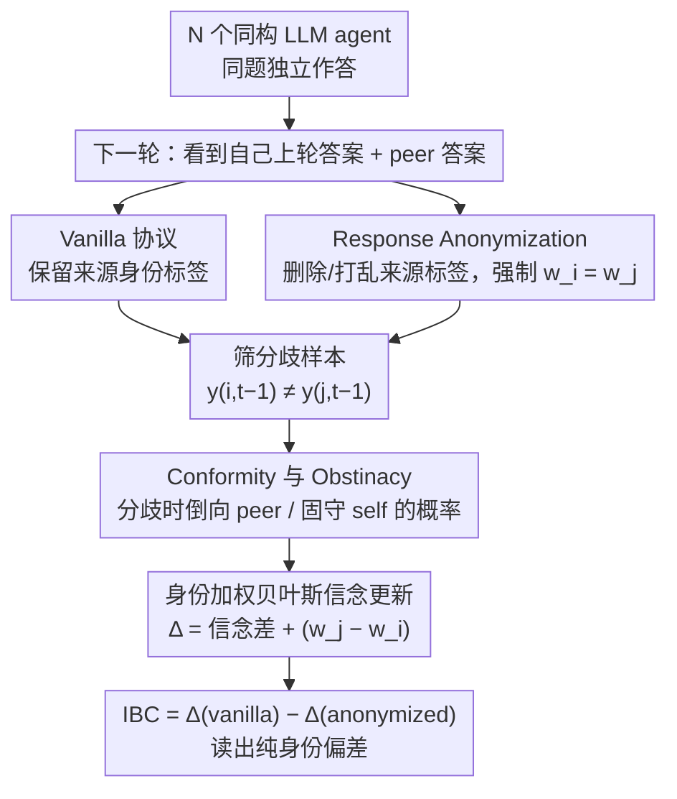

# When Identity Skews Debate: Anonymization for Bias-Reduced Multi-Agent Reasoning

**会议**: ACL2026  
**arXiv**: [2510.07517](https://arxiv.org/abs/2510.07517)  
**代码**: https://github.com/deeplearning-wisc/MAD-identity-bias  
**领域**: LLM评测  
**关键词**: 多智能体辩论、身份偏差、匿名化、从众性、自我偏见

## 一句话总结
这篇论文指出多智能体辩论中的 LLM 会因为“谁说的”而不是“说了什么”改变立场，并通过响应匿名化与 Identity Bias Coefficient 量化和削弱这种身份驱动偏差。

## 研究背景与动机
**领域现状**：多智能体辩论（Multi-Agent Debate, MAD）的基本假设是，让多个 LLM 先独立回答、再互相阅读答案并修正立场，可以放大正确推理信号，减少单模型幻觉或偶然错误。许多工作把注意力放在通信拓扑、轮数、聚合方式、角色设定和 agent 多样性上，默认每个 agent 会根据论据本身更新信念。

**现有痛点**：实际辩论里，agent 看到的不是一段纯内容，而是带有来源标签的内容：这是“我上一轮的答案”，那是“另一个 agent 的答案”。论文发现 LLM 并不总是中立地处理这些标签。有些模型会过度迁就同伴，哪怕自己的原答案更可靠；有些模型又会固守自己，忽略更好的外部证据。这样一来，MAD 可能不但没有纠错，反而会把正确答案带偏。

**核心矛盾**：MAD 想利用多视角讨论，但讨论协议同时泄露了身份信息。身份标签会把原本应该基于内容质量的信念更新，扭曲成“自我”和“他人”的权重竞争。也就是说，系统需要 agent 互相参考，但不希望它们因为来源身份而产生非理性的从众或自我坚持。

**本文目标**：论文要解决三个问题：第一，如何把从众性和自我偏见放进同一个可解释框架；第二，如何度量一个 agent 在分歧时偏向同伴还是偏向自己；第三，能否不用训练、不改模型，仅靠协议层改动降低身份偏差。

**切入角度**：作者从“同一段信息被标成 self 或 peer 时会触发不同权重”这个观察出发，把辩论过程建模为带身份权重的贝叶斯信念更新。这个角度有希望，因为它不需要猜测模型内部神经机制，只要观察分歧场景下 agent 最终跟随哪一方，就能估计身份标签对行为的影响。

**核心 idea**：用响应匿名化去掉辩论 transcript 中的身份标记，让 agent 只能比较论据内容，从而把身份权重强制对齐，并用 IBC 衡量匿名化前后偏差被移除了多少。

## 方法详解

### 整体框架
论文先构造一个用于观测身份偏差的 MAD 设置：多个同构 LLM agent 在同一道题上先独立作答，下一轮看到自己上一轮答案和一个或多个 peer 的答案，然后再输出修正后的答案。关键分析只关注出现分歧的样本，即 agent 自己上一轮答案 $y_{i,t-1}$ 与 peer 答案 $y_{j,t-1}$ 不同的情况，因为只有这时才能判断它是跟随对方，还是坚持自己。

在此基础上，作者定义两个行为统计量。Conformity 表示 agent 在分歧时最终采用 peer 上一轮答案的概率；Obstinacy 表示 agent 在分歧时继续采用自己上一轮答案的概率。如果 Conformity 明显高于 Obstinacy，说明模型更容易向他人让步；如果相反，则说明模型更容易自我坚持。随后论文把这两个量解释为一个带身份权重的 Dirichlet-Compound-Multinomial 信念更新过程，并提出 Response Anonymization：把 prompt 中“Agent i / your previous answer / peer answer”之类来源标签删掉或打乱，只保留候选回答内容。

实验流程也很直接。作者在 vanilla MAD 和 anonymized MAD 两种协议下分别运行同一批模型和数据集，计算 Conformity、Obstinacy、二者差值 $\Delta$ 以及匿名化前后差出的 Identity Bias Coefficient。若匿名化后 $\Delta$ 接近 0，说明此前偏差主要来自身份标签，而不是答案内容本身。

### 关键设计

**1. 用 Conformity 与 Obstinacy 量化分歧时的方向性行为：把"从众"和"自我坚持"变成可计算指标**

旧的辩论分析只能事后看准确率涨没涨，却分不清涨跌来自有效纠错还是盲目跟随。论文把观测窗口收窄到真正有信息量的分歧样本——只在 agent 自己上一轮答案与 peer 上一轮答案不同（$y_{i,t-1}\ne y_{j,t-1}$）时统计，因为只有此时才能判断它倒向哪一边。在这些样本上，Conformity 定义为最终采用 peer 答案的概率 $\mathbb{E}[\mathbb{1}\{y_{i,t}=y_{j,t-1}\}]$，Obstinacy 定义为继续保留自己答案的概率 $\mathbb{E}[\mathbb{1}\{y_{i,t}=y_{i,t-1}\}]$。

这种条件化排除了双方本来就一致、无法区分身份影响的情况，把混在准确率里的辩论动态拆成两种基础倾向：被 peer 拉走，还是固守 self。两者一旦量化，后续的信任度分析和匿名化效果就有了统一坐标系。

**2. 身份加权的贝叶斯信念更新模型：解释 $\Delta$ 为何能分解出一项纯身份权重**

光有两个指标还说不清从众究竟来自论据更强、还是仅仅来自"它被标成了 peer"。论文把 agent 对候选答案的内部信念写成 Dirichlet 参数 $\alpha_{i,t}$，每条可见回答作为一条 one-hot 证据加入更新，但 self 与 peer 的证据被赋予不同权重 $w_i$ 与 $w_j$。在分歧场景下，差值

$$\Delta=\text{Conformity}-\text{Obstinacy}$$

可被分解为先验信念差（prior belief difference）加上身份项 $w_j-w_i$，再除以总信念质量。

这一步的价值不在于断言 LLM 内部真的显式跑 Dirichlet 更新，而在于给 MAD 行为提供一个可检验的低维解释：即便 peer 的内容并不更强，只要 $w_j>w_i$，模型也会更倾向采纳它。换句话说，$\Delta$ 里藏着一个本不该存在的、由来源标签驱动的权重差。

**3. Response Anonymization 与 IBC：用协议层匿名化把身份项强制清零，并量化被清掉了多少**

既然偏差来自 self/peer 的权重差，那最省事的修法不是训练一个更理性的模型，而是直接掐断身份通道。Response Anonymization 把 prompt 里"Agent i / 你上一轮的答案 / peer 的答案"这类来源标签删除或打乱，只留下未署名的候选内容；agent 无从分辨哪条是自己的，理论上相当于强制 $w_i=w_j$，身份项归零。论文据此定义

$$\text{IBC}=\Delta_{\text{vanilla}}-\Delta_{\text{anonymized}}$$

IBC 为正代表此前 peer 权重过高（从众），为负代表 self 权重过高（自我偏见）。匿名化前后做差，恰好近似抵消掉那部分内容信念差，把残留的纯身份偏差读出来。它几乎零部署成本、不依赖模型架构，把问题从"修复模型能力"转成"控制信息暴露"，适合当作 MAD 的默认安全协议。

### 损失函数 / 训练策略
本文没有训练新模型，也没有引入额外损失函数。所有改动发生在推理时的辩论 prompt 构造层：vanilla 设置保留来源身份，匿名化设置移除来源身份。实验使用多个开源和闭源模型，在相同数据集、相同辩论轮次和相同聚合方式下比较匿名化前后的行为统计。

## 实验关键数据

### 主实验
论文评估 Qwen2.5-7B/32B、Llama3.1-8B、Mistral-7B、GPT-OSS-20B，在 GPQA、MMLU Professional Medicine、HellaSwag、GSM8K 上运行 5-agent MAD。主表显示，身份偏差几乎普遍存在，而且大多数情况下是正向 IBC，即 agent 更容易过度采纳 peer。

| 模型 / 数据集 | Vanilla $\Delta$ | 匿名化 $\Delta$ | IBC | 现象 |
|--------|------|------|------|------|
| Qwen-32B / MMLU | 0.608 | 0.024 | 0.584 | 身份标签导致强烈从众，匿名化后几乎归零 |
| Qwen-7B / HellaSwag | 0.507 | -0.032 | 0.539 | peer 身份权重极高，匿名化后变成轻微自我侧 |
| Llama-8B / MMLU | 0.151 | -0.157 | 0.307 | 匿名化不仅削弱从众，还暴露出内容信念差异 |
| Mistral-7B / GSM8K | -0.302 | -0.157 | -0.145 | 少数自我偏见案例，匿名化减弱但未完全消失 |
| GPT-OSS-20B / HellaSwag | 0.180 | -0.069 | 0.249 | 中等从众偏差，匿名化后明显收缩 |

### 消融实验
论文的关键消融不是删模块训练，而是比较是否匿名化、分歧轮次、异构 agent、多 peer 和专家 agent 等辩论配置。主文给出了匿名化对信任度的分析，附录进一步说明身份偏差在多种协议中都存在。

| 配置 | 关键指标 | 说明 |
|------|---------|------|
| Vanilla MAD | 20 个模型-数据集组合中 18 个 IBC 为正 | 大多数情况下 agent 更偏向 peer，身份标签本身会诱发从众 |
| Anonymized MAD | 多数 $\Delta$ 接近 0 | 移除来源身份后，self/peer 权重趋于对称 |
| Qwen-32B + MMLU 匿名化 | Subversion 下降 64.3%，Correction 仅下降 14.9% | 匿名化主要减少“正确答案被错误 peer 带偏”，而不是简单压制所有改答案行为 |
| 多轮辩论 | 偏差会随轮次累积 | 身份通道越长时间存在，错误共识越容易被强化 |
| 多 peer 设置 | 身份偏差可能叠加 | 多个 peer 同时出现时，来源标签影响不会自动平均掉 |

### 关键发现
- 最重要的发现是，MAD 的失败不只是“多数人错了”或“模型不会推理”，还有一个更隐蔽的协议问题：同一份论据因为被标成 self 或 peer，会获得不同影响力。
- 匿名化对 Qwen 系列尤其有效，例如 Qwen-32B 在 MMLU 上的 $\Delta$ 从 0.608 降到 0.024，说明大型模型也并不天然免疫身份驱动从众。
- 从信任度角度看，匿名化更强地减少 Subversion，而不是同等减少 Correction。这一点很关键，因为理想辩论不是让 agent 永不改变答案，而是减少“从正确改错”的身份驱动转向。

## 亮点与洞察
- 论文把 sycophancy 和 self-bias 放进同一个 identity bias 框架中，而不是把它们当作两个孤立现象。这让 MAD 的行为分析从经验观察上升到可比较、可量化的协议诊断。
- Response Anonymization 很朴素但击中要害：它不试图判断哪条回答质量更高，而是先拿掉不该影响判断的来源身份。这个思路可以迁移到 peer review agent、代码审查 agent、医疗多模型会诊等任何多主体意见聚合系统。
- IBC 的定义很实用，因为它利用匿名化前后的差值近似剥离 belief difference。即便理论模型是简化的，作为工程诊断指标也足够清楚：如果 IBC 大，说明协议暴露了危险身份信号。

## 局限与展望
- 理论模型把身份权重作为主要影响因素，但真实 MAD 中还可能有回答长度、论证质量、位置顺序、上下文截断和格式显著性等混杂因素。这些因素也可能改变 agent 对某条回答的采纳概率。
- 匿名化适合同构或弱角色化辩论，但在专家-非专家混合系统中，身份有时是有用信号。未来需要区分“有害身份标签”和“可信能力标签”，也许可以只保留可验证的质量证据，而不是保留 agent 名称。
- 实验主要围绕选择题和短答案推理任务，尚不清楚在长文本生成、开放式规划、代码修复等任务中，匿名化是否会牺牲可追责性或降低协作效率。

## 相关工作与启发
- **vs 传统 Multi-Agent Debate**: 许多 MAD 工作关注 agent 数量、拓扑和聚合策略，默认交互内容是主要变量；本文指出来源身份本身就是一个会改变更新方向的变量，因此协议设计不能只看最终多数投票。
- **vs 单智能体 sycophancy 研究**: 以往 sycophancy 多发生在用户-模型互动中，模型迎合用户观点；本文把问题扩展到模型-模型互动，并进一步加入 self-bias，使偏差分析更适合 MAD 场景。
- **vs 角色设定 / persona debate**: persona 方法常常主动强化身份差异以获得多样性；本文提醒这类身份信号可能同时带来非内容驱动的权重偏差，需要配套的匿名、盲审或校准机制。

## 评分
- 新颖性: ⭐⭐⭐⭐☆ 从身份权重角度统一分析 MAD 中的从众与自我偏见，问题切入很新，方法本身较简洁。
- 实验充分度: ⭐⭐⭐⭐☆ 覆盖 5 个模型和 4 个 benchmark，并有信任度、异构、多 peer、多轮等分析，但任务类型仍偏选择题。
- 写作质量: ⭐⭐⭐⭐☆ 理论分解、指标和实验叙事连贯，读者容易理解匿名化为什么有效。
- 价值: ⭐⭐⭐⭐⭐ 对任何使用多 agent 辩论或投票的系统都有直接启发，几乎零成本的协议修复很值得默认尝试。

<!-- RELATED:START -->

## 相关论文

- [\[ACL 2026\] Latent Agents: A Post-Training Procedure for Internalized Multi-Agent Debate](latent_agents_a_post-training_procedure_for_internalized_multi-agent_debate.md)
- [\[ICML 2025\] From Debate to Equilibrium: Belief-Driven Multi-Agent LLM Reasoning via Bayesian Nash Equilibrium](../../ICML2025/multi_agent/from_debate_to_equilibrium_belief-driven_multi-agent_llm_reasoning_via_bayesian_.md)
- [\[CVPR 2026\] Tackling Model Bias via Game-theoretic Multi-agent Collaboration Framework for Hateful Meme Classification](../../CVPR2026/multi_agent/tackling_model_bias_via_game-theoretic_multi-agent_collaboration_framework_for_h.md)
- [\[ICML 2026\] When Cloud Agents Meet Device Agents: Lessons from Hybrid Multi-Agent Systems](../../ICML2026/multi_agent/when_cloud_agents_meet_device_agents_lessons_from_hybrid_multi-agent_systems.md)
- [\[ICLR 2026\] When Agents "Misremember" Collectively: Exploring the Mandela Effect in LLM-based Multi-Agent Systems](../../ICLR2026/multi_agent/when_agents_misremember_collectively_exploring_the_mandela_effect_in_llm-based_m.md)

<!-- RELATED:END -->
