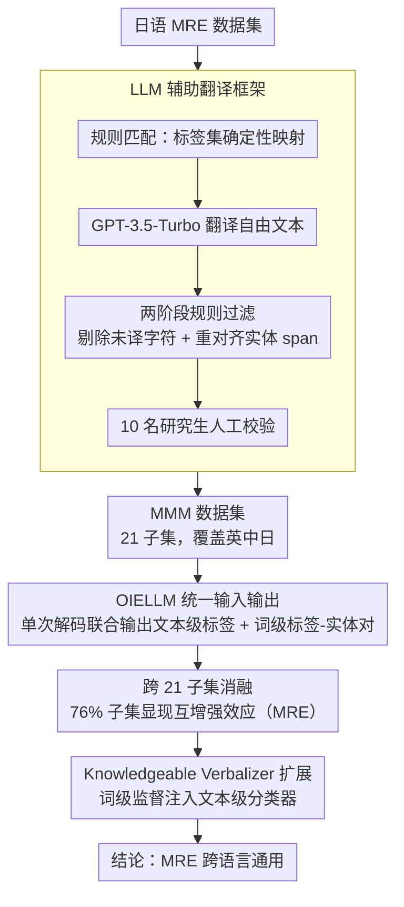

# A Multilingual Dataset and Empirical Validation for the Mutual Reinforcement Effect in Information Extraction

**会议**: ACL 2026 Findings  
**arXiv**: [2407.10953](https://arxiv.org/abs/2407.10953)  
**代码**: [GitHub/HuggingFace](https://ganchengguang.github.io/MRE/)  
**领域**: Information Extraction / Multilingual NLP  
**关键词**: 互增强效应, 多语言信息抽取, 词级-文本级联合建模, 数据集构建, LLM辅助翻译

## 一句话总结

构建首个多语言MRE Mix数据集（MMM，21个子集覆盖英中日），并通过大规模消融实验系统验证了词级与文本级信息抽取任务的互增强效应（MRE）跨语言普遍存在。

## 研究背景与动机

**领域现状**：信息抽取（IE）包含命名实体识别、关系抽取、情感分析等多个子任务，传统做法将其独立建模。多任务学习虽共享表示，但并未显式建模任务间的语义交互。

**现有痛点**：互增强效应（MRE）——词级和文本级IE任务在联合建模时能相互提升——此前仅在日语上有验证，缺乏多语言MRE数据集严重阻碍了跨语言验证和更广泛的应用。

**核心矛盾**：MRE是语言特定的现象还是跨语言的通用机制？这个根本问题因数据缺失而无法回答。

**本文目标**：构建多语言MRE数据集并系统验证MRE在不同语言和任务组合中的普遍性。

**切入角度**：提出LLM辅助的数据集翻译对齐框架，将日语MRE数据集扩展到英语和中文，同时构建新的开放域数据集。

**核心 idea**：MRE不是语言特定artifact，而是IE任务中词级细粒度语义与文本级全局语义之间双向依赖的通用机制。

## 方法详解

### 整体框架

整个工作是一条「造数据 → 联合建模验证 → 反向验证」的实证流水线，对应三个核心设计：(1) 用 LLM 辅助翻译框架把已有的日语 MRE 数据扩成多语言的 MMM 数据集（21 个子集，覆盖英中日）；(2) 在 MMM 上训练统一输入输出的 OIELLM，让单个模型在一次解码里同时做词级与文本级抽取，并通过跨 21 子集的消融观测互增强效应（MRE）；(3) 把词级监督注入 Knowledgeable Verbalizer，从文本分类这一侧反向印证词级信息确实增益文本级任务。

### 关键设计

**1. LLM 辅助的数据集翻译框架：把日语 MRE 数据扩成多语言，又不丢标注一致性**

MRE 此前只在日语上验证过，跨语言验证卡在没有对齐的多语言数据。直接机翻整段会破坏词级实体 span 的对齐，纯人工又太慢。框架因此分层处理：固定标签集用规则匹配做确定性翻译以消除歧义，自由文本部分交给 GPT-3.5-Turbo 辅助翻译，再过两阶段规则过滤（剔除未翻译字符、重新对齐实体 span），最后人工校验把关。

关键在于分工——LLM 只负责减少重复劳动，人工始终守在质量控制环节，标签集的确定性映射则保证同一标签在英中日三语里指向一致。这样扩出来的 MMM（21 个子集覆盖英中日）才能支撑可比的跨语言消融。

**2. 统一输入输出的 OIELLM 模型：单次解码里同时吐出文本级标签和词级标签-实体对**

要验证词级与文本级任务互相增强，就得让一个模型同时做两件事，且输出能被稳定解析。OIELLM 的输入是原文加任务指令词（用 "/" 前缀标记），输出按固定格式先给文本级标签、再给词级抽取结果，并用 ":" 和 ";" 作分隔符，保证跨任务跨语言都能一致地切出结构。

之所以不用对话式 prompt，是因为那会带来额外长度开销和 prompt 引导偏差，干扰模型去学习文本级与词级之间真正的结构性依赖——而这个依赖正是 MRE 的核心。

**3. Knowledgeable Verbalizer 扩展：把词级监督信号显式注入文本级分类器，从另一头验证 MRE**

前两个设计验证的是"联合建模能涨点"，但还需要一个反向证据：如果词级信息确实有助于文本级任务，那把它显式塞进分类器也应该能涨。论文利用 MRE Mix 数据里的词级标注构建知识增强的 verbalizer，强化 prompt-based 文本分类中标签词的表示。

这一招把 MRE 从"联合训练的副产品"变成"可单独操作的增益来源"：词级监督一注入，文本级分类就提升，等于从应用侧再次确认词级与文本级之间存在可利用的双向依赖。

### 损失函数 / 训练策略

OIELLM基于开源LLM进行全量微调，使用标准的自回归语言模型训练目标。训练数据涵盖MMM全部21个子集。

## 实验关键数据

### 主实验

| 模型 | SCNM TL | SCNM WL | SCNM ALL |
|------|---------|---------|----------|
| GPT-4o | 58.30 | 23.42 | 8.57 |
| OIELLM-8B | 84.73 | 88.53 | 61.93 |
| OIELLM-8B* | 87.30 | 89.28 | 64.00 |
| OIELLM-13B | 89.00 | 86.33 | 57.70 |

### 消融实验

| 配置 | 关键指标 | 说明 |
|------|---------|------|
| MRE存在率 | 76% | 21个子集中16个展现显著MRE |
| 跨语言一致性 | 英/中/日均有效 | MRE非语言特定现象 |
| Verbalizer增益 | 正向 | 词级监督注入提升文本级分类 |

### 关键发现
- 76%的MMM子数据集在消融中显示出稳定的互增强效应，证明MRE是跨语言通用机制
- OIELLM在联合训练设置下全面超越零样本LLM（GPT-3.5, GPT-4o），证明MRE的实际价值
- 将词级信息注入Knowledgeable Verbalizer带来了一致的文本级分类提升

## 亮点与洞察
- "Point-Line"抽象优雅地统一了词级和文本级IE任务的关系——词级是点，文本级是线，互相约束
- LLM辅助翻译框架的设计实用：确定性映射+LLM翻译+规则过滤+人工校验，每步都有明确分工
- 实验设计周到——不仅证明MRE存在，还通过Verbalizer实验展示了其可操作的应用价值

## 局限与展望
- 目前仅覆盖英中日三种语言，低资源语言的MRE有效性未验证
- 翻译框架仍需10名多语言研究生参与人工校验，规模化成本不低
- MRE的理论解释（为何词级和文本级会互增强）仍不充分
- 未来可扩展到更多语言和更多IE任务组合

## 相关工作与启发
- **vs 传统多任务IE**: 不仅共享表示，更显式建模和验证任务间的双向增强
- **vs UIE/USM等统一IE模型**: 聚焦于MRE现象的实证验证而非模型架构创新
- **vs LLM零样本IE**: 微调后的OIELLM显著优于GPT-4o零样本，说明任务特定训练仍然重要

## 评分
- 新颖性: ⭐⭐⭐⭐ 首个多语言MRE数据集和系统性跨语言验证
- 实验充分度: ⭐⭐⭐⭐ 21个子集的全面消融，多模型对比
- 写作质量: ⭐⭐⭐⭐ 结构清晰，Point-Line抽象生动
- 价值: ⭐⭐⭐⭐ 为多语言IE提供重要数据资源和实证基础

<!-- RELATED:START -->

## 相关论文

- [\[ACL 2025\] KnowCoder-X: Boosting Multilingual Information Extraction via Code](../../ACL2025/multilingual_mt/knowcoder-x_boosting_multilingual_information_extraction_via_code.md)
- [\[ACL 2025\] Translation and Fusion Improves Zero-shot Cross-lingual Information Extraction](../../ACL2025/multilingual_mt/translation_and_fusion_improves_cross-lingual_information_extraction.md)
- [\[ACL 2026\] NeoAMT: Neologism-Aware Agentic Machine Translation with Reinforcement Learning](neoamt_neologism-aware_agentic_machine_translation_with_reinforcement_learning.md)
- [\[ACL 2026\] XQ-MEval: A Dataset with Cross-lingual Parallel Quality for Benchmarking Translation Metrics](xq-meval_a_dataset_with_cross-lingual_parallel_quality_for_benchmarking_translat.md)
- [\[ACL 2026\] Reinforcement Learning with Semantic Rewards Enables Low-Resource Language Expansion without Alignment Tax](reinforcement_learning_with_semantic_rewards_enables_low-resource_language_expan.md)

<!-- RELATED:END -->
