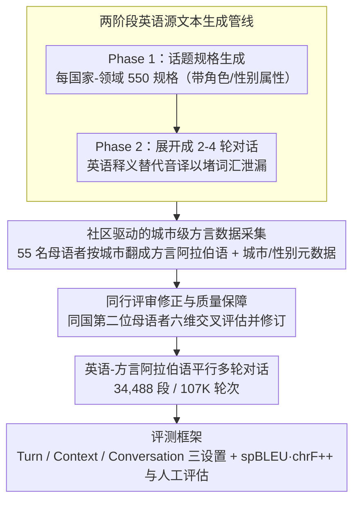

# Alexandria: A Multi-Domain Dialectal Arabic Machine Translation Dataset for Culturally Inclusive and Linguistically Diverse LLMs

**会议**: ACL 2026  
**arXiv**: [2601.13099](https://arxiv.org/abs/2601.13099)  
**代码**: [https://github.com/UBC-NLP/Alexandria](https://github.com/UBC-NLP/Alexandria)  
**领域**: 音频语音  
**关键词**: 方言阿拉伯语, 机器翻译, 多领域数据集, 文化包容, 大语言模型评测

## 一句话总结

Alexandria 构建了覆盖 13 个阿拉伯国家、11 个社会影响领域、107K 轮次的多轮对话方言阿拉伯语-英语平行数据集，通过社区驱动的人工翻译与修订流程，为方言阿拉伯语机器翻译提供了前所未有的细粒度训练和评测资源，并在 24 个 LLM 上进行了系统性基准评估。

## 研究背景与动机

**领域现状**：神经机器翻译在高资源语言对上取得了显著进步，但阿拉伯语面临严重的"双语现象"（diglossia）挑战——日常交流主要使用地区方言，而 MT 系统主要基于现代标准阿拉伯语（MSA）训练，导致对方言输入的泛化能力极差。

**现有痛点**：现有方言阿拉伯语资源存在三大限制——(1) PADIC 仅覆盖约 6,400 句/方言，MADAR 仅 2,000 句，规模严重不足；(2) 领域覆盖窄，MADAR 偏重旅游场景，缺乏健康、教育、农业等社会影响领域；(3) 粒度粗糙，仅有"黎凡特""北非"等区域标签，缺乏城市级别的方言变体区分，也缺少性别配置和语码转换等元数据标注。

**核心矛盾**：数百万阿拉伯语使用者的日常方言交流需求 vs. MT 系统对方言的系统性忽视和评测资源的匮乏。

**本文目标**：构建大规模、多领域、城市级粒度的方言阿拉伯语平行数据集，同时作为训练资源和评测基准，全面揭示当前 LLM 在方言翻译上的能力与不足。

**切入角度**：采用社区驱动模式，招募 55 名来自 13 个阿拉伯国家的参与者（含 29 名女性），每人与特定城市关联，确保方言的真实性和本地化特征。

**核心 idea**：通过城市级标注、性别配置元数据、11 个领域覆盖和人工翻译-修订流程，在规模和细粒度上大幅超越现有资源，首次为方言阿拉伯语 MT 提供全面的评测框架。

## 方法详解

### 整体框架

Alexandria 本质是一套"生成英语种子 → 母语者方言翻译 → 同行交叉修订"的数据集构建流水线，外加一个覆盖 24 个 LLM 的评测框架。构建分三阶段：先用 Gemini-2.5 Pro 在指定国家和领域条件下生成多轮英语对话场景，再由母语者把每轮翻成方言阿拉伯语，最后由同国同行交叉审校修订，最终产出轮次对齐的英语-方言阿拉伯语平行多轮对话，共 34,488 段、107K 轮次。

作为评测基准，它设计了三种输入设置——Turn-level（单轮翻译）、Context-level（带前序对话历史翻当前轮）、Conversation-level（整段一次翻完）——以区分模型利用上下文的能力。自动评估用 spBLEU 和 chrF++，刻意避开对方言可靠性有限的 COMET；人工评估则覆盖语义充分性（5 分制 XSTS）、性别准确度（Pass/Fail）和方言性与流畅度（1-5 分），把"译得对不对"和"像不像方言"分开打分。

### 关键设计

**1. 两阶段英语源文本生成管线：为每个国家-领域对造出多样、文化得体且不泄漏词汇的英语种子**

如果像 MADAR 那样源文本单领域又短，方言数据的覆盖面从一开始就被锁死。管线因此分两步放大多样性：Phase 1 为每个国家-领域对生成 550 个话题规格（55 子领域 × 10 话题），并带上角色与性别属性；Phase 2 再基于话题展开成 2-4 轮对话。

一个容易被忽略的细节是用英语释义替代阿拉伯语音译（如用 "God willing" 而非 "inshallah"），目的是堵住词汇泄漏——否则源文本里残留的音译会让"翻译"退化成表面转写，而非真正的语义传递。生成质量靠 t-SNE 可视化把关，话题间均值余弦相似度仅 0.20，证明语义确实铺得开。

**2. 社区驱动的城市级方言数据采集：用真实说话人和城市元数据替代粗粒度区域标签**

旧资源只给"黎凡特""北非"这种区域标签，根本捕捉不到同一国家内城市间的系统性方言差异（如巴勒斯坦拉马拉与舒克巴）。Alexandria 招募 55 名来自 13 国不同城市的参与者（含 29 名女性），每人只翻译自己城市方言对应的对话，并由各国的 country lead 协调标注一致性。

每段数据都挂上城市来源元数据以支持亚方言级分析，同时标注说话者→听话者的性别配置（F→M 33.19%、M→F 32.78%、M→M 21.43%、F→F 12.60%）。这种"人对城市、城市对方言"的绑定，是把方言真实性和地理多样性写进数据本身、而非事后近似。

**3. 同行评审修正与质量保障：每段翻译都过第二位母语者的六维交叉评估**

LLM 生成的英语源文本可能措辞不自然或文化错配，人工翻译本身也需要系统性兜底。每段译文由同国第二位参与者从方言真实性、性别对齐、语域适当性、语义忠实度、标点、语码转换一致性六个维度交叉评估并按需修订。

最终 68.4% 的轮次无需改动、30.6% 只需小幅编辑、仅 1% 存在重大问题——这个分布既说明母语者首译的基线质量已经较高，也说明交叉修订真正拦下了那少部分严重错误，让数据可以同时充当训练资源和评测基准。

## 实验关键数据

### 主实验

**English→Dialect Context-Level spBLEU（代表性模型和方言）**

| 模型 | SA | EG | SY | LB | MA | MR |
|------|-----|-----|-----|-----|-----|-----|
| Gemini-2.5-Pro | 31.4 | 27.1 | 34.4 | 27.8 | 20.3 | 8.2 |
| Gemini-3-Flash | 29.6 | 27.8 | 31.1 | 27.9 | 19.5 | 10.1 |
| Command-A | 29.2 | 25.8 | 29.0 | 19.5 | 18.0 | 8.9 |
| Gemma-3-27b | 30.0 | 25.7 | 26.8 | 21.3 | 17.3 | 7.4 |
| Qwen3-32B | 17.6 | 14.8 | 15.2 | 10.4 | 13.2 | 4.4 |
| ALLaM-7B | 12.5 | 10.4 | 10.3 | 7.1 | 8.9 | 2.5 |

### 消融实验

**元数据消融（Single-turn English→Dialect spBLEU）**

| 模型 | 元数据 | EG | SA | SY | MA |
|------|--------|-----|-----|-----|-----|
| gemma-3-12b | None | 25.54 | 25.65 | 25.79 | 11.33 |
| gemma-3-12b | Full | 25.11 | 24.39 | 24.90 | 11.34 |
| Command-A | None | 28.78 | 28.88 | 27.74 | 18.60 |
| Command-A | Full | 29.45 | 29.40 | 26.96 | 20.01 |
| NLLB-200-3.3B | N/A | 17.16 | 17.96 | 22.24 | 9.82 |

**Thinking 模式消融**：仅 Gemini-3-Flash 通过推理提升约 2.0 spBLEU，其他模型推理反而降低性能。

### 关键发现

- 存在显著的方向不对称性：Dialect→English 翻译质量一致优于 English→Dialect，说明生成方言比理解方言更困难
- 模型在黎凡特和埃及方言上表现最好，马格里布方言（特别是毛里塔尼亚）最具挑战性
- Gemini 系列在两个方向上均表现最强，开源小模型（ALLaM-7B、Fanar-9B）差距巨大
- 人工评估发现所有模型的方言真实度/流畅度（~2-3/5）显著低于语义充分性（>3/5），说明模型倾向生成接近 MSA 的输出
- 语码转换（使用拉丁字符）会显著降低翻译质量，摩洛哥和突尼斯方言受影响最大
- 与 MSA 的词汇重叠度与翻译质量正相关（沙特 r=0.48，也门 r=0.44）

## 亮点与洞察

- 社区驱动的数据集构建方法论值得借鉴：城市级标注 + country lead 协调 + 同行交叉修订，兼顾了规模和质量
- 性别配置标注（F→M、M→F 等）是阿拉伯语 MT 评测的独特需求，填补了重要空白
- 107K 轮次的规模远超 PADIC（38K）和 MADAR（100K），且涵盖 11 个高社会影响领域
- 亚方言分析揭示了国家内部的系统性翻译难度差异，且模型排序在子方言间高度一致
- 元数据的效果因模型而异——并非"越多信息越好"，某些模型在 Full 元数据下性能反而下降

## 局限与展望

- 性别分布不平衡：F→F 仅占 12.60%，源于 LLM 生成偏向混合性别场景
- 技术术语翻译困难导致部分领域存在 MSA 渗入
- 闭源模型评测受预算限制，仅测试了 Gemini 系列
- 未覆盖所有阿拉伯方言（如伊拉克、巴林等未包含）

## 相关工作与启发

- **vs MADAR**: Alexandria 在规模（107K vs 100K）、领域数（11 vs 1）、标注粒度（城市级 + 性别 + 语码转换）上全面超越
- **vs FLORES+**: FLORES+ 被报告存在某些方言部分过于接近 MSA 的问题，Alexandria 通过母语者翻译避免了此问题
- **vs NLLB-200**: 所有评测的 LLM 即使在无元数据条件下也一致优于 NLLB-200-3.3B

## 评分

- 新颖性: ⭐⭐⭐⭐ 城市级方言粒度、性别配置标注和 11 领域覆盖在方言阿拉伯语资源中前所未有
- 实验充分度: ⭐⭐⭐⭐⭐ 24 个模型、13 种方言、自动+人工评估、多维度消融，极为全面
- 写作质量: ⭐⭐⭐⭐ 结构清晰，数据详实，图表丰富
- 价值: ⭐⭐⭐⭐⭐ 填补了方言阿拉伯语 MT 的重大资源空白，对社区具有高实用价值

<!-- RELATED:START -->

## 相关论文

- [\[ACL 2026\] NiuTrans.LMT: Toward Inclusive and Scalable Multilingual Machine Translation with LLMs](niutranslmt_toward_inclusive_and_scalable_multilingual_machine_translation_with_.md)
- [\[ACL 2026\] LQM: Linguistically Motivated Multidimensional Quality Metrics for Machine Translation](lqm_linguistically_motivated_multidimensional_quality_metrics_for_machine_transl.md)
- [\[ACL 2026\] CLewR: Curriculum Learning with Restarts for Machine Translation Preference Learning](clewr_curriculum_learning_with_restarts_for_machine_translation_preference_learn.md)
- [\[ACL 2026\] TransLaw: A Large-Scale Dataset and Multi-Agent Benchmark Simulating Professional Translation of Hong Kong Case Law](translaw_a_large-scale_dataset_and_multi-agent_benchmark_simulating_professional.md)
- [\[ACL 2026\] XQ-MEval: A Dataset with Cross-lingual Parallel Quality for Benchmarking Translation Metrics](xq-meval_a_dataset_with_cross-lingual_parallel_quality_for_benchmarking_translat.md)

<!-- RELATED:END -->
