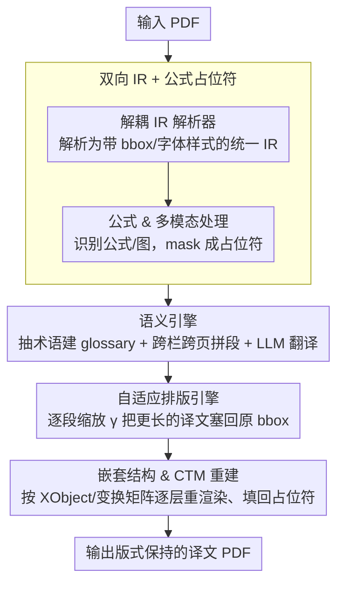

# BabelDOC: Better Layout-Preserving PDF Translation via Intermediate Representation

**会议**: ACL 2026  
**arXiv**: [2605.10845](https://arxiv.org/abs/2605.10845)  
**代码**: https://github.com/funstory-ai/BabelDOC  
**领域**: 多语言机器翻译 / 文档翻译 / Layout-aware NLP  
**关键词**: PDF 翻译, 中间表示, 自适应排版, 公式占位符, 术语一致性

## 一句话总结
本文提出 BabelDOC：一个基于「中间表示（IR）」的版式保持 PDF 翻译系统，把视觉布局和语义内容解耦，让 LLM 翻译、术语提取、跨页上下文、公式占位等 NLP 操作发生在语义层，再用自适应排版引擎重新锚回原版式；在 200 页基准上 BIoU、layout fidelity、术语一致性都超过 PDFMathTranslate 和 DeepL Document Translation。

## 研究背景与动机
**领域现状**：跨语言科研协作激增，PDF 是科学/法律/技术文档的主导格式，但其「为显示而生」的命令式语法让翻译变得很尴尬。现有路线两类：(i) CAT/MT 系统（Google、DeepL）专注文本流，抓取阶段就丢了大量布局元数据；(ii) 文档解析器（Doc2X、MinerU、Mathpix）擅长 PDF → Markdown/LaTeX 单向抽取，但不支持反向重排，无法做「翻译后再还原 PDF」。

**现有痛点**：作者团队此前的 PDFMathTranslate 做了首个端到端排版保持翻译，但是 monolithic pipeline 缺乏显式 IR 层，导致几乎无法做文档级 NLP 干预——术语在长文档上不一致、跨页/跨栏上下文断裂、嵌套 XObject/Form/clipping path 难统一处理；端到端模型则把翻译当黑盒，扩展性差。

**核心矛盾**：「翻译质量」与「布局保真」是一对结构性 trade-off——文本层操作（CAT、LLM）会破坏布局，布局解析器又不能反向重建；缺乏一个中间层，让两边都能在自己最擅长的抽象层上工作。

**本文目标**：(1) 设计一个可双向操作的 IR，能从 PDF 解构、也能向 PDF 重建；(2) 在 IR 上挂多种文档级 NLP 干预（术语提取、glossary 注入、跨页拼接、公式占位）；(3) 用自适应排版把翻译后的（通常更长的）文本塞回原 bounding box；(4) 全开源、模块可热插。

**切入角度**：把翻译 pipeline 拆成 parser → IR → semantic engine → typesetting 四段，IR 同时携带 spatial coordinates + stylistic attributes + semantic content，让上游解析与下游重建解耦；NLP 干预（如术语库注入）只在 IR 上做，不污染布局。

**核心 idea**：用「显式 IR」打通文档理解（DU）与 NLP 两个社区，让翻译变成 plugin-friendly 的 transparent pipeline，而非 black-box 转换。

## 方法详解

### 整体框架
五个模块按顺序工作：(1) **Decoupled IR Parser**：把输入 PDF 标准化后解析成统一 IR，每页元素（字符、文本行、graphic block、inline image）都带 bbox、坐标、字体/样式属性；(2) **Formula & Multimodal Processing**：识别公式 + 多模态片段并 mask 成占位符（避免 LLM 翻译时改坏数学符号）；(3) **Semantic Engine**：在 IR 上做 LLM 翻译，自动抽取术语建动态 glossary、跨页/跨栏拼段、glossary-constrained generation；(4) **Adaptive Typesetting**：迭代搜索局部缩放因子 $\gamma$ 把翻译后较长的文本塞回原 bbox；(5) **Nested Structure & CTM Reconstruction**：管理 XObject/Form/clipping path 嵌套栈和 Current Transformation Matrix，逐层应用 graphics state 重渲染。

### 关键设计

**1. 双向 IR + 公式占位符：把 PDF 拆成翻译能读、重建能闭环的结构化中间层**

公式破坏是 PDF 翻译的第一杀手——传统 LLM 一看到 $\int$ 或上下标就容易乱译、乱删，把数学符号搅坏；而单向 parser（Doc2X / MinerU）虽能把公式抠出来，却只能 PDF→Markdown 单向走，回不到原版式。BabelDOC 的解法是构造一个同时携带 spatial 坐标、stylistic 属性和 semantic 内容的 IR，每个页面元素都挂着自己的 bbox 与字体样式，这样既能喂给翻译、又能闭环重建。

公式的处理在 IR 层分三步完成：script detection unit 看相邻字符的 font-size 方差判断上下标，offset calculation unit 基于基线坐标算出每个 fragment 的偏移，vector reconstruction unit 再用这些 offset 把矢量公式重建出来。识别出的公式连同 inline image、特殊字符等所有非语言内容，在进入 NLP 阶段前全部 mask 成占位符，LLM 眼里只剩「文本流 + 占位符 ID」，翻译完成后再按 IR 把占位符精确填回原位。正是这个显式 IR 化解了「翻译时不能动公式」与「还原时要把公式放回原位」的根本冲突，是整个系统能 work 的基石。

**2. 语义引擎：用 document-level 视图统一术语、拼回被布局切碎的句子**

常规 CAT/MT 是 per-paragraph 翻译，长文档里同一个术语会漂出多种译法——「Current Transformation Matrix」一会「当前变换矩阵」、一会「现行变换矩阵」；长句被分栏一切，语义也断在栏与栏之间。BabelDOC 把 IR 当作整篇文档的全局视图：翻译开始前先扫一遍 IR 抽取领域术语，构建一份动态 glossary（也可接受用户上传），再把它显式注入 LLM prompt，让所有 paragraph 共享同一套术语约束；同时利用 IR 里的 reading order，把「这一栏底部的句子继续到下一栏顶部」这类跨栏/跨页逻辑段落先拼合再翻。

这套干预之所以能做，关键在于 IR 提供了 PDFMathTranslate 那种 paragraph-level pipeline 拿不到的 document-level 视图，于是术语一致、上下文连贯都变成了 prompt-engineering 而非架构改造，每个模块都能独立替换升级。

**3. 自适应排版引擎：用最简单的迭代搜索吸收跨语言的文本膨胀**

英→西之类的翻译普遍把文本撑长 10–30%，硬塞回原 bbox 必然溢出，这正是 layout-preserving translation 最大的障碍。BabelDOC 没有上复杂的 layout 优化或学习，而是在 IR 给定的 bbox 约束上做 per-paragraph 的局部缩放：从 $\gamma = 1.0$ 起，每轮检查翻译文本是否落在原 bbox 内，溢出就 $\gamma \leftarrow \gamma - 0.05$（或 $0.10$）重排，直到不溢出或触底（典型可缩到 $\gamma = 0.85$）。

之所以是局部而非全局统一缩放，是为了让长段落缩、短段落不动，整页视觉不会糊成一坨——和 DeepL Document 那种「随便往里塞、溢出就重叠」相比，自适应缩放把 layout fidelity 大幅拉高，ablation 里去掉它 LF 直接从 4.5 掉到 3.0。

### 一个完整示例：一页双栏论文怎么被翻译并锚回原版式

拿一页带行内公式的双栏英文论文页走一遍：Decoupled IR Parser 先把它解析成 IR，左右两栏的每个字符、文本行、graphic block 都带上 bbox 和字体属性；Formula & Multimodal Processing 扫到正文里的 $\sum_{i=1}^{n} x_i$ 和一张配图，把它们 mask 成 `[FORMULA_1]`、`[IMG_1]` 占位符。

进入 Semantic Engine 后，系统先抽出本页术语建 glossary，再根据 reading order 发现左栏末尾那句话其实接到右栏开头，于是把这两段拼成一个完整逻辑段一起翻译，prompt 里带上 glossary 约束保证术语统一；LLM 翻完的西语文本比原文长了约 20%，并保留了 `[FORMULA_1]`、`[IMG_1]` 占位符。Adaptive Typesetting 接手，发现这段塞不进原 bbox，于是 $\gamma$ 从 1.0 逐步降到 0.85 才放下；最后 Nested Structure & CTM Reconstruction 按嵌套栈和变换矩阵逐层重渲染，把占位符还原成原来的公式和图，输出一页版式几乎不变、内容已翻译的西语 PDF。

### 损失函数 / 训练策略
本文是系统/工程论文，无训练目标。LLM 用现成模型 + role-play prompt，OCR / layout detection 可热插（DocLayout-YOLO、YOLOv10）。

## 实验关键数据

### 主实验（200 页基准：80 科学文献 + 60 技术文档 + 60 国际专利）

| 系统 | BIoU ↑ | LF (human) ↑ | TP ↑ | VA ↑ | TC ↑ | UTB (avg untranslated blocks) ↓ |
|---|---|---|---|---|---|---|
| DeepL Document | 19.8% | 3.44 | 3.62 | 3.63 | 4.21 | 2.33 |
| PDFMathTranslate | 48.7% | 3.29 | 3.40 | 3.28 | 3.34 | 6.25 |
| **BabelDOC** | **50.0%** | **4.59** | **4.28** | **4.46** | **4.47** | 2.85 |

LLM-as-a-judge（Gemini-2.5-Flash）评分趋势一致：BabelDOC 在 LF (4.46)、VA (4.49)、TC (4.43) 上都最高，TP 与 DeepL 并列 4.19。BIoU 50% 是 layout 元素 bbox 几何 IoU，几何上的「能不能放对位置」直接验证了 IR + 自适应排版的有效性。

### 消融实验（80 页代表性子集）

| 变体 | LF ↑ | VA ↑ | TC ↑ | 含义 |
|---|---|---|---|---|
| Full BabelDOC | 4.50 | 4.50 | 5.00 | 完整 |
| w/o adaptive typesetting | 3.00 | 2.50 | 4.00 | 排版打回原形，LF/VA 双跌 |
| w/o glossary/context control | 4.50 | 4.50 | 3.00 | 术语一致性塌方 |

### 关键发现
- **layout 是 BabelDOC 的最强卖点**：BIoU 比 DeepL 高 30 个点，human-LF 比所有 baseline 都高 1 分以上；这是 IR + 自适应排版的直接收益。
- **TP 上 BabelDOC 与 DeepL 打平**：说明 BabelDOC 的价值不是替代 MT engine，而是给 MT engine 套一层 layout-aware 的 controllable framework。
- **UTB 略输 DeepL**：BabelDOC 还有少量未翻译块来自上游 OCR/layout detection 失败（in-figure 文本、扫描页），说明 layout-preserving pipeline 受制于解析端鲁棒性。
- **两个 ablation 完美分工**：自适应排版主要影响 LF/VA，glossary/上下文主要影响 TC——证明两个模块解决的是正交问题，可以独立换/独立升级。
- **生态影响**：开源 8.4K stars、17 contributors，证明 IR-based 设计的可扩展性吸引社区。

## 亮点与洞察
- **「IR-as-interface」让 DU 与 NLP 两个社区终于能对话**：之前文档翻译是个孤岛，DU 出 parser、NLP 出 MT，结合一直靠工程胶水；本文把 IR 抬到一等公民，两边都能在自己的层面工作再 join。这个范式可以推到 PowerPoint、Word、Web layout 等其他视觉文档。
- **Adaptive typesetting 的工程简洁性**：没有用复杂 layout 优化或学习，就用一个迭代搜索 + 0.05 步长，工程上极简，效果上吊打 DeepL。提醒我们「先把 trivial baseline 做到位」比急着上 NN 更重要。
- **公式占位符 + glossary 注入是可复用的 prompt 技巧**：对任何要把含数学符号的长文档喂给 LLM 的任务（论文翻译、教科书改写、学术摘要）都适用。
- **开源 ecosystem 战略**：8.4K stars + 17 contributors 不是噱头，作者刻意做 backend + 多种 UI + plugin 架构，把 system paper 做成长期生态资产，是值得 NLP 社区学习的 release pattern。

## 局限与展望
- IR 构建有计算开销，inference latency 显著高于纯文本 API 调用（1.63 s/page vs Google 0.38 s/page），不适合大并发实时场景。
- 完全依赖上游 OCR / layout detection 鲁棒性，扫描质量差或排版怪异的 PDF 仍会失败，UTB 略输 DeepL 就是例证。
- 翻译质量本身受 LLM 限制，BabelDOC 不是 MT 引擎；遇到 morphological 差距极大的语言对（如垂直繁体中文 ↔ 拉丁字母）排版仍待优化。
- 评测主要在科学文献 / 技术文档 / 专利上，对小说、图表丰富的杂志页面等版式更复杂的场景未覆盖。
- 自适应缩放 step size 0.05 是经验值，遇到极端 expansion 比例（如英 → 德）可能要降字号到难读；本文无字号阈值的硬约束讨论。

## 相关工作与启发
- **vs PDFMathTranslate（同作者前作）**: monolithic 黑盒、无 IR；BabelDOC 拆开成 IR + 模块，可独立替换 LLM/OCR，并新增术语提取 + 跨页 + 自适应排版。
- **vs DeepL Document / Google Doc Translate**: 商用闭源 + 文本流为主，layout 还原差；BabelDOC 开源 + IR + 显式 layout 控制。
- **vs Doc2X / MinerU / Mathpix**: 单向解析（PDF → Markdown），不能反向重建；BabelDOC 双向 IR 是关键差异。
- **vs LayoutReader / DocLayout-YOLO**: 这些是 IR 上游的 layout 模型，BabelDOC 把它们当 hot-swappable plugin。
- **vs LLM 长上下文翻译**: 单纯长上下文 LLM 翻译会丢 layout、丢公式；BabelDOC 给 LLM 加了 layout-aware scaffolding，是务实的工程组合。

## 评分
- 新颖性: ⭐⭐⭐⭐ IR 范式本身在文档处理里不新，但在 PDF 翻译上做成可双向操作 + plugin 化是首次系统落地
- 实验充分度: ⭐⭐⭐⭐ 200 页基准 + 人评 + LLM-as-judge + 组件 ablation，量化与定性都到位
- 写作质量: ⭐⭐⭐⭐ 五模块讲得很清楚，table 和 case study 对应紧密
- 价值: ⭐⭐⭐⭐⭐ 开源 8.4K stars，社区影响和工业可用性都很硬，是 ACL system demo 的优秀范例

<!-- RELATED:START -->

## 相关论文

- [\[ACL 2025\] Cross-Lingual Representation Alignment Through Contrastive Image-Caption Tuning](../../ACL2025/multilingual_mt/cross-lingual_representation_alignment_through_contrastive_image-caption_tuning.md)
- [\[ACL 2025\] Building Better: Avoiding Pitfalls in Developing Language Resources when Data is Scarce](../../ACL2025/multilingual_mt/building_better_avoiding_pitfalls_in_developing_language_resources_when_data_is_.md)
- [\[ACL 2025\] Middle-Layer Representation Alignment for Cross-Lingual Transfer in Fine-Tuned LLMs](../../ACL2025/multilingual_mt/mid_layer_crosslingual_alignment.md)
- [\[ACL 2025\] Less, but Better: Efficient Multilingual Expansion for LLMs via Layer-wise Mixture-of-Experts](../../ACL2025/multilingual_mt/less_but_better_efficient_multilingual_expansion.md)
- [\[ACL 2026\] CLewR: Curriculum Learning with Restarts for Machine Translation Preference Learning](clewr_curriculum_learning_with_restarts_for_machine_translation_preference_learn.md)

<!-- RELATED:END -->
