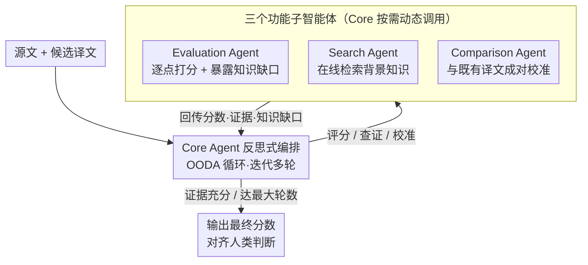

# Beyond Literal Mapping: Benchmarking and Improving Non-Literal Translation Evaluation

**会议**: ACL 2026  
**arXiv**: [2601.07338](https://arxiv.org/abs/2601.07338)  
**代码**: [GitHub](https://github.com/BITHLP/RATE)  
**领域**: Multilingual / MT Evaluation  
**关键词**: 机器翻译评估, 非字面翻译, 元评估基准, 智能体评估框架, LLM-as-Judge

## 一句话总结

构建非字面翻译元评估数据集 MENT（7,530 条人工标注），揭示传统指标和 LLM-as-Judge 在非字面翻译评估上的不可靠性，并提出 RATE 智能体评估框架，通过反思核心智能体动态调用子智能体，提升 3.2+ 点人类判断相关性。

## 研究背景与动机

**领域现状**: LLM 极大扩展了机器翻译的应用范围，社交媒体、文学等非字面翻译场景日益重要。翻译质量评估对 MT 系统迭代和强化学习奖励信号至关重要。

**现有痛点**: (1) 传统指标（BLEU、COMET）缺乏深层语义理解，在非字面翻译上与人类判断严重脱节——高估字面但语义错误的翻译，低估地道但非字面的翻译；(2) LLM-as-Judge 受知识截止限制（无法评估新兴网络用语）和评分不一致性影响；(3) 现有元评估数据集主要覆盖新闻/维基百科等正式领域，缺乏非字面翻译覆盖。

**核心矛盾**: 非字面翻译的核心挑战在于翻译错误往往源于对整体语义的误解（如俚语、文化典故），而非孤立的词汇错误，传统基于词级匹配或表面语义的指标本质上无法捕捉此类问题。

**本文目标**: 系统评估 MT 指标在非字面翻译上的可靠性，并提出更准确的评估方法。

**切入角度**: 先构建大规模非字面翻译元评估基准（覆盖 SNS、跨文化、诗歌、文学四个领域），再设计智能体框架解决 LLM 评估的局限。

**核心 idea**: 反思式智能体评估——Core Agent 动态决定是否调用 Search Agent 检索背景知识、由 Evaluation Agent 评分、或由 Comparison Agent 校准分数。

## 方法详解

### 整体框架

RATE 以反思式 Core Agent 为中心，把"该用什么评估策略"本身交给模型推理：Core Agent 在 OODA（观察-定向-决策-行动）循环里多轮迭代，每一轮根据当前状态动态调用三种功能子智能体——Evaluation Agent（逐点打分）、Search Agent（在线检索外部知识、弥补知识截止）、Comparison Agent（与既有译文成对比较、校准分数一致性），直到收集到足够证据或达到预设最大轮数才输出最终分数。MENT 数据集则是评估这套框架可靠性的标尺，不进入 RATE 的推理回路。

### 关键设计

**1. MENT 元评估数据集：给非字面翻译评估补上一个够大、够难的标尺**

现有元评估数据集普遍不超过 1,000 条标注，且几乎只覆盖新闻、维基百科这类正式领域，根本撑不起对非字面翻译指标的系统验证——而非字面翻译恰恰是 LLM 时代最吃语义理解的场景。MENT 把基准做大做难：覆盖 SNS、跨文化、诗歌、文学四个领域，囊括从 NLLB-3.3B 到 GPT-4o 共 10 个 MT 系统的译文，汇成 7,530 条人工标注。每条译文用 SQM 5 分制打分，且至少由 2 名翻译专业的标注员评判，从规模和领域两个维度同时把这块空白补上，才让「字面指标到底在非字面翻译上有多不可靠」这件事第一次能被量化地说清。

**2. Core Agent 反思式编排：把"该用什么评估策略"也交给模型推理，而不是一条固定评分链走到底**

静态 LLM 评估的毛病在于不管什么译文都走同一条评分链路，但 SNS 译文要先查清新兴用语的含义、诗歌译文要理解韵律和意象、文学译文又另有讲究，一套固定 prompt 没法灵活应对。RATE 因此把决策权交给一个反思式的 Core Agent：它不是简单的路由器，而是在 OODA（观察-定向-决策-行动）循环里多轮迭代——先分析源文和译文当前的评估状态，再推理判断这一步缺什么、该调用哪个子智能体，拿到子智能体反馈后继续下一轮，直到自认为证据充分、或达到预设的最大轮数才输出最终分数。这样「该用什么评估策略」本身也成了模型要推理的一部分，贴近人类专家评估时边查边判的认知流程。

**3. 三个功能子智能体：评分、检索、校准各司其职，由 Core Agent 按需调用**

Core Agent 编排的是三个分工明确的子智能体，分别对应「打分」「补知识」「稳分数」三件事。**Evaluation Agent** 是基础打分器，结合 Core Agent 注入的上下文和指令给出 SQM 分数，并额外返回置信度、打分理由、错误片段和疑似的知识缺口——后者会反过来触发 Core Agent 唤起别的子智能体补充信息，避免凭幻觉打分。**Search Agent** 专治 LLM 的知识截止硬伤：当源文出现模型参数知识答不上的新兴俚语、文化典故或歧义实体时被按需唤起，它把 Core Agent 的请求转成搜索查询、调用搜索引擎、再把检索结果汇总回传，让评分依据当下检索到的真实语义而非可能早已过期的模型记忆——消融里去掉它，SNS 和跨文化领域性能下滑最大，印证知识截止是 LLM 评估的关键瓶颈。**Comparison Agent** 则针对逐点打分天然的主观漂移：当 Core Agent 对某条译文的初步分数没把握时，让它把这条译文与既有已评译文作锚点做成对偏好排序，把分数校准到一致的量纲上——它从不在第一轮触发，只在 Evaluation Agent 给分后被调来「稳一稳」。

### 一个完整示例：一条 SNS 俚语译文怎么被 RATE 评分

设源文是一条含新兴网络俚语的英文推文，某 MT 系统给出了字面但意思跑偏的中文译文。Core Agent 先读源文和译文，反思后判断：这条句子的关键在一个它不确定含义的网络俚语上，于是调用 Search Agent。Search Agent 构建查询、检索到该俚语的实际语义，把解释作为上下文回传。Core Agent 据此构建评估指令交给 Evaluation Agent，后者结合检索到的真实含义打分，发现译文虽逐词对应却误解了整体语义，给出偏低分数。若同一源文还有多个候选译文，Core Agent 再唤起 Comparison Agent 横向对比、校准分数一致性，避免同等质量被打出漂移的分。最终输出的分数与人类判断的相关性比静态 LLM-as-Judge 高出 3.2+ 点。

### 损失函数 / 训练策略

RATE 无需训练，基于 LLM 的零样本智能体框架。评估协议采用 SQM 5 分制。Comparison Agent 通过对比同一源文的多个翻译来校准分数，缓解 LLM 评估的分数漂移问题。

## 实验关键数据

### 主实验

| 方法类别 | 代表方法 | 系统+片段级综合相关性 |
|---------|---------|-------------------|
| 传统指标 | BLEU, COMET | 基线 |
| LLM-as-Judge | GEMBA, AutoMQM | +X |
| **RATE (本文)** | Core + Sub-agents | **+3.2+ 点** |

### 消融实验

| 配置 | 发现 |
|------|------|
| 无 Search Agent | SNS 和跨文化领域性能显著下降 |
| 无 Comparison Agent | 分数一致性降低 |
| 不同骨干 LLM | RATE 在不同 LLM 上一致有效 |
| 通用领域测试 | RATE 在通用 MT 评估上也鲁棒 |

### 关键发现

- 传统指标在非字面翻译上严重失准：高估字面映射，低估地道翻译
- LLM-as-Judge 的两大限制：知识截止（无法评估新俚语）和评分不一致（同一质量不同分数）
- RATE 不仅在非字面场景有效，在通用 MT 评估上也保持鲁棒性
- 10 个 MT 系统中，大规模基础模型（GPT-4o、Gemini-2.5Pro）表现最优

## 亮点与洞察

- 首次系统性评估 MT 指标在非字面翻译上的可靠性，填补重要空白
- MENT 数据集规模（7,530 标注）远超同类工作（<1,000），且覆盖 4 个挑战性领域
- RATE 的智能体设计优雅——核心推理 + 按需调用子能力，符合人类评估的认知流程
- 发现知识截止是 LLM 评估的关键瓶颈，Search Agent 提供了简洁有效的缓解方案

## 局限与展望

- MENT 仅覆盖中英双语，未扩展至更多语言对
- RATE 依赖搜索引擎质量
- 子智能体数量和类型可进一步扩展（如风格分析智能体）
- SQM 评估协议可能遗漏细粒度错误信息

## 相关工作与启发

- WMT 元评估（Freitag et al., 2023; Moghe et al., 2025）：正式领域基准
- COMET / BLEURT：模型化指标，但在非字面场景下仍有局限
- Agent-as-a-Judge（You et al., 2026）：智能体评估范式
- RATE 的动态子智能体调用可推广至其他需要外部知识的评估场景

## 评分

- 新颖性: ⭐⭐⭐⭐ 首次聚焦非字面翻译评估，智能体框架设计巧妙
- 实验充分度: ⭐⭐⭐⭐⭐ 7,530 人工标注、10 个 MT 系统、全面消融
- 写作质量: ⭐⭐⭐⭐ 数据构建流程清晰，案例分析直观
- 价值: ⭐⭐⭐⭐ 对 MT 评估研究和实践有直接指导意义

<!-- RELATED:START -->

## 相关论文

- [\[ACL 2026\] XQ-MEval: A Dataset with Cross-lingual Parallel Quality for Benchmarking Translation Metrics](xq-meval_a_dataset_with_cross-lingual_parallel_quality_for_benchmarking_translat.md)
- [\[ACL 2025\] Beyond N-Grams: Rethinking Evaluation Metrics and Strategies for Multilingual Abstractive Summarization](../../ACL2025/multilingual_mt/beyond_n-grams_rethinking_evaluation_metrics_and_strategies_for_multilingual_abs.md)
- [\[ACL 2026\] Prosody as Supervision: Bridging the Non-Verbal–Verbal for Multilingual Speech Emotion Recognition](prosody_as_supervision_bridging_the_non-verbal--verbal_for_multilingual_speech_e.md)
- [\[ACL 2026\] PEAR: Pairwise Evaluation for Automatic Relative Scoring in Machine Translation](pear_pairwise_evaluation_for_automatic_relative_scoring_in_machine_translation.md)
- [\[ACL 2025\] Accessible Machine Translation Evaluation For Low-Resource Languages](../../ACL2025/multilingual_mt/accessible_machine_translation_evaluation_for_low-resource_languages.md)

<!-- RELATED:END -->
