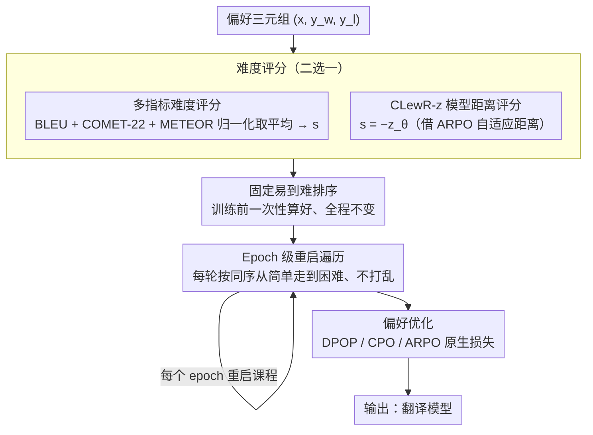

# CLewR: Curriculum Learning with Restarts for Machine Translation Preference Learning

**会议**: ACL 2026  
**arXiv**: [2601.05858](https://arxiv.org/abs/2601.05858)  
**代码**: [https://github.com/alexandra-dragomir/CLewR](https://github.com/alexandra-dragomir/CLewR)  
**领域**: 优化  
**关键词**: 课程学习, 偏好优化, 机器翻译, 灾难性遗忘, DPO

## 一句话总结

本文提出 CLewR（Curriculum Learning with Restarts），一种在偏好优化训练中按易到难排序并在每个 epoch 重启课程的策略，有效缓解灾难性遗忘问题，在多个模型家族（Gemma2、Qwen2.5、Llama3.1）和多种偏好优化算法（DPO、CPO、ARPO）上持续提升机器翻译性能。

## 研究背景与动机

**领域现状**：大语言模型在零样本多语言机器翻译中表现出色。后续工作通过偏好优化（如 DPO、CPO、ARPO）进一步提升翻译质量，将高质量翻译与低质量翻译进行对比学习。

**现有痛点**：偏好优化方法在训练中忽视了数据样本的呈现顺序——一个对训练效果有显著影响的因素。已有课程学习工作（如 CurriDPO）仅简单地按难度排序数据，但未解决训练过程中的灾难性遗忘问题：早期学到的简单样本在训练后期被遗忘。

**核心矛盾**：传统课程学习将数据按易到难排列后仅遍历一次，模型在训练后期集中于困难样本时会遗忘之前学到的简单样本知识，但如果不按顺序学习又无法获得课程学习的收益。

**本文目标**：提出一种能够同时享受课程学习收益并缓解灾难性遗忘的数据级课程策略，适用于机器翻译的偏好优化训练。

**切入角度**：在每个 epoch 内按易到难排序数据，但在每个 epoch 结束后重启排序——即每个 epoch 都完整遍历所有样本，从简单到困难。

**核心 idea**：通过在每个 epoch 重启易到难的课程排序，CLewR 原生地解决了灾难性遗忘问题，因为每个 epoch 都会从头开始遍历所有样本。

## 方法详解

### 整体框架

CLewR 分为两个阶段：(1) 排序阶段——根据选中翻译与拒绝翻译之间的相似度差异对所有训练三元组排序；(2) 训练阶段——在每个 epoch 中按固定的易到难顺序遍历所有数据，不进行随机打乱。排序在训练开始前一次性完成，训练过程中每个 epoch 重复相同的排序。

### 关键设计

**1. 基于多指标的难度评分：让"难"有一个可量化的定义**

课程学习要先回答"哪些样本算难"。CLewR 把每个偏好三元组 $(x, y_w, y_l)$ 的难度，定义成选中翻译 $y_w$ 与拒绝翻译 $y_l$ 之间的"像不像"：两者差异越小，模型越难分辨好坏，就越难。具体做法是同时算 BLEU、COMET-22、METEOR 三个翻译评估指标，各自归一化后取平均得到相似度分数 $s$；$s$ 高（两条译文很接近）的样本判为困难，$s$ 低的判为简单。

之所以不用单一指标，是因为 BLEU 偏 n-gram 表面重叠、COMET 偏语义、METEOR 兼顾词形与同义，单看任意一个都会在某类句子上失真。三个互补指标平均后的难度估计更稳，也让后续排序不至于被某一指标的偏置带偏。

**2. Epoch 级重启机制：每一轮都从简单样本重新走一遍**

这是 CLewR 化解"课程学习 vs 灾难性遗忘"矛盾的核心。传统课程学习把数据按易到难排好后只遍历一次，训练后期模型长时间泡在困难样本里，早期学到的简单样本知识会被悄悄覆盖。CLewR 的做法是：排序在训练开始前按 $s$ 一次性算好并固定，但每个 epoch 都按这同一条易到难顺序完整遍历全部样本、且**不做随机打乱**——于是每进入一个新 epoch，模型都被强制从最简单的样本重新热身、再逐步爬到困难样本。

正是这种"重启"让简单样本在每一轮都被重新巩固，遗忘还没来得及发生就被下一轮的复习抵消，同时又完整保留了由易到难的课程收益。它不改动任何模型结构或损失，只是把"遍历顺序"从一次性变成了每轮重置。

**3. CLewR-z 变体：用模型自己的距离信号替代外部指标排序**

外部指标排序需要额外跑 BLEU/COMET，且这套"难度"未必和优化目标对齐。当底座算法是 ARPO 时，CLewR 提供一个更自洽的变体 CLewR-z：直接借用 ARPO 的自适应距离函数 $z_\theta(y_w, y_l)$，它本身就编码了选中与拒绝响应之间的对数似然差异，于是用 $s = -z_\theta$ 当课程分数，让"模型当前认为这对样本有多难分"直接决定排序。

在此基础上论文还给出增强版 ARPO，把 $z_\theta$ 与 BLEU、COMET 距离加权组合，兼取模型内部信号与外部质量信号之长。这样排序依据与优化目标天然一致，省掉外部指标计算的同时，也让课程与训练动态更同步。

### 损失函数 / 训练策略

CLewR 与三种偏好优化算法兼容：DPOP（DPO 增强版）、CPO（带行为克隆的对比偏好优化）、ARPO（自适应拒绝偏好优化）。训练时使用各算法原生的损失函数，CLewR 仅改变数据呈现顺序。

## 实验关键数据

### 主实验

**Gemma2-9B 在 6 种罗曼语言上的 BLEU 分数（en→xx 方向）**

| 方法 | DPOP | +CurriDPO | +CLewR | CPO | +CLewR | ARPO | +CLewR |
|------|------|-----------|--------|-----|--------|------|--------|
| BLEU | 23.26 | 21.81 | 22.35 | 33.53 | **36.24** | 35.37 | **36.63** |

**Qwen2.5-7B 在 6 种罗曼语言上的 BLEU 分数（en→xx 方向）**

| 方法 | DPOP | +CLewR | CPO | +CLewR | ARPO | +CLewR |
|------|------|--------|-----|--------|------|--------|
| BLEU | 24.43 | 23.59 | 27.68 | **30.05** | 30.41 | **31.56** |

### 消融实验

| 配置 | 说明 | 效果 |
|------|------|------|
| CLewR（多指标排序） | BLEU+COMET+METEOR 综合排序 | 最优 |
| CLewR-z（模型距离排序） | 使用 ARPO 内部距离排序 | 接近最优 |
| ARPO-z'-V1/V2（增强距离） | 增强的距离函数 | 进一步提升基线 ARPO |
| CurriDPO | 竞争方法 | 效果不如 CLewR |

### 关键发现

- CLewR 在 CPO 和 ARPO 上一致提升性能，在 DPOP 上效果因模型而异
- 在 Gemma2 上，CLewR + ARPO-z'-V2 的最佳配置达到 BLEU 37.45（en→xx），比基线 ARPO 提升 2.08
- CLewR 在所有模型家族和大多数偏好优化算法上超越 CurriDPO
- 增强版 ARPO（结合外部指标的距离函数）进一步提升了基线 ARPO 的性能

## 亮点与洞察

- 方法极其简洁——仅改变数据呈现顺序，无需修改模型架构或损失函数，即可获得一致的性能提升
- "重启"机制是对课程学习和灾难性遗忘之间矛盾的优雅解决方案
- CLewR 的普适性强，可无缝集成到 DPO、CPO、ARPO 等多种偏好优化算法中

## 局限与展望

- 在 DPOP 上的效果不如在 CPO/ARPO 上稳定，可能与 DPOP 的参考模型依赖有关
- 难度排序基于训练前的静态评估，未能在训练过程中动态调整课程
- 仅在机器翻译任务上验证，在其他偏好优化场景（如对话、摘要）中的效果待验证

## 相关工作与启发

- **vs CurriDPO**: CurriDPO 使用迭代式课程但未解决灾难性遗忘，CLewR 通过 epoch 级重启更有效
- **vs X-ALMA**: X-ALMA 是基于 ARPO 的强基线，CLewR 在 ARPO 基础上进一步提升

## 评分

- 新颖性: ⭐⭐⭐⭐ 重启机制虽简单但有效地解决了课程学习+灾难性遗忘的矛盾
- 实验充分度: ⭐⭐⭐⭐⭐ 三个模型家族、三种偏好优化算法、多语言评估，覆盖全面
- 写作质量: ⭐⭐⭐⭐ 动机清晰，方法简洁，实验详尽
- 价值: ⭐⭐⭐⭐ 为偏好优化训练提供了简单有效的课程学习策略

<!-- RELATED:START -->

## 相关论文

- [\[ACL 2026\] NeoAMT: Neologism-Aware Agentic Machine Translation with Reinforcement Learning](neoamt_neologism-aware_agentic_machine_translation_with_reinforcement_learning.md)
- [\[ACL 2025\] Code-Switching Curriculum Learning for Multilingual Transfer in LLMs](../../ACL2025/multilingual_mt/code-switching_curriculum_learning_for_multilingual_transfer_in_llms.md)
- [\[ACL 2026\] Selective Contrastive Learning For Gloss Free Sign Language Translation](selective_contrastive_learning_for_gloss_free_sign_language_translation.md)
- [\[ACL 2025\] GrammaMT: Improving Machine Translation with Grammar-Informed In-Context Learning](../../ACL2025/multilingual_mt/grammamt_improving_machine_translation_with_grammar-informed_in-context_learning.md)
- [\[ACL 2026\] SERM: Self-Evolving Relevance Model with Agent-Driven Learning from Massive Query Streams](serm_self-evolving_relevance_model_with_agent-driven_learning_from_massive_query.md)

<!-- RELATED:END -->
