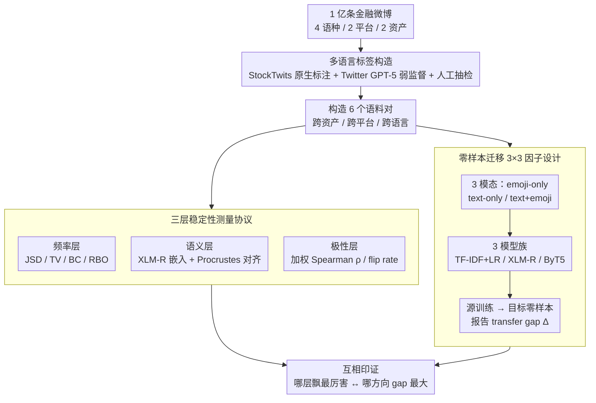

# Cross-Cultural Transfer of Emoji Semantics and Sentiment in Financial Social Media

**会议**: ACL 2026  
**arXiv**: [2605.09414](https://arxiv.org/abs/2605.09414)  
**代码**: 无  
**领域**: NLP / 多语言 / 金融情感分析  
**关键词**: emoji 语义, 跨语言迁移, 金融社交媒体, 零样本情感分析, 跨平台泛化

## 一句话总结
在 4 语种 / 2 平台 / 2 资产类的 1 亿条金融微博上系统比较 emoji 的频率、语义和情感极性，发现 emoji 频率因语言/平台差异大但语义和极性高度稳定，并据此在零样本情感迁移上验证：把 emoji 加入文本能稳定地把 cross-platform transfer gap 从最高 21% 降到接近 0%。

## 研究背景与动机

**领域现状**：金融社交媒体（Twitter、StockTwits）的情感分析依赖 LLM/编码器在英文 stocks 域训练，再迁到加密货币、其它语言、其它平台。emoji 在金融语境（🚀、💎🙌、🐻 等）出现频率极高，被普遍认为是"通用语言"，但目前主流做法要么把它当噪声 strip 掉，要么用通用 emoji embedding（在非金融语料上训练）当 feature 加进去。

**现有痛点**：

1. 单平台单资产单语言研究多——已有工作只在 Twitter 英文 stocks 上验证 emoji 有效，没人系统测过它跨语言/跨平台/跨资产是否还稳。
2. 通用语境下已有大量证据表明 emoji 跨文化语义飘移严重（同一个 emoji 中日英用法差很多），但金融子文化是否同样飘移、是否飘到影响下游模型，没人量化过。
3. 没人把"emoji 分布是否相似"与"加 emoji 是否能改善零样本迁移"这两件事联系起来。

**核心矛盾**：emoji 作为 token 的频率分布很可能严重依赖语言/平台（写作习惯），但它编码的金融语义（看涨/看跌/坚持持有）可能是跨文化共享的——这两层是不同的稳定性概念，必须分开测量；如果第二层稳定，那 emoji 就值得作为跨域迁移的"轻量桥梁"。

**本文目标**：分解为两个子问题：(i) 金融社区在频率、语义、极性这三层上 emoji 是否一致；(ii) 这种一致/不一致如何影响 zero-shot 情感模型跨社区迁移。

**切入角度**：把 emoji 看作"金融子文化的共享密码"——先用四个互补的分布度量(JSD/TV/BC/RBO)看频率，再用 XLM-R 嵌入 + Procrustes 对齐看语义，再用极性比例看情感稳定性，最后用三种输入模态(emoji-only / text-only / text+emoji)的零样本迁移实验把以上分析"落地"到下游指标。

**核心 idea**：用"分层稳定性测量 + 多模态零样本迁移"两个互补视角，证明 emoji 是金融 NLP 跨域迁移的稳定信号源——尤其在跨平台时几乎能完全弥合 transfer gap。

## 方法详解

### 整体框架
论文有两条平行流水线：**分析侧**和**迁移实验侧**。分析侧拿 1 亿+ 条金融微博构造 6 个语料对（cross-asset/cross-platform/cross-language 共 5 个核心对比），在 3 层（频率/语义/极性）上各算一组互补指标；迁移实验侧用 3 个模型家族 × 3 种输入模态 × 3 种迁移方向构造 27 组零样本实验，统一报告"in-domain accuracy"和"transfer gap"。两条线共享同一套多语言标签作为数据基础，结论通过"哪一层飘得最厉害"对上"哪种迁移方向 gap 最大"互相印证。

### 关键设计

**1. 多语言金融情感真值构造：GPT-5 弱监督 + 人工抽检补上多语言标签缺口**

要把分析扩到 EN/ES/JA/TR 四语，绕不开一个现实障碍：Twitter 没有原生情感标签，而多语言金融情感语料几乎不存在。本文的折中是分平台取真值——StockTwits 直接用平台自带的 bullish/bearish 标注，Twitter 则用 GPT-5 做弱监督打 sentiment，再在四个语种各抽 2700 条做人工校验，确认标签质量足以支撑迁移结论。

这种"LLM 自动标 + 小规模人工 spot-check"是当下可扩展的现实做法，也是后面两条流水线共享的数据基础；人工抽检的作用是保证后续"emoji 是否帮助跨语言迁移"的结论不被真值噪声主导，而不是追求逐条精标。

**2. 三层稳定性测量协议：把"emoji 跨社区是否一致"拆成频率/语义/极性三层各自量化**

直接问"emoji 跨语言跨平台是否一样"会得到一个模糊且通常悲观的答案——因为单靠 JSD 之类的分布距离一看就"完全不同"。本文的关键是把这个问题拆成三个互相独立、可分别测量的层。频率层取每个语料的 top-100 emoji，同时算 JSD（全局信息散度）、TV（成比例差异）、BC（分布重叠）、RBO（rank-weighted 头部一致性）四个指标，分别覆盖"全局/比例/重叠/排名"四种视角；语义层用 XLM-R 对 emoji 所在帖子编码取 centroid，跨语料做 Procrustes 正交对齐后看 mean cosine 与 NN@1/NN@5；极性层把每个 emoji 在各语料中"正面帖子占比"当作 polarity，跨语料算 weighted Spearman $\rho_w$、加权 MAUD$_w$ 与 flip rate。

这套分层正是后面所有结论的解释机制：分开测之后才看得见"频率确实飘（写作习惯不同），但语义和极性其实很稳"这一反直觉结构——而稳的恰恰是下游情感迁移真正依赖的那一层。

**3. 零样本迁移的 3×3 因子设计：用受控对照回答"加 emoji 是否真的提升迁移"**

光证明分布稳定还不够，必须落到下游指标。本文把迁移实验做成可控对照：三种输入模态——E（只用 emoji 序列）、T（去除 emoji 的纯文本）、TE（保留 emoji 的原始文本）；三个模型族——TF-IDF+LR（词袋基线）、XLM-R（多语言上下文编码器）、ByT5（byte-level）。每个模型只在 source 上训练、target 上零微调评测，统一报告 transfer gap $\Delta = \text{Acc}_{\text{in-domain}} - \text{Acc}_{\text{target}}$，并覆盖 cross-asset（stocks↔crypto）、cross-platform（StockTwits↔Twitter）、cross-language（EN/ES/JA/TR）三种方向。

这套因子设计让每个对照都回答一个干净的问题：E vs T 直接量化"emoji 单独能携带多少跨域不变信号"，TE vs T 量化"emoji 作为补充是否一致地缩小 gap"。引入 ByT5 则是为了排除一个 confounder——担心 emoji 提升只是因为它在某些 tokenizer 里被切碎、加进去改变了分词；byte-level 模型对 emoji 一视同仁，若连它的 text-only 都掉得厉害，就能把"tokenizer 漂移"这条解释排除掉。

### 损失函数 / 训练策略
TF-IDF+LR 走标准 L2 正则；XLM-R 和 ByT5 都做标准 cross-entropy 微调（三模态共享超参），所有语料均做正负样本平衡、统一 tokenizer 处理，确保 in-domain 与 transfer 差异完全来自数据分布而非训练设置。

## 实验关键数据

### 主实验

跨平台迁移（StockTwits-BTC → Twitter-BTC）是 transfer gap 的"硬骨头"，下表展示三种输入模态在不同模型下的对比：

| 模态 / 模型 | In-domain Acc | Δ→Twitter-BTC | 备注 |
|---|---|---|---|
| Text / ByT5 | 0.783 | **0.209** | 纯文本 gap 最大 |
| Text / XLM-R | 0.739 | 0.035 | 多语言编码器自带缓冲 |
| Emoji / XLM-R | 0.718 | **0.004** | emoji-only 几乎零 gap |
| Emoji / TF-IDF | 0.738 | 0.035 | 简单词袋也稳 |
| Text+Emoji / ByT5 | **0.833** | 0.147 | 高 in-domain + 改善的 transfer |
| Text+Emoji / XLM-R | 0.791 | 0.022 | 最佳综合 |

跨资产迁移（Crypto → Stocks，同平台同语言）的 gap 整体小 2–11%：emoji-only 全部 < 5%，TF-IDF text 模态的 gap 最大（0.106），而 TE 配置都明显小于 T。

三层稳定性测量的关键数字：跨资产 emoji 频率 JSD=0.28、语义 cosine=0.96、polarity $\rho_w$=0.89；到跨语言 EN-JA 时 JSD 飙到 0.51、NN@1 跌到 0.09，但 polarity $\rho_w$ 仍然有 0.85——印证"频率会变，极性不大变"。

### 消融实验

把模态当作消融维度，固定 XLM-R，横向看三种输入对 cross-platform transfer gap 的贡献：

| 配置 | In-domain Acc | Cross-platform Δ | 含义 |
|---|---|---|---|
| Full (Text+Emoji) | 0.791 | 0.022 | 完整模型，gap 几乎消失 |
| w/o Emoji (Text only) | 0.739 | 0.035 | 去掉 emoji，gap 略增 |
| w/o Text (Emoji only) | 0.718 | **0.004** | emoji 信号本身最稳，但 in-domain 上限低 |
| TF-IDF / Text | 0.831 | 0.191 | 去掉上下文编码器后，gap 暴涨 |
| ByT5 / Text | 0.783 | 0.209 | byte-level 也无法补救纯文本的飘移 |

### 关键发现

- emoji 是 zero-shot 情感迁移的"绝缘体"：跨平台时 text-only 最高掉 20.9 pp，而 emoji-only 仅掉 0.4 pp（XLM-R），说明 emoji 编码的金融情感语义几乎不受平台风格漂移影响。
- TE > T 是几乎不变的趋势：text+emoji 在所有 9 种 model×modality 组合下都比 text-only 给出更小的 transfer gap，证明 emoji 是补充信号而非冗余。
- "频率不稳但语义/极性稳"是核心结构性观察：跨语言对的 JSD 高达 0.51 但 polarity $\rho_w$ 仍有 0.79–0.89——这解释了为什么频率分布看起来差异巨大，最终的下游情感迁移效果却没有想象中那么糟。
- 跨语言仍是最难的方向：emoji 能弥合 cross-platform 几乎全部 gap，但 cross-language 仍受限于文本层的多语言鸿沟，emoji 只能帮一部分。

## 亮点与洞察

- **三层度量解耦**很巧妙：把"分布"、"语义"、"极性"分开后，作者揭示了一个反直觉结论——emoji 的"用得多不多"和"用得对不对"是两件事，混在一起看会得出错误的悲观结论。这种解耦的方法论可以直接迁移到 hashtag、表情包、行业 jargon 等任何"形式飘移但意义稳定"的符号研究。
- 把"emoji-only"模态当成独立 baseline 是关键创新：以前研究只比 T vs TE，本文加入 E 后才能干净地分离"emoji 自身携带多少跨域不变信号"，这个对照设计应该成为后续 emoji NLP 工作的标准协议。
- 选 ByT5 作为对照模型展现了细心的实验设计：byte-level 模型对 emoji 一视同仁，所以如果连 ByT5 的 text-only 都掉得厉害，就能排除"emoji 提升只是因为 tokenizer 漂移"这种 confounder。

## 局限与展望

- 作者承认：cross-language transfer 仍是最难方向，emoji 能缩 gap 但远远不能消除，需要更强的多语言对齐手段。
- 我的观察：StockTwits 只有英文，导致 cross-platform 和 cross-language 在数据上耦合（跨平台对比固定在 BTC 英文），其实并未严格隔离两个变量；后续若能收集多语言 StockTwits-like 平台数据会更干净。
- 极性测量基于"positive 帖子占比"，这是粗糙的代理；细粒度 emoji-级别因果分析（例如 do-calculus 风格的反事实）可以更直接量化 emoji 对情感判定的因果贡献。
- 实验只到 ByT5/XLM-R 量级，没有放进大型生成式 LLM（如 GPT-5 直接做 zero-shot 分类），加入这条 baseline 会让"emoji 是否还重要"在 LLM 时代的结论更有力。

## 相关工作与启发

- **vs Mahrous et al. (2023)**：他们首次提出金融 emoji 携带独立情感信号，但只在单平台单语言验证；本文把规模扩大到 4 语 2 平台 2 资产，并且首次量化跨域迁移效果。
- **vs Lu et al. (2016) / Barbieri et al. (2016)**：通用语境研究强调 emoji 跨文化语义差异大；本文揭示金融子文化下"frequency 飘但 polarity 不飘"，提示子文化语料可以打破跨文化差异的悲观默认。
- **vs Colavito et al. (2025) / Di Palo et al. (2024)**：他们论证 emoji-only 模型在金融领域可以匹敌 text-only 且更快更便宜；本文进一步证明这种 emoji-only 优势在跨域迁移上更突出，给"轻量金融 NLP 系统"提供了强有力的实证支撑。

## 评分

- 新颖性: ⭐⭐⭐⭐ 首次系统量化金融 emoji 的跨平台/语言/资产稳定性并把它绑定到 zero-shot 迁移指标；方法不算"新算法"但研究问题切口很扎实。
- 实验充分度: ⭐⭐⭐⭐⭐ 1 亿条数据、4 语、2 平台、2 资产、3 模型族、3 模态、27 组迁移实验，外加附录里的 DeBERTa-v3 ABSA 验证，覆盖足够全面。
- 写作质量: ⭐⭐⭐⭐ 逻辑链清楚（分层度量 → 迁移验证），表格信息密度高；个别地方公式排版略乱（OCR 抽取的副作用）。
- 价值: ⭐⭐⭐⭐ 对金融 NLP 系统、跨语言情感工具实际部署有直接指导意义；emoji-only 模型的极低 cross-platform gap 是非常 actionable 的工程结论。

<!-- RELATED:START -->

## 相关论文

- [\[ACL 2026\] PluRule: A Benchmark for Moderating Pluralistic Communities on Social Media](plurule_a_benchmark_for_moderating_pluralistic_communities_on_social_media.md)
- [\[ACL 2025\] Cross-Lingual Transfer of Cultural Knowledge: An Asymmetric Phenomenon](../../ACL2025/multilingual_mt/cross-lingual_transfer_of_cultural_knowledge_an_asymmetric_phenomenon.md)
- [\[CVPR 2025\] SMTPD: A New Benchmark for Temporal Prediction of Social Media Popularity](../../CVPR2025/multilingual_mt/smtpd_a_new_benchmark_for_temporal_prediction_of_social_media_popularity.md)
- [\[ACL 2026\] What Factors Affect LLMs and RLLMs in Financial Question Answering?](what_factors_affect_llms_and_rllms_in_financial_question_answering.md)
- [\[ACL 2026\] Why Low-Resource NLP Needs More Than Cross-Lingual Transfer: Lessons Learned from Luxembourgish](why_low-resource_nlp_needs_more_than_cross-lingual_transfer_lessons_learned_from.md)

<!-- RELATED:END -->
