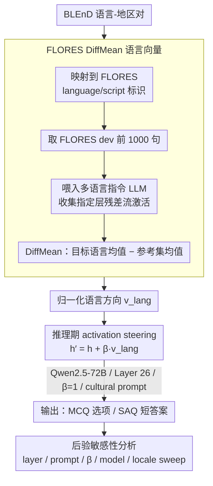

# DFKI-MLT at SemEval-2026 TASK 7: Steering Multilingual Models Towards Cultural Knowledge

**会议**: ACL2026  
**arXiv**: [2605.23069](https://arxiv.org/abs/2605.23069)  
**代码**: https://github.com/Yusser96/SemEval-2026-Track7  
**领域**: 多语言模型 / 文化知识评测  
**关键词**: activation steering, cultural awareness, FLORES, BLEnD, SemEval

## 一句话总结
这篇 SemEval 系统论文用 FLORES 平行语料提取语言方向，在推理时向多语言 LLM 的 residual stream 注入 language steering vector，最终 MCQ 官方成绩为 86.96% accuracy、17 队第 7，但后验分析显示增益高度依赖层、prompt、模型和 locale。

## 研究背景与动机
**领域现状**：多语言 LLM 已经可以流畅处理多种语言，但语言流畅不等于文化知识可靠。BLEnD 和 SemEval-2026 Task 7 这类 benchmark 关注模型是否能回答特定语言、地区和文化背景下的问题，而不是只会输出语法正确的文本。

**现有痛点**：很多文化知识缺口无法通过简单翻译或通用 multilingual instruction tuning 解决。模型可能懂某种语言，却不了解该地区的日常文化、食品、节日、社会习惯或地方常识。微调可以改善特定任务，但 SemEval 共享任务没有提供 BLEnD 训练数据，且微调成本高、容易过拟合。

**核心矛盾**：文化知识和语言表征可能在模型内部有重叠，但如何在不更新参数的情况下利用这种重叠仍不清楚。Activation steering 提供了轻量方案，但它是否能稳定提升文化推理，需要在多语言、多 locale、多 prompt 和多模型上验证。

**本文目标**：DFKI-MLT 系统希望用 language vectors 做推理期适配，参加 SemEval-2026 Task 7 的 SAQ 和 MCQ 两个 track，并分析 steering 对文化题目的真实收益和失败模式。

**切入角度**：作者假设语言身份在 residual stream 中形成稳定方向，而文化知识访问部分依赖语言/地区相关方向。于是他们从 FLORES 平行句子中提取语言向量，在生成时把目标语言向量加到指定 transformer layer 的 residual stream。

**核心 idea**：不微调模型参数，而是在推理时沿目标语言方向轻推内部表示，让模型更容易访问对应语言和文化上下文。

## 方法详解
论文的系统由三部分组成：任务设置、语言向量提取和推理时 steering。任务包括 Track 1 SAQ 和 Track 2 MCQ。SAQ 要用输入语言生成短答案，官方按可接受答案集合匹配；MCQ 输入为英文问题和四个地区文化选项，系统要选择目标地区对应的正确选项。官方指标都是 accuracy。

### 整体框架
作者首先把 BLEnD 的语言-地区对映射到 FLORES language/script identifiers。对每个可映射语言，取 FLORES dev 的前 1,000 个句子，通过模型 tokenizer 输入多语言 instruction-tuned LLM，收集指定层的 post-normalization residual-stream activation。语言向量用 DiffMean 构造，即目标语言 activation 平均值与参考集合 activation 平均值的差。

推理时，对某一 transformer layer 的 hidden state 加入 $\beta v_{lang}$，其中 $v_{lang}$ 是归一化后的语言方向，$\beta$ 是 steering strength。最终提交选择 Qwen2.5-72B-Instruct、Layer 26、$\beta=1$，并使用 cultural prompt。所有 track 采用 greedy decoding，temperature=0，以减少采样噪声对 steering 效果判断的干扰。

### 关键设计

**1. FLORES DiffMean language vectors：用平行语料把"语言身份"提成一个可注入的方向**

要在推理时往模型里"加一点目标语言"，前提是先有一个干净的语言方向。作者把 BLEnD 的语言-地区对映射到 FLORES 的 language/script identifiers，对每个可映射语言取 FLORES dev 的前 1,000 个句子，通过模型自身 tokenizer 喂进多语言 instruction-tuned LLM，收集指定层的 post-normalization residual-stream activation；语言向量用 DiffMean 构造，即目标语言 activation 均值与参考集合 activation 均值之差。

之所以选 FLORES 而不是随手抓的语料，是因为它是内容对齐的平行多语言数据——各语言句子讲的是同一批内容。这样"均值差"里被消掉的是主题/句意差异，剩下的更可能是纯粹的语言身份方向，而不是混入了话题偏置的杂方向。

**2. 推理期 activation steering：不动参数，只在残差流上沿语言方向轻推**

有了方向 $v_{lang}$，干预方式是在选定 transformer layer 的 hidden state 上做加性注入：

$$h' = h + \beta v_{lang}$$

其中 $v_{lang}$ 是归一化后的语言方向，$\beta$ 是 steering strength。开发阶段在 $\beta\in\{1,3,5\}$ 与一批候选层之间搜索，最终官方提交锁定 Qwen2.5-72B-Instruct、Layer 26、$\beta=1$ 并配 cultural prompt，全程 greedy decoding、temperature=0，把采样噪声从 steering 效果的判断里剔除。

相比 full fine-tuning，这种干预成本极低、可在不同语言间瞬间切换，且天然契合"没有 BLEnD 训练数据"的 shared task 设定——不需要任何文化题训练集，也不更新一个参数。

**3. prompt、层和模型的后验敏感性分析：解释单一配置为何无法全局稳定提升**

官方提交只能反映一个锁死的 $(\text{model}, \text{layer}, \beta, \text{prompt})$ 配置，看不出 steering 到底稳不稳。所以提交之后作者补做了一整套敏感性分析：在 MCQ 与 SAQ 上对 Qwen2.5-72B/7B、Aya Expanse 8B/32B、Qwen3 8B/32B 跑 layer sweep、prompt comparison（generic prompt vs cultural prompt）和 steering strength comparison，还加入随机 Gaussian vector vs language vector 的对照。

这一步是这篇系统论文最诚实的地方：它直接量化出文化推理的 steering 效果高度局部化——最优层会随 prompt 在 Layer 2/3 与 Layer 26 之间跳，收益在不同 locale 间并不一致泛化，而随机向量的效果集中在 0 附近、语言向量则更分散且偶有负 outlier。结论不是"steering 万能"，而是"它真实但不稳，必须看 layer/prompt/locale/model 之间的交互"。

### 损失函数 / 训练策略
该系统没有训练损失，因为不更新模型参数。开发策略是基于 SemEval development phase 选择模型、层和 $\beta$：候选模型包括 Qwen2.5-72B-Instruct、Qwen2.5-7B-Instruct、Aya Expanse 8B/32B、Qwen3-8B/32B；候选强度为 $\{1,3,5\}$；最终官方提交为 Qwen2.5-72B-Instruct + Layer 26 + $\beta=1$。SAQ 生成最多 32 tokens，并做轻量规范化；MCQ 则输出选项。

## 实验关键数据

### 主实验
| Track | 指标 | DFKI-MLT | 排名 | 说明 |
|--------|------|------|----------|------|
| Track 1 (SAQ) | Acc. | N/A | - / 10 | 官方提交文件错误/损坏，未被成功评测 |
| Track 2 (MCQ) | Acc. | 86.96 | 7 / 17 | 使用 cultural prompt 和 activation steering 的官方成绩 |
| Track 2 best system | Acc. | 96.78 | 1 / 17 | 官方最佳系统，领先 DFKI-MLT 9.82 个百分点 |

### 消融实验
| Locale | DFKI-MLT (%) | 本系统 locale 排名 | 官方最佳 (%) | 差距 |
|------|---------|------|---------|------|
| es-EC | 97.54 | 7 | 98.67 | -1.13 |
| en-GB | 96.12 | 6 | 99.17 | -3.05 |
| es-MX | 94.94 | 4 | 99.32 | -4.38 |
| ar-EG | 94.84 | 2 | 91.03 | +3.81 |
| bg-BG | 94.60 | 8 | 99.54 | -4.94 |

### 关键发现
- 最好的 locale 不代表全局最优。ar-EG 上 DFKI-MLT 达到 94.84%，比总榜冠军同 locale 的 91.03% 高 3.81 个百分点，但 bg-BG 仍落后 4.94 个百分点。
- Steering 的平均收益很小且不稳定。论文摘要中写到 individual locales 最多有 +1.5% absolute accuracy，但其他配置会降低表现，收益不在语言-地区对之间一致泛化。
- 层选择非常敏感。Qwen2.5-72B 的 post-hoc sweep 中，MCQ 最优层会随 prompt 变为 Layer 2 或 3，SAQ 最优层会变为 Layer 8 或 7；官方提交用的 Layer 26 是 dev split 上的单一折中。
- $\beta=1$ 是较稳妥默认值。较大 steering strength 更容易在早期层造成不稳定，但 Qwen3/Aya 的某些配置也能容忍更强 steering，因此强度不能只按模型规模决定。
- FLORES 样本量不是主要不稳定源。DiffMean 向量在所有六个模型上，$N=100$ 时联合 median cosine 已至少 0.99，$N=500$ 时至少 0.999；作者认为 1,000 句是保守选择。

## 亮点与洞察
- 这篇系统论文诚实地展示了 activation steering 的边界。它不是把 steering 包装成稳定万能的文化对齐方法，而是指出收益高度依赖 locale、layer 和 prompt。
- 使用 FLORES 平行语料提取语言方向很轻量。这个方法不需要文化题训练集，也不需要模型参数更新，适合 shared task 和快速原型。
- 随机向量对照很有必要。作者发现 random-vector effects 集中在 0 附近，而 language-vector effects 更分散且有负 outlier，说明语言向量确实不是纯随机扰动，但也不保证正收益。
- SAQ 与 MCQ 的 prompt 需求不同。文化 prompt 在 MCQ 中可能帮助选项概率，但在 SAQ 中可能生成过长或解释性答案，反而影响短答案匹配。

## 局限与展望
- 官方 SAQ 结果缺失是最大实验遗憾。由于提交文件错误，Track 1 只有 post-hoc offline re-evaluation，不能和官方 leaderboard 直接比较。
- 对比范围有限。论文分析了层、$\beta$、prompt、模型和 locale，但没有系统比较 prompt-only、fine-tuning、CAA、ReFT 或 SAE-based steering 等替代方法。
- 单一全局配置不适配所有 locale。官方提交用一个 $(\beta, layer)$ pair，但后验分析表明最优设置随语言、地区、任务和 prompt 变化，未来应做 per-locale 或 per-prompt adaptive steering。
- 语言向量只是文化知识的近似代理。语言和文化相关但不等价，许多文化差异是地区、族群和社会语境层面的，不能完全由 FLORES language direction 表示。

## 相关工作与启发
- **vs BLEnD / SemEval cultural awareness evaluation**: BLEnD 提供文化知识评测框架，本文是参赛系统，关注如何在无训练数据情况下轻量适配模型。
- **vs activation steering / CAA**: 通用 steering 方法通过内部方向调控模型行为，本文把方向定义为语言身份方向，并检验其对文化题目的迁移。
- **vs fine-tuning**: 微调能直接学习文化知识，但需要数据和成本。本文方法不改参数，适合开发阶段快速尝试，但稳定性弱于理想的任务定制方案。
- **vs prompt-only 方法**: prompt 可以显式要求模型考虑文化背景，steering 则作用于内部表示。论文结果提示二者需要联合优化，而不是二选一。

## 评分
- 新颖性: ⭐⭐⭐⭐☆ 把 language-vector steering 用于文化知识 shared task 很有意思，但核心技术建立在已有 activation steering 思路上。
- 实验充分度: ⭐⭐⭐⭐☆ 官方 MCQ 和大量 post-hoc sweep 很有价值，但 SAQ 官方缺失、强 baseline 对比不足。
- 写作质量: ⭐⭐⭐⭐☆ 对负结果和敏感性写得坦诚，系统描述清楚，部分 appendix 图表信息偏分散。
- 价值: ⭐⭐⭐⭐☆ 对多语言文化评测和推理期干预很有启发，尤其提醒不要把语言流利度等同文化能力。

<!-- RELATED:START -->

## 相关论文

- [\[ACL 2026\] Lingo_Research_Group at SemEval-2026 Task 9: Evaluating Prompt Variants for Polarization Detection](lingo_research_group_at_semeval-2026_task_9_evaluating_prompt_variants_for_polar.md)
- [\[ACL 2026\] Multilingual Steering by Design: Multilingual Sparse Autoencoders and Principled Layer Selection](multilingual_steering_by_design_multilingual_sparse_autoencoders_and_principled_.md)
- [\[ACL 2026\] EMCEE: Improving Multilingual Capability of LLMs via Bridging Knowledge and Reasoning with Extracted Synthetic Multilingual Context](emcee_improving_multilingual_capability_of_llms_via_bridging_knowledge_and_reaso.md)
- [\[ACL 2025\] Cross-Lingual Transfer of Cultural Knowledge: An Asymmetric Phenomenon](../../ACL2025/multilingual_mt/cross-lingual_transfer_of_cultural_knowledge_an_asymmetric_phenomenon.md)
- [\[ACL 2026\] Language on Demand, Knowledge at Core: Composing LLMs with Encoder-Decoder Translation Models for Extensible Multilinguality](language_on_demand_knowledge_at_core_composing_llms_with_encoder-decoder_transla.md)

<!-- RELATED:END -->
