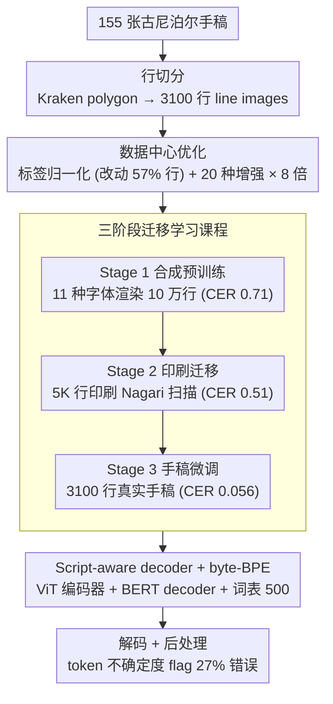

# Digitizing Nepal's Written Heritage: A Comprehensive HTR Pipeline for Old Nepali Manuscripts

**会议**: ACL 2026  
**arXiv**: [2512.17111](https://arxiv.org/abs/2512.17111)  
**代码**: https://github.com/anjalisarawgi/nepOCR/ (有)  
**领域**: 多语言 / OCR / 低资源文档识别  
**关键词**: HTR、Devanagari、低资源、TrOCR、三阶段迁移学习、数据增强

## 一句话总结
首个端到端的**古尼泊尔语手写文本识别 (HTR)** 完整 pipeline：用 "合成 Devanagari → 印刷 Nagari → 古尼泊尔手稿" 三阶段迁移学习 + 20 种数据增强 + 字节级 BPE + script-aware decoder，把 CER 从 fine-tuned TrOCR baseline 的 9.6% 降到 **4.9%**，并开源代码、模型与 Streamlit web 应用。

## 研究背景与动机
**领域现状**：现代 HTR 已从 CNN+CTC 走向 transformer 范式（TrOCR），在英文/拉丁系手稿上效果很好；但**低资源 + 历史脚本**（如古尼泊尔语 Devanagari）依然是 OCR 的硬骨头，原因包括手写风格多样、文档退化严重、复杂连字 (conjuncts)、几乎无标注数据。

**现有痛点**：(1) Tesseract / Google Cloud Vision 在 Devanagari 历史手稿上 fail（无法捕捉 conjuncts、变音符、标点）；(2) TrOCR 没有在 Devanagari 上预训练，开箱输出非 Devanagari；(3) 仅有 155 张手稿（3100 行）远不足以从头训练 transformer；(4) 历史文档存在 scriptio continua（无词间空格）、随意 punctuation、字符演变（U+0310 vs U+0901 同义）、不一致 spelling 等问题，让标签也充满 noise。

**核心矛盾**：transformer-based HTR 需要大数据，但古尼泊尔手稿天然小数据；如果直接微调 TrOCR 又因 tokenizer 不懂 Devanagari 而效果差。

**本文目标**：构造一个 (1) 能在 ~3000 行训练数据上稳定 < 5% CER 的 pipeline；(2) 自动处理 line segmentation → recognition → 后处理；(3) 给出 ablation 让其他低资源脚本研究者能复用方法论。

**切入角度**：(a) 三阶段课程学习 —— 先用 11 种字体合成 100K 行 Devanagari 学通用字形 → 再在 5K 行印刷 Nagari 上 transfer learning 学真实噪声 → 最后在 3100 行手稿上 fine-tune；(b) script-aware decoder —— 自己训 byte-BPE / char-BPE tokenizer + BERT 或 GPT-2 decoder 替代 TrOCR 的英文 wordpiece；(c) 数据中心的优化（label normalization + 20 种增强 × 8 倍扩增）压过模型架构差异。

**核心 idea**：低资源历史脚本 OCR 的天花板不在模型容量，而在数据质量与 cur­riculum，把"合成预训练 + 印刷桥接 + 手稿微调"三步打透后，BERT/GPT-2、char-BPE/byte-BPE 等架构选择影响其实很小。

## 方法详解

### 整体框架
Pipeline 五步：① **Line segmentation**——用 Kraken polygon-based 把 155 张手稿（平均 1593×133 px、1198 字符、20 行）切成 3100 行 line images（最长 162 字符、最短 1 字符）；② **Stage 1 合成预训练**——从 21 本历史尼泊尔教科书（Internet Archive）提取文本，用 11 种 Devanagari 字体 + 10 种噪声变形（透视、模糊、椒盐、JPEG 压缩等）渲染 100K 训练行 + 各 2500 val/test；③ **Stage 2 印刷迁移**——heiDATA 上 247 页印刷 Nagari 扫描切出 5139 行（80/10/10），灰度化后 fine-tune；④ **Stage 3 手稿微调**——3100 行手稿（80/10/10）做最终 fine-tune；⑤ **解码 + 后处理**——多种解码策略对比、按 token 不确定度做 post-correction flag。所有 stage 用 AdamW、lr=3e-5、bs=8、warmup 500，分别 6/10/20 epoch。

### 关键设计

**1. 三阶段迁移学习课程：用"合成 → 印刷 → 手稿"三段课程，在仅 3100 行真实标注下学会古尼泊尔手写识别**

直接把 transformer 丢到 3100 行手稿上 fine-tune 会严重过拟合，而只做单阶段合成预训练又消不掉"合成字形 vs 真实扫描噪声"之间的分布鸿沟。三阶段课程把这条 gap 拆成两座桥来过：Stage 1 用 11 种字体渲染的 10 万行合成数据，让 decoder 先学到 Devanagari 字符的视觉先验和语言分布；Stage 2 在 5K 行真实印刷 Nagari 扫描上做迁移，桥接合成→真实扫描的噪声差异；Stage 3 才在 3K 行手稿上做最终适配，吃下手写风格、orthographic 变异和纸张退化。三段共享同一 seed 和同一 80/10/10 切分。

CER 的逐段轨迹把每一步的作用说得很清楚：Stage 1 后 CER=0.71（基本是随机猜），Stage 2 后降到 0.51（学会基础识别），Stage 3 后才落到 0.056（base encoder）/ 0.049（large encoder）。ablation（Table 18）确认每一段都贡献净增益，三阶段课程是一个被实验验证有效的中介，缺哪一段都不行。

**2. Script-aware decoder + byte-BPE tokenizer：把 TrOCR 自带的英文 wordpiece 换成专为 Devanagari 现训的 BPE + 轻量 decoder**

TrOCR 默认的 robertaBPE 词表根本不含 Devanagari 连字 (conjuncts)，直接 fine-tune 等于逼模型在一堆 OOV token 上猜，开箱甚至输出非 Devanagari 字符。解决办法是整条 decode 路径都为脚本重做：用 HuggingFace tokenizers 训两种 BPE——按字符合并的 CharBPETokenizer 和按字节合并的 ByteLevelBPETokenizer，词表都设成 500（小词表在低资源下兼顾覆盖率与频次平衡）；decoder 则用标准 BERT/GPT-2 配置（12 层、768 hidden、12 head、114M 参数）从头训，只把 vocab size 改成 500 对齐自训 tokenizer。三种 ViT 编码器（trocr-base/large-handwritten、swin）× 2 decoder × 2 tokenizer 组合出 12 种方案逐一扫过。

字节级 BPE 能完美覆盖 Devanagari 字符与 conjunct，这是直接 fine-tune 大 decoder 做不到的。有意思的是横向对比下来 BERT 比 GPT-2 在 HTR 上只略好、差异 ≤0.005 CER，byte-BPE 也只比 char-BPE 略优——这正是全文反复强调的发现："低资源下架构差异很小，数据质量才是主导"。最终选定 BERT + byte-BPE。

**3. 数据中心优化（label normalization + 20 种增强 × 8 倍）：不加一条标注，靠清洗和增强把数据多样性撑起来**

3100 行手稿远远盖不住 Devanagari 手写风格叠加文档退化的完整分布，而再标注又昂贵，于是把杠杆压在数据本身。第一步是 label normalization：统一 chandrabindu (U+0310 vs U+0901) 这类同形异码、删多余空格、bullet→danda 标准化、ASCII 数字→Devanagari 数字等 6 类规则，影响 5300+ 字符、改动了 57% 的行——处理的正是低资源场景里"量少但成系统"的标签噪声。第二步是 20 种增强分三组叠加：形状变形（旋转 ±3°、shift、perspective、shear、横/纵向拉伸）、质量退化（高斯模糊/噪声、运动模糊、JPEG 压缩、jitter、椒盐、弹性模糊）、字符级扰动（局部模糊 blurredpatches、正弦波扭曲、弹性 warp、腐蚀/膨胀/锐化）。

增强倍数从 2× 一直扫到 16×，发现 8×（22320 样本）是性价比拐点，再加不再涨。两项数据干预合起来威力惊人：Table 3 显示 normalization 单独 -0.005、再叠 8× 增强 -0.028，累计 -0.033，几乎是单次模型升级（base→large 仅 -0.007）的 5 倍——这是 CER 从 0.089 压到 0.056 的最大单一贡献者，也是"数据 > 模型"结论的直接证据。

### 损失函数 / 训练策略
全程标准 cross-entropy NLL；CER（Levenshtein 距离归一化）作为模型选择主指标，weighted CER 修正不同行长度，exact match accuracy 作为辅助。解码评估时去掉零宽 Unicode (U+200B/200C/200D)。解码方法横向对比 5 种：beam search (width 1/5/10/20)、contrastive search、temperature sampling、top-k、top-p，全部 weighted CER ≈ 0.0483-0.0490，**解码策略对结果几乎无影响**。

## 实验关键数据

### 主实验

最终模型 vs 现有 OCR 基线（CER↓）：

| 系统 | CER | CER(w) | ACC | 备注 |
|------|-----|--------|-----|------|
| Google Cloud Vision OCR | failure | - | - | 无法处理 conjuncts、变音符 |
| Fine-tuned TrOCR (默认 decoder) | 0.096 | - | - | 直接微调 TrOCR baseline |
| 本文 base-handwritten + BERT+byteBPE + 8× aug | **0.056** | 0.057 | 29.4% | base encoder |
| **本文 large-handwritten + BERT+byteBPE + 8× aug** | **0.049** | **0.048** | **33.5%** | 最终模型 (final) |

→ CER 从 baseline 0.096 → final 0.049，**绝对降 4.7pp，相对降 49%**。

模型架构组合（12 种 × 3 stage = 36 个 run，节选 Stage 3 结果）：

| Encoder | Decoder | Tokenizer | Stage 3 CER | ACC |
|---------|---------|-----------|--------------|------|
| trocr-base-hw | BERT | byteBPE | **0.082** | 24.8% |
| trocr-base-hw | BERT | charBPE | 0.087 | 25.5% |
| trocr-base-hw | GPT-2 | byteBPE | 0.084 | 26.1% |
| trocr-base-hw | GPT-2 | charBPE | 0.084 | 28.7% |
| swin-base | BERT | byteBPE | 0.174 | 21.9% |

→ TrOCR ViT encoder 比 Swin 好 3× CER；BERT 比 GPT-2 略优但差异 <0.005；byte-BPE 略优于 char-BPE。

### 消融实验

数据中心干预的累积效果（Table 3，base encoder）：

| Step | Samples | CER | CER(w) | ACC |
|------|---------|-----|--------|------|
| Original | 2,480 | 0.089 | 0.090 | 22.9% |
| + Normalization | 2,480 | 0.084 (-0.005) | 0.084 | 21.6% |
| + Aug 2× | 7,440 | 0.067 (-0.017) | 0.068 | 26.7% |
| + Aug 4× | 12,400 | 0.060 (-0.007) | 0.061 | 27.1% |
| **+ Aug 8×** | **22,320** | **0.056 (-0.004)** | **0.057** | **29.4%** |
| + Aug 12× | 32,240 | 0.056 | 0.056 | 30.0% |
| + Aug 16× | 42,160 | 0.056 | 0.056 | 29.7% |

→ 8× 是性价比最高，再加不涨。Normalization + 8× aug = -0.033（37% 相对降），比改 encoder 还大。

三阶段课程的累计增益（Table 18）：

| Training stage | Pretraining | CER on final test | ACC |
|---------------|-------------|-------------------|------|
| Only Stage 1 | - | 0.71 | 0.0% |
| Only Stage 2 | + Stage 1 | 0.51 | 2.58% |
| Stage 3 | + Stage 1 + Stage 2 | **0.056** | **29.58%** |

### 关键发现
- **数据中心干预 > 架构调优**：normalization + 8× aug 共贡献 -0.033 CER，比 base→large encoder (-0.007) 和 decoder/tokenizer 变体 (≤-0.005) 加起来还大，证明低资源 HTR 的天花板是数据质量。
- **解码策略几乎无影响**：beam/contrastive/sampling 全部 weighted CER ≈ 0.0483-0.0490，差异远小于一个错误字符；不必在解码上花精力。
- **错误高度结构化**：top 10 字符（vocab 80 个中 12.5%）贡献 55.9% 错误，其中 virama (12.92%) 和 space (11.41%) 是头部；y vs p、t vs n 等视觉相似字符对是 systematic confusion，不是 random hallucination；可被未来 post-correction 利用。
- **长行严重崩**：行长 >120 字符时 CER 飙升，分两半后单 case 错误从 23 → 4 或 30 → 2，建议未来对长行做 sub-line 切分；这暴露了 transformer HTR 的 length generalization 问题。
- **27% 错误可被 token 不确定度 flag**：用 top-1/top-2 token prob 比作为不确定度指标，27% 错误能被 flag，其中过半能从 top-3 候选恢复，给 human-in-the-loop 后处理留接口。

## 亮点与洞察
- **数据 > 模型** 这个结论被实证：相同三阶段课程下，BERT/GPT-2、char-BPE/byte-BPE 等架构变化对 CER 影响 ≤0.005，但 label normalization (-0.005) + 8× 增强 (-0.028) 是数量级更大的杠杆。对低资源 OCR 研究者是个很重要的方向校准。
- **三阶段 currciculum + 自训 BPE** 的组合可直接迁移到任何"印刷 + 手写 + 低资源"组合的 OCR 任务（藏文、维吾尔、阿拉伯历史文档），是一套有可复制 recipe 的工作。
- **误差结构性强**这一发现既是积极信号（说明模型在学 meaningful pattern，不是 hallucinate）也是机会窗口（说明 post-correction 收益空间大），论文给出 token uncertainty + top-3 recovery 的 27% flag 率作为 baseline，留好后续工作 hook。
- **长行 split 的 trick**虽朴素但效果显著（一个 case 错误从 23 降到 4），背后是 transformer encoder length OOD generalization 的本质限制，这条经验对所有 HTR/OCR 生产部署都有参考意义。
- **作者诚实暴露 dataset confidential** 限制，开源代码 + 模型但不开 data，对低资源历史文档项目这是个值得效仿的合规态度。

## 局限与展望
- **dataset 闭源** 阻碍可复现：作者已开 model 和 code，但 ground truth 由于版权不能公开，他人无法严格复现 Table 3。
- **依赖 Kraken 做 line segmentation**：当文档 layout 不规则或破损严重时 segmentation 出错会级联到 recognition；未来需要 end-to-end full-page HTR 模型。
- **长行 (>120 char) 性能崩**：训练集只有 26 行超过 120 char，模型在长序列上 generalize 差；建议未来收集更多长行或显式做 length augmentation。
- **未做 LM-based post-correction**：error 结构化但论文没把它喂给 Devanagari LM 做 rescoring；token uncertainty flag 给了 hook 但下游 post-correction 系统是 open work。
- **CER 4.9% 对学术研究仍偏高**：粗略意味着每 100 字符约 5 个错，对于历史学家精校还是不可用，依然需要 human-in-loop。

## 相关工作与启发
- **vs Nakarmi et al. 2024 (Pracalit Lipi CRNN+CTC)**：同样是尼泊尔历史脚本但用旧式 CNN-RNN 架构；本文用 transformer + 三阶段课程，把"低资源 + transformer = 必失败"的旧 wisdom 推翻。
- **vs Garces Arias et al. 2023 (Old Occitan HTR)**：同一作者团队的方法论延续，把 Occitan 的 transformer + 三阶段流程 + script-aware decoder 配方搬到 Devanagari，证明 framework 跨脚本可迁移。
- **vs Google Cloud Vision / TrOCR baseline**：商业 OCR 在 Devanagari 历史文档上完全失败（不识别 conjuncts、变音、标点），fine-tuned TrOCR 默认 decoder CER 0.096 也明显差于本文 0.049；专门为脚本 customize 的 pipeline 不可替代。
- **启发**：(a) 低资源历史脚本任务应优先投入 data normalization + 多样化增强而非模型架构；(b) 三阶段 curriculum（合成 → 印刷 → 手写）是适配新脚本的稳定 recipe；(c) script-aware tokenizer (byte-BPE, vocab=500) + 轻量化 from-scratch decoder 是低资源的最佳搭配，比直接 fine-tune 大 decoder 更稳。

## 评分
- 新颖性: ⭐⭐⭐ 各组件（三阶段课程、byte-BPE、TrOCR fine-tune、增强）都不算新，但首次组合应用于古尼泊尔语 + 详尽 ablation，对低资源历史脚本社区有真正价值
- 实验充分度: ⭐⭐⭐⭐⭐ 12 个模型组合 × 3 stage = 36 runs + 6 个数据中心 ablation + 5 种解码 × 多 hyperparameter + 编码器变体 + 长行分析 + 错误归因 + uncertainty flag，工程上极其扎实
- 写作质量: ⭐⭐⭐⭐ 故事线"挑战 → 三阶段 → 数据中心 → 误差分析 → 应用"层次清晰；附录 22 张表 17 个图也很扎实
- 价值: ⭐⭐⭐⭐ 为尼泊尔历史文档数字化提供了 strong baseline + 开源代码 + Streamlit 应用，对该具体语言社区是 game-changer；方法论可迁移至其他低资源脚本

<!-- RELATED:START -->

## 相关论文

- [\[ACL 2026\] The GaoYao Benchmark: A Comprehensive Framework for Evaluating Multilingual and Multicultural Abilities of Large Language Models](the_gaoyao_benchmark_a_comprehensive_framework_for_evaluating_multilingual_and_m.md)
- [\[ACL 2025\] Are Rules Meant to be Broken? Understanding Multilingual Moral Reasoning as a Computational Pipeline with UniMoral](../../ACL2025/multilingual_mt/are_rules_meant_to_be_broken_understanding_multilingual_moral_reasoning_as_a_com.md)
- [\[ACL 2026\] Efficient Low-Resource Language Adaptation via Multi-Source Dynamic Logit Fusion](efficient_low-resource_language_adaptation_via_multi-source_dynamic_logit_fusion.md)
- [\[ACL 2026\] BhashaSutra: A Task-Centric Unified Survey of Indian NLP Datasets, Corpora, and Resources](bhashasutra_a_task-centric_unified_survey_of_indian_nlp_datasets_corpora_and_res.md)
- [\[ACL 2026\] Prosody as Supervision: Bridging the Non-Verbal–Verbal for Multilingual Speech Emotion Recognition](prosody_as_supervision_bridging_the_non-verbal--verbal_for_multilingual_speech_e.md)

<!-- RELATED:END -->
