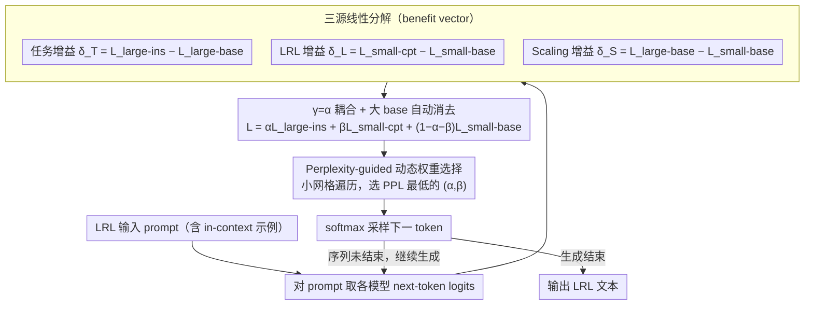

# Efficient Low-Resource Language Adaptation via Multi-Source Dynamic Logit Fusion

**会议**: ACL 2026  
**arXiv**: [2604.18106](https://arxiv.org/abs/2604.18106)  
**代码**: https://github.com/luciusssss/TriMix  
**领域**: 多语言 / 低资源  
**关键词**: 低资源语言、Proxy Tuning、Logit Fusion、动态权重、连续预训练

## 一句话总结
TriMix 把 LRL（低资源语言）适配拆解为"语言能力 + 任务能力 + scaling 红利"三股 logit benefit vector，仅对小模型做连续预训练即可，在推理时按 perplexity 动态决定权重，于 4 个模型家族 × 8 种 LRL 上一致超越单模型 baseline 和 Proxy Tuning，且核心实证发现"应让小 CPT 模型权重高于大指令模型"——直接挑战了 Proxy Tuning 默认的"大模型主导"假设。

## 研究背景与动机

**领域现状**：把 HRL 主导（英语等高资源语言）的大模型迁移到 LRL（藏语、维语、哈萨克语、孟加拉语等）一直是多语言 NLP 的硬骨头。主流路线两条：(1) 模型合并（model merging，如 TIES）：把"在 HRL 上学到任务能力的 ins 模型"与"在 LRL 上 CPT 出的 base 模型"做参数级融合，但要求二者**同架构同尺寸**，想要更强大模型仍需对大模型做 CPT；(2) Proxy Tuning（Liu et al. 2024）：把小专精模型的 logits 注入大模型 logits，避开大模型 CPT，在代码域成功。

**现有痛点**：Proxy Tuning 隐含"大模型作为主信号、小模型只是 delta"的假设；可在 LRL 场景，大模型本身在目标 LRL 上**也是弱者**，让它当主信号会"压住"小 CPT 模型在 LRL 上的强能力，甚至破坏基本 LRL 生成（论文 Appendix B.4 给出例子）。换言之，logit 融合里"不同来源的能力并不等价"。

**核心矛盾**：LRL 任务同时缺三样东西——LRL 语言数据、任务标注、大模型算力；现有方法每次只能解决其中一两个，且默认"大模型 logits 是骨架"，与"大模型本身在 LRL 弱"的事实冲突。

**本文目标**：设计一个 (i) 不需要 LRL 任务标注、(ii) 不需要对大模型做 CPT、(iii) 能正确平衡三种能力来源、(iv) 跨多个模型家族通用的框架。

**切入角度**：把模型分成 base / ins / cpt 三个变体，并在 logit 空间把"任务"、"LRL"、"scaling"分别表示为 base 与变体之间的 delta 向量；再用 perplexity 这种"无监督的输入分布契合度"自动选权重。

**核心 idea**：在 logit 上做"三源线性分解 + 动态权重"，并刻意把 scaling 系数与任务系数耦合（$\gamma=\alpha$），使大 base 模型完全被消去，只需载入"大 ins + 小 base + 小 cpt"即可推理。

## 方法详解

### 整体框架
TriMix 是**纯测试时**框架（除小模型 CPT 外无需训练）。给定 LRL 输入 prompt：(1) 同时把它喂给三个模型——大型指令模型 large-ins、小型 base small-base、在 LRL 上 CPT 过的小模型 small-cpt；(2) 取它们 next-token logits 做线性融合 $L=\alpha L_{large\text{-}ins}+\beta L_{small\text{-}cpt}+(1-\alpha-\beta)L_{small\text{-}base}$；(3) $\alpha,\beta$ 用 perplexity-guided（默认）或 entropy-guided 方式从一个小网格里**在线**选；(4) softmax 后采样下一个 token，循环直到结束。整套流程只需要对小模型做一次原始 LRL 文本的 CPT，**完全不需要 LRL 任务标注**，也**完全不更新**大模型。

### 关键设计

**1. 三源线性分解（Task / Language / Scaling 三个 benefit vector）：把"理想 logit"显式拆成 small-base 加三股独立增益**

LRL 任务同时缺三样东西——语言数据、任务标注、大模型算力，而以往方法把它们混在一起调，无法分别施力。TriMix 在 logit 空间把能力 disentangle 成三条独立通道：任务增益 $\delta_T=L_{large\text{-}ins}-L_{large\text{-}base}$（大模型学习能力强，所以任务能力从大模型这对里抽）、LRL 增益 $\delta_L=L_{small\text{-}cpt}-L_{small\text{-}base}$（只有小模型能 CPT，故语言能力只能从小模型差出来）、Scaling 增益 $\delta_S=L_{large\text{-}base}-L_{small\text{-}base}$（特意用 base 对 base，避免把"指令风格"误当成"规模红利"）。最终理想 logit 写成 $L=L_{small\text{-}base}+\alpha\delta_T+\beta\delta_L+\gamma\delta_S$。

显式拆开的意义在于每一项都能独立调权重，而不是像 Proxy Tuning 那样只有"大主小辅"一个旋钮。$\delta_S$ 坚持 base-对-base 的细节也正是为了让"规模"这一项保持纯净，不被指令调的风格污染。

**2. $\gamma=\alpha$ 耦合 + 大 base 自动消去：一个代数变换把推理要载入的模型从 4 个压到 3 个**

上面的理想公式需要同时跑 large-ins、large-base、small-cpt、small-base 四个模型，可现实里部署端常常没有载入大 base 的显存。TriMix 令 $\gamma=\alpha$，把 $\alpha(L_{large\text{-}ins}-L_{large\text{-}base})+\alpha(L_{large\text{-}base}-L_{small\text{-}base})$ 一合并，中间的 $L_{large\text{-}base}$ 正好消掉，公式塌缩成 $L=\alpha L_{large\text{-}ins}+\beta L_{small\text{-}cpt}+(1-\alpha-\beta)L_{small\text{-}base}$。推理时只剩大 ins + 小 base + 小 cpt 三次 forward。

这是一笔"工程成本换灵活性"的交易：作者坦承放开 $\gamma\ne\alpha$ 理论上界更高，但作为实用近似，省掉大 base 的显存和带宽开销在 LRL 真实部署里更划算。

**3. Perplexity-guided 动态权重选择：没有 LRL 验证集，就用 PPL 逐样本在线选 $(\alpha,\beta)$**

LRL 场景拿不到任务标注，传统的网格超参搜索因为没有 dev set 而失效。TriMix 改用一个无监督代理：对每条输入 prompt（含 in-context 示例 + 测试输入），用三个模型融合后的语言模型算它的 perplexity，在一个小网格里遍历、选 PPL 最低的那组 $(\alpha,\beta)$——直觉就是"哪组权重最能解释当前输入分布，就用哪组"。备选的 ENT 策略则选首个生成 token 熵最低的配置，捕捉"最确定"的输出，两者都不碰任何标注。

之所以可行，是因为 PPL 与生成质量高度相关又完全无监督；实验里 PPL 选出的权重和经验上界（Upper Bound）几乎贴合，且在 1.5B+3B 上明显优于 ENT，说明"输入分布契合度"比"输出确定度"是更稳的指针。

### 损失函数 / 训练策略
本框架**唯一的训练**是把小模型在 LRL 原始语料上做 CPT，得到 small-cpt；其余阶段（任务能力转移、scaling 增益、$\alpha,\beta$ 选择）全部在 test time 完成，**0 任务标注、0 大模型梯度更新**。CPT 细节因模型家族而异：Qwen2.5 / Llama3.2 / Gemma3 自己跑 CPT，Llama2 直接复用 Tao et al. 2024 的 checkpoint。

## 实验关键数据

### 主实验
Qwen2.5 家族下不同 large 规模的对比（4 种中国少数民族语言：藏 bod、维 uig、哈 kaz、蒙 mvf，平均分），$\Delta$ 为相对最优单模型 baseline 的相对提升：

| 设置 | 方法 | #Param Train | #Param Test | MC | ENG-G | LRL-G | Avg | $\Delta$ |
|------|------|--------------|-------------|-----|-------|-------|------|----------|
| 1.5B+3B | Qwen2.5-3B-ins | 0 | 3B | 42.4 | 12.2 | 10.8 | 24.8 | – |
| 1.5B+3B | Proxy Tuning | 1.5B | 6B | 45.4 | 14.1 | 14.1 | 28.5 | -7.2% |
| 1.5B+3B | **TriMix (PPL)** | 1.5B | 6B | 48.7 | 19.5 | 16.3 | **31.1** | **+1.3%** |
| 1.5B+3B | TriMix (Upper Bound) | 1.5B | 6B | 52.4 | 21.3 | 17.6 | 33.6 | +9.4% |
| 1.5B+7B | Qwen2.5-7B-ins | 0 | 7B | 49.7 | 20.0 | 12.5 | 30.6 | – |
| 1.5B+7B | Proxy Tuning | 1.5B | 10B | 50.5 | 16.3 | 13.3 | 30.0 | -2.3% |
| 1.5B+7B | **TriMix (PPL)** | 1.5B | 10B | **53.4** | 19.8 | 15.7 | **33.0** | **+7.5%** |
| 1.5B+14B | Qwen2.5-14B-ins | 0 | 14B | 57.1 | 21.0 | 13.8 | 34.4 | – |
| 1.5B+14B | Proxy Tuning | 1.5B | 17B | 57.7 | 15.4 | 16.8 | 33.9 | -1.5% |
| 1.5B+14B | **TriMix (PPL)** | 1.5B | 17B | **59.5** | 20.5 | 16.8 | **36.1** | **+4.9%** |

要点：(1) Proxy Tuning 在多数 Qwen2.5 配置上反而**降分**（最严重 -7.2%），印证"大模型主导"在 LRL 失灵；(2) TriMix-PPL 在每个 large 尺寸上都稳定为正提升，14B+ 配置仍能再涨 4.9%；(3) PPL 策略与 Upper Bound 差距随 large 增大缩小（如 1.5B+7B 已经只差 0.6 分），说明 PPL 是非常好的代理；(4) ENT 策略不如 PPL（在 1.5B+3B 上甚至更差），表明"输入分布契合度" > "输出确定度"。

### 跨模型 × 跨语言验证
作者把同一框架推到 Llama2 (7B+13B)、Llama3.2 (1B+3B)、Gemma3 (4B+12B)，覆盖 Tibetan / Uyghur / Kazakh / Mongolian / Tamil / Telugu / Odia / Bengali 共 8 种 LRL（Llama2 因 CPT checkpoint 限制不含 Kazakh，Llama3.2 排除 Mongolian），TriMix-PPL 始终 ≥ 最强单模型 baseline，证明框架不挑模型家族。

### 消融实验：权重模式分析
论文核心实证发现（基于 Upper Bound 选权重的分布统计）：

| 设置 | 经验最优 $\alpha$ (large-ins) | 经验最优 $\beta$ (small-cpt) | $\beta/\alpha$ |
|------|-------------------------------|------------------------------|----------------|
| Proxy Tuning 默认假设 | ≈1.0 | ≈0.x | <1（large 主导） |
| TriMix Upper Bound | 较小 | **显著更大** | **>1（small-cpt 主导）** |
| TriMix PPL 选出 | 与 Upper Bound 接近 | 与 Upper Bound 接近 | >1 |

也就是说，**最优策略恰好与 Proxy Tuning 的隐含假设相反**：在 LRL 场景应让小 CPT 模型主导 logit、大 ins 模型只作为辅助任务/scaling 信号注入。

### 关键发现
- **"大模型主导"是 Proxy Tuning 在 LRL 失灵的根因**：作者用 Upper Bound 权重分布直接证伪默认假设，给后续 logit-fusion 工作提供了一条新原则——"按目标域强者主导"。
- **Perplexity 是 LRL 无监督选权重的好代理**：PPL 策略选出的 $(\alpha,\beta)$ 几乎贴合 Upper Bound，且优于 ENT；这是 LRL 缺验证集时一个非常实用的工程结论。
- **小模型 CPT 的杠杆极高**：仅 1.5B CPT + 14B 现成 ins 就能比裸 14B 涨 4.9%，相当于"省下对 14B 做 CPT 的算力"。
- **任务类型敏感**：在生成型任务（LRL-G、ENG-G）上 TriMix 涨幅最大；MC 偏小，因为 MC 主要看 retrieval 而非语言流畅度。
- **divergence-from-base 解释 LRL 权重需求**：作者发现当 CPT 模型与 base 分布差异越大（LRL 适配越深），最优 $\beta$ 也越大——给"何时该多用小 CPT"提供了可量化指标。

## 亮点与洞察
- **三源分解 + 系数耦合**：把 logit 融合从"两个模型互相加减"升级为"三源能力的可控线性组合"，并通过 $\gamma=\alpha$ 巧妙消去大 base，这是工程美感很强的一步。该思路可推广到任何"多能力来源"场景（代码 + 数学 + 多语种）。
- **挑战 Proxy Tuning 默认假设**：用经验上界和动态权重双重证据反转"大模型一定是主信号"的直觉，这是 logit arithmetic 文献近年最有力的反例之一。
- **无标注、可即插即用**：方法不需要任务级 LRL 标注，等于把"准备数据"成本几乎归零，对真实 LRL 社群（藏文、维文等）极友好。
- **PPL 选超参的范式**：在缺标注场景里把"PPL on prompt"作为权重选择的免费代理，这一招完全可以照搬到其他 inference-time fusion 工作。

## 局限与展望
- $\gamma=\alpha$ 是"工程实用化"妥协，理论上放开后性能上限更高；如何把大 base 高效融入而不爆显存是后续方向。
- CPT 仍是必要环节，对完全无原始语料的 ultra-low resource 语言仍不可行。
- 实验主要在 Llama / Qwen / Gemma 等开源家族，未覆盖 MoE 大模型；MoE logits 的 fusion 行为可能不同。
- 评测以 MiLiC-Eval、Belebele、SIB-200 为主，未做开放式人评；LRL 生成质量的细粒度评测仍是问题。
- 权重搜索网格的离散粒度可能压制 Upper Bound 的潜力；可用连续优化（如 token-level dynamic gating）进一步改进。

## 相关工作与启发
- **vs Proxy Tuning (Liu 2024)**：同样在 logit 域融合，但 Proxy 把大模型作主、小模型作 delta；TriMix 反过来让小 CPT 主导且引入"任务 + scaling"两条独立通道，实测在 LRL 上一致更好。
- **vs Model Merging (Tao 2024, TIES)**：要求同架构同尺寸，且 scaling 需对大模型 CPT；TriMix 不要求架构匹配且小模型 CPT 即可享受 scaling 红利。
- **vs Contrastive Decoding (Li 2023)**：CD 用 small-cpt − small-base 做差强化语言能力，没有大模型；TriMix 显式接入大 ins 提供任务和 scaling，且权重动态化。
- **启发**：所有"小模型懂局部 X、大模型懂通用"的场景（医学、法律、垂直 agent）都可以试 TriMix——把垂直能力做成 $\delta_L$、把任务能力做成 $\delta_T$、把规模做成 $\delta_S$，PPL/ENT 在线选权重。

## 评分
- 新颖性: ⭐⭐⭐⭐ 三源分解 + $\gamma=\alpha$ 消去 + PPL 选权重 + 推翻"large 主导"假设，每点都非颠覆但合起来很有创意。
- 实验充分度: ⭐⭐⭐⭐⭐ 4 个模型家族 × 8 种 LRL × 多种 large 规模 × 上界 / PPL / ENT 三种策略，覆盖很扎实。
- 写作质量: ⭐⭐⭐⭐ 数学推导清晰，图 2 框架直观；部分 ablation 引用到 Appendix 偏多。
- 价值: ⭐⭐⭐⭐⭐ 对真实 LRL 社群算力受限场景极具实用性，且对未来 logit-fusion 研究有方法论冲击。

<!-- RELATED:START -->

## 相关论文

- [\[ICML 2026\] Toward Robust Multilingual Adaptation of LLMs for Low-Resource Languages](../../ICML2026/multilingual_mt/toward_robust_multilingual_adaptation_of_llms_for_low-resource_languages.md)
- [\[ACL 2026\] Mitigating Catastrophic Forgetting in Target Language Adaptation of LLMs via Source-Shielded Updates](mitigating_catastrophic_forgetting_in_target_language_adaptation_of_llms_via_sou.md)
- [\[ACL 2026\] Reinforcement Learning with Semantic Rewards Enables Low-Resource Language Expansion without Alignment Tax](reinforcement_learning_with_semantic_rewards_enables_low-resource_language_expan.md)
- [\[ACL 2026\] Why Low-Resource NLP Needs More Than Cross-Lingual Transfer: Lessons Learned from Luxembourgish](why_low-resource_nlp_needs_more_than_cross-lingual_transfer_lessons_learned_from.md)
- [\[ACL 2025\] Language Fusion for Parameter-Efficient Cross-lingual Transfer (FLARE)](../../ACL2025/multilingual_mt/flare_crosslingual_lora.md)

<!-- RELATED:END -->
