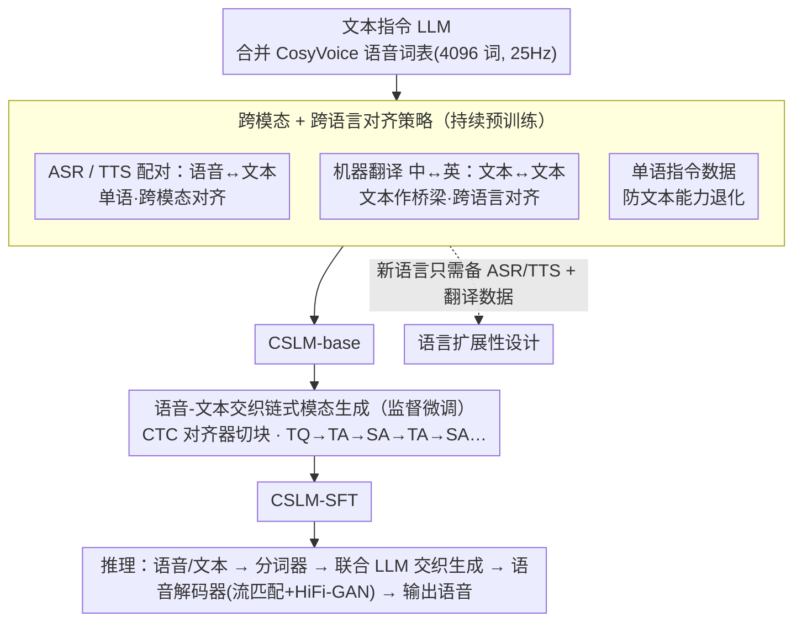

# Efficient Training for Cross-lingual Speech Language Models

**会议**: ACL 2026 Findings  
**arXiv**: [2604.11096](https://arxiv.org/abs/2604.11096)  
**代码**: [https://github.com/ictnlp/CSLM](https://github.com/ictnlp/CSLM)  
**领域**: 多语言/翻译 / 音频语音  
**关键词**: 跨语言语音LLM、离散语音token、模态对齐、链式模态生成、数据高效训练

## 一句话总结
本文提出CSLM，一种高效训练跨语言语音LLM的方法，通过新颖的对齐策略实现跨模态和跨语言对齐，并引入语音-文本交织链式模态生成来提升质量和降低延迟，无需大规模语音数据即可扩展到新语言。

## 研究背景与动机

**领域现状**：语音LLM正在兴起以实现更自然的人机交互，但构建有效的端到端语音LLM仍面临挑战。现有方法包括：级联ASR+LLM+TTS（存在误差累积和高延迟）、编码器+LLM的模块化方法（语音生成能力弱）、基于离散语音token的统一建模（如SpeechGPT、GLM-4-Voice）。

**现有痛点**：(1) 语音数据相对文本极度稀缺，尤其对某些语言；(2) 现有统一建模方法（如GLM-4-Voice、Moshi）需要海量数据训练；(3) 将语音LLM扩展到更多语言面临数据稀缺和训练困难的双重挑战；(4) 现有链式模态生成（TQ→full TA→full SA）的延迟高。

**核心矛盾**：构建多语言多模态的统一表示通常需要大量数据，但语音数据在许多语言中严重不足。如何用有限数据同时实现跨语言和跨模态对齐是核心挑战。

**本文目标**：设计一种数据高效的训练方法，用有限语音数据同时实现跨模态和跨语言对齐，并具备良好的语言扩展性。

**切入角度**：利用文本模态作为"桥梁"来实现跨语言对齐——在单一语言内通过ASR/TTS数据做语音-文本跨模态对齐，跨语言通过机器翻译数据（文本-文本）做对齐。这样就不需要跨语言的语音-语音对齐数据。

**核心 idea**：设计"语音-文本交织链式模态"生成方式——模型交替生成短文本块和对应语音块（TQ→TA→SA→TA→SA...），比全量链式模态（TQ→full TA→full SA）具有更细粒度的模态对齐和更低的延迟。

## 方法详解

### 整体框架
CSLM由三个组件组成：(1) CosyVoice语音分词器（4096词汇表，25Hz）将语音转为离散token；(2) 语音-文本联合LLM（合并语音和文本词汇表）；(3) 语音解码器（流匹配模型+HiFi-GAN声码器）。这套架构是底座，真正的贡献落在两阶段训练上：持续预训练阶段用「跨模态+跨语言对齐策略」把语音和文本、中文和英文同时对齐；监督微调阶段用「语音-文本交织链式模态生成」细化对齐、压低延迟；整套对齐配方还天然带来「语言扩展性」——接入新语言只需补两样数据。

### 关键设计

**1. 跨模态 + 跨语言对齐策略：用文本当桥梁，绕开难拿的跨语言语音-语音配对数据**

直接采集"中文语音↔英文语音"这种跨语言语音配对极其困难，但 ASR/TTS 配对和机器翻译数据相对廉价。CSLM 因此把对齐拆成两段都好拿的数据来拼：单语内用 ASR 数据（语音→文本）和 TTS 数据（文本→语音）做跨模态对齐，让每种语言各自的语音和文本对齐；跨语言则用机器翻译数据（中↔英文本）做文本-文本对齐。两种语言的语音都锚定到各自文本、文本之间又通过翻译相连，于是跨语言的语音对齐被"间接"地搭了出来，全程不需要任何跨语言语音配对。此外还掺入单语指令数据，防止模型在补语音能力时把原有文本能力训退化。

**2. 语音-文本交织链式模态生成：把"先出完整文本再出完整语音"改成小块交替，细化对齐又压低延迟**

原始链式模态 TQ→full TA→full SA 要等整段文本生成完才开始出语音，延迟很高。交织式改成模型先生成一小块文本回复、立刻生成对应的语音块，再循环下去，即 TQ→TA→SA→TA→SA…。训练数据靠 CTC 对齐器从已有语音-文本对里自动构建——用 CTC 动态规划找最优对齐路径

$$\pi^* = \arg\max_\pi \prod_t P(\pi_t|\mathbf{h}_t)$$

拿到 token 级时间边界后，按 chunk 大小（7 个词）在标点处切分成交替块。这样做的收益是生成和播放在时间上重叠：前一块语音正在播时，模型已经在生成后续内容，延迟自然降下来；而 chunk 级的文本-语音交织比 word 级切分误差更小、更稳定。

**3. 语言扩展性设计：新语言只要 ASR/TTS 配对 + 翻译数据两样就能接入**

把语音 LLM 扩到新语言通常卡在目标语言缺大规模单语语音数据。CSLM 的对齐配方天然把这个门槛降到最低：因为离散语音 token 与语言无关、CosyVoice 分词器本身就支持多语言，所以只要目标语言备齐 (1) 语音-文本配对数据（喂模态对齐）和 (2) 翻译数据（喂语言对齐），就能把它集成进训练。不需要目标语言的大规模单语语音、更不需要跨语言语音配对，这正是低资源语言也能上车的关键。

### 损失函数 / 训练策略
两阶段训练：(1) 持续预训练——在已经过指令微调的LLM基础上，合并语音词汇表，使用ASR/TTS/MT/单语指令数据混合训练得到CSLM-base；(2) 监督微调——在文本指令和语音对话数据上训练得到CSLM-SFT，使用交织链式模态格式。连续重复的语音token在输入LLM前合并以提高效率。

## 实验关键数据

### 主实验

| 任务 | 模型 | 英文 | 中文 |
|------|------|------|------|
| ASR (WER↓) | Whisper-large-v3 | 2.5 | 9.3 |
| ASR | GLM-4-Voice | 2.8 | 2.5 |
| ASR | CSLM-SFT | 9.8 | 9.0 |
| TTS (WER↓) | CosyVoice-SFT | 3.4 | — |
| TTS | GLM-4-Voice | 4.7 | — |
| TTS | CSLM-SFT | **3.8** | — |
| TTS (LibriTTS) | CSLM-SFT | **2.9** | — |

### 消融实验

| 配置 | 效果 | 说明 |
|------|------|------|
| 全量链式模态 | 延迟高 | TQ→full TA→full SA |
| 交织链式模态 | 延迟低、质量更好 | TQ→TA→SA→TA→SA... |
| w/o 跨语言对齐 | 跨语言任务差 | 缺乏翻译数据桥接 |
| w/o 模态对齐 | 语音质量差 | 缺乏ASR/TTS训练 |

### 关键发现
- CSLM在TTS质量上接近甚至超越专用TTS系统（CosyVoice），同时具备对话和跨语言能力
- 交织链式模态显著降低延迟——前一块音频播放时模型已在生成后续内容
- 使用远少于GLM-4-Voice的语音数据（后者使用海量数据），CSLM仍达到可比的性能
- CTC对齐器构建的chunk级交织数据比word级交织更稳定
- ASR性能不如专用ASR模型（Whisper），但对于对话场景足够用

## 亮点与洞察
- **文本作为跨语言桥梁**：巧妙地利用文本模态的丰富资源来桥接不同语言的语音，避免了对跨语言语音配对数据的依赖。这个思路对所有多语言多模态系统都有借鉴意义。
- **交织链式模态的延迟优化**：通过交替生成文本和语音实现生成-播放重叠，是一个实用且优雅的延迟优化方案。
- **CTC对齐器构建训练数据**：用现有ASR模型的CTC模块获取精确的语音-文本对齐，自动构建交织训练数据，避免了手工对齐。

## 局限与展望
- ASR性能显著弱于专用Whisper模型，说明统一建模在理解任务上仍有差距
- 仅验证了中英双语，未测试更多语言的扩展效果
- 语音分词器（CosyVoice）的性能直接影响整个系统，更换分词器可能带来提升
- 交织式生成的chunk大小（7个词）是手动选择的，可探索自适应chunk划分

## 相关工作与启发
- **vs GLM-4-Voice**：GLM-4-Voice是首个中英双语语音LLM但需海量数据。CSLM用远更少的数据达到可比效果
- **vs SPIRIT LM / Moshi**：需要大量语音数据的统一建模方法。CSLM的高效对齐策略大幅降低数据需求
- **vs LLaMA-Omni**：模块化方法（编码器+LLM+TTS），语音质量和多样性受限。CSLM通过离散token统一建模提供更自然的语音

## 评分
- 新颖性: ⭐⭐⭐⭐ 交织链式模态和文本桥接对齐策略是新颖且实用的设计
- 实验充分度: ⭐⭐⭐ 覆盖多个任务但仅双语、数据规模对比不够详细
- 写作质量: ⭐⭐⭐⭐ 框架清晰，对齐策略的可视化有助理解
- 价值: ⭐⭐⭐⭐ 为低资源语言的语音LLM提供了可行的训练路径

<!-- RELATED:START -->

## 相关论文

- [\[ACL 2026\] LLM-XTM: Enhancing Cross-Lingual Topic Models with Large Language Models](llm-xtm_enhancing_cross-lingual_topic_models_with_large_language_models.md)
- [\[ACL 2026\] Vocabulary Shapes Cross-Lingual Variation of Word-Order Learnability in Language Models](vocabulary_shapes_cross-lingual_variation_of_word-order_learnability_in_language.md)
- [\[ACL 2025\] Language Fusion for Parameter-Efficient Cross-lingual Transfer (FLARE)](../../ACL2025/multilingual_mt/flare_crosslingual_lora.md)
- [\[ACL 2025\] Statement-Tuning Enables Efficient Cross-lingual Generalization in Encoder-only Models](../../ACL2025/multilingual_mt/statement-tuning_enables_efficient_cross-lingual_generalization_in_encoder-only_.md)
- [\[ACL 2025\] Cross-Lingual Optimization for Language Transfer in Large Language Models](../../ACL2025/multilingual_mt/cross-lingual_optimization_for_language_transfer_in_large_language_models.md)

<!-- RELATED:END -->
