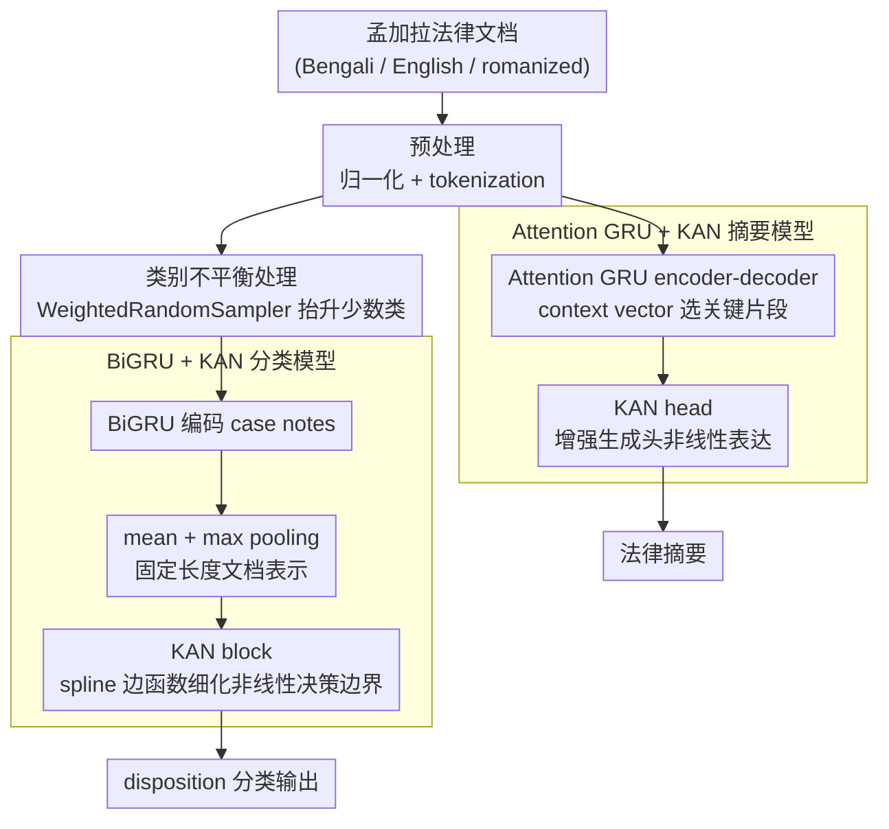

# Enhancing BiGRU with a KAN Block for Legal Document Classification and Summarization

**会议**: ACL2026  
**arXiv**: [2606.00116](https://arxiv.org/abs/2606.00116)  
**代码**: 无  
**领域**: 法律NLP / 多语言文本分类与摘要  
**关键词**: BiGRU, Kolmogorov-Arnold Network, legal NLP, document classification, legal summarization

## 一句话总结
本文在低资源多语言孟加拉法律文档上，把 KAN block 加到 BiGRU 分类器和 attention-based GRU 摘要模型中，使分类准确率达到 67.96%、ROUGE-1/2/L 达到 0.38/0.23/0.31，并在消融中把 BiGRU 准确率从 57.34% 提升到 67.96%。

## 研究背景与动机
**领域现状**：法律 NLP 常见任务包括判决/处分类别分类、案情摘要和法律文档检索。传统方法用 SVM、Logistic Regression 等手工特征模型；深度方法则常用 BiGRU、BiLSTM、encoder-decoder attention 或 pointer-generator。

**现有痛点**：法律文档长、结构复杂、术语专门，还经常包含程序性事实和细微法律差异。孟加拉法律数据又额外包含 Bengali、English 和 transliterated Bengali，形成低资源、多语言、类别不平衡的组合难题。

**核心矛盾**：预训练语言模型理论上强，但在低资源法律语料和有限算力设定下可能调不充分；传统 recurrent model 成本低，却可能表达能力不足。问题是能否在不引入重型 backbone 的情况下增强 recurrent model 的非线性表示。

**本文目标**：作者想验证 KAN block 是否能作为轻量增强模块，提高 BiGRU/GRU 在法律文档分类和摘要上的表现，而不是提出全新的法律大模型。

**切入角度**：KAN 用可学习的 spline-like edge functions 替代传统 MLP 中固定激活函数，理论上能建模更复杂的非线性关系。作者把它接在 recurrent backbone 的表示之后，让 KAN 负责细化文档表示或生成头。

**核心 idea**：在低资源法律场景中，用 “BiGRU/AttnGRU 负责序列建模 + KAN 负责非线性表示增强” 作为比重型 PLM 更可控的折中方案。

## 方法详解
论文包含两个任务：法律文档 disposition classification 和 legal document summarization。二者共享一个基本思路：先用 recurrent architecture 编码长文本，再把 KAN 作为增强 head 或 transformation block。分类任务侧重固定长度文档表示，摘要任务侧重 encoder-decoder attention 输出。

### 整体框架
数据来自 Manupatra，包含 2,937 个孟加拉法律文档样本，文本中混有 Bengali、English 和 romanized Bengali。作者把数据分成 2,349 个训练样本和 588 个 held-out evaluation 样本。预处理包括缺失值和 placeholder 标准化、文本 normalization、删除重复/损坏项、长度分析、tokenization 等。分类任务使用 BiGRU 编码 case notes，并通过 mean pooling 和 max pooling 得到文档表示，再交给 KAN block 预测 disposition。摘要任务使用 attention-based GRU encoder-decoder，并在输出头上加入 KAN 来增强 token prediction。两条任务支路共享同一套预处理后的文本，并各自在 recurrent backbone 之上挂一个 KAN 增强模块。

### 关键设计

**1. BiGRU + KAN 分类模型：序列编码交给 BiGRU，非线性决策边界交给 KAN**

法律文档又长、术语又专，还混着 Bengali、English 和 romanized Bengali 三种文字，单靠一个 recurrent backbone 的表达力不一定够。这个分类模型让 token sequence $X=(x_1,x_2,\ldots,x_T)$ 先过 embedding 和 BiGRU，每个时间步把前向与后向 hidden state 拼起来得到 $h_t=[\overrightarrow{h_t};\overleftarrow{h_t}]$，再同时做 mean pooling 和 max pooling 形成固定长度的文档表示 $h_{doc}=[h_{mean};h_{max}]$，最后送进 KAN block 输出分类 logits。两种 pooling 各有分工——mean 保留整段语义，max 抓住强触发词或关键法律短语；而 KAN head 用可学习的 spline-like edge functions 替代 MLP 里的固定激活，给这份固定表示补上更复杂的非线性分割能力，相当于在不换重型 backbone 的前提下把决策边界做得更细。

**2. Attention GRU + KAN 摘要模型：attention 选片段，KAN 强化生成头**

法律摘要要从长文本里聚焦核心法律问题和关键条款，光靠 recurrent decoder 容易抓不准重点。摘要模型用 attention-based GRU encoder-decoder：encoder 把输入编码为 $H=(h_1,h_2,\dots,h_T)$，decoder 每个时间步通过 attention 算出 context vector $c_t$，结合自身 hidden state 预测下一个 token。和分类模型同源的思路是，KAN head 被接在这个生成头上方——attention 负责从输入中挑出该关注的片段，KAN 负责提升输出表示的非线性表达力，让生成的摘要更能保留重要事实和条款。

**3. 类别不平衡处理：用 WeightedRandomSampler 把少数类抬进每个 batch**

法律 disposition 标签高度不平衡，普通随机采样会让模型一味倒向多数类。分类训练因此改用 WeightedRandomSampler，按类别频率反比加权，让 minority classes 在 mini-batch 里出现得更频繁；这是个低成本又天然兼容 recurrent/KAN 架构的缓解手段。摘要任务则保留标准 batch formation——因为摘要目标依赖每个样本完整的原文和 target summary，逐样本采样比按类别重采样更合适。

### 损失函数 / 训练策略
分类任务使用标准 cross entropy，摘要任务使用 sequence-to-sequence target token loss。训练超参数为 200 epochs、learning rate $2\times10^{-5}$、batch size 8、Adam optimizer、dropout 0.2。分类指标包括 accuracy、macro-F1 和 weighted-F1；摘要使用 ROUGE-1、ROUGE-2、ROUGE-L F1。论文也报告了三次分类实验的稳定性：0.6765、0.6699、0.6771，均接近主结果。

## 实验关键数据

### 主实验
分类结果中，BiGRU + KAN 是所有比较方法里 accuracy 最高的模型。论文明确给出该模型 macro-F1 为 0.53、weighted-F1 为 0.65。

| 类别 | 模型 | Accuracy |
|------|------|---------:|
| Classical ML | Logistic Regression | 0.59 |
| Classical ML | Random Forest | 0.62 |
| Classical ML | SVM | 0.62 |
| Classical ML | Naive Bayes | 0.48 |
| Classical ML | KNN | 0.58 |
| PLMs | BERT | 0.3813 |
| PLMs | Legal-BERT | 0.3885 |
| PLMs | RoBERTa | 0.3741 |
| PLMs | T5 | 0.4101 |
| PLMs | Longformer | 0.4173 |
| Recurrent | BiLSTM w/o KAN | 0.5188 |
| Recurrent | BiGRU w/o KAN | 0.5734 |
| Recurrent | BiGRU + KAN | 0.6796 |

摘要结果中，AttnGRU + KAN 同时优于 BiLSTM 和 Pointer-Generator。

| 模型 | ROUGE-1 F1 | ROUGE-2 F1 | ROUGE-L F1 |
|------|-----------:|-----------:|-----------:|
| AttnGRU + KAN | 0.38 | 0.23 | 0.31 |
| BiLSTM | 0.30 | 0.18 | 0.25 |
| Pointer-Generator | 0.35 | 0.20 | 0.28 |

### 消融实验
| 配置 | Accuracy | 说明 |
|------|---------:|------|
| BiLSTM without KAN | 0.5188 | recurrent baseline |
| BiGRU without KAN | 0.5734 | 更强 recurrent baseline |
| BiGRU + KAN | 0.6796 | 加入 KAN 后提升 10.62 个百分点 |

三次主分类实验的 accuracy 分别为 0.6765、0.6699、0.6771，论文报告均值为 0.6796。这里的均值与列出的三次值在算术上并不完全对应，但缓存原文如此给出，笔记不额外修正。

### 关键发现
- KAN 对 BiGRU 的提升很明显：classification accuracy 从 0.5734 提升到 0.6796，幅度为 10.62 个百分点。
- 传统 ML 中 Random Forest 和 SVM 达到 0.62，强于该实验下的 PLM baseline；这提示低资源法律数据上，PLM 如果调参不足并不必然占优。
- 摘要侧 AttnGRU + KAN 的 ROUGE-1/2/L 分别为 0.38/0.23/0.31，说明 KAN 增强头也有助于生成任务。
- 错误分析显示，模型仍会混淆相近 disposition classes，例如 Appeal Dismissed 与 Petition Dismissed，也会漏掉摘要中的程序性法律事实。

## 亮点与洞察
- 论文的目标很工程化：不追求更大模型，而是在低资源、混合语言、类别不平衡的实际法律数据上验证一个轻量结构增强。
- KAN 作为 head 而不是 backbone 替代品，这个定位比较合理。它让 recurrent model 保留序列建模优势，同时把非线性分类边界交给 KAN 处理。
- 结果反常但有启发：在受限资源下，BERT/Legal-BERT/Longformer 都低于 classical ML 和 BiGRU + KAN，说明法律 NLP 小数据实验必须谨慎比较 tuning budget。
- 摘要示例显示模型能抓住核心法律行为和条款，但也暴露了生成摘要偏短、容易省略程序信息的问题。

## 局限与展望
- 作者明确指出类别不平衡仍然严重；WeightedRandomSampler 只能部分缓解，minority classes 仍难预测。
- 数据多语言混写，包括 Bengali、English 和 romanized Bengali，增加了 tokenization、表示学习和术语对齐难度。
- 摘要模型有时会跳过重要程序性信息，这在法律场景中风险较高，因为程序事实可能影响结论。
- PLM 比较是在有限算力和不同 tuning budget 下完成的，不能据此断言 recurrent+KAN 一定优于充分调优的 Legal-BERT、Longformer 或更强模型。
- 数据规模只有 2,937 条，且来自特定孟加拉法律数据源；跨国家、跨法系和更大法律语料的泛化还未验证。
- 未来方向包括更强 backbone、更好的类别不平衡方法、更保真摘要生成，以及 KAN block 的透明性/可解释性分析。

## 相关工作与启发
- **vs classical ML**: SVM 和 Random Forest 在该数据上有不错表现，但依赖较浅文本特征；BiGRU + KAN 能更好建模上下文和非线性类别边界。
- **vs pretrained language models**: BERT、Legal-BERT、RoBERTa、T5、Longformer 在当前受限设定下表现较弱；这提醒低资源法律任务中，模型规模不等于实际收益。
- **vs BiGRU/BiLSTM**: 单纯 recurrent backbone 表达能力不足，KAN head 提供了更强非线性转换，消融提升直接支持这一点。
- **vs pointer-generator summarization**: Pointer-generator 适合法律摘要中的 copy 需求，但本文 AttnGRU + KAN 在 ROUGE 上更高；后续可考虑把 KAN 与 copy mechanism 结合。
- **启发**: 对低资源专业 NLP，轻量结构改造 + 明确的数据不平衡处理，可能比直接套大模型更稳、更容易复现。

## 评分
- 新颖性: ⭐⭐⭐☆☆ KAN 加 recurrent head 的思路有一定新意，但整体方法偏工程组合。
- 实验充分度: ⭐⭐⭐☆☆ 有分类、摘要、消融和稳定性结果，但数据规模小，PLM 对照不够公平，统计显著性不足。
- 写作质量: ⭐⭐⭐☆☆ 主线清楚，数字完整；但部分引用和均值表述略粗糙，需要更严谨的实验说明。
- 价值: ⭐⭐⭐⭐☆ 对低资源多语言法律 NLP 有实践参考价值，尤其说明轻量模型在资源受限条件下仍值得认真优化。

<!-- RELATED:START -->

## 相关论文

- [\[ACL 2026\] Mitigating Extrinsic Gender Bias for Bangla Classification Tasks](mitigating_extrinsic_gender_bias_for_bangla_classification_tasks.md)
- [\[ACL 2026\] SteerEval: Inference-time Interventions Strengthen Multilingual Generalization in Neural Summarization Metrics](steereval_inference-time_interventions_strengthen_multilingual_generalization_in.md)
- [\[ACL 2026\] LLM-XTM: Enhancing Cross-Lingual Topic Models with Large Language Models](llm-xtm_enhancing_cross-lingual_topic_models_with_large_language_models.md)
- [\[CVPR 2026\] SEA-Vision: A Multilingual Benchmark for Document and Scene Text Understanding in Southeast Asia](../../CVPR2026/multilingual_mt/sea-vision_a_multilingual_benchmark_for_comprehensive_document_and_scene_text_un.md)
- [\[ACL 2025\] mOSCAR: A Large-scale Multilingual and Multimodal Document-level Corpus](../../ACL2025/multilingual_mt/moscar_a_large-scale_multilingual_and_multimodal_document-level_corpus.md)

<!-- RELATED:END -->
