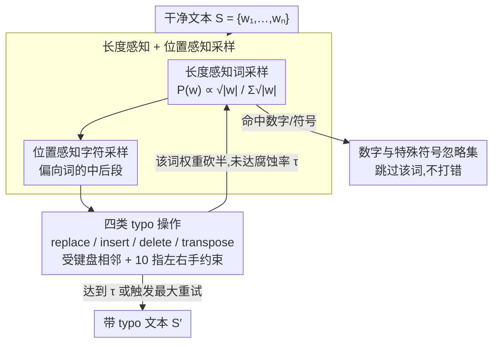

# Evaluating Robustness of Large Language Models Against Multilingual Typographical Errors

**会议**: ACL 2026  
**arXiv**: [2510.09536](https://arxiv.org/abs/2510.09536)  
**代码**: <https://github.com/cisnlp/multypo>  
**领域**: 多语言 / 鲁棒性 / LLM 评测  
**关键词**: 多语言 typo、键盘布局、鲁棒性评测、MulTypo、指令微调

## 一句话总结
本文提出 MulTypo——一个基于各语言键盘布局和 10 指打字习惯的多语种 typo 生成算法，并用它系统评测 18 个开源 LLM 在 12 种语言、5 类下游任务上的鲁棒性，证明 typo 对生成与推理任务影响最大、指令微调反而更脆弱、且 typo 影响存在跨语种和跨方向的非对称性。

## 研究背景与动机

**领域现状**：LLM 已大量部署在聊天、翻译、搜索等场景中，真实用户输入天然带 typo。但绝大多数 benchmark 都假设输入是干净的，模型 robustness 评测要么集中在英文，要么用 edit-distance 这种与键盘无关的扰动方式。

**现有痛点**：早期的字符级扰动（Pruthi 2019、Gao 2018 等）只考虑了"替换 / 插入 / 删除 / 换位"四类操作，但完全忽略键盘布局——例如英文 QWERTY 下 "q" 旁边是 "w"，而西里尔字母键盘是另一套相邻关系，简单的随机字符替换无法逼近人类真实打字噪声。多语种 robustness 评测最多覆盖 mBERT/XLM-R 这类 encoder-only 模型（Cooper Stickland 2023），尚未系统覆盖现代 LLM。

**核心矛盾**：要量化"现实 typo"对 LLM 的影响，必须有一个能在 12 种语言上都"像人"打字的扰动算法；同时还要解开模型规模、指令微调、shot 数等因素与鲁棒性的关系，这些维度此前都没有被统一控制变量评估。

**本文目标**：(i) 构造一个跨语种、与键盘布局一致的 typo 生成器；(ii) 在 3 大模型族（Gemma / Qwen / OLMo）共 18 个模型 × 5 类任务（NLI、MCQA、数学推理、机器翻译）上做受控扰动评测；(iii) 回答模型规模、指令微调、shot 数、源/目标语言方向是否影响 typo 鲁棒性。

**切入角度**：作者观察到人类 typo 主要来自 "10 指 QWERTY 打字习惯" 和 "相邻键误触"，并且打错的概率受词长（长词更易错）与位置（中后部更易错）影响。这两个先验可以直接编码进采样分布。

**核心 idea**：用"键盘布局相邻图 + 长度感知词采样 + 位置感知字符采样 + 10 指左右手约束"来生成 typo，使扰动同时满足"像人"和"可控难度"，再以此为放大镜系统重测 18 个 LLM 的鲁棒性。

## 方法详解

### 整体框架
MulTypo 把一段干净文本 $S=\{w_1,\dots,w_n\}$ 变成带 typo 的文本，整体 pipeline 三步：(i) 按词长开方采样一批要打错的词；(ii) 在选中的词内部按"位置感知"分布采一个字符位置；(iii) 从四类操作（replace / insert / delete / transpose）里采一个，根据该语言的键盘布局执行。整个过程由用户给的腐蚀率 $\tau\in[0,1]$ 控制要打错的词数，对每个成功 typo 的词，把它的采样权重砍半以鼓励分布多样性，直到达到目标 typo 数或触发最大重试次数。所有数字串（不论是阿拉伯数字还是 "three / hundred" 这样的词形）都加入"忽略集"，保证扰动只影响语言部分而不污染评测题目。

### 关键设计

**1. 长度感知的词采样 + 位置感知的字符采样：把人类 typo 的分布先验直接编码进采样器**

心理语言学早就发现 typo 在长词中更密集、且更爱出现在词的中后段（Peterson 1986、Kukich 1992、Lisbach & Meyer 2013），均匀随机扰动会白白浪费这份先验。MulTypo 把它写进两级采样：选哪些词打错时，每个词的概率正比于 $\frac{\sqrt{|w|}}{\sum_w \sqrt{|w|}}$，长词更容易被选中，但用 sqrt 而非线性，避免所有错误都堆在某一个超长词上；选词内哪个位置打错时，则按经验分布给中后段更高概率。这等于免费拿到一份“人类 typo 分布先验”，比纯随机更贴近真实打字行为。

**2. 键盘布局相邻 + 10 指左右手约束的四类 typo 操作：让扰动对应真实的手指物理动作**

早期字符级扰动（Pruthi 2019、Gao 2018）虽然也用 replace/insert/delete/transpose 四类操作，但完全不看键盘布局，于是会生成“看着像 typo、人却根本不会犯”的错误——比如把字符按相似度随便替换，而真实打字错误其实来自相邻键误触。MulTypo 给这四类操作都套上物理约束：Replacement 只允许替换成同语言键盘上相邻的键；Insertion 在正确字符后插一个相邻键，模拟“同时按下两键”；Deletion 随机删一个字符；Transposition 则只在“分属左右手”的两个相邻字符间换位——这条约束直接来自 10 指打字法“5TGB 归左手、6YHN 归右手”的经验观察（Logan et al., 2016）。把扰动锚定到手指动作上，使 MulTypo 生成的噪声在 6/7 种语言上的“自然度”都显著优于 naive baseline（Table 2，多语言 $p<0.001$）。

**3. 数字与特殊符号忽略集（ignoring string sets）：屏蔽掉会改写评测语义的 token**

在数学推理任务里，把 `500` 打成 `5O0` 不是加噪声，而是直接改了答案——这会把 robustness 评测悄悄变成“模型能不能猜回原数字”。为堵住这个隐性 bug，MulTypo 为每种语言维护一个忽略集，囊括阿拉伯数字（`1`、`2`、`3`）、数字词形（`three`、`hundred`、`million`）以及标点、Enter、修饰键，凡是匹配或包含这些子串的词在 typo 阶段一律跳过。这样扰动只落在语言部分，保证测的是模型对输入噪声的鲁棒性本身，而不是它的数字识别能力。

### 损失函数 / 训练策略
本文不训练模型，只评测。所有 18 个 LLM 都用 3-shot prompting 作为默认设置（论文 §6.3 单独研究 shot 数影响），typo 只注入到 dataset 内容里、不注入到 prompt instruction，以保证测的是"输入噪声"而非"任务规范"被破坏。腐蚀率取 $\tau\in\{0, 0.1, 0.4, 0.7\}$ 四档；模型同时评测 base 与 instruction-tuned 两个版本，覆盖 12 种语言 × 5 类任务 (XNLI / Belebele / MMMLU / MGSM / FLORES200) + 加 multilingual AIME 做更难的推理验证。

## 实验关键数据

### 主实验

| 模型族 | Small | Medium | Large | 说明 |
|--------|-------|--------|-------|------|
| Gemma | 21.46 (-9.9%) | 48.50 (-5.7%) | 59.11 (-3.7%) | 10% typo 下平均分 + 相对掉点 |
| OLMo | 16.30 (-9.5%) | 29.16 (-7.9%) | 36.82 (-4.3%) | 同上 |
| Qwen | 27.86 (-5.7%) | 44.50 (-8.2%) | 47.19 (-5.7%) | 同上 |

Qwen 在 Belebele 上从 50+ (clean) → ~45 (10% typo)；在 MGSM 上从 ~40 → ~27 (70% typo)，下降近 13 分。XNLI 几乎不变，证明分类类任务远比生成 / 推理类任务鲁棒。

### 消融实验

| 配置 (gemma-3-4b-it) | XNLI | Belebele | MMMLU | MGSM | Flores200 |
|------|------|----------|-------|------|-----------|
| Baseline naive (10%) | 56.25 | 74.83 | 35.73 | 46.90 | 35.47 |
| WikiTypo (10%) | 57.65 | 73.07 | 37.80 | 53.30 | 35.20 |
| MulTypo (10%) | 55.83 | 76.58 | 43.43 | 53.80 | 35.35 |
| Baseline naive (70%) | 40.67 | 56.20 | 30.62 | 12.00 | 24.21 |
| WikiTypo (70%) | 38.80 | 52.65 | 30.45 | 16.40 | 22.47 |
| MulTypo (70%) | 43.20 | 61.85 | 31.27 | 38.80 | 29.68 |

MulTypo 的降幅普遍介于 naive baseline 与 WikiTypo（真实 wiki edit 历史）之间，且与 WikiTypo 趋势一致，说明它捕捉到了"真实但可控"的 typo 行为，而 naive baseline 高估了模型脆弱性。

### 关键发现
- **任务敏感度差异巨大**：XNLI 在 10% typo 下几乎无掉点（Qwen），但 MGSM 数学推理在 70% typo 下相对掉 33%。token 级扰动会显著破坏多步推理链。
- **规模带来弱鲁棒性增益**：Gemma 从 Small 的 9.9% 相对掉点降到 Large 的 3.7%，但即使最大的 13B 模型仍有 4-6% 的掉点，没有"规模免疫"。
- **指令微调反而更脆弱**：IT 模型在干净输入下显著优于 base，但在 10-40% noise 下绝对掉点常常≥base 版，说明现有 instruction-tuning 没有显式做 noise-aware 训练。
- **shot 数不增鲁棒性**：3-shot 比 0-shot 整体好，但 clean→noisy 的 robustness gap 在 0/1/3/5 shot 间几乎不变；OLMo 上加 shot 甚至有害。
- **方向不对称**：在 FLORES200 上，"X→英" 比 "英→X" 在带 typo 时更不鲁棒；高资源语言（en/de/fr）比低资源语言（hi/ben）鲁棒，且 Latin 字母语言比非 Latin 鲁棒。

## 亮点与洞察
- **键盘布局先验 + 物理约束 transposition** 是一个"几乎免费"的真实性提升器：不需要训练数据、不需要人类标注，只靠一份公开 keyboard layout 数据库就能把扰动从"看似 typo"变成"真的像人手指打错"，并且这一点被 6/7 种语言的人工评测显著证实。
- **"数字忽略集"细节**虽小，却暴露了大量 robustness 评测的隐性 bug——很多过去的扰动算法在 GSM8K 上直接改了答案数字，相当于在测"题目鲁棒性"而不是"模型鲁棒性"。这是评测设计上一个值得反复强调的 lesson。
- **MulTypo < WikiTypo < Baseline 在掉点幅度上的顺序**反向证明：模型在预训练阶段已经见过大量"真实人类 typo"，所以更接近现实分布的扰动反而掉点更小；naive 字符扰动是"未见过的分布"，过度高估了脆弱性。这一观察对所有 robustness benchmark 都有方法论意义。

## 局限与展望
- 仅覆盖 12 种字母 / 表音文字，对中文 / 韩文 / 日文这类 IME 输入法主导的语言不直接适用——CJK 的 typo 模式（拼音错选、五笔字根）与键盘相邻完全不同。
- 阿拉伯语在人工评测中 MulTypo 没显著优于 naive baseline，作者承认这可能与阿拉伯键盘 / RTL 排版的特殊性有关，需要更细致的物理模型。
- 全部评测在 base/IT 阶段做 robustness 测试，没有验证 noise-aware fine-tuning 是否能闭环；下一步自然是用 MulTypo 做训练时的数据增强而非仅仅评测。
- 文中"指令微调反而更脆弱"的结论可能与具体 IT 数据有关，缺乏对 IT mix 中 noise 占比的对比实验。

## 相关工作与启发
- **vs Pruthi et al. (2019) / Gao et al. (2018)**：他们做英文字符级对抗扰动；本文把扰动从"对抗 / 字符相似"扩展到"键盘布局 + 多语种"，并系统覆盖现代 LLM 评测。
- **vs WikiTypos (Aliakbarzadeh et al., 2025)**：WikiTypos 来自 Wikipedia edit 历史，是真实但难以控制比例；MulTypo 可任意指定 $\tau$ 和语言，两者结合可作为多语种 robustness 评测的 "真实-可控" 双锚点。
- **vs Cooper Stickland et al. (2023)**：他们关注 encoder-only 模型（XLM-R/mBERT）上的真实噪声；本文把研究对象升级到 decoder-only LLM 并加入推理类任务，把多语种 robustness 评测的边界向 GenAI 时代推进。

## 评分
- 新颖性: ⭐⭐⭐⭐ 算法本身简单，但"键盘布局 + 物理约束 + 多语种 + 系统评测"是一个被忽视已久的现实需求
- 实验充分度: ⭐⭐⭐⭐⭐ 18 模型 × 12 语言 × 5 任务 × 4 typo rate + 人工评测 + WikiTypo 对比，工程量极大
- 写作质量: ⭐⭐⭐⭐ 结构清晰，takeaway 每节末小结，但部分图表只在 appendix，读起来略需跳转
- 价值: ⭐⭐⭐⭐⭐ 提供了可复用的 Python 包，未来所有多语种 LLM 评测都应该把 MulTypo 列为标准扰动 baseline

<!-- RELATED:START -->

## 相关论文

- [\[ACL 2026\] The GaoYao Benchmark: A Comprehensive Framework for Evaluating Multilingual and Multicultural Abilities of Large Language Models](the_gaoyao_benchmark_a_comprehensive_framework_for_evaluating_multilingual_and_m.md)
- [\[ACL 2026\] LaoBench: A Large-Scale Multidimensional Lao Benchmark for Large Language Models](laobench_a_large-scale_multidimensional_lao_benchmark_for_large_language_models.md)
- [\[ACL 2025\] Disentangling Language and Culture for Evaluating Multilingual Large Language Models](../../ACL2025/multilingual_mt/disentangle_language_culture.md)
- [\[ACL 2026\] LLM-XTM: Enhancing Cross-Lingual Topic Models with Large Language Models](llm-xtm_enhancing_cross-lingual_topic_models_with_large_language_models.md)
- [\[NeurIPS 2025\] XIFBench: Evaluating Large Language Models on Multilingual Instruction Following](../../NeurIPS2025/multilingual_mt/xifbench_evaluating_large_language_models_on_multilingual_instruction_following.md)

<!-- RELATED:END -->
