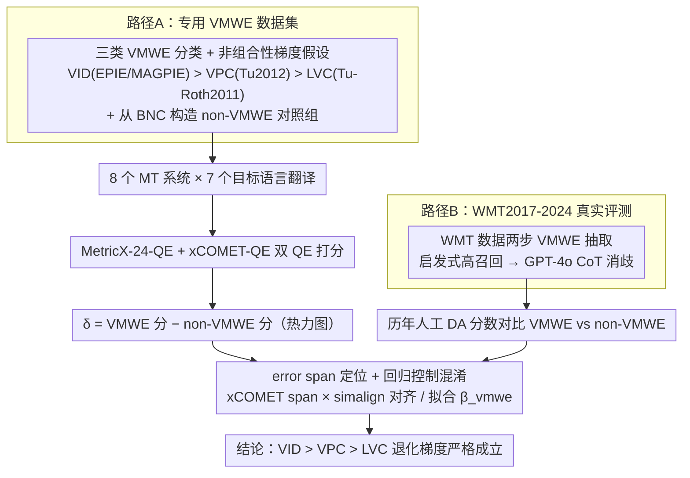

# Evaluating the Impact of Verbal Multiword Expressions on Machine Translation

**会议**: ACL 2026  
**arXiv**: [2508.17458](https://arxiv.org/abs/2508.17458)  
**代码**: <https://github.com/cincynlp/vmwe-mt-eval>  
**领域**: 机器翻译 / 多语言 / 评测  
**关键词**: VMWE、动词成语、verb-particle、light verb、xCOMET、MetricX

## 一句话总结
本文首次系统评测动词类多词表达式（VMWE：动词成语 VID、动词-小品词 VPC、轻动词构式 LVC）对机器翻译质量的影响，在 8 个 MT 系统 × 7 个语言对 × 两类 QE 模型 + 人工 DA 评分上证明：VMWE 普遍掉点，且掉点幅度与"非组合性"严格正相关（VID > VPC > LVC），即使 GPT-4.1/GPT-5.1 也无法消除这一退化。

## 研究背景与动机

**领域现状**：MT 系统在过去 5 年因 LLM 加持质量飞涨，但翻译界长期知道某些语言现象（结构差异、形态复杂词、MWE）依然啃不动。前人工作要么只研究统计 MT 时代的 idiom 翻译，要么只在中英方向上做案例分析，没有覆盖现代神经 MT + LLM 时代的系统性评测。

**现有痛点**：(i) VMWE 本身是高度非组合性的——"spill the beans" 不是"洒豆子"而是"泄密"，"land on his feet" 也不是字面意思；模型经常逐词翻译丢语义。(ii) 已有的 MWE 评测要么只覆盖单一类型（只测 idiom 或只测 light verb），要么只用 BLEU 这种对短语级语义不敏感的指标。(iii) 没有控制混淆变量——VMWE 句子可能本身就更长 / 更复杂，到底是 VMWE 还是 sentence difficulty 导致退化，没人区分。

**核心矛盾**：要证明"是 VMWE 本身在拖累 MT"，必须同时做到：覆盖三类典型 VMWE、横跨多种 MT 系统、用 reference-free QE + 人类 DA 双验证、并在回归里把句长 / 多义性 / 结构复杂度等混淆控制掉。前人都没做齐这四件事。

**本文目标**：(i) 在三类 VMWE（VID / VPC / LVC）× 7 语言对 × 8 MT 系统上量化退化；(ii) 用现成 VMWE 数据集 + WMT 真实评测数据双 source 验证；(iii) 用 xCOMET error span 定位错误是否真的落在 VMWE token 上；(iv) 用回归证明 VMWE 即使控制了句子难度仍是显著负向预测因子。

**切入角度**：作者注意到 VMWE 三类在 "非组合性程度" 上有天然梯度（VID 完全不可推导 > VPC 半可推导 > LVC 主要靠名词承载语义），这正好可以用作 "翻译退化 vs 组合性" 假设的天然控制变量。

**核心 idea**：双数据集 (VMWE-specific + WMT) × 双评测 (QE + DA) × 双分析 (error span + 回归控制) 的"五道铁链"评测框架，把 VMWE 对 MT 的影响从"业界感觉"变成"统计上严格归因"。

## 方法详解

### 整体框架
评测分两条路径并行：路径 A 是"专用 VMWE 数据集"——从 EPIE / MAGPIE 抽 idiom、从 Tu 2012 抽 VPC、从 Tu-Roth 2011 抽 LVC，加 BNC 抽 non-VMWE 对照组；用 8 个 MT 系统翻译到 7 种目标语言，用 MetricX-24-QE 和 xCOMET-QE 两个 reference-free QE 打分，取 $\delta = \text{score}_{\text{VMWE}} - \text{score}_{\text{non-VMWE}}$。路径 B 是"WMT 真实评测数据"——用启发式 + GPT-4o 双步从 WMT2017-2024 的英文源句里抽 VMWE 句子，用历年人工 DA 分数对比 VMWE vs non-VMWE。两条路径都报告 δ 热力图。

### 关键设计

**1. 三类 VMWE 的语言学分类 + 非组合性梯度假设：把"翻译变差"做成一个可证伪的命题**

业界常说 idiom "翻不好"，但 VMWE 是个笼统概念，没法定量比较。本文把它拆成三档非组合性递减的类型：VID（动词成语）如 "spill the beans"，语义和字面完全脱钩、纯不可推导；VPC（动词-小品词）如 "give up = quit"，半可推导，particle 改写了 verb 的含义；LVC（轻动词构式）如 "take a walk"，语义主要由名词承载，动词只起语法作用。每一类都配 1-2 个公认的高质量数据集（VID 用 EPIE/MAGPIE、VPC 用 Tu 2012、LVC 用 Tu-Roth 2011），再用 spaCy 依存解析加 idiom 词典反向过滤 BNC 句子，构造结构相近但不含 VMWE 的对照组。

这样设计的好处是把"非组合性导致退化"变成一个可证伪假设：如果退化真源自非组合性，就应当观察到 VID > VPC > LVC 的退化梯度。实验完全对上——Opus 在 VID 上 error overlap 高达 78.64%，VPC 降到 65.51%，LVC 进一步降到 62.21%；即便 GemmaX2、Google API 这类强系统，VID 一档也始终最差。梯度的存在让结论从"感觉"升级成可重复验证的规律。

**2. WMT 数据上的两步 VMWE 抽取：在没有金标标注的真实评测数据里高精度捞出 VMWE 句子**

仅靠专用数据集还不够，因为它们缺乏真实人工评分。最有生态效度的评测来源是 WMT2017-2024——自带金标人工 DA 分数，但句子里的 VMWE 没有任何标注。本文设计了召回-消歧两步 pipeline：第一步用启发式高召回，idiom 用 EPIE/MAGPIE 词表加 BLEU-4 $\ge 0.6$ 的模糊匹配捞候选，verb-particle 和 light verb 则靠 spaCy 的 `prt` 依存关系定位；第二步用 GPT-4o 配 chain-of-thought prompt，按 PARSEME 标注指南对候选逐一消歧，剔除字面用法。

这套 pipeline 在 VID/VPC/LVC 上的抽取 F1 分别达到 81.8 / 80.0 / 81.6（Table 1），明显高于 Phi-4、LLaMA-3.3-70B、DeepSeek-R1-70B 等其他 LLM。它让大规模真实数据上的 VMWE 评测第一次变得可行，且作为开源工具供后续工作复用。

**3. error span 定位 + 回归控制混淆：把退化严格归因到 VMWE token，而不是"句子凑巧更难"**

最致命的反驳是"VMWE 句子本来就更长更复杂，退化未必怪 VMWE"。本文用两件事把这个 confound 切掉。其一是错误定位：用 xCOMET 输出的 token 级 error span，配合 simalign 做双语对齐，统计有多少错误 span 实际落在源端 VMWE 短语对应的目标端 token 上（Table 2）——把"句子分低"细化到"错误就发生在 VMWE 处"。其二是回归控制，在 30 万条 segment 上拟合

$$\text{score}_i = \beta_0 + \beta_1 I_{vmwe} + \beta_2 S_{len} + \beta_3 P_{deg} + \beta_4 T_{cmp} + \varepsilon_i$$

其中 $I_{vmwe}$ 是 VMWE 标志，$S_{len}$ 是句长，$P_{deg}$ 是词义多义性（WordNet 平均 sense 数），$T_{cmp}$ 是结构复杂度（spaCy 依存弧长之和）。只要在控制掉后三项难度因素后 $\beta_1$ 仍显著，就证明 VMWE 自身在拖累翻译。结果正是如此：$\beta_{vmwe}$ 在 xCOMET 上为 $-0.0813$、MetricX 上 $+0.9954$，均 $p<0.001$，即额外贡献约 0.08（xCOMET 的 0-1 尺度）/ 1 分（MetricX 的 0-25 尺度）的退化，且数值远大于句长等其他因素。

### 损失函数 / 训练策略
本文是纯评测论文，不训练模型。QE 评测用 MetricX-24-QE（基于 mT5、低分好、0-25）和 xCOMET-QE（基于 XLM-RoBERTa-XL、高分好、0-1）；MT 系统覆盖 SeamlessM4T、Madlad400、M2M100、Opus-MT、LLaMAX3 Alpaca、Phi-4-multimodal、GemmaX2、Google Translate API 共 8 个；目标语言为 de/cs/ru/zh/es/ja/tr 共 7 种。WMT 路径补充评测 GPT-4.1、GPT-5.1、Google API 在 100 句 × 4 类别 × 4 语言对的可控子集。

## 实验关键数据

### 主实验

| MT 系统 | VID error overlap (%) | VPC | LVC | xCOMET 平均分 |
|---------|----------------------|-----|-----|---------------|
| Opus | 78.64 | 65.51 | 62.21 | 66.89 |
| M2M | 82.15 | 67.67 | 62.19 | 73.02 |
| Phi-4-multi | 66.50 | 54.43 | 56.36 | 74.68 |
| Madlad | 69.88 | 52.79 | 50.14 | 78.22 |
| Seamless | 67.91 | 56.30 | 55.75 | 76.43 |
| LLaMAX | 66.82 | 53.11 | 55.89 | 78.08 |
| GemmaX2 | 55.41 | 46.77 | 43.90 | 85.69 |
| Google API | 52.98 | 40.77 | 39.25 | 87.19 |

整体规律：MT 系统越强（xCOMET 越高），错误落在 VMWE 上的比例越低；且任何系统都呈现 VID > VPC > LVC 的退化梯度。

### 消融实验（回归控制句子难度）

| 预测变量 | xCOMET β (SE) | MetricX β (SE) | 解读 |
|----------|---------------|----------------|------|
| $\beta_0$ (intercept) | 0.7908 (0.0010)*** | 5.6889 (0.0183)*** | non-VMWE 句子在均值难度下的预期 |
| $I_{vmwe}$ | **-0.0813** (0.0012)*** | **+0.9954** (0.0240)*** | VMWE 自身造成的额外退化 |
| $S_{len}$ | -0.0359 (0.0012)*** | +0.6348 (0.0240)*** | 句长每涨 1 SD 的影响 |
| $P_{deg}$ | -0.0126 (0.0006)*** | +0.0244 (0.0110)* | 词义多义性影响 |
| $T_{cmp}$ | -0.0120 (0.0009)*** | +0.0059 (0.0210) ns | 结构复杂度影响 |

$N=305{,}428$ segment 级回归。VMWE 系数远大于其他难度因素，证明退化主要源自 VMWE 本身而非"VMWE 句子凑巧更难"。

### 关键发现
- **非组合性梯度严格成立**：所有 8 个 MT 系统 + 顶级 LLM (GPT-4.1/5.1/Google API) 上，VID 退化都最大、LVC 最小。Table 4 显示 GPT-4.1 在 VID 上平均 $\delta=+0.10$，VPC 仅 +0.01，LVC 仅 +0.01，三档差异接近一个数量级。
- **强 LLM 没救 idiom**：GPT-5.1 也无法消除 VID 退化，en-cs 方向 δ=+0.22。说明 LLM 的 "literal-by-default" 倾向是根深蒂固的，单纯放大模型规模治不了 idiom。
- **人类翻译几乎不受影响**：WMT 人工译文在 VMWE/non-VMWE 上 DA 分数差异极小，说明退化是 MT 系统而非任务本身的 fundamental 难度。
- **error span 与 QE 分数高度相关**：error span 越集中在 VMWE 上的系统 QE 总分越低，说明 VMWE 处理能力是 MT 系统总体质量的 leading indicator。
- **LLM-based MT 的额外副作用**：GemmaX2 在 ja/cs/tr 上有 75%+ 的句子完全翻错语种或空输出，这是 LLM-based MT 的隐藏脆弱性。

## 亮点与洞察
- **"五道铁链"评测框架**：双数据源 × 双评测 × 双分析的设计，让任何一项结论都至少有两条互独立的证据支持，是评测类论文的方法论标杆——值得 idiom / metaphor / metonymy 等类似研究复用。
- **error span overlap 作为 leading indicator**：Table 2 揭示 MT 系统的 xCOMET 总分与其 VMWE error overlap 几乎单调反相关。这意味着想提升整体 MT 质量，可以专门针对"减少 error 落在 MWE 上"做 reward shaping 或 DPO，是个具体可行的下游 idea。
- **回归 + simalign 的组合范式**：把"语言学假设"用"统计因果分析 + token 级对齐"严格证明，比单纯报告 BLEU 差异有说服力得多。

## 局限与展望
- 评测语言只覆盖 7 种（de/cs/ru/zh/es/ja/tr），全部从英语翻出；没有反向 / 低资源 / 非印欧语对，结论可能不适用于 Swahili 这类语言。
- VMWE 数据集翻译无人工 reference 评分，只有 QE 模型；虽然 QE 与 DA 相关性高，但仍是已知 limitation。
- 没有提出修复方法——本文只暴露问题不给方案。未来可以试在训练数据里上采样 VMWE 句 + idiom 释义、或在 decode 阶段加 MWE-aware reranking。
- 没覆盖 metaphor / metonymy 等其他非字面语言现象，作者也承认这是 future work。

## 相关工作与启发
- **vs Song & Xu (2024)**：他们做中英 MT 上 idiom + named entity 的错误分析；本文把研究升级到 8 个 MT 系统 × 3 类 VMWE × 7 语言对，并加上回归归因。
- **vs Baziotis et al. (2023) / Zaninello & Birch (2020)**：他们做 NMT 时代 MWE 翻译改进方法；本文不提方法，但提供了一个系统的评测框架来 benchmark 任何 future improvement 是否真的解决了 VMWE 问题。
- **vs PARSEME shared task**：PARSEME 标准化 VMWE identification 跨语种标注；本文把它用作下游 MT 评测的输入，是 task chain 的自然延展。

## 评分
- 新颖性: ⭐⭐⭐⭐ 评测维度本身不新，但"五道铁链"设计 + 严格回归控制是方法论上的真贡献
- 实验充分度: ⭐⭐⭐⭐⭐ 8 MT × 7 语言 × 3 VMWE 类 × 2 数据源 × 2 QE + 30 万 segment 回归 + GPT-4.1/5.1 补充，工程量巨大
- 写作质量: ⭐⭐⭐⭐ takeaway 每节末小结，组织清晰；但图表大量集中，初读需在 main text 和 appendix 之间反复跳转
- 价值: ⭐⭐⭐⭐ 开源 pipeline 让任意未来 MT 系统都能"接 plug 即测"，会成为 VMWE 类 MT 工作的标准 baseline

<!-- RELATED:START -->

## 相关论文

- [\[ACL 2026\] Prosody as Supervision: Bridging the Non-Verbal–Verbal for Multilingual Speech Emotion Recognition](prosody_as_supervision_bridging_the_non-verbal--verbal_for_multilingual_speech_e.md)
- [\[ACL 2026\] CLewR: Curriculum Learning with Restarts for Machine Translation Preference Learning](clewr_curriculum_learning_with_restarts_for_machine_translation_preference_learn.md)
- [\[ACL 2026\] NiuTrans.LMT: Toward Inclusive and Scalable Multilingual Machine Translation with LLMs](niutranslmt_toward_inclusive_and_scalable_multilingual_machine_translation_with_.md)
- [\[ACL 2026\] LQM: Linguistically Motivated Multidimensional Quality Metrics for Machine Translation](lqm_linguistically_motivated_multidimensional_quality_metrics_for_machine_transl.md)
- [\[ACL 2026\] MORPHOGEN: A Multilingual Benchmark for Evaluating Gender-Aware Morphological Generation](morphogen_a_multilingual_benchmark_for_evaluating_gender-aware_morphological_gen.md)

<!-- RELATED:END -->
