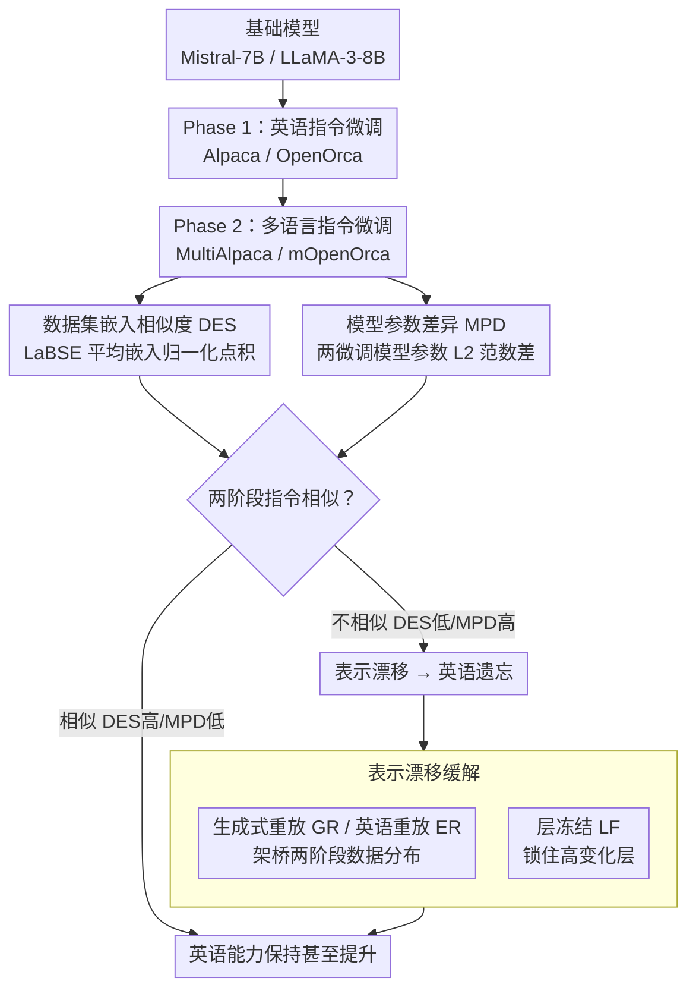

# Exploring Two-Phase Continual Instruction Fine-tuning for Multilingual Adaptation in Large Language Models

**会议**: ACL 2026  
**arXiv**: [2410.16006](https://arxiv.org/abs/2410.16006)  
**代码**: 无  
**领域**: 多语言 / 持续学习  
**关键词**: 持续微调, 多语言适应, 灾难性遗忘, 数据集相似度, 表示漂移

## 一句话总结

本文提出两阶段持续微调（CFT）框架——先在英语指令数据上微调，再在多语言数据上微调——发现阶段间数据集的指令相似性是决定英语能力是否退化的关键因素，并通过生成式重放和启发式层冻结有效缓解了不相似数据集导致的表示漂移和英语遗忘。

## 研究背景与动机

**领域现状**：LLM 的多语言用户群不断增长，但模型在低资源语言上表现明显较差。从头训练成本极高，微调是首选方案。混合多语言数据集微调会导致英语偏倚，而仅在非英语数据上微调会因灾难性遗忘导致英语性能下降。

**现有痛点**：(1) 现有方法如 InstructAlign 需要平行数据和旧任务数据，计算开销大；(2) 直接在混合数据集上微调会导致英语-多语言性能不平衡；(3) 缺乏对"什么条件下多语言微调会损害英语能力"的系统性理解；(4) EWC 等正则化方法需要保存新旧参数，计算效率低。

**核心矛盾**：提升多语言能力（MA）与保持英语能力（EA）之间存在张力——理想情况下同一模型应在两方面都出色，避免维护多个模型的成本。

**本文目标**：在两阶段 CFT 框架下，理解多语言适应中英语退化的机制，并提出高效的缓解策略。

**切入角度**：聚焦于阶段间数据集的"指令相似性"——如果两阶段编码相同指令（只是语言不同），则英语能力可保持甚至提升。

**核心 idea**：英语退化的根本原因是表示漂移——不相似的阶段数据集导致模型隐层表示空间发生大幅偏移，可通过数据分布重放和层冻结控制漂移幅度。

## 方法详解

### 整体框架

两阶段 CFT：Phase 1 在英语指令数据集（Alpaca/OpenOrca）上微调，Phase 2 在多语言数据集（MultiAlpaca/mOpenOrca）上微调。与单阶段混合微调对比，两阶段 CFT 在相同训练步数下平均表现更优。围绕这条主线，本文先用两把尺子（DES、MPD）从数据和参数两个视角量化两阶段数据集的指令相似性，相似性高低恰好预测了 Phase 2 之后英语能力是保持还是因表示漂移而退化；对退化的情形再用重放和层冻结两条路径压制漂移。

### 关键设计

**1. 数据集嵌入相似度（DES）：从数据视角预测 Phase 2 会不会毁掉英语能力**

要解释"为什么有的多语言微调伤英语、有的不伤"，先得有一把能跨语言比较的尺子。本文用语言无关的句子编码器 LaBSE 把两个阶段数据集里的所有指令编码成向量，取各自的平均嵌入，再计算两者归一化点积作为 DES——值越高说明两阶段编码的指令越接近，只是语言不同。

这个度量直接预测了下游结果：同源对 Alpaca-MultiAlpaca 的 DES 高达 0.924，而异源对 Instruct-MultiAlpaca 只有 0.746，恰好对应前者保住英语、后者英语崩盘。之所以选 LaBSE 而非普通英语编码器，是因为 Phase 2 数据是多语言的，必须用语言无关编码才能把"指令语义"和"指令语言"分开来量。

**2. 模型参数差异（MPD）：从参数视角给相似性假说再加一条独立证据**

DES 只看了数据本身，万一数据相似但模型反应迥异呢？本文补了一个参数侧的度量：从同一个基础模型出发，分别在两个数据集上微调，然后算两个微调模型之间参数的 L2 范数差异，记作 MPD——差异越小，说明两个数据集对模型的"拉扯方向"越一致。

结果与 DES 互相印证：Alpaca-MultiAlpaca 的 MPD 只有 0.29，Instruct-MultiAlpaca 高达 1.00。一个从数据视角、一个从模型视角，两条互独立的证据同时指向"指令相似性决定遗忘程度"，让这个核心假说不再依赖单一指标。

**3. 表示漂移缓解：把英语退化的根因（隐层表示偏移）从两条路径压下去**

前面证明了英语退化的机制是表示漂移——不相似的 Phase 2 数据把模型隐层表示空间整体推偏。本文从分布和参数两侧分别给出缓解手段。分布侧是重放：生成式重放（GR）用 Phase 1 模型在 Phase 2 数据集对应的英语版指令上生成回复，按 5% 或 10% 比例混进 Phase 2 训练，相当于用模型自己生成的数据在两阶段分布之间架一座桥；英语重放（ER）则直接用真实英语平行数据替代生成数据。参数侧是层冻结（LF）：根据 Phase 1 微调中变化最大的层（LF_H2）、随机层（LF_H1）或信噪比（Spectrum）选择性冻结部分层，从物理上限制漂移能发生的空间。

两条路径针对的是同一机制的两端——重放靠保持数据分布连续性来减小漂移的"驱动力"，层冻结靠锁住参数来压缩漂移的"自由度"。其中 GR 的一大现实优势是不需要原始 Phase 1 数据，只要留着 Phase 1 模型即可生成重放样本，正好绕开了 InstructAlign 这类方法对旧数据和平行数据的依赖。

### 损失函数 / 训练策略

全参微调，bf16 精度。Phase 1 和 Phase 2 各使用对应数据集全量训练。评估英语能力使用 IFEval、Alpaca Eval、MMLU、HellaSwag、XLSUM_en；多语言能力使用 MLQA、XQuAD、XLSUM、GMMLU。多语言覆盖 11 种语言（法、阿、德、西、印尼、日、韩、葡、俄、泰、越）。

## 实验关键数据

### 主实验

| 模型 | Phase 1 | Phase 2 | EA 平均 | MA 平均 | 综合 |
|------|---------|---------|---------|---------|------|
| Mistral-7B | Alpaca | MultiAlpaca | 0.371 ↑ | 0.338 ↑ | 0.355 |
| Mistral-7B | Instruct | MultiAlpaca | 0.332 ↓ | 0.302 ↑ | 0.317 |
| LLaMA-3-8B | Alpaca | MultiAlpaca | 0.265 ↑ | 0.427 ↑ | 0.346 |
| LLaMA-3-8B | Instruct | MultiAlpaca | 0.178 ↓ | 0.301 ↓ | 0.240 |
| Mistral-7B | 混合 | - | 0.371 | 0.278 | 0.325 |
| LLaMA-3-8B | 混合 | - | 0.335 | 0.289 | 0.312 |

### 消融实验

| 策略 | Mistral EA | Mistral MA | LLaMA EA | LLaMA MA |
|------|-----------|-----------|----------|----------|
| 无缓解（Instruct→MA） | 0.332 | 0.302 | 0.178 | 0.302 |
| GR_5 | 0.394 | 0.298 | 0.236 | 0.348 |
| GR_10 | 0.394 | 0.274 | 0.173 | 0.204 |
| ER_10 | 0.404 | 0.276 | 0.345 | 0.359 |
| LF_H2 | 0.294 | 0.263 | 0.306 | 0.320 |
| Spectrum | 0.363 | 0.237 | 0.329 | 0.261 |
| LoRA | 0.341 | 0.321 | 0.142 | 0.075 |

### 关键发现

- 两阶段 CFT 一致优于混合微调——Mistral-7B 综合 0.355 vs 0.325，LLaMA-3-8B 0.346 vs 0.312
- 相似数据集（Alpaca→MultiAlpaca）不仅不损害英语，反而提升——因为两阶段编码相同指令
- 不相似数据集（Instruct→MultiAlpaca）导致严重英语退化——LLaMA-3-8B 的 IFEval 从 0.735 暴跌至 0.182
- 表示漂移可视化证实：不相似数据集在高层产生 3-4 倍于相似数据集的协方差偏移
- ER_10 在 Mistral 上达到最佳综合表现，GR_5 在 LLaMA 多语言任务上最强
- LoRA 在 LLaMA 上多语言能力极差（0.075），表明参数高效方法未必能有效保持多语言性能

## 亮点与洞察

- "指令相似性决定遗忘程度"的发现非常实用——选择 Phase 2 数据集时应优先考虑与 Phase 1 编码相同指令的版本，而非盲目使用任意多语言数据
- DES 和 MPD 两种度量从数据和模型视角互补验证了相似性假说，增强了结论的可信度
- 生成式重放不需要原始 Phase 1 数据（满足现实约束），仅需 5% 重放数据即可有效缓解漂移
- 协方差矩阵漂移分析直观揭示了英语退化的层级分布——Mistral 集中在高层，LLaMA 在所有层

## 局限与展望

- 仅在 Mistral-7B 和 LLaMA-3-8B 上验证，更大模型或不同架构的泛化性未知
- DES 和 MPD 作为相似性代理可能无法捕捉所有指令级差异
- ER_10 的最佳性能依赖于平行数据的可用性，在实践中未必总能获得
- 未探索多阶段（>2）持续微调的扩展

## 相关工作与启发

- **vs InstructAlign**: 后者需要跨语言对齐和情景重放、平行数据，成本高；本文的 GR 仅需 Phase 1 模型生成英语回复
- **vs Shaham et al. (2024)**: 后者在第一阶段引入多语言性，本文在第二阶段引入且系统分析了遗忘条件
- **vs EWC 等正则化**: 需要保存新旧参数，计算效率低；层冻结以更轻量的方式达到类似效果

## 评分

- 新颖性: ⭐⭐⭐⭐ 两阶段 CFT 框架和相似性度量有新意，但各组件有先例
- 实验充分度: ⭐⭐⭐⭐ 多数据集对、多模型、详细消融和缓解策略，但模型规模有限
- 写作质量: ⭐⭐⭐⭐ 结构清晰，可视化有效，但符号系统略繁
- 价值: ⭐⭐⭐⭐ 为多语言持续微调提供了实用指导——选择相似数据集和轻量重放即可大幅缓解遗忘

<!-- RELATED:START -->

## 相关论文

- [\[ACL 2025\] SIFT-50M: A Large-Scale Multilingual Dataset for Speech Instruction Fine-Tuning](../../ACL2025/multilingual_mt/sift-50m_a_large-scale_multilingual_dataset_for_speech_instruction_fine-tuning.md)
- [\[ACL 2026\] Mitigating Catastrophic Forgetting in Target Language Adaptation of LLMs via Source-Shielded Updates](mitigating_catastrophic_forgetting_in_target_language_adaptation_of_llms_via_sou.md)
- [\[ACL 2026\] Evaluating Robustness of Large Language Models Against Multilingual Typographical Errors](evaluating_robustness_of_large_language_models_against_multilingual_typographica.md)
- [\[ACL 2026\] LaoBench: A Large-Scale Multidimensional Lao Benchmark for Large Language Models](laobench_a_large-scale_multidimensional_lao_benchmark_for_large_language_models.md)
- [\[ACL 2026\] LLM-XTM: Enhancing Cross-Lingual Topic Models with Large Language Models](llm-xtm_enhancing_cross-lingual_topic_models_with_large_language_models.md)

<!-- RELATED:END -->
