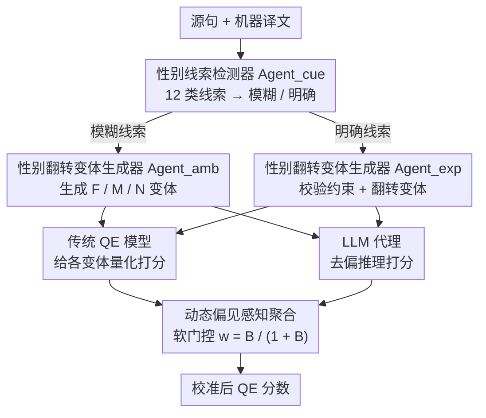

# FairQE: Multi-Agent Framework for Mitigating Gender Bias in Translation Quality Estimation

**会议**: ACL 2026  
**arXiv**: [2604.21420](https://arxiv.org/abs/2604.21420)  
**代码**: 无  
**领域**: LLM Agent / 机器翻译评估  
**关键词**: 翻译质量估计, 性别偏见, 多智能体, 公平性, 偏见缓解

## 一句话总结

提出 FairQE 多智能体框架，通过性别线索检测、性别翻转变体生成和动态偏见感知分数聚合机制，在不牺牲翻译质量评估准确性的前提下有效缓解 QE 模型中的系统性性别偏见。

## 研究背景与动机

**领域现状**：翻译质量估计（QE）旨在无需参考译文的情况下自动评估机器翻译质量。COMETKiwi、MetricX 等模型已在 WMT 评测中取得了优秀表现，成为翻译评估的重要工具。

**现有痛点**：现有 QE 模型存在系统性性别偏见——在性别模糊语境中倾向于给男性化翻译更高分；在明确要求女性化翻译时仍可能偏好男性形式（偏好反转现象）。这种偏见会级联影响下游决策（模型选择、数据过滤等）。

**核心矛盾**：如何在缓解性别偏见的同时保持 QE 模型的评估准确性？简单去偏可能损害模型的翻译质量判断能力。

**本文目标**：设计一个模型无关的框架，能以即插即用的方式校准现有 QE 模型的性别偏见，同时保持甚至提升整体评估性能。

**切入角度**：采用多智能体协作架构，将偏见检测、变体生成和去偏推理分解为独立模块，结合 LLM 推理能力与传统 QE 模型的量化评分。

**核心 idea**：通过生成性别翻转变体量化偏见程度，利用动态权重在传统 QE 分数和 LLM 去偏推理分数之间软切换——偏见越大，越依赖 LLM 推理。

## 方法详解

### 整体框架

FairQE 包含四个顺序阶段：(1) 性别线索检测——识别源句中的性别相关语言线索；(2) 性别翻转变体生成——根据线索类型生成男/女/中性翻译变体；(3) 双流质量评估——传统 QE 模型提供量化分数，LLM 代理进行去偏推理；(4) 动态偏见感知聚合——根据偏见严重程度动态调整两路分数的权重。

### 关键设计

**1. 性别线索检测器（$Agent_{cue}$）：先认清这是哪一种性别问题，才能用对去偏策略**

性别偏见不是一种现象，盲目去偏会顾此失彼。$Agent_{cue}$ 接收源句和目标译文，按一套 12 个细粒度类别的线索分类体系，把识别到的性别线索归为两大类——性别模糊（源句本身没指定性别）和性别明确（源句已点明性别）——并把每条线索在源句和译文里对应的片段一一链接起来。

之所以要先做这层细分，是因为两类线索对"好翻译"的要求恰好相反：模糊线索追求的是一致性（各种性别实现都该被同等评分，不能偏袒男性形式），明确线索追求的是忠实性（必须严格匹配源句指定的性别）。不先把线索类型分清，后面就无法对症下药。

**2. 性别翻转变体生成器（$Agent_{amb}$ + $Agent_{exp}$）：用"翻转后分数怎么变"把偏见量化出来**

偏见看不见摸不着，本文的办法是制造对照样本去逼它现形。对性别模糊线索，$Agent_{amb}$ 生成全部有效的性别实现（女 F / 男 M / 中性 N）；对性别明确线索，$Agent_{exp}$ 先校验目标译文是否符合源句的性别约束，再生成翻转变体用于对比。

有了这些只在性别维度上不同、其余保持一致的变体，就能把同一个 QE 模型对它们的打分摆在一起看：如果模型给男性变体的分数系统性偏高，差距本身就是偏见的量化值。这一步把"模型有没有偏见"从主观判断变成了可计算的分数差。

**3. 动态偏见感知分数聚合：偏见越大越信 LLM 推理，偏见为零就退回原始 QE**

传统 QE 模型在细粒度精度上更强，LLM 在推理密集型判断上更稳，硬选一个都不划算。本文让两路分数按偏见严重程度软切换：先从变体分数算出模糊偏见 $b_{amb}$（各性别变体分数的极差）和明确偏见 $b_{exp}$（偏好违背的程度），合成总偏见 $B$，再用软门控

$$w = \frac{B}{1 + B}$$

决定融合权重——$B$ 越大，$w$ 越接近 1，最终分数越偏向 LLM 去偏推理；$B$ 趋近 0 时 $w \to 0$，框架自动退化成原始 QE 模型，对没有偏见的样本不做任何扰动。超参数 $\alpha$、$\beta$ 分别调节模糊偏见和明确偏见在 $B$ 中的权重。这种设计让公平性和准确性不再是二选一：只在真正有偏见的地方才动用 LLM，避免了对全部样本无差别去偏带来的精度损失。

### 一个完整示例：一句性别模糊的源句怎么走完四个 agent

以一句英语源句 "The doctor finished the report"（源句未指定 doctor 性别）译成西班牙语为例：

1. $Agent_{cue}$ 检测到 "doctor" 是性别相关线索，且源句无性别指示，判定为**性别模糊**类。
2. $Agent_{amb}$ 据此生成两个有效变体：阴性 "La doctora terminó el informe"（F）与阳性 "El doctor terminó el informe"（M）。
3. 双流评估并行打分：传统 QE（如 COMETKiwi）分别给 F、M 变体打分，发现 M 拿到的分明显高于 F；同时 LLM agent 做去偏推理，判断在源句未指定性别时两种译法都同等合理。
4. 动态聚合：F 与 M 的分差较大 → $b_{amb}$ 大 → $B$ 大 → 门控 $w$ 接近 1 → 最终分数主要采纳 LLM 的"两者等价"判断，把原本被 QE 压低的阴性译文分数拉回，使 F/M 分数比从基线的 0.983 升到 0.995（ES 列），更接近理想的 1.0。

若换成一句性别明确的源句（如已点明女性），$b_{exp}$ 会改为衡量译文是否违背该约束，聚合后同样让 LLM 推理在偏见大的样本上主导评分。

### 损失函数 / 训练策略

FairQE 不涉及训练，是纯推理时的即插即用框架。超参数 $\alpha$ 和 $\beta$ 分别控制模糊偏见和明确偏见的权重。

## 实验关键数据

### 主实验（性别模糊场景 - F/M QE 分数比）

| 方法 | ES | FR | IT | AR | DE | HI |
|------|-----|-----|-----|-----|-----|-----|
| COMETKiwi 22 | 0.983 | 0.978 | 0.979 | 0.985 | 0.994 | 0.991 |
| FairQE (w/ COMETKiwi 22) | **0.995** | **0.986** | **0.992** | **0.994** | **0.999** | **0.997** |

### 性别明确场景准确率

| 方法 | AR | DE | HI |
|------|------|------|------|
| COMETKiwi 22 | 95.0 | 99.2 | 55.3 |
| FairQE (w/ COMETKiwi 22) | **97.3** | **99.7** | 74.0 |

### 关键发现
- FairQE 在性别公平性指标上全面优于基线 QE 模型，F/M 分数比更接近理想值1.0
- 在 MQM 评估中，FairQE 达到了有竞争力甚至更优的整体 QE 性能，证明去偏不会牺牲评估精度
- 模型无关设计使其可与多种 QE 模型（COMETKiwi、MetricX）组合使用
- 在 MQM 评测中 avg-corr 达到0.812（w/ COMETKiwi 22），超越多数基线

## 亮点与洞察
- 首个同时解决性别模糊和性别明确两种场景下 QE 偏见的统一框架
- 动态聚合机制优雅地平衡了公平性和准确性——偏见为零时退化为原始 QE 模型
- 多智能体设计使各模块职责清晰、可独立优化
- 生成性别翻转变体的思路可推广到其他类型的偏见检测

## 局限与展望
- 每个样本需要多次 LLM 和 QE 模型调用，推理成本较高
- 性别线索检测依赖 LLM 的语言理解能力，对低资源语言可能效果有限
- 仅关注性别偏见，未来可探索将框架扩展到其他类型的社会偏见（年龄、种族等）
- 依赖 LLM 的性别翻转质量，不恰当的翻转可能引入噪声
- 超参数 $\alpha$、$\beta$ 的最优值可能因语言对和 QE 模型而异，调参成本需考虑
- 未探索对非二元性别表达的处理策略

## 相关工作与启发
- **vs COMETKiwi/MetricX**: 这些传统 QE 模型有较强的评估精度但存在性别偏见，FairQE 在此基础上校准偏见
- **vs GEMBA-MQM**: 纯 LLM 方法在推理能力上有优势但精度不如专用 QE 模型，FairQE 结合两者优势
- **vs 去偏训练方法**: FairQE 是推理时的即插即用方案，无需重训 QE 模型

## 评分
- 新颖性: ⭐⭐⭐⭐ 多智能体+动态聚合的去偏框架设计新颖，性别翻转变体的偏见量化思路巧妙
- 实验充分度: ⭐⭐⭐⭐ 四种评估设置涵盖性别模糊/明确场景，多语言对实验
- 写作质量: ⭐⭐⭐⭐ 框架描述清晰，数学形式化程度高
- 价值: ⭐⭐⭐⭐ 解决了实际部署中 QE 模型的公平性问题，具有工程实用价值

<!-- RELATED:START -->

## 相关论文

- [\[ACL 2026\] Mitigating Extrinsic Gender Bias for Bangla Classification Tasks](mitigating_extrinsic_gender_bias_for_bangla_classification_tasks.md)
- [\[ACL 2025\] Watching the Watchers: Exposing Gender Disparities in Machine Translation Quality Estimation](../../ACL2025/multilingual_mt/watching_the_watchers_exposing_gender_disparities_in_machine_translation_quality.md)
- [\[ACL 2026\] TransLaw: A Large-Scale Dataset and Multi-Agent Benchmark Simulating Professional Translation of Hong Kong Case Law](translaw_a_large-scale_dataset_and_multi-agent_benchmark_simulating_professional.md)
- [\[ACL 2026\] LQM: Linguistically Motivated Multidimensional Quality Metrics for Machine Translation](lqm_linguistically_motivated_multidimensional_quality_metrics_for_machine_transl.md)
- [\[ACL 2026\] MORPHOGEN: A Multilingual Benchmark for Evaluating Gender-Aware Morphological Generation](morphogen_a_multilingual_benchmark_for_evaluating_gender-aware_morphological_gen.md)

<!-- RELATED:END -->
