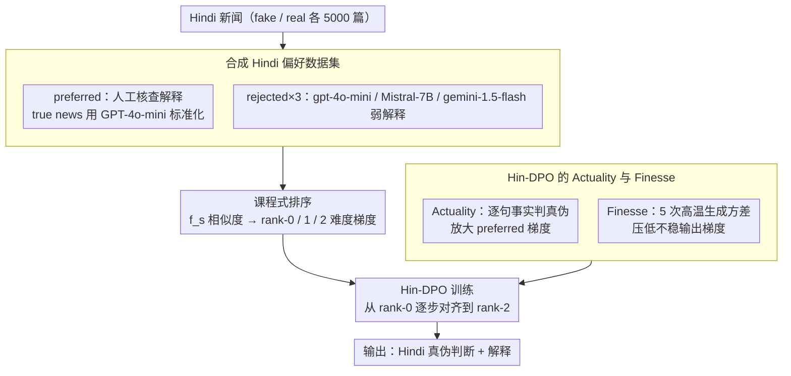

# From Fragments to Facts: A Curriculum-Driven DPO Approach for Generating Hindi News Veracity Explanations

**会议**: ACL2026  
**arXiv**: [2507.05179](https://arxiv.org/abs/2507.05179)  
**代码**: Project Page: From Fragments to Facts（缓存未提供 URL）  
**领域**: 多语言NLP / 事实核查 / 解释生成  
**关键词**: Hindi fact-checking, DPO, curriculum learning, explanation generation, hallucination mitigation  

## 一句话总结
本文提出 DeFactoX，用课程学习组织 Hindi 新闻偏好数据，并在 DPO 中加入 Actuality 和 Finesse 两个事实性/稳定性信号，使模型能同时预测新闻真伪并生成更接近人工事实核查解释的 Hindi rationale。

## 研究背景与动机
**领域现状**：自动化 misinformation detection 和 explanation generation 已在英语、中文等高资源语言中得到较多研究，但 Hindi 这类高使用人数、低自动化资源的语言仍缺少可靠的事实核查解释生成工具。现实中，Hindi fact-checking 主要依赖人工平台，难以扩展到海量新闻传播场景。

**现有痛点**：通用 LLM 虽然能生成流畅解释，但在 Hindi 新闻真伪判断中容易出现浅层文本线索偏置、只关注单一事实维度、缺少上下文和证据链，甚至生成看似合理但事实不稳的解释。仅靠 supervised fine-tuning 很难让模型学会“什么解释更像专业 fact-checker”。

**核心矛盾**：解释生成既要贴近人工 rationale，又要避免事实错误和幻觉。标准 DPO 能利用 preferred / rejected 响应做偏好对齐，但它并不显式区分“事实是否正确”和“多次生成是否稳定”。

**本文目标**：作者希望构建一个面向 Hindi news veracity 的偏好学习框架，让模型从容易区分的差解释逐步学习到难区分的高相似解释，并在优化目标中显式加入事实正确性和幻觉稳定性。

**切入角度**：论文用 fact-checking 网站的人工解释作为 preferred responses，用多个 LLM 的弱解释作为 rejected responses，再用自动评分把 rejected responses 排成 curriculum 难度。

**核心 idea**：把课程学习、DPO、Actuality factuality signal 和 Finesse uncertainty signal 合成 Hin-DPO，让偏好优化不只偏向“更像参考答案”，还偏向事实正确且生成稳定的解释。

## 方法详解
DeFactoX 包含两条主线：先构建 Hindi 新闻偏好数据，再用 curriculum-driven Hin-DPO 微调模型。数据来自 Hindi fact-checking 网站，输入是新闻首段，不包含直接真伪和推理；输出要求模型给出真假判断和解释。preferred explanation 来自人工事实核查或标准化后的真实新闻解释，rejected explanation 来自 LLM 生成的较弱回答。

### 整体框架
第一阶段是偏好数据构建。作者从 Sharma and Arya 数据集中抽取 fake 和 real 各 5,000 篇，共 10,000 篇新闻。fake news 的人工解释通常天然包含明确驳斥和证据；true news 的解释往往只是信息性摘要，因此作者用 GPT-4o-mini 标准化 true news explanation，让它也显式说明真实性，同时保持事实内容不变。然后用 gpt-4o-mini、Mistral-7B-v0.1 和 gemini-1.5-flash 生成 rejected responses，每条样本形成 1 个 preferred 和 3 个 rejected。

第二阶段是 curriculum-driven preference optimization。对 rejected responses，用 $f_s$ 评分函数衡量它们与 ground-truth rationale 的相似度，并按 rank-0、rank-1、rank-2 划分难度。模型先学习最容易区分的低质量 rejected，再逐步面对更接近 preferred 的 rejected。最后，用 Hin-DPO 损失把 preferred / rejected 的 log probability ratio、Actuality 和 Finesse 结合起来。

### 关键设计

**1. 合成 Hindi 偏好数据集：用已有的人工核查解释当 preferred、用 LLM 弱解释当 rejected，绕开全量人工标注**

Hindi 缺少大规模高质量的解释偏好数据，从头让人工标注 preferred / rejected 对成本太高。作者的做法是把现成资源拼成偏好对：preferred 直接取自 fact-checking 网站的人工解释，但 true news 的解释往往只是信息性摘要、不显式表态，于是用 GPT-4o-mini 在保持事实内容不变的前提下标准化它，让它也明确说明真实性。rejected 则故意用 gpt-4o-mini、Mistral-7B-v0.1、gemini-1.5-flash 三个模型在简单 prompt 下生成，保留它们浅层、片面、事实不稳的毛病，每条新闻最终形成 1 个 preferred 配 3 个 rejected。这样既复用了专业 fact-checker 的判断作为正样本，又让负样本天然覆盖了真实 LLM 会犯的各类错误。

**2. 课程式排序：用一个加权相似度函数把三个负例排成难度梯度，让 DPO 先学易区分、再学难区分**

如果一上来就拿最接近 preferred 的 rejected 去做对比，模型很难分辨细微差异、优化不稳。作者给每个 rejected 算一个与 ground-truth rationale 的相似度 $f_s=(\mathrm{BERTScore}+3\times(\mathrm{ROUGE\text{-}L}+\mathrm{METEOR}))/4$，按它把三个负例排成 rank-0、rank-1、rank-2，训练时从最容易的 rank-0 逐步推进到最难的 rank-2。这个 1:3 的权重不是拍脑袋定的：在 300 条样本的人类排序上，1:3 权重与人评的 Spearman $\rho=0.81$，明显高于 1:1 的 0.63 和 1:2 的 0.74，说明它最贴近人类对"解释好坏"的判断。课程顺序模仿人先掌握明显错误、再学细粒度差异的过程，让偏好对齐更稳。

**3. Hin-DPO 的 Actuality 与 Finesse：把"事实对不对"和"生成稳不稳"显式塞进 DPO 目标**

标准 DPO 只知道哪个回答被偏好，却不知道偏好的原因，因此既不奖励事实正确、也不抑制幻觉。作者补了两个任务特定信号：Actuality 用 GPT-4o-mini 加 web search 对解释里的每句事实陈述逐句判真伪再取平均，对应"事实对不对"；Finesse 用同一输入下 5 次高温生成的 token distribution 方差衡量输出抖动，对应"每次说法稳不稳"。在 Hin-DPO 里，preferred 的 log ratio 被 $(1+s_w)$ 放大（越事实正确越该被强化），rejected 的 log ratio 按 $\max(0.01,s_l)$ 调节，整体再由 $1/(v+\epsilon)$ 按 Finesse 缩放（越不稳越压低梯度）。这样偏好优化不再只偏向"更像参考答案"，而是同时偏向事实正确且生成稳定，正好切中事实核查解释的两大风险：流畅但错误、以及每次说法不一致。

### 损失函数 / 训练策略
设 $r_w=\pi_\theta(y_w|x)/\pi_{ref}(y_w|x)$，$r_l=\pi_\theta(y_l|x)/\pi_{ref}(y_l|x)$。Hin-DPO 定义中间分数 $S(x,y_w,y_l)=\frac{1}{v+\epsilon}[(1+s_w)\log r_w-\max(0.01,s_l)\log r_l]$，最终损失为 $\mathcal{L}_{Hin\text{-}DPO}=-\mathbb{E}[\log\sigma(\beta\cdot S)]$。其中 $s_w,s_l$ 是 preferred / rejected 的 Actuality，$v$ 是 Finesse，$\epsilon$ 可学习。

实验微调五个模型：Gemma-2-9B-It、Llama-3.1-8B-Instruct、Mistral-7B-Instruct-v0.3、mBART-large-50、mT5-large。自动评测使用 ROUGE-1/2/L、METEOR 和 BERTScore；Hindi 的 ROUGE 和 METEOR 使用 Polyglot tokenizer。

## 实验关键数据

### 主实验
| 模型 | 方法 | ROUGE-1 | ROUGE-2 | ROUGE-L | METEOR | BERTScore |
|------|------|---------|---------|---------|--------|-----------|
| mT5 | DPO | 17.93 | 9.14 | 13.59 | 22.87 | 73.61 |
| mT5 | Hin-DPO | 20.29 | 9.45 | 16.89 | 24.39 | 77.32 |
| Llama3.1-8B | DPO | 34.56 | 22.00 | 28.73 | 34.53 | 80.98 |
| Llama3.1-8B | Hin-DPO | 37.13 | 24.07 | 31.22 | 37.25 | 84.73 |
| Gemma2-9B | DPO | 30.92 | 19.86 | 25.19 | 31.21 | 79.59 |
| Gemma2-9B | Hin-DPO | 33.55 | 21.64 | 27.91 | 33.84 | 83.67 |

### 消融实验
| 实验 | 配置 | mT5 结果 | Llama3.1-8B 结果 | 说明 |
|------|------|----------|-------------------|------|
| Curriculum | DPO w/o CL | R-L 13.59 / BS 73.61 | R-L 28.73 / BS 80.98 | 标准 DPO |
| Curriculum | DPO with CL | R-L 15.37 / BS 75.02 | R-L 30.00 / BS 82.04 | 课程学习单独有效 |
| Curriculum | Hin-DPO w/o CL | R-L 15.22 / BS 76.19 | R-L 29.74 / BS 82.01 | Actuality + Finesse 单独有效 |
| Curriculum | Hin-DPO with CL | R-L 16.89 / BS 77.32 | R-L 31.22 / BS 84.73 | 完整方法最好 |
| Human Eval | Base+SFT | Gemma 3.29 | Llama 3.07 | 0-5 人评均分 |
| Human Eval | DPO | Gemma 3.92 | Llama 3.87 | 偏好学习明显提升 |
| Human Eval | Hin-DPO | Gemma 4.12 | Llama 4.23 | 与自动指标趋势一致 |

### 关键发现
- Hin-DPO 相比 DPO 在 mT5 上提升 ROUGE-1 +2.36、ROUGE-L +3.30、BERTScore +3.71；在 Llama3.1-8B 上提升 ROUGE-1 +2.57、ROUGE-L +2.49、BERTScore +3.75。
- Actuality score 的验证中，400 条 factual claims 上 GPT-4o-mini 相对人工判断达到 80.0% accuracy、78.8% precision、89.1% recall、83.7% F1；混淆矩阵为 TP 205、FP 55、TN 115、FN 25。
- Veracity prediction 也随 Hin-DPO 提升：Gemma2-9B 达到 80.6% accuracy / 78.4% F1，Llama3.1-8B 达到 81.2% accuracy / 78.9% F1。
- 课程学习与 Hin-DPO 是互补的。只加 CL、只加 Actuality/Finesse 都有收益，完整组合在 mT5 和 Llama3.1-8B 上最好。
- 人评 800 条解释、三名学生标注，Spearman agreement 为 0.71，说明人评趋势有较稳定一致性。

## 亮点与洞察
- 这篇论文最实用的地方是把 fact-checker explanation 当成偏好学习信号，而不只是做真假分类。对 misinformation 应用来说，透明解释往往比单个标签更重要。
- Actuality 和 Finesse 分别对应“事实对不对”和“生成稳不稳”。这两个信号切中了事实核查解释生成的核心风险：流畅但错误，以及每次说法不一致。
- 课程学习在这里不是装饰，而是符合数据结构。三个 rejected responses 与 preferred 的相似度不同，先学明显差异再学细微差异，有助于稳定对齐。
- 论文承认 GPT-4o-mini 既用于 rejected generation 又用于 Actuality，但通过不同设置区分：前者是无检索文档级生成，后者是有 web search 的句子级验证，这个澄清减少了方法循环依赖的疑虑。

## 局限与展望
- 高质量 Hindi fact-checked data 仍有限，训练和评估覆盖的领域多样性受源数据限制，对高度专业或技术性新闻可能效果下降。
- 论文只在 Hindi 上系统评估，迁移到其他低资源语言需要新的数据、native speaker 验证和语言特定事实核查资源。
- 实验模型规模限制在 10B 以下，没有和更大 reasoning-oriented models 比较。
- Actuality 依赖外部 LLM 和检索，可能引入模型偏见或检索错误；Finesse 需要每个输入多次生成，计算成本明显更高。
- 高风险场景如政治、医学新闻仍应保留 human-in-the-loop，不能把自动解释当最终事实裁决。

## 相关工作与启发
- **vs 标准 fake news detection**: 传统方法输出真假标签或可解释特征，DeFactoX 同时生成 veracity explanation，更适合面向读者和 fact-checker 的工作流。
- **vs 标准 DPO**: 标准 DPO 只用偏好对，Hin-DPO 把 factuality 和 uncertainty 作为任务特定权重，使偏好优化更贴近事实核查目标。
- **vs Curry-DPO / curriculum preference optimization**: 相关工作证明课程学习能增强偏好优化，本文把 curriculum 具体落到 Hindi explanation ranking，并用 Actuality/Finesse 做领域适配。

## 评分
- 新颖性: ⭐⭐⭐⭐☆ DPO、课程学习和事实性评分都不是全新概念，但组合到 Hindi veracity explanation 上很有针对性。
- 实验充分度: ⭐⭐⭐⭐☆ 覆盖五个模型、自动指标、人评、消融和 veracity prediction；更大模型和跨语言验证不足。
- 写作质量: ⭐⭐⭐⭐☆ 数据构建和损失函数解释清楚，附录验证充分；Project Page 缓存未给 URL。
- 价值: ⭐⭐⭐⭐☆ 对低资源语言事实核查很实用，也为面向事实性的偏好优化提供了可复用设计。

<!-- RELATED:START -->

## 相关论文

- [\[ACL 2026\] CLewR: Curriculum Learning with Restarts for Machine Translation Preference Learning](clewr_curriculum_learning_with_restarts_for_machine_translation_preference_learn.md)
- [\[ACL 2025\] CLIX: Cross-Lingual Explanations of Idiomatic Expressions](../../ACL2025/multilingual_mt/clix_cross-lingual_explanations_of_idiomatic_expressions.md)
- [\[ACL 2026\] SERM: Self-Evolving Relevance Model with Agent-Driven Learning from Massive Query Streams](serm_self-evolving_relevance_model_with_agent-driven_learning_from_massive_query.md)
- [\[ACL 2025\] Code-Switching Curriculum Learning for Multilingual Transfer in LLMs](../../ACL2025/multilingual_mt/code-switching_curriculum_learning_for_multilingual_transfer_in_llms.md)
- [\[ACL 2025\] Hierarchical Level-Wise News Article Clustering via Multilingual Matryoshka Embeddings](../../ACL2025/multilingual_mt/hierarchical_news_clustering.md)

<!-- RELATED:END -->
