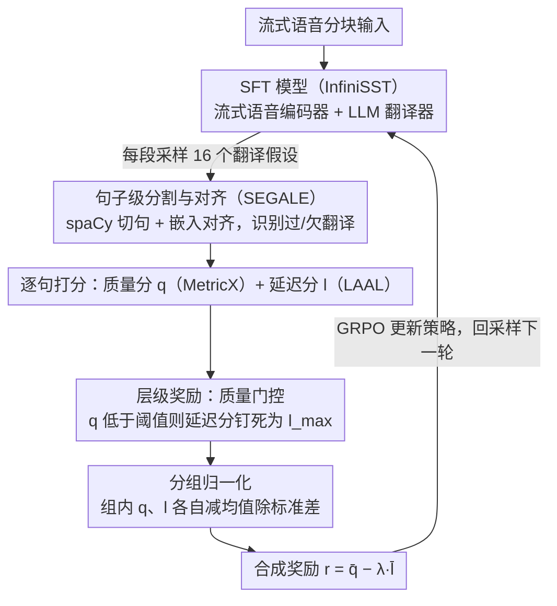

# Hierarchical Policy Optimization for Simultaneous Translation of Unbounded Speech

**会议**: ACL 2026 Oral  
**arXiv**: [2604.21045](https://arxiv.org/abs/2604.21045)  
**代码**: [https://github.com/owaski/HPO](https://github.com/owaski/HPO)  
**领域**: 图像分割  
**关键词**: 同声传译, 强化学习, 层级奖励, LLM语音翻译, GRPO

## 一句话总结
本文提出 Hierarchical Policy Optimization (HPO)，通过层级奖励设计对基于 LLM 的同声传译模型进行后训练，在翻译质量未达阈值时抑制延迟优化，从而在 1.5 秒延迟下实现 +7 COMET 的翻译质量提升。

## 研究背景与动机

**领域现状**：同声语音翻译 (SST) 需要在接收部分语音输入的同时生成翻译。近年来，基于 LLM 的方法通过将 SST 建模为多轮对话任务，利用 KV cache 复用消除冗余计算，已成为处理无界长语音的主流方案（如 InfiniSST）。

**现有痛点**：这类方法严重依赖合成的读写轨迹数据进行监督微调 (SFT)，但现有轨迹合成方法存在明显缺陷。基于词对齐工具的方法忽略了翻译时序所需的未来上下文；基于 LLM 模拟口译员的方法分割不稳定，无法保证生成有效的读写轨迹。这导致 SFT 数据质量不理想，模型学到错误行为。

**核心矛盾**：翻译质量和延迟之间存在天然的 trade-off。直接用强化学习联合优化两者时，延迟奖励更容易被优化（只需提前翻译即可降低延迟，不管翻译是否正确），导致模型过度优化延迟而牺牲翻译质量。

**本文目标**：设计一种后训练方法纠正 SFT 模型的错误行为，同时稳定地平衡翻译质量和延迟的优化。

**切入角度**：作者观察到延迟奖励在优化中占主导地位的根本原因是两种奖励的尺度差异和优化难度不对称。通过引入"质量门控"机制——只有翻译质量达标后才允许优化延迟——可以建立有效的层级约束。

**核心 idea**：用层级奖励结构约束 GRPO 训练：翻译质量未超阈值时，延迟奖励被设为最差值，确保模型优先保证准确性再追求速度。

## 方法详解

### 整体框架
系统由流式语音编码器和 LLM 翻译器组成。语音按固定时长分块，编码器增量编码每个新块并复用之前的 KV cache，LLM 基于交错的语音特征和已生成翻译解码下一段翻译。HPO 在此 SFT 模型基础上，采样多个翻译假设，计算层级奖励并用 GRPO 优化。

### 关键设计

**1. 句子级分割与对齐（SEGALE）：先把长译文切句、对齐参考，避免乱码也能骗到高分**

传统的 mwersegmenter 通过最小化词错误率强制对齐，哪怕假设是一段无意义乱码，它也会硬塞一个对齐，再配上不鲁棒的神经指标就会冒出虚假高分，等于给 reward hacking 开了后门。SEGALE 换了条路：用 spaCy 先做句子分割，再用基于嵌入的对齐器配合自适应搜索把假设句和参考句对齐，并显式识别过翻译（$R_k=\phi$）和欠翻译（$H_k=\phi$）两类异常。这样奖励信号是建立在"句子真的对得上"的基础上，乱码无法再蒙混过关，后续的质量/延迟打分才有意义。

**2. 层级奖励：用质量门控锁住延迟优化，强制"先保质、后提速"**

翻译质量和延迟天然冲突，而延迟奖励更好骗——只要提前开口翻就能降延迟，根本不管翻得对不对，于是直接加权组合两者会把模型推向"翻得早但翻得差"。HPO 对每个对齐句对分别算质量分 $q^{j,k}$（MetricX）和延迟分 $l^{j,k}$（LAAL），关键一步是设了道闸门：只要质量分低于阈值 $q_{\text{thres}}$，延迟分就被钉死在最差值 $l_{\max}$，相当于"还没翻好就别谈速度"。随后对假设内所有句子取平均、组内样本各自做 group normalization，最终奖励为 $r^j=\bar{q}^j-\lambda\cdot\bar{l}^j$。这道硬约束把"加权平衡"换成了"层级优先级"，只有翻译足够好时低延迟才会被奖励。

**3. 分组归一化：把量纲悬殊的质量分和延迟分拉到同一尺度，稳住训练**

质量指标 MetricX 的范围是 -25 到 0，延迟指标是秒数，两者量纲天差地别，直接相加会让某一项主导梯度、训练发散。作者对同一 prompt 采样的 $n$ 个假设，把质量分和延迟分各自做 group normalization（减均值除标准差）后再组合，使两种奖励落在可比的尺度上。这一步看似简单，却是层级奖励能稳定生效的前提——否则门控和加权都会被尺度差异淹没。

### 损失函数 / 训练策略
采用 GRPO 框架，对每段语音采样 16 个翻译轨迹，使用 clipped importance sampling 和 on-policy KL 散度正则化。MetricX 作为质量奖励模型，质量阈值 $q_{\text{thres}} = -5$，延迟权重 $\lambda = 0.5$，KL 惩罚权重 0.01。在 3 个 8×H100 节点上训练约 20 小时（500 步），其中 1 个节点专门用于奖励计算。

## 实验关键数据

### 主实验
在 ACL 60/60 dev set 上的 En→Zh/De/Ja 三个方向，HPO 在 COMET、MetricX、BLEURT 三个指标上均显著优于 InfiniSST 基线。

| 方向 | 延迟(s) | COMET提升 | MetricX提升 | BLEURT提升 |
|------|---------|-----------|-------------|------------|
| En→Zh | ~1.5s | +7 | +1.25 | +4 |
| En→De | ~1.5s | 显著提升 | 显著提升 | 显著提升 |
| En→Ja | ~1.5s | 显著提升 | 显著提升 | 显著提升 |

### 消融实验

| 配置 | StreamLAAL | COMET | MetricX |
|------|-----------|-------|---------|
| SFT (基线) | 1216 | 0.7348 | -4.52 |
| Normalize | 1555 | 0.7977 | -3.41 |
| Normalize + Truncation (SeqPO) | 1805 | 0.8058 | -3.39 |
| Normalize + Hierarchical-Doc | 1544 | 0.8157 | -3.27 |
| Normalize + Hierarchical-Sent (HPO) | 1383 | 0.8234 | -3.21 |

### 关键发现
- 句子级层级奖励 (Hierarchical-Sent) 全面优于文档级层级奖励和简单截断方法，在更低延迟下取得更好翻译质量
- MetricX 是六种质量奖励函数中唯一在所有自动指标和人工评估上都表现一致的
- BLEU 是唯一例外，HPO 在 BLEU 上未必优于基线，Gemini 评估也证实了基于神经奖励的优化可能导致 reward hacking
- 使用 mwersegmenter 的模型会利用分割和指标的弱点进行 reward hacking，乱码假设也能获得高分

## 亮点与洞察
- 层级奖励的设计非常巧妙：不是简单地加权平衡两个目标，而是建立了"质量优先"的硬约束，只有翻译够好才允许优化速度。这种思路可以推广到所有"主目标+辅助目标"的多目标 RL 场景
- 暴露了 mwersegmenter + 神经指标组合的 reward hacking 漏洞，乱码文本被分割后竟能获得接近满分的 MetricX 分数，这对翻译评估领域也是重要发现
- HPO 在某些设置下甚至超越了离线翻译模型的质量，说明 RL 后训练不仅能纠正 SFT 的错误，还能发现比离线全量翻译更好的策略

## 局限与展望
- 仅验证了 InfiniSST 一种架构、一种数据合成方法和英语作为源语言的三个方向
- MetricX 作为奖励模型仍不完美，有时偏好流畅性而非准确性，可能导致 reward hacking
- BLEU 和 Gemini 评估显示神经奖励优化存在过拟合风险，需要更鲁棒的质量奖励模型
- 未探索将 HPO 应用于离线翻译模型（标准 GRPO）的效果

## 相关工作与启发
- **vs InfiniSST (SFT)**: InfiniSST 仅用合成轨迹做 SFT，HPO 在其基础上用 RL 后训练纠正错误行为，在所有延迟水平上都显著优于 SFT
- **vs SeqPO-SiMT**: SeqPO 用截断+归一化处理延迟奖励，但仅限文本翻译且不支持无界语音；HPO 的层级奖励在消融中优于截断方法
- **vs 传统 RL-SST**: 之前的 RL 方法都基于编码器-解码器 Transformer 的文本翻译，HPO 首次将 RL 扩展到基于 LLM 的无界语音同传

## 评分
- 新颖性: ⭐⭐⭐⭐ 层级奖励思路简洁有效，但 GRPO 框架本身并非新贡献
- 实验充分度: ⭐⭐⭐⭐⭐ 三语方向、六种奖励函数、多维消融、人工评估、reward hacking 分析，非常全面
- 写作质量: ⭐⭐⭐⭐⭐ 问题动机清晰，方法描述逻辑严谨，图表设计精良
- 价值: ⭐⭐⭐⭐ 对同声传译 RL 训练有直接指导意义，层级奖励思想有普适性

<!-- RELATED:START -->

## 相关论文

- [\[ACL 2025\] SeqPO-SiMT: Sequential Policy Optimization for Simultaneous Machine Translation](../../ACL2025/multilingual_mt/seqpo-simt_sequential_policy_optimization_for_simultaneous_machine_translation.md)
- [\[ACL 2026\] TLPO: Token-Level Policy Optimization for Mitigating Language Confusion in Large Language Models](tlpo_token-level_policy_optimization_for_mitigating_language_confusion_in_large_.md)
- [\[ACL 2026\] Efficient Training for Cross-lingual Speech Language Models](efficient_training_for_cross-lingual_speech_language_models.md)
- [\[ACL 2026\] NiuTrans.LMT: Toward Inclusive and Scalable Multilingual Machine Translation with LLMs](niutranslmt_toward_inclusive_and_scalable_multilingual_machine_translation_with_.md)
- [\[ACL 2026\] NeoAMT: Neologism-Aware Agentic Machine Translation with Reinforcement Learning](neoamt_neologism-aware_agentic_machine_translation_with_reinforcement_learning.md)

<!-- RELATED:END -->
