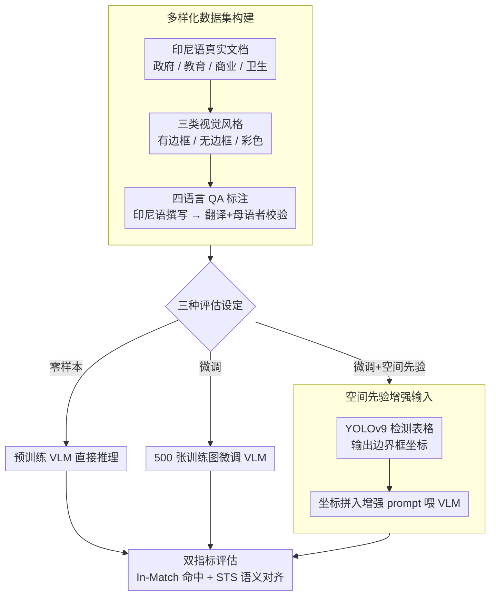

# IndoTabVQA: A Benchmark for Cross-Lingual Table Understanding in Bahasa Indonesia Documents

**会议**: ACL 2026  
**arXiv**: [2604.11970](https://arxiv.org/abs/2604.11970)  
**代码**: [https://huggingface.co/datasets/NusaBharat/INDOTABVQA](https://huggingface.co/datasets/NusaBharat/INDOTABVQA)  
**领域**: 文档理解 / 跨语言VQA  
**关键词**: 跨语言表格理解, 视觉问答, 印尼语文档, 空间先验, 低资源语言

## 一句话总结

提出 IndoTabVQA，一个针对印尼语（Bahasa Indonesia）文档表格的跨语言视觉问答基准，包含 1593 张文档图像和四种语言（印尼语/英语/印地语/阿拉伯语）的 QA 标注，揭示了 VLM 在低资源语言和跨语言表格理解上的显著性能差距，微调+空间先验可带来最高 48.5% 的 In-Match 准确率。

## 研究背景与动机

**领域现状**：视觉语言模型（VLM）在文本密集型视觉理解任务上表现出色，TextVQA、DocVQA 等基准推动了领域进步。针对表格的数据集如 TableVQA-Bench 进一步评估了结构感知的数值推理能力。

**现有痛点**：现有基准共享一个关键局限——以英语为中心且为单语言，无法揭示 VLM 在低资源语言上的真实能力。印尼语、印地语、阿拉伯语等语言覆盖了全球数十亿用户，但 VLM 在这些语言的文档上可能严重失效。对于表格 VQA，模型需要同时处理语言变化和结构复杂性，这个组合挑战尚未被充分研究。

**核心矛盾**：现有 VQA 基准无法测试两个关键能力：(1) VLM 是否能理解低资源语言的表格？(2) 当文档和问题使用不同语言时，VLM 能否正确回答？这个差距限制了我们对真实多语言能力的理解。

**本文目标**：构建一个跨语言表格视觉问答基准，系统评估 VLM 在低资源语言文档理解和跨语言视觉推理方面的能力。

**切入角度**：以印尼语文档为视觉内容（覆盖 2 亿以上使用者但在视觉语言研究中严重代表不足），配以四种语言的 QA 标注，分离两个挑战：视觉-语言理解（单语设定）和跨语言对齐（跨语言设定）。

**核心 idea**：通过真实世界的印尼语文档表格+四语言 QA 标注构建基准，引入空间先验（表格检测坐标）作为额外输入，证明定向微调和空间信息能显著提升 VLM 在专业文档任务上的性能。

## 方法详解

### 整体框架

IndoTabVQA 的评估流程包括三种设定：(1) 零样本评估——直接用预训练 VLM 在测试集上推理；(2) 微调评估——在 500 张训练图像上微调后在 1043 张测试图像上评估；(3) 微调+空间先验——先用 YOLOv9 检测表格区域得到边界框坐标，将坐标信息加入 prompt 后再由 VLM 处理。输入为文档图像 I + 问题 Q（四种语言之一），输出为短文本或数值答案 A，最后用双指标统一评分。

### 关键设计

**1. 多样化的数据集构建：用三类视觉风格的真实印尼语文档把 VLM 的不同失败模式逼出来**

VLM 在表格上失效的原因五花八门，单一风格的表格测不出全貌。作者从印尼政府报告、教育记录、商业文档、公共卫生数据等来源收集 1593 张文档图像，按视觉风格切成三类：有边框表格 500 张、无边框表格 602 张、彩色表格 491 张。这三类各自考验不同能力——无边框表格逼模型从空白和对齐里推断行列结构，彩色表格则用底色制造视觉干扰。QA 标注先由人工用印尼语撰写，再经自动翻译 + 母语者人工校验扩展到英语、印地语、阿拉伯语，每条 QA 都过了内部一致性和跨语言等价性的双重质检，保证四种语言问的是同一件事。

**2. 空间先验增强输入（Spatial Priors）：先告诉模型表格在哪，再让它读表**

零样本 VLM 面对整页文档时注意力是散的，常被表格外的版式干扰。作者把真实文档处理流水线"先检测区域、再做专业处理"的思路搬进来，做成两阶段：Stage 1 用在 TableBank + PubLayNet 上预训练的 YOLOv9 检测文档里的表格区域，输出边界框坐标和表格数量；Stage 2 把原始输入连同这些坐标和表格数量拼成增强 prompt 再喂给 VLM。模型知道表格的精确位置后就能把注意力收到相关内容上。这个设计还有个附带好处：它把"空间定位"这一个变量单独隔离出来，方便量化空间信息到底贡献了多少。

**3. 双指标评估方案：In-Match 抓"对没对"，STS 抓"懂没懂"**

VLM 生成答案时爱带一堆多余上下文，严格字符串匹配会把本该答对的也判错。为此作者并行用两个指标：In-Match 准确率走宽松匹配，把真实答案归一化后只要作为子串出现在预测里就算对，专治"答案藏在冗长回复里"的假阴性；STS 准确率则用多语言 sentence embedding 模型算预测和真值的余弦相似度，捕捉"换种说法但语义等价"的情况。两个指标一个管精确命中、一个管语义对齐，合起来才不会高估或低估模型的真实理解力。

### 损失函数 / 训练策略

对 Qwen2.5-VL 3B 进行全量指令微调，对 7B 版本使用 LoRA 进行参数高效微调。每种语言变体分别独立训练，以隔离语言特定的学习模式。训练集仅 500 张图像，验证集 50 张，测试集 1043 张。

## 实验关键数据

### 主实验

跨语言 In-Match 准确率（%）：

| 模型 | 印尼语 | 英语 | 印地语 | 阿拉伯语 | 平均 |
|------|--------|------|--------|---------|------|
| GPT-4o (零样本) | 72.2 | 44.6 | 26.0 | 21.4 | 41.1 |
| Qwen2.5-VL 7B | 54.8 | 36.2 | 17.3 | 23.0 | 32.9 |
| LLaMA-3.2 11B | 57.4 | 30.8 | 15.5 | 19.4 | 30.7 |
| IndoTabVQA 7B+SP | **78.3** | **58.4** | **29.4** | **32.8** | **48.5** |
| IndoTabVQA 3B+SP | 73.1 | 54.8 | 27.2 | 31.1 | 46.6 |
| GPT-4o+SP | 72.6 | 52.7 | 27.2 | 25.5 | 44.6 |

### 消融实验

| 配置 | In-Match 平均 | STS 平均 | 说明 |
|------|-------------|---------|------|
| Qwen2.5-VL 3B 零样本 | 21.9% | 26.5% | 基线 |
| 微调 3B | 39.7% | 46.7% | +17.8% 提升 |
| 微调 3B + 空间先验 | 46.6% | 53.1% | 再 +6.9% |
| 微调 7B | 44.5% | 54.9% | 更大模型 |
| 微调 7B + 空间先验 | 48.5% | 58.3% | 最优配置 |

### 关键发现
- 跨语言性能严重下降：GPT-4o 从印尼语 72.2% 降至印地语 26.0%、阿拉伯语 21.4%，差距达 30-50 个百分点
- 印地语最难：几乎所有模型中准确率最低（4-29%），原因包括天城文脚本的分词困难和训练数据稀缺
- 仅 500 张图像的定向微调即可带来显著提升：印尼语 +28.6 百分点，英语 +17.4
- 空间先验对所有模型规模都有效：GPT-4o +3.5%，3B +6.9%，7B +4.0%
- 微调 7B+SP 以 48.5% 超越 GPT-4o+SP 的 44.6%，说明领域适配+空间信息比单纯模型规模更重要
- 无边框表格最难（需推断结构），有边框最简单，彩色表格对大模型有利（颜色辅助视觉分组）

## 亮点与洞察
- **跨语言差距的量化**：首次在表格 VQA 场景下系统量化了跨语言迁移的性能损失，30-50 个百分点的差距令人警醒，说明当前 VLM 的多语言能力被严重高估
- **小数据微调的有效性**：仅 500 张训练图像就能带来 17-28 百分点的提升，证明领域适配的边际效益极高。这对资源有限的低资源语言研究非常鼓舞
- **空间先验的简单有效**：用现成的目标检测模型提供表格坐标作为额外输入，是一个零额外训练成本的简单策略，但稳定带来 4-7% 的提升。这个思路可以推广到其他需要空间定位的文档理解任务

## 局限与展望
- 数据集规模较小（1593 张图像），可能不足以覆盖印尼语文档的完整多样性
- 每张图像只有一个 QA 对，限制了对复杂多跳推理的评估
- 翻译 QA 虽经人工校验，但跨语言的语义完全等价难以保证
- 空间先验依赖外部目标检测模型的准确性，检测失败会传递误差
- 未来可扩展到更多低资源语言（如缅甸语、高棉语）和更复杂的文档类型

## 相关工作与启发
- **vs TableVQA-Bench**: 仅支持英语，IndoTabVQA 扩展到四种语言和跨语言设定
- **vs DocVQA**: 聚焦通用文档理解，IndoTabVQA 专注于表格结构推理这个更具挑战性的子任务
- **vs TabComp**: 关注表格比较推理但仍以英语为中心，IndoTabVQA 填补了低资源语言的空白

## 评分
- 新颖性: ⭐⭐⭐⭐ 首个面向印尼语的跨语言表格VQA基准，关注低资源语言的代表性问题
- 实验充分度: ⭐⭐⭐⭐ 六个模型+三种评估设定+表格类型分析+语言分析，比较全面
- 写作质量: ⭐⭐⭐⭐ 结构清晰，分析有深度，RQ 设计合理
- 价值: ⭐⭐⭐⭐ 为跨语言文档AI研究提供了重要的评测资源，对多语言VLM的不足有警示作用

<!-- RELATED:START -->

## 相关论文

- [\[CVPR 2026\] SEA-Vision: A Multilingual Benchmark for Document and Scene Text Understanding in Southeast Asia](../../CVPR2026/multilingual_mt/sea-vision_a_multilingual_benchmark_for_comprehensive_document_and_scene_text_un.md)
- [\[ACL 2026\] Efficient Training for Cross-lingual Speech Language Models](efficient_training_for_cross-lingual_speech_language_models.md)
- [\[ACL 2025\] EXECUTE: A Multilingual Benchmark for LLM Token Understanding](../../ACL2025/multilingual_mt/execute_a_multilingual_benchmark_for_llm_token_understanding.md)
- [\[ACL 2025\] CruxEval-X: A Benchmark for Multilingual Code Reasoning, Understanding and Execution](../../ACL2025/multilingual_mt/cruxeval-x_a_benchmark_for_multilingual_code_reasoning_understanding_and_executi.md)
- [\[ACL 2026\] LLM-XTM: Enhancing Cross-Lingual Topic Models with Large Language Models](llm-xtm_enhancing_cross-lingual_topic_models_with_large_language_models.md)

<!-- RELATED:END -->
