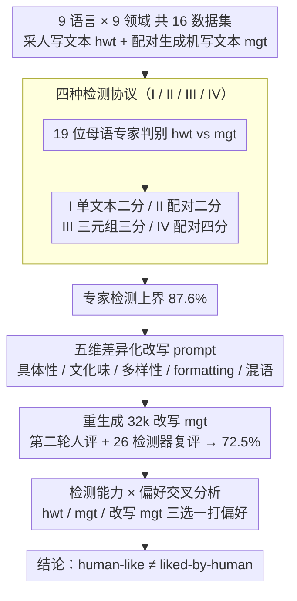

# Is Human-Like Text Liked by Humans? Multilingual Human Detection and Preference Against AI

**会议**: ACL 2026  
**arXiv**: [2502.11614](https://arxiv.org/abs/2502.11614)  
**代码**: https://github.com/xnlp-lab/HumanEval-MGT  
**领域**: 多语言 / AIGC 检测 / 人机偏好  
**关键词**: MGT 检测、多语言、人类评估、prompting 改写、偏好分析

## 一句话总结
作者组织 19 位母语专家对 9 种语言、9 个领域、11 个 SOTA LLM 共 16 个数据集做了 8.8k 例的人机文本判别，发现专家平均准确率高达 87.6%（远高于"接近随机"的早期结论），并进一步揭示：用显式说明差异的 prompt 改写后机器文本能把检测准确率压到 72.5%，但人在分不清来源时反而倾向选机器文本，挑战了"human-like 等于 liked-by-human"的隐含假设。

## 研究背景与动机
**领域现状**：现有 MGT (Machine-Generated Text) 检测研究的人评结论大多基于 GPT-3.5-turbo + 英语 + 约 300 例样本，普遍报告"人类难以区分 LLM 与人写文本，准确率接近随机猜测"（Guo et al. 2023; Chein et al. 2024; Wang et al. 2024a）。这些结论被广泛援引用以论证"LLM 已通过非正式图灵测试"。

**现有痛点**：上述结论存在三个未被充分检验的限制——（1）语言覆盖窄，几乎只测英语和少量中文；（2）模型陈旧，没覆盖 GPT-4o / Claude-3.5 / Llama4 等新一代；（3）标注者画像模糊，常混入对 LLM 不熟悉的 layman，无法反映"专家上限"。

**核心矛盾**：要回答"LLM 是否真的过了图灵测试"，必须把"人能不能区分"这个能力上界先量出来；如果连训练有素的母语专家都识别不出，结论才真正可信；如果反过来专家其实能识别，那意味着 LLM 的人格化程度被严重高估，已有的检测器评估和"AI 不可识别"叙事都需要修正。

**本文目标**：作者把问题拆解为四个研究子问题：（i）专家在多语言/多模型/多领域上的检测上界是多少；（ii）哪些语言特征驱动判别决策；（iii）用 prompting 显式弥合差异能否真正缩小机器与人的距离；（iv）人到底偏好哪种文本？

**切入角度**：跳出"小规模英文 GPT-3.5"的旧设定，构建"大规模 + 多语言 + 新模型 + 母语专家"的四维矩阵，并设计四种检测协议（单文本二分、配对二分、三元组三分、配对四分）来分离"任务难度"和"识别能力"两个因素。

**核心 idea**：用 9 种语言 × 9 个领域 × 11 个 LLM 共 16 个数据集 × 19 名母语 NLP 专家的全因子人评，把"人类检测上界"和"机器与人的语言差距"做成一份可复用的多语 benchmark，并把 prompting 弥合、人机偏好挂钩进同一框架来回答"human-like vs. liked-by-human"。

## 方法详解
本文严格意义上不是一个"算法论文"，方法部分是一个精心设计的大规模人评协议 + 一个 prompting 改写实验 + 一个偏好对比研究。下面按 pipeline 描述。

### 整体框架
整体 pipeline 分为四个阶段：

1. **数据构造**：对 9 种语言 × 9 个领域共 16 个数据集（Arabic Tweet/EASC/Youm7/SANAD、Chinese Zhihu-QA/Essay/GovReport、English Peersum、Hindi News、Italian DICE、Japanese News、Kazakh Wiki、Russian News/Summary、Vietnamese Wiki/News），每个数据集采 300–600 条人写文本（hwt），并用一个多语 SOTA 模型（GPT-4o / Claude / Llama3-405B）+ 一个语言特化模型（Qwen / ChatGLM / AceGPT / Anita）各自生成配对的机写文本（mgt）。
2. **人评检测（第一轮）**：19 名母语 NLP 专家（含 BSc/MSc/PhD/Postdoc）在四种标注协议下判别 hwt vs. mgt，得到"专家检测上界"和"哪些语言/领域/模型/协议最难判"的细粒度地图。
3. **Prompting 弥合**：让标注者针对自己识别到的差异（具体性、文化味、长度多样性、formatting、混语等）手写"改写 prompt"，用同一个 LLM 重生成 32k 条改写版 mgt，再做第二轮人评 + 26 种自动检测器评估，量化 prompting 能填多少 gap。
4. **偏好实验**：把原 hwt、原 mgt、改写后 mgt 三选一（外加 none）让 10 名标注者在 6 个数据集上打偏好，并和检测准确率交叉分析，得到"人类是否真的偏爱人写文本"的回答。

四个阶段串成一条实验流水线：数据构造是脚手架，后三个阶段分别落在下面三个关键设计上——人评检测靠四种协议、Prompting 弥合靠五维改写模板、偏好实验靠检测 × 偏好交叉分析。

### 关键设计

**1. 四种检测协议（I/II/III/IV）的分层设计：把"信息量"和"任务难度"两个混在一起的变量拆开**

以往各家用各家的协议，"60% 准确率"和"90% 准确率"根本没法直接比，因为没人控制"手里有没有配对参考"这个关键变量。作者设了四种协议来分层：I. Single-Binary（给 1 段文本判 Y/N 是否人写）、II. Pair-Binary（给一对 hwt + mgt 二选一）、III. Triplet-Three-Class（hwt 加两个不同 LLM 的 mgt，三选一）、IV. Pair-Four-Class（一对文本各自可能是 hwt 或 mgt，输出 A/B/none/both）。理论难度排序是 I > IV > III > II——I 没有任何可比对的参考最难，II 二选一信息量最大最易。把同一批标注者放在同一数据集上跨协议跑（如阿拉伯 Tweet 在 I 下 50.1%、在 II 下 92.7%），就能干净地把"配对参考能带来约 +20%"这个系统性效应单独量出来。

**2. 改写 prompt 的五维差异化模板：把"机器哪里不像人"翻译成可执行的生成指令**

光说"机器文本不自然"没用，得知道到底差在哪、能不能补上。标注者在第一轮里先总结出 5 类系统性差异——具体性（concreteness）、文化/宗教 nuance、长度/结构/情感多样性、Markdown formatting、混语；然后把这些写进改写 prompt，显式要求模型"加入具体数字/人名/地名/URL""避免 bullet 和 Markdown""随机化长度风格与情感""用本族母语写作、别混英文"，对同一条 hwt 重新生成 mgt。这相当于一个对照实验，直接测 LLM 是否"知道自己哪里露馅"：如果 prompting 能填上 gap，说明缺陷只是表层对齐问题；如果填不上（尤其是文化 nuance 和多样性），说明缺陷已经长进了训练数据和优化目标里，得换更根本的解法。

**3. 检测能力 × 偏好的交叉分析（human-like vs. liked-by-human）：验证"更像人"是不是等于"更被喜欢"**

RLHF/对齐文献里默认"模仿人类偏好 = 模仿人类写作"，但这两件事真的是一回事吗？作者在同一组样本上同时收两个标签——"哪个是人写"（检测）和"你更喜欢哪个"（偏好），再按检测准确率分高/中/低三层汇总偏好分布。形式化看，记某条样本上标注者的检测正确率为 $p$、偏好人文本的概率为 $q$，结果是 $q$ 与 $p$ 正相关但远不到 1：$p \approx 1$ 时 $q \approx 0.6$，而 $p \approx 0.5$ 时 $q$ 反而 $< 0.5$——也就是说人一旦看不出谁是机器，偏好反而倒向机器。这把"是否像人"和"是否被喜欢"两条轴放进同一实验量化，直接给了一条"liked-by-human 是独立于 human-like 的优化目标"的实证证据。

### 损失函数 / 训练策略
本文为评测/分析论文，不涉及训练损失。涉及的关键超参主要是采样规模（每个数据集 300–600 例，总计约 9k 检测实例 + 13.5k 第二轮检测实例 + 5k 偏好实例 + 1.6k fill-the-gap 调查），以及 26 个自动检测器的复现设置（沿用 COLING 2025 GenAI shared task）。标注流程是 zero-shot/few-shot 两个 setting：few-shot 在正式标注前给 3–5 个带标签例子，作为"专家校准"。

## 实验关键数据

### 主实验：跨 9 语言 × 16 数据集人评检测准确率

| 语言 | 代表数据集 | 协议 / shot | 平均准确率 | 关键观察 |
|------|------------|------------|-----------|---------|
| Chinese | Zhihu-QA (GPT-4o) | II / Zero | 99.6% | 高准确率，5 人波动 99–100% |
| Chinese | Student Essay | IV / Zero | 97.0% | 四分类不降准确率 |
| Russian | News | II / Few | 100.0% | 单标注者达 100% |
| Russian | Academic Summary | I / Few | 80.0% | I 协议明显更难 |
| English | Peersum | II / Few | 99.8% | 同行评议易识别 |
| Italian | DICE News (GPT-4o) | II / Few | 100.0% | 同一标注者：Anita 88% / Llama3-405B 99.7% / GPT-4o 100% |
| Arabic | Dialect Tweet | I / Zero | 50.1% | 短文本 + 方言 = 最难 |
| Arabic | SANAD News | II / Zero | 100.0% | 新闻最易识别 |
| Vietnamese | Wikipedia | II / Zero | 50.7% | Wiki 与训练数据高度相似 |
| Kazakh | Wikipedia | II / Zero | 79.7% | 同上 |
| **总体** | **16 数据集 / 8,778 例** | – | **87.6%** | **远高于先前"接近随机"结论** |

### 消融实验：Prompting 改写后准确率下降幅度

| 数据集 | Original Acc | Improved Acc | 下降 | 解读 |
|--------|-------------|-------------|-----|------|
| Kazakh Wikipedia | 79.7 | ↓ 显著 | – | 改写引入具体名/日期，最有效 |
| Arabic Tweet | 50.1 | ↓ 显著 | – | 改写加情感后更像人，但 hashtag 仍露馅 |
| Chinese Zhihu-QA | 99.6 | ~92 | -7.6 | "首先/然后/最后"结构难根除 |
| English Peersum | 99.8 | ~88 | -11.8 | 长度/结构方差仍然太低 |
| Italian DICE (GPT-4o) | 100.0 | ~85 | -15 | formatting 易改、cultural nuance 难补 |
| **总均值** | **87.6** | **72.5** | **-15.1** | prompting 能填一半 gap |

26 个自动检测器中，有 19 个在改写后准确率下降，与人评趋势一致，说明 prompting 改写带来的"更像人"对自动检测器同样有效。

### 关键发现
- **专家不是随机猜**：以往"50% 准确率"很大程度上是 GPT-3.5 + 单文本协议 + 非专家三个因素叠加的产物；只要换成 SOTA 模型 + 配对协议 + 母语专家，准确率立刻飙到 87.6%。
- **协议差异巨大**：同一阿语 Tweet 在 I 协议下 50.1%、在 II 协议下 92.7%；说明"是否有可比对参考"对人评至关重要，单文本判别才是真正接近随机的设置。
- **模型差异随能力递增**：GPT-4o > Llama3-405B > Anita（语言特化小模型），越强的模型越像人，但即使是 GPT-4o 在英文 peer review 上专家也能 99.8% 识别。
- **prompting 能填一半 gap**：约 50% 的样本通过改写 prompt 可以完全或部分弥合差异，但 cultural nuance / 多样性 / 情感这类深层差异即使显式指令也填不上，提示需要更根本的训练目标改造。
- **人不偏爱人**：在能正确识别来源的 Chinese QA / Essay 上人偏好人文本 ~60%，但在难识别的 Russian/Arabic summary 上人偏好机器文本 $\geq 2/3$；情感 QA 上 4 个标注者里 3 个反而更喜欢机器答案，暗示 RLHF 数据的偏好分布可能系统性偏向机器风格。

## 亮点与洞察
- **协议解耦带来的"准确率体检表"**：把 I/II/III/IV 四种检测协议在同一标注团队上拉一遍，直接给出了一份"以前的小规模研究怎么读"的换算表——这套设计可直接复用到任何后续 MGT/AIGC 检测评测里。
- **"human-like ≠ liked-by-human"的实证拆分**：作者用极简的"检测 + 偏好"双标签把这两个对齐目标拆开，结论非常反直觉：当人无法区分来源时，他们的偏好实际上向机器倾斜——这等于告诉 RLHF 社区"你以为在对齐人类喜好，其实在对齐 LLM 自己的风格"。
- **五维差异化 prompt 模板**：把"机器哪里不像人"翻译成可执行的 prompt 指令，本身就是一个 transferable 的 trick；做指令微调和 distillation 时可直接把这套差异维度加入 system prompt，逼模型生成"低 detectability"文本。
- **多语 + 多模型 + 多协议的数据资源**：17k 原始 + 32k 改写 MGT + 13.5k 检测 + 5k 偏好 + 1.6k fill-the-gap + 19 位标注者元数据全部开源，是目前多语 AIGC 检测最完整的资源之一。

## 局限与展望
- 标注者全部为 NLP 专家/研究者，结论是"专家上限"，对普通用户场景需要额外的 layman 标注研究（作者也承认这点）。
- 偏好实验只覆盖 6 个数据集 + 10 名标注者，统计显著性有限；偏好与 MBTI/年龄/性别等个体特征的相关性留作 future work。
- "prompting 能填一半 gap"的结论是在用同一 LLM 自身改写时得到的，没有测"用更弱模型按相同 prompt 能否同样填上"，因此分不清是 prompt 的功劳还是模型本身的能力。
- 9 种语言虽覆盖广，但缺低资源非洲语 / 印欧语小语种；Wikipedia 类语料的"训练污染"问题没有定量评估。
- 改进方向：（1）加入 layman + crowd-source 大规模标注，构建"detection accuracy × 用户画像"二维图；（2）把 fill-the-gap 失败维度（cultural nuance）翻译成训练目标项，做 culturally-aware fine-tuning；（3）把"liked-by-human"作为独立优化轴融入对齐 pipeline，与 helpfulness/harmlessness 并列。

## 相关工作与启发
- **vs. Guo et al. (2023) / Chein et al. (2024)**：他们结论是"专家也只比随机略好"，本文用 SOTA 模型 + 母语专家 + 配对协议把准确率拉到 87.6%，主要差异不在模型而在标注协议与标注者画像，提示 MGT 检测评测必须报告协议元数据。
- **vs. Wang et al. (2024a/b)**：同作者团队前作偏单一语言 / 单 setting，本文把矩阵扩到 9×9×11，是其多语广义化版本。
- **vs. COLING 2025 GenAI Shared Task**：本文复用其 26 个自动检测器作为基线，并提供 32k 改写 mgt 作为新评测集，未来 shared task 可直接接入。
- **vs. RLHF / 对齐工作**：本文偏好实验直接挑战 "human preference = human writing" 的隐含等式，可作为讨论 RLHF 数据偏置的有力实证。

## 评分
- 新颖性: ⭐⭐⭐⭐ 不是新算法，但"多语 + 多协议 + 偏好交叉"的实验设计在 MGT 领域算是开创性的。
- 实验充分度: ⭐⭐⭐⭐⭐ 9 语言 × 9 领域 × 11 模型 × 4 协议 × 19 标注者 × 8.8k+13.5k+5k 实例，规模和细致度都罕见。
- 写作质量: ⭐⭐⭐⭐ 数据表、协议图、偏好柱状图都直观；但章节切换略碎，附录依赖较重。
- 价值: ⭐⭐⭐⭐⭐ 直接颠覆"AI 已过图灵测试"的流行叙事，同时给出可复用的多语数据集，对检测器评测和对齐研究都有长期价值。

<!-- RELATED:START -->

## 相关论文

- [\[NeurIPS 2025\] HelpSteer3-Preference: Open Human-Annotated Preference Data across Diverse Tasks and Languages](../../NeurIPS2025/multilingual_mt/helpsteer3-preference_open_human-annotated_preference_data_across_diverse_tasks_.md)
- [\[ACL 2026\] Evaluating Robustness of Large Language Models Against Multilingual Typographical Errors](evaluating_robustness_of_large_language_models_against_multilingual_typographica.md)
- [\[ACL 2025\] Has Machine Translation Evaluation Achieved Human Parity?](../../ACL2025/multilingual_mt/mt_eval_human_parity.md)
- [\[ACL 2026\] Lingo_Research_Group at SemEval-2026 Task 9: Evaluating Prompt Variants for Polarization Detection](lingo_research_group_at_semeval-2026_task_9_evaluating_prompt_variants_for_polar.md)
- [\[ACL 2026\] CLewR: Curriculum Learning with Restarts for Machine Translation Preference Learning](clewr_curriculum_learning_with_restarts_for_machine_translation_preference_learn.md)

<!-- RELATED:END -->
