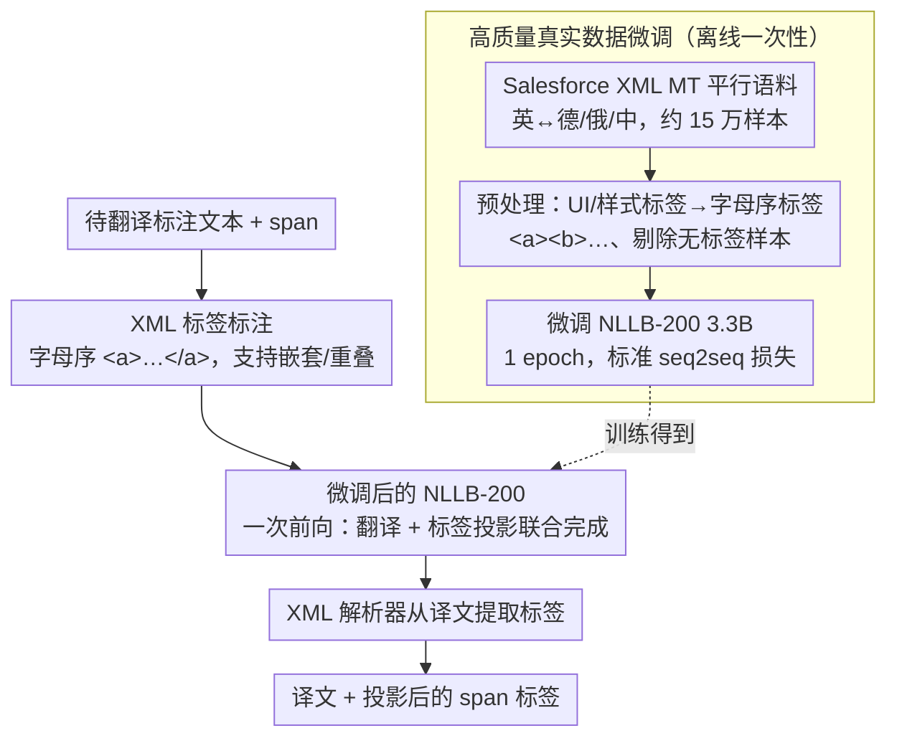

# Just Use XML: Revisiting Joint Translation and Label Projection

**会议**: ACL 2026  
**arXiv**: [2603.12021](https://arxiv.org/abs/2603.12021)  
**代码**: [https://github.com/thennal10/LabelPigeon](https://github.com/thennal10/LabelPigeon)  
**领域**: 多语言翻译 / 跨语言迁移  
**关键词**: 标签投影, XML标记, 联合翻译, 跨语言迁移, NER

## 一句话总结

提出 LabelPigeon，一种基于 XML 标签的联合翻译与标签投影方法，通过在高质量 XML 标记平行语料上微调 NLLB-200 翻译模型，在 11 种语言上超越所有基线并主动提升翻译质量，在下游跨语言 NER 任务中实现最高 +40.2 F1 的提升。

## 研究背景与动机

**领域现状**：许多 NLP 任务依赖 span 级别标签（如 NER 中的实体、事件抽取中的论元），将这些任务扩展到低资源语言的常见做法是先机器翻译训练数据再进行标签投影。标签投影传统上使用词对齐模型（如 Awesome-align）作为翻译后的独立步骤。

**现有痛点**：Chen et al. (2023) 的 EasyProject 尝试了联合翻译和标签投影（翻译前在 span 周围插入方括号），但报告翻译质量下降。后续工作（T-Projection、CLaP、Codec）因此放弃联合方法，转向复杂的多阶段管道：分离翻译和标签投影，引入 LLM 上下文翻译或约束解码，计算和工程开销大幅增加。

**核心矛盾**：领域共识是"插入标记会固有地损害翻译质量"，因此主流方法选择复杂的多阶段管道。但这个假设是否真的成立？或者只是因为训练数据和标记选择不当？

**本文目标**：重新验证联合翻译+标签投影是否必然降低翻译质量，并提出一个简单有效的替代方案。

**切入角度**：作者从三个观察出发：(1) XML 标签比方括号有天然优势——提供源标签和译文标签间的直接对应关系，可优雅处理嵌套和重叠；(2) 结构化文档翻译领域已有大量高质量 XML 标记平行语料（如 Salesforce Localization XML MT 数据集）；(3) 标签感知翻译可以引导模型优先保持标签 span 的连续性和完整性，避免翻译中的代词省略和歧义分配。

**核心 idea**：用 XML 标签代替方括号作为标记选择，利用现有高质量 XML 平行语料（而非合成数据）微调翻译模型，一次前向传播同时完成翻译和标签投影，无需多阶段管道。

## 方法详解

### 整体框架

LabelPigeon 的流程非常简洁：(1) 在待翻译的标注文本中用字母序 XML 标签（`<a>`, `<b>` 等）标记所有 span；(2) 用微调后的 NLLB-200 3.3B 模型进行翻译；(3) 用标准 XML 解析器从译文中提取标签。整个推理只需一次模型前向传播，无额外计算开销。能做到这点的前提是模型事先在真实 XML 平行语料上微调过——所以完整框架由「离线一次性微调」和「在线一次前向的联合翻译+投影」两段组成。

### 关键设计

**1. XML 标签替代方括号：给源文和译文的标注 span 一个精确的对应关系**

EasyProject 用方括号在 span 两边插标记，但方括号本身不携带任何对应信息——译文里冒出几对方括号后，还得靠额外的模糊字符串匹配去猜哪对对应源文哪个 span，既慢又在嵌套时容易配错。XML 标签天生带命名，`<a>...</a>` 在源文和译文里一一对应，嵌套和重叠 span（如 `<a><b>...</b>...</a>`）也能优雅表达，甚至可以直接用 `<PER>` 这类标签名承载语义。选 XML 还有个现实理由：结构化文档翻译领域早就积累了大量 XML 标记的翻译实践和数据，可以直接拿来用，不必从零造。

**2. 高质量真实数据微调：用现成的 XML 平行语料教模型在翻译时别把标签弄丢**

EasyProject 当年翻译质量掉，很大程度是因为它用合成生成的标记数据训练，把噪声和分布偏移都带了进来。作者改用 Salesforce Localization XML MT 数据集——英语与七种语言约 10 万对真实 XML 标记平行句。预处理时把原始的 UI/样式标签统一替换成通用字母序标签（`<a>`, `<b>` 等）、去掉无标签样本，每个语言对剩约 2.5 万样本；经消融后只挑英-德、英-俄、英-中三个高资源语言对训练，加上双向翻译总计约 15 万样本，单张 A100 上 5.5 小时跑完一个 epoch。用真实语料而非合成数据，正是这套方法翻译质量不降反升的关键前提。

**3. 标签感知翻译的优势论证：翻译选择会直接影响标签能不能完整落地**

分离式方法默认"先翻译、再重建标签映射"总能成功，但翻译过程里的语言学变化常让这个假设失效。作者用三个最小示例点破问题：(a) 翻译可能把一个标签 span 拆到句子的不同位置（如马拉雅拉姆语）；(b) 目标语言可能直接省掉标签对应的词（如日语的代词省略）；(c) 翻译可能造成标签该归给谁的歧义（如法语）。联合翻译则反过来用标签去约束翻译——引导模型挑那种能让 span 保持连续且完整的译法，把标签完整性和翻译质量绑在一起优化，而不是事后补救。

### 损失函数 / 训练策略

标准的 seq2seq 翻译训练损失。关键的训练策略选择：(1) 只在三个高资源语言对上训练避免灾难性遗忘；(2) 训练一个完整 epoch（9091 步，有效 batch size 16）；(3) 标签替换为通用字母序标签使模型泛化到任意标签类型。

## 实验关键数据

### 主实验

直接标签投影评估（XQuAD + MLQA，11 种语言平均）：

| 方法 | COMET 翻译质量 | Label Match F1 |
|------|---------------|----------------|
| Awesome-align | 82.3 (基线) | 50.6% |
| Gemma 3 27B | 69.6 (-12.7) | 78.1% |
| EasyProject | 80.8 (-1.5) | 77.7% |
| **LabelPigeon** | **82.4 (+0.1)** | **79.2%** |

下游 NER 任务（UNER，16 个数据集平均 F1）：

| 方法 | 平均 F1 | 最大提升 |
|------|---------|---------|
| EasyProject | 62.5% | - |
| **LabelPigeon** | **76.7%** | Tagalog +40.2 F1 |

### 消融实验

| 配置 | BLEU (无标记) | BLEU (复杂标记) | 投影率 |
|------|-------------|---------------|--------|
| NLLB 基线 | 17.4 | - | - |
| EasyProject | 17.7 | 14.9 | 47.7% |
| LabelPigeon | 17.6 | 15.5 | 69.3% |
| 非标记微调 (NF) | 17.9 | - | - |

### 关键发现
- LabelPigeon 是唯一在插入标记后翻译质量不降反升的方法——COMET 从 82.3 提升到 82.4
- 翻译质量提升归因于额外微调本身（非标记微调模型也有提升），即使是在未训练的语言上也有正向迁移
- EasyProject 在所有标记配置下都降低翻译质量，而 LabelPigeon 在单标记场景下保持了与基线相当的 BLEU
- 下游 NER 中低资源语言提升最大：Cebuano +30.7, Tagalog +40.2, Swedish +22
- 共指消解任务上 EasyProject 在 11/16 语言上 F1 < 1.0（几乎完全失败），LabelPigeon 仅在 2 个历史语言上为 0
- LabelPigeon 能泛化到训练时未见过的标签数量：训练最多 6 个标签，测试 XQuAD 平均 9 个标签（最多 24 个）

## 亮点与洞察
- **挑战领域共识**：推翻了"联合翻译和标签投影必然降低翻译质量"的广泛假设，用充分实验证明问题出在标记选择和训练数据而非方法本身。这种敢于重新验证已有结论的精神值得学习
- **极简方法的胜利**：相比复杂的多阶段管道（T-Projection 需要额外 LLM，Codec 需要约束解码），LabelPigeon 只需一次微调+一次前向传播，却在标签投影和翻译质量上同时取得最优，是"less is more"的典范
- **标签感知翻译的理论洞察**：通过最小示例优雅地论证了为什么翻译和标签投影应该联合而非分离——翻译选择会影响标签完整性，反之标签约束也能引导更适合的翻译

## 局限与展望
- 直接标签投影评估仅使用 QA 数据集（XQuAD、MLQA），标签类型单一
- Flores-200 上的合成标记插入可能不完全反映真实标注的标签分布
- 仅在 NLLB-200 3.3B 上验证，更大翻译模型或 LLM-based 翻译的效果未知
- 共指消解任务整体性能仍然较低，嵌套和高频标签场景的翻译质量仍有下降
- 训练数据仅限英语到三种高资源语言对，扩展到更多语言对可能进一步提升

## 相关工作与启发
- **vs EasyProject**: 使用方括号+合成数据，翻译质量下降且标签对应依赖模糊匹配。LabelPigeon 用 XML+真实数据，翻译质量提升且标签对应精确
- **vs T-Projection / CLaP**: 需要额外 LLM 进行标签投影或上下文翻译，计算开销大。LabelPigeon 零额外推理成本
- **vs Awesome-align**: 词对齐方法在 Label Match F1 上仅 50.6%，远低于 LabelPigeon 的 79.2%

## 评分
- 新颖性: ⭐⭐⭐⭐ 关键贡献在于挑战领域共识并提出更简单有效的替代方案，XML+真实数据的组合看似简单但效果惊人
- 实验充分度: ⭐⭐⭐⭐⭐ 直接评估+翻译质量+三个下游任务，覆盖 203 种语言和 27 种语言的下游实验，非常全面
- 写作质量: ⭐⭐⭐⭐⭐ 论证逻辑清晰，从理论到实验层层递进，最小示例非常直观
- 价值: ⭐⭐⭐⭐⭐ 为跨语言 NLP 提供了一个极简但高效的标签投影方案，直接可用于实际系统

<!-- RELATED:START -->

## 相关论文

- [\[ACL 2025\] Probing LLMs for Multilingual Discourse Generalization Through a Unified Label Set](../../ACL2025/multilingual_mt/probing_llms_for_multilingual_discourse_generalization_through_a_unified_label_s.md)
- [\[ACL 2025\] Just Go Parallel: Improving the Multilingual Capabilities of Large Language Models](../../ACL2025/multilingual_mt/just_go_parallel_improving_the_multilingual_capabilities_of_large_language_model.md)
- [\[ACL 2025\] CC-Tuning: A Cross-Lingual Connection Mechanism for Improving Joint Multilingual Supervised Fine-Tuning](../../ACL2025/multilingual_mt/cc-tuning_a_cross-lingual_connection_mechanism_for_improving_joint_multilingual_.md)
- [\[ACL 2026\] Hierarchical Policy Optimization for Simultaneous Translation of Unbounded Speech](hierarchical_policy_optimization_for_simultaneous_translation_of_unbounded_speec.md)
- [\[ACL 2026\] CLewR: Curriculum Learning with Restarts for Machine Translation Preference Learning](clewr_curriculum_learning_with_restarts_for_machine_translation_preference_learn.md)

<!-- RELATED:END -->
