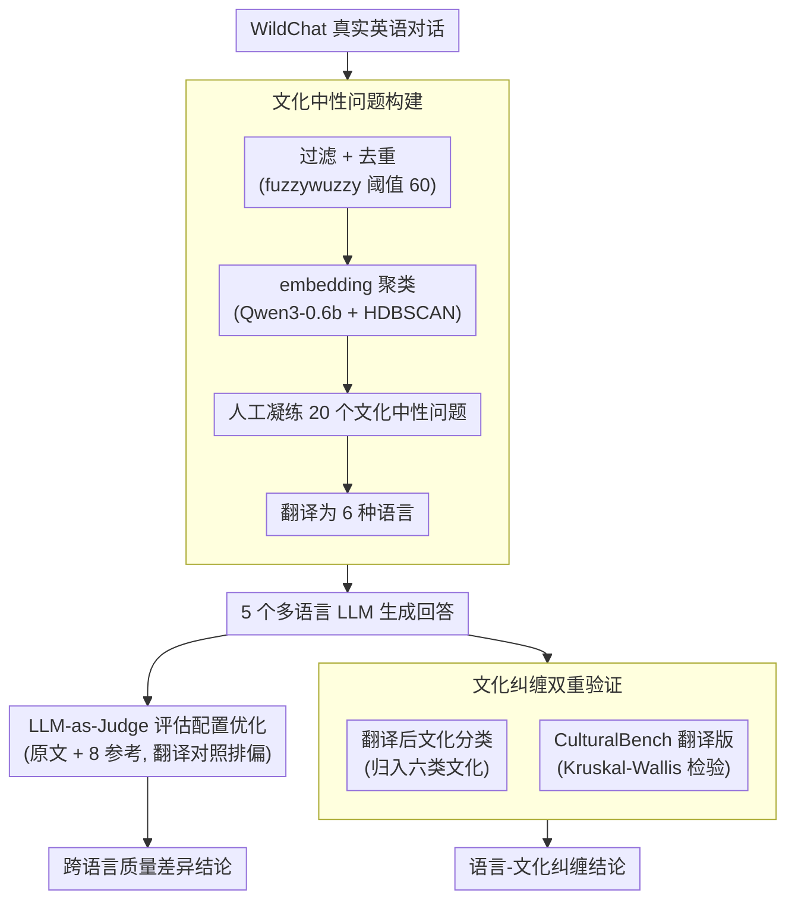

# Language Models Entangle Language and Culture

**会议**: ACL 2026  
**arXiv**: [2601.15337](https://arxiv.org/abs/2601.15337)  
**代码**: 无  
**领域**: 多语言 / 文化偏差  
**关键词**: 多语言LLM, 文化偏差, 语言-文化纠缠, LLM评估, 公平性

## 一句话总结

本文通过基于 WildChat 数据集构建的通用建议类问题评估多语言 LLM，发现不同语言查询会导致回答质量和文化上下文的系统性差异——低资源语言的回答质量显著低于英语，且语言选择会隐式地改变回答中使用的文化信息，在翻译版 CulturalBench 上验证了语言与文化在 LLM 中的纠缠关系。

## 研究背景与动机

**领域现状**：ChatGPT 等 LLM 已被数亿人用于日常查询（健康、金融、教育等），用户使用多种语言交互。现有多语言评估如 MMMLU、BenchMAX 主要关注知识问答、数学推理等 MCQ 任务，仅评估准确率而忽略回答风格和文化上下文的变化。

**现有痛点**：(1) 现有多语言 benchmark 只看"对不对"，不看"好不好"——对开放式建议类问题的回答质量缺乏评估；(2) 现有偏差研究通过在 prompt 中嵌入文化线索（姓名、国籍等）来触发偏差，但这不反映用户实际查询方式；(3) 没有工作系统地建立语言选择与文化上下文之间的关系。

**核心矛盾**：LLM 在训练过程中隐式地将语言与文化绑定——用某种语言查询时，模型不仅可能产生质量较低的回答，还会使用与该语言相关联的文化框架，导致相同问题在不同语言下获得本质不同的建议。这对使用低资源语言的用户造成系统性不利。

**本文目标**：(1) 构建通用建议类问题集，评估 LLM 在不同语言下的回答质量差异；(2) 验证语言选择是否改变回答的文化上下文；(3) 通过翻译版 CulturalBench 进一步验证语言-文化纠缠假设。

**切入角度**：使用文化中性的开放式问题（不包含任何文化线索），观察仅改变查询语言是否导致回答的文化上下文变化——这比现有嵌入文化线索的方法更真实地反映了用户实际交互场景。

**核心 idea**：语言和文化在 LLM 中是纠缠的——选择不同语言不仅影响回答质量，还隐式地激活不同的文化信息，导致即使是文化中性的通用问题也产生文化偏向的回答。

## 方法详解

### 整体框架

整个评估分为三部分：(1) 基于 WildChat 构建 20 个文化中性建议类问题，翻译为 6 种语言（英语、中文、印地语、巴西葡语、斯瓦希里语、希伯来语）；(2) 在每种语言下对 5 个多语言 LLM 生成回答，用 LLM-as-Judge 评估质量差异；(3) 对回答进行文化分类 + 在翻译版 CulturalBench 上验证语言-文化纠缠。

### 关键设计

**1. 基于 WildChat 的文化中性问题构建：让评估问题既贴近真实查询、又不带任何文化暗示**

现有偏差研究常在 prompt 里塞进姓名、国籍这类文化线索来"钓"出偏差，但真实用户并不会这么提问，得到的结论也就难以反映模型自身的倾向。本文反其道而行：先从 WildChat 真实对话里过滤出英语查询，剔除占比过高的编程类问题，只保留 40–400 字符的条目，用 fuzzywuzzy 按阈值 60 去重，再用 Qwen3-0.6b 生成 embedding、HDBSCAN 聚类，人工分析各簇后凝练出 20 个覆盖健康、教育、投资、求职等场景的问题。关键在于这些问题被刻意设计成文化中性——不出现任何国家、民族或文化引用，于是当不同语言下的回答仍然带上文化色彩时，这份色彩只可能来自模型本身，而非问题的诱导。

**2. LLM-as-Judge 评估配置优化：先排除"评委本身偏心"，再谈跨语言质量差异**

要用一个 LLM 给多语言回答打分，最大的隐患是评委自带语言偏好——若它天然偏爱英语，所谓"低资源语言回答更差"就成了循环论证。为此作者横向测试了 6 种评判配置（原文 vs 翻译、不同数量的参考回答），以 Pearson 相关和 Cohen's Kappa 对齐人工标注，最终敲定"原始语言查询 + 原始语言回答 + 8 个随机参考回答"的组合，评判模型用 Cohere Command-A。更关键的是一个对照实验：把英语回答翻译成印地语后再评分，仍高于把原生印地语回答翻译成英语的评分——说明分差来自回答内容本身，而不是评委对某种语言的偏好。

**3. 文化纠缠双重验证：用两个相互独立的角度证明"换语言=换文化"，而非仅仅质量下降**

质量差异只能说明低资源语言"答得差"，还不足以证明语言和文化被绑在了一起，所以本文补了两道独立验证。其一是翻译后分类：把所有非英语回答统一翻成英语，再让 LLM-as-Judge 归入西方、印度、中国、非洲、拉美、犹太六种文化——结果即便褪去了语言外壳，模型仍能从内容里认出回答的文化来源，印地语查询的回答最常被判为印度文化、中文查询最常被判为中国文化。其二是在翻译版 CulturalBench（750+ 题、覆盖 29 个地区）上评估 Qwen3-14B，同一道文化知识题在不同语言下准确率出现显著分化（Kruskal-Wallis $H=45.52$, $p=1.14\times10^{-8}$）；为排除"任何扰动都会改变结果"的质疑，又做了随机字符串对照，性能变化并不显著（$H=1.02$, $p=0.80$）。两条证据从生成内容和知识准确率两个维度共同指向同一结论：语言选择确实改写了回答的文化内容。

### 损失函数 / 训练策略

本文为评估工作，不涉及模型训练。评估使用 Kruskal-Wallis 非参数检验验证跨语言差异的统计显著性。

## 实验关键数据

### 主实验

**Kruskal-Wallis 跨语言质量差异检验**

| 模型 | H 统计量 | p 值 | 差异显著性 |
|------|---------|------|-----------|
| Cohere-Aya-32B | 712.80 | $8.39\times10^{-152}$ | 极显著 |
| Cohere-Aya-8B | 721.13 | $1.33\times10^{-153}$ | 极显著 |
| Magistral-Small | 610.81 | $9.33\times10^{-130}$ | 极显著 |
| Qwen3-14B | 928.91 | $1.48\times10^{-198}$ | 极显著 |
| Sarvam-m | 899.84 | $2.89\times10^{-192}$ | 极显著 |

所有模型在英语上表现最佳，印地语、斯瓦希里语、希伯来语持续较差。

### 消融实验

**CulturalBench 翻译版 vs 随机扰动对照（Qwen3-14B）**

| 条件 | H 统计量 | p 值 | 结论 |
|------|---------|------|------|
| 跨语言 | 45.52 | $1.14\times10^{-8}$ | 显著差异 |
| 随机字符串 | 1.02 | 0.80 | 无显著差异 |

### 关键发现

- 所有 5 个模型在至少一种语言上表现显著较差，英语始终最佳
- Cohere-Aya-32B 的跨语言一致性优于 Cohere-Aya-8B，提示更大模型跨语言更稳定
- Sarvam-m 和 Magistral 虽基于同一底座（Mistral-small-3.1-24B），但因不同微调策略在不同语言上各有优势——Sarvam-m 在英语和印地语更强，Magistral 在中文和葡语更强
- 文化分类实验显示：印地语查询→回答被归为印度文化比例最高，中文→中国文化，即使翻译为英语后文化特征仍可识别

## 亮点与洞察

- 使用文化中性问题揭示语言-文化纠缠是一个巧妙的实验设计——排除了人为注入文化线索的混淆因素，使发现更有说服力
- 评判模型偏差的控制实验（翻译回答再评判）是方法论上的加分项——很多多语言评估忽略了这个潜在混淆
- 语言-文化纠缠的发现对 LLM 部署有直接实际意义：用户可能因为使用母语而获得文化偏向的建议，例如投资建议可能隐式偏向该语言对应文化的投资习惯

## 局限与展望

- 仅评估中小规模开源模型（最大 32B），更大模型的表现可能不同
- 20 个问题覆盖面有限，虽然基于真实分布但样本量较小
- 依赖 LLM-as-Judge 评估，尽管做了验证但仍可能存在系统性偏差
- 仅覆盖 6 种语言，更多低资源语言的表现有待探索
- 未探索机制——语言-文化纠缠的根因（训练数据分布？tokenizer？）需要可解释性分析

## 相关工作与启发

- **vs MMMLU/BenchMAX**: 它们评估 MCQ 准确率，本文评估开放式回答质量和文化上下文——揭示了现有 benchmark 遗漏的一个重要维度
- **vs Bąk et al. / Schlicht et al.**: 它们在特定领域（邮件/医疗）评估多语言偏差，本文覆盖更广泛的通用查询
- **vs IndQA (OpenAI)**: 类似但仅关注印度语言，本文覆盖多地区语言并建立了一般性的语言-文化纠缠结论

## 评分

- 新颖性: ⭐⭐⭐⭐ 首次系统性地用文化中性问题揭示语言-文化纠缠，但方法主要是评估而非提出解决方案
- 实验充分度: ⭐⭐⭐⭐ 多模型+多语言+统计检验+评判偏差控制+随机扰动对照，较为全面
- 写作质量: ⭐⭐⭐⭐ 逻辑清晰，实验设计层层递进
- 价值: ⭐⭐⭐⭐ 对多语言 LLM 公平性和部署有直接指导意义，但缺乏解决方案降低了实用价值

<!-- RELATED:START -->

## 相关论文

- [\[ACL 2025\] Disentangling Language and Culture for Evaluating Multilingual Large Language Models](../../ACL2025/multilingual_mt/disentangle_language_culture.md)
- [\[ACL 2026\] The GaoYao Benchmark: A Comprehensive Framework for Evaluating Multilingual and Multicultural Abilities of Large Language Models](the_gaoyao_benchmark_a_comprehensive_framework_for_evaluating_multilingual_and_m.md)
- [\[ACL 2026\] Language on Demand, Knowledge at Core: Composing LLMs with Encoder-Decoder Translation Models for Extensible Multilinguality](language_on_demand_knowledge_at_core_composing_llms_with_encoder-decoder_transla.md)
- [\[ACL 2026\] LLM-XTM: Enhancing Cross-Lingual Topic Models with Large Language Models](llm-xtm_enhancing_cross-lingual_topic_models_with_large_language_models.md)
- [\[ACL 2026\] Multilingual Language Models Encode Script Over Linguistic Structure](multilingual_language_models_encode_script_over_linguistic_structure.md)

<!-- RELATED:END -->
