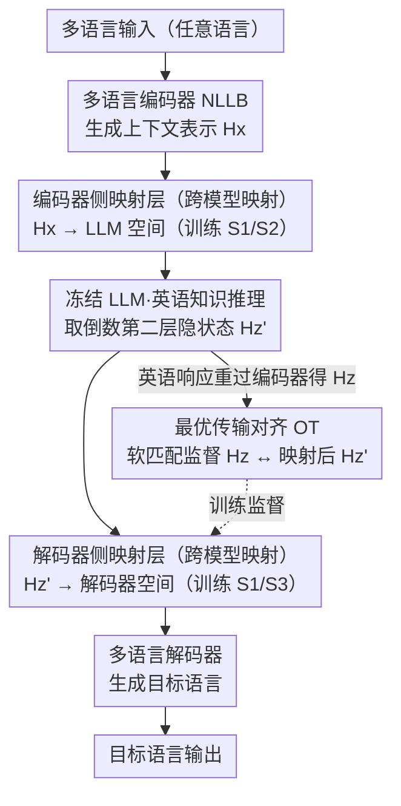

# Language on Demand, Knowledge at Core: Composing LLMs with Encoder-Decoder Translation Models for Extensible Multilinguality

**会议**: ACL 2026  
**arXiv**: [2603.17512](https://arxiv.org/abs/2603.17512)  
**代码**: [GitHub](https://github.com/ictnlp/XBridge)  
**领域**: 多语言翻译  
**关键词**: 多语言LLM, 模型组合, 编码器-解码器翻译模型, 最优传输对齐, 低资源语言

## 一句话总结

本文提出 XBridge，一种将预训练多语言编码器-解码器翻译模型（如 NLLB）与英语为中心的 LLM 组合的架构——编码器负责多语言理解、LLM 负责知识推理、解码器负责多语言生成，通过轻量级映射层和最优传输对齐实现跨模型语义桥接，在低资源和未见语言上显著优于基线。

## 研究背景与动机

**领域现状**：LLM 展现了强大的通用智能和推理能力，但其多语言性能严重不均衡——英语和少数高资源语言表现优秀，低资源和未见语言则常常失败。与此同时，预训练编码器-解码器翻译模型（如 NLLB）已支持数百种语言的均衡翻译能力。

**现有痛点**：(1) 数据级方法（翻译指令数据进行多语言微调）可能引入翻译噪声并干扰已有语言能力，高低资源语言之间的性能难以平衡；(2) 现有编码器增强方法（如 MindMerger、LayAlign）仅在输入端注入多语言编码器表示来提升理解，但生成仍依赖 LLM 的原始语言分布（通常是英语）；(3) 自然的扩展是加入多语言解码器，但在编码器和解码器之间插入冻结的 LLM 会引入表示空间不匹配——LLM 的输出不再符合解码器的交叉注意力期望。

**核心矛盾**：LLM 的核心限制不在于缺乏知识，而在于无法将其统一语义空间中的知识与多样化语言表示空间有效接口。编码器-解码器翻译模型恰好提供了互补的多语言理解和生成能力，但两者的表示空间异构且不对齐。

**本文目标**：构建一个编码器-LLM-解码器的组合架构，将多语言理解和生成任务卸载给外部翻译模型，同时保持 LLM 冻结作为英语中心的知识核心。

**切入角度**：利用翻译模型编码器和解码器的模块化特性——编码器将多语言输入映射到共享语义空间，解码器将共享表示投射到目标语言——这与 LLM 的输入-处理-输出流程天然对应。关键挑战在于跨模型表示对齐。

**核心 idea**：构建语义桥梁（Semantic Bridge），通过轻量级映射层将表示从多语言编码器空间转换到 LLM 输入空间，经 LLM 知识处理后再映射到解码器生成空间，并用最优传输目标实现 token 级别的细粒度语义对齐。

## 方法详解

### 整体框架

XBridge 采用 Encoder-LLM-Decoder 三段式架构：(1) 多语言编码器（如 NLLB 编码器）接收任意语言输入，生成上下文表示 $H_x$；(2) 编码器侧映射层将 $H_x$ 投射到 LLM 表示空间，与英语指令一起输入冻结的 LLM 进行知识处理；(3) LLM 生成英语响应的同时，其倒数第二层隐状态通过解码器侧映射层投射到解码器表示空间，作为多语言解码器的交叉注意力输入。训练时，最优传输对齐把解码器实际看到的表示拽回编码器-解码器的共享语义空间，整条桥按三阶段渐进训练逐步对齐。

### 关键设计

**1. 跨模型映射层（Cross-Model Mapping）：用两块轻量投影把编码器、LLM、解码器三个异构空间串成一条流水线**

编码器、冻结 LLM、解码器各自有一套表示空间，直接对接根本说不上话，于是 XBridge 在两个接口各插一块线性映射。编码器侧的 $\text{Mapping}_{enc}$ 把编码器表示 $H_x \in \mathbb{R}^{n \times d_e}$ 投射到 LLM 维度 $\tilde{H}_x \in \mathbb{R}^{n \times d_l}$，让多语言理解结果能以 LLM 听得懂的形式喂进去；解码器侧的 $\text{Mapping}_{dec}$ 则把 LLM 的隐状态 $H_{z'} \in \mathbb{R}^{m \times d_l}$ 投射到解码器维度 $\tilde{H}_{z'} \in \mathbb{R}^{m \times d_d}$，充当解码器交叉注意力的输入。一个值得注意的细节是取 LLM 的倒数第二层而非最终层——最终层已经过度对齐到输出词表空间，倒数第二层反而保留了更丰富的语义信息。整条桥只引入这两块投影，参数开销被压到最低。

**2. 最优传输对齐（Optimal Transport Alignment）：在分词器不一致的两端之间，用软匹配做 token 级语义对齐**

LLM 与翻译模型用的是不同分词器，同一句话切出的 token 数都对不上，一个简单的线性投影没法保证解码器拿到的表示在语义上仍落在编码器-解码器的共享空间里。XBridge 的做法是把 LLM 生成的英语序列 $z$ 重新过一遍编码器得到 $H_z$，再计算它与解码器侧映射后的 $\tilde{H}_{z'}$ 之间的最优传输距离，传输代价用余弦距离衡量。OT 天然支持多对多的软匹配，对序列长度的差异鲁棒，于是即便两端 token 数不同，也能给出一份细粒度、可微的对齐监督，把解码器实际看到的表示拽回共享语义空间。

**3. 三阶段渐进训练策略：把"对齐空间"和"适配任务"拆开训，避免两端目标互相打架**

如果让映射层、解码器交叉注意力和下游适配一起从零优化，编码器端和解码器端的目标会相互拉扯、训练极不稳定。XBridge 改为三段渐进：Stage 1 用三语翻译数据（源语言-英语-目标语言）训练两块映射层和解码器交叉注意力，先建立一个粗粒度的跨模型对齐；Stage 2 冻住解码器端，只用任务指令数据微调编码器侧映射层，教会 LLM 如何拿多语言表示去执行任务；Stage 3 反过来冻住编码器端，用 OT 损失加解码器生成损失微调解码器侧映射层，专攻多语言生成质量。先稳住 LLM 的条件分布、再优化解码器输出，两端的优化目标因此解耦，训练得以收敛。

### 损失函数 / 训练策略

总损失包含三项：LLM 英语生成交叉熵 $\mathcal{L}_{CE\_LLM}$、解码器多语言生成交叉熵 $\mathcal{L}_{CE\_Dec}$ 和最优传输对齐损失 $\mathcal{L}_{OT}$，不同阶段使用不同子集。LLM 全程冻结，仅训练映射层和解码器交叉注意力参数。

## 实验关键数据

### 主实验

| 系统 (LLM=LLaMA3-8B) | 低资源 X→En | 低资源 En→X | 高资源 X→En | 高资源 En→X |
|----------------------|------------|------------|------------|------------|
| LLaMA3-8B 原始 | 29.83 | 13.18 | 45.28 | 36.24 |
| MindMerger | 33.86 | - | 42.52 | - |
| LayAlign | 32.95 | - | 41.29 | - |
| **XBridge** | **37.09** | **28.42** | **45.75** | **35.45** |
| NLLB-200-1.3B | 37.78 | 32.83 | 46.23 | 39.91 |

### 消融实验

| 配置 | 低资源 BLEU | 高资源 BLEU | 说明 |
|------|-----------|-----------|------|
| Full XBridge | 37.09 / 28.42 | 45.75 / 35.45 | 完整模型 |
| w/o OT 对齐 | 降低 ~2-3 点 | 降低 ~1-2 点 | token 级对齐重要 |
| w/o 三阶段训练 | 训练不稳定 | 训练不稳定 | 渐进训练是必要的 |
| 用最终层隐状态 | 降低 ~1-2 点 | 降低 ~1 点 | 倒数第二层更优 |

### 关键发现

- XBridge 在低资源语言上的提升最为显著（相比 LLaMA3-8B 原始，En→X 从 13.18 到 28.42），证明了模型组合的有效性
- 在四种不同 LLM（MetaMath-7B、LLaMA3-8B、Aya-23-8B、Qwen2.5-7B）上均一致有效
- 低资源语言生成性能接近专门的 NLLB 翻译模型（28.42 vs 32.83），大幅缩小了差距
- 现有方法（MindMerger、LayAlign）仅支持 X→En 方向，无法做多语言生成

## 亮点与洞察

- "语言按需、知识为核"的设计理念简洁优雅——LLM 只需精通英语推理，多语言能力完全外包给翻译模型，两者各展所长
- 最优传输对齐巧妙解决了异构分词器导致的序列长度不匹配问题，比简单的线性投影更精细
- 三阶段训练的解耦思想可迁移到其他模型组合场景——先对齐表示空间，再分别适配输入端和输出端

## 局限与展望

- LLM 全程冻结意味着无法利用 LLM 内部的隐含多语言知识
- 需要额外维护一个翻译模型，增加了推理时的计算开销和部署复杂度
- 目前仅在翻译和简单任务上评估，在复杂推理+多语言生成的联合场景下表现未知
- OT 对齐的计算复杂度随序列长度增长，长文本场景可能成为瓶颈

## 相关工作与启发

- **vs MindMerger/LayAlign**: 它们仅在输入端加入多语言编码器，生成仍依赖 LLM 的英语分布；XBridge 进一步加入解码器实现真正的多语言生成
- **vs 数据级增强**: 翻译指令数据进行多语言微调可能损害高资源语言性能；XBridge 不修改 LLM 参数，避免了这种退化
- **vs NLLB**: NLLB 有均衡的多语言能力但缺乏通用推理能力；XBridge 组合两者优势

## 评分

- 新颖性: ⭐⭐⭐⭐ 编码器-LLM-解码器的组合思路新颖，但 OT 对齐和映射层都是已有技术的应用
- 实验充分度: ⭐⭐⭐⭐ 四种 LLM、多任务、多语言评估，但缺少复杂推理任务
- 写作质量: ⭐⭐⭐⭐⭐ 动机推导清晰，方法描述精确，图表直观
- 价值: ⭐⭐⭐⭐ 为 LLM 多语言化提供了一种不修改 LLM 参数的优雅方案

<!-- RELATED:START -->

## 相关论文

- [\[ACL 2026\] Language Models Entangle Language and Culture](language_models_entangle_language_and_culture.md)
- [\[ICML 2026\] Optimizing Language Models for Crosslingual Knowledge Consistency](../../ICML2026/multilingual_mt/optimizing_language_models_for_crosslingual_knowledge_consistency.md)
- [\[ACL 2026\] DFKI-MLT at SemEval-2026 TASK 7: Steering Multilingual Models Towards Cultural Knowledge](dfki-mlt_at_semeval-2026_task_7_steering_multilingual_models_towards_cultural_kn.md)
- [\[ACL 2026\] LLM-XTM: Enhancing Cross-Lingual Topic Models with Large Language Models](llm-xtm_enhancing_cross-lingual_topic_models_with_large_language_models.md)
- [\[ACL 2026\] NiuTrans.LMT: Toward Inclusive and Scalable Multilingual Machine Translation with LLMs](niutranslmt_toward_inclusive_and_scalable_multilingual_machine_translation_with_.md)

<!-- RELATED:END -->
