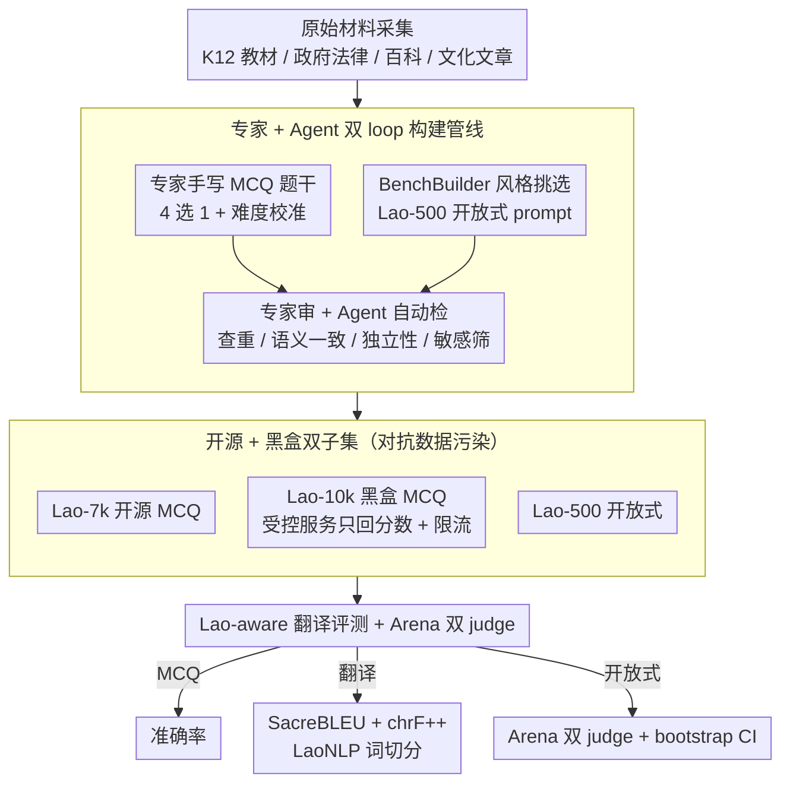

# LaoBench: A Large-Scale Multidimensional Lao Benchmark for Large Language Models

**会议**: ACL 2026  
**arXiv**: [2511.11334](https://arxiv.org/abs/2511.11334)  
**代码**: https://huggingface.co/datasets/BAAI/LaoBench  
**领域**: 多语言评测 / 低资源语言 / 东南亚语 / 数据集  
**关键词**: 老挝语、低资源 NLP、文化推理、黑盒评测、专家+Agent 协同构建

## 一句话总结
LaoBench 是首个大规模、多维度的老挝语 LLM 评测基准，包含 17000+ 条专家精选样本，覆盖文化-知识应用 / 老挝 K12 课纲 / 老-中-英三语翻译三大维度，并独创"开源 7k + 黑盒 10k + 开放式 500"三段式设计——其中 10k 黑盒子集通过受控服务发分数防污染，主流闭源模型（GPT-5-High、Gemini-2.5-Pro 等）仍落后人类专家 ~10-20 个百分点，老挝语文化推理与翻译保真度依然是远未解决的难题。

## 研究背景与动机

**领域现状**：LLM 评测严重偏向高资源语言；东南亚虽有 SeaEval、SEA-HELM、SeaExam 等基准，但老挝语（Lao）几乎缺席。已有的少数 Lao 资源是任务特定的（形态学、双语 MT），缺乏系统、可复现的"通用 LLM 能力评测"。

**现有痛点**：(1) 多数 SEA 基准要么从英文翻译过来（丢失本地文化锚定），要么只测高层多语推理，跳过课程对齐的母语熟练度；(2) 老挝文是 scriptio continua（连续书写，无明确词边界），传统 BLEU/Tokenizer 都不准；(3) 公开 benchmark 越来越受 contamination/leaderboard overfitting 困扰，Lao 这种低资源语言尤其没有黑盒评测服务可用。

**核心矛盾**：要测 LLM 在低资源语言上的真实能力，必须同时具备：本地真专家亲写、多维度（知识/教育/翻译）覆盖、对抗数据污染的黑盒机制、可复现的统计协议——而现有任何一个老挝语资源都没把这些凑齐。

**本文目标**：(1) 建首个大规模本地母语撰写的老挝语 benchmark；(2) 同时覆盖文化-知识应用、K12 课程、Lao↔Zh↔En 三语翻译；(3) 设计开源 + 黑盒双子集对抗污染；(4) 用专家 + Agent 协同管线兼顾质量与规模；(5) 系统测主流开源/闭源 LLM，量化与人类专家差距。

**切入角度**：把"benchmark 构建"重新视为一个**软件 + 流程 + 评测协议**的整体工程问题——不仅给数据，还给 Lao-aware SacreBLEU 配置、Arena-style 开放式评测、bootstrap CI、多 judge 聚合、黑盒服务 API——把"如何公平地评一个 Lao 模型"全部 standardize。

**核心 idea**：用三维度 × 三子集（Lao-7k 开源 MCQ / Lao-10k 黑盒 MCQ / Lao-500 开放式 prompt）+ 专家 + Agent 双 loop 构建，配套 Arena 双 judge + bootstrap CI 评估协议。

## 方法详解

### 整体框架
LaoBench 构建管线分三段（图 1）：(A) **原始材料采集**——从权威老挝来源采集 K12 教材、政府/法律文件、百科教育出版物、本地文化文章；(B) **数据集构建**——MCQ 子集（Lao-7k 开源 + Lao-10k 黑盒）由 11 位 Lao 母语专家手写题干、4 选 1、加难度校准；Lao-500 开放式 prompt 用 BenchBuilder 风格管线（LLM 评分 specificity/clarity/domain depth + 主题聚类 + 多样性采样）从大候选池里挑出 500 条；(C) **多阶段验证**——专家审 + Agent 自动检（重复检测、语义一致性、context independence、敏感内容筛）。整套 17,000+ 样本按 Knowledge Application / K12 / Translation 三维度组织，每维度再细分多个 subdomain。评测阶段对 MCQ 用准确率，对翻译用 SacreBLEU + chrF++（统一 LaoNLP 词切分），对 Lao-500 用 Arena 双 judge 成对评测。

### 关键设计

**1. 专家 + Agent 双 loop 构建管线：把机械活外包给 Agent、把文化判断留给母语专家，兼顾保真与规模**

纯靠人工写 17k+ 题成本会爆炸，纯靠 Agent 生成又翻车率高，于是 LaoBench 走 Hendrycks 式的 hybrid pipeline。人这一侧是 55 位贡献者按角色分工——25 位领域专家写题、11 位翻译专家做双语对齐、10 位资深 reviewer 终审、9 位 NLP 数据 curator，每题至少 2 位独立专家审、分歧交 senior reviewer 裁决；开放式的 Lao-500 则用 BenchBuilder 风格管线（LLM 评分 specificity/clarity/domain depth + 主题聚类 + 多样性采样）从大候选池里挑高质量 prompt。Agent 这一侧则跑可机械化的环节：duplicate detection（字符 n-gram + 嵌入检索）、semantic consistency（验证唯一正确答案）、context independence（剔除依赖外部信息的题）、sensitivity screening（先机筛再人核）。500 题抽样测得 Fleiss $\kappa{=}0.87$，大致达到 substantial agreement，说明这套分工既压住了成本，也守住了母语保真度。

**2. 开源 + 黑盒双子集对抗数据污染：把一半题目永远握在手里，让低资源 benchmark 不被预训练语料"吃掉"**

低资源语言一旦把整套 benchmark 公开，几乎注定会被下一代模型的预训练语料吸收，分数从此失真。LaoBench 的对策是把构建好的 MCQ 拆成两份：Lao-7k 开源 MCQ 供复现研究，Lao-10k 则永不公开题目，评测者要么提交 item ID → answer 的字典、要么提供 inference API endpoint 让受控服务按 standardized prompt 跑，最终只回 overall 与 subdomain 准确率，并配上 submission rate limit 阻击刷榜式过拟合。即便是开源子集也做了 web overlap 检索 + n-gram overlap 检查，发现 6.2% 候选样本有疑似重叠（多为常识性陈述，并非直接泄露）。这套黑盒服务被作者视为低资源 benchmark 能长期保持区分度的唯一现实路径。

**3. Lao-aware 翻译评测 + Arena 双 judge 开放式评测：针对老挝文无词边界和 MCQ 看不到生成质量两个痛点对症下药**

老挝文是 scriptio continua、没有明确词边界，直接套 BLEU 出来的分数根本不可解释；而纯 MCQ 又测不出回答的生成质量。LaoBench 因此把评测拆成两条线。翻译评测用 SacreBLEU 搭配 Lao-aware 的 LaoNLP v0.7 词切分，并额外报对分词不敏感的 chrF++（字符 n-gram）。开放式的 Lao-500 则走 Arena pairwise：以 GPT-5-High 为固定 baseline $B$，每个 prompt $x_i$ 让候选 $M$ 与 $B$ 各出一个回答 $y_i^M, y_i^B$，由 Gemini-2.5-Pro + Qwen3-Max 双 judge 按 correctness / completeness / reasoning / clarity / Lao fluency 判胜负、输出严格 JSON 防泄露；为消位置偏置每对评两次（A/B 互换）取平均、ties 记 0.5，再用 bootstrap 重采样 prompt 给出 95% CI。最终得分对两个 judge 取平均

$$S(M)=\frac{1}{|\mathcal{J}|}\sum_{J}\frac{1}{N}\sum_i w_i^J(M)$$

这样"生成质量"被转成人和 LLM 都能判的标准化协议，bootstrap CI 又让不同模型之间的差距是否显著一目了然。

### 损失函数 / 训练策略
LaoBench 本身是数据集与评测协议，不训练模型。所有被评 LLM 在 zero-shot 下评测、解码温度 0（支持时），MCQ 输出做 A/B/C/D 后处理；CoT 变体 (Thinking) 与直答 (Non-Thinking) 分别评。Lao-500 的 Arena judge 模型为 Gemini-2.5-Pro + Qwen3-Max；为避免 self-preference，候选模型同时是 judge 时跳过对应对比。

## 实验关键数据

### 主实验
Lao-7k 上三大维度（K12 平均 / 翻译 BLEU 取代表子域 Social & Law / Knowledge Application 平均）的对比（节选）：

| 模型 | K12 Avg ↑ | Translation Soc.&Law BLEU ↑ | Knowledge App Avg ↑ |
|------|-----------|------------------------------|---------------------|
| Random Choice | 25.00 | – | 25.00 |
| Ministral-8B-Instruct | 28.29 | 0.83 | 24.15 |
| Ling-mini-2.0 | 36.91 | 0.69 | 30.25 |
| Qwen3-Next-80B-A3B-Instruct | 79.80 | 16.03 | 63.05 |
| DeepSeek-V3.2-Exp (Thinking) | 85.12 | 20.57 | 69.11 |
| Qwen3-235B-A22B-Instruct-2507 | 86.18 | 21.81 | 67.42 |
| Qwen3-Max (闭源) | 86.78 | 21.70 | 69.06 |
| Gemini-2.5-Pro | 89.56 | **26.22** | 73.68 |
| Claude-Opus-4.1 | 87.95 | 24.78 | 73.40 |
| **GPT-5-High** | **89.46** | 20.96 | **74.89** |
| **Human Experts** | **98.52** | – | **98.74** |

GPT-5-High K12 上和人类的 gap 仍有 ~9 分；Knowledge Application 上的 gap 高达 ~24 分；最强翻译 BLEU 也只有 mid-30s。

### 消融实验
**Lao-500 双 judge Arena 跨 judge 偏差分析**（节选）：

| 模型 | Gemini judge 胜率 | Qwen3-Max judge 胜率 | Δ(G−Q) | Gap |
|------|-------------------|----------------------|--------|-----|
| Gemini-2.5-Pro | 54.22 | 48.85 | +5.37 | 5.37 |
| Qwen3-Max | 45.16 | 52.80 | −7.64 | 7.64 |
| Qwen3-235B-A22B-Instruct-2507 | 45.53 | 51.75 | −6.22 | 6.22 |
| Claude-Sonnet-4.5 thinking | 50.50 | 50.08 | +0.42 | 0.42 |
| GPT-5-High（baseline） | 49.94 | 49.94 | 0.00 | 0.00 |

**Annotator 一致性**：500 抽样 Fleiss $\kappa{=}0.87$；Lao-500 Arena judge 间 Spearman $\rho{=}0.83$ / Kendall $\tau{=}0.71$；人类 sanity check 50 题与 LLM judge 同意率 84%。

### 关键发现
- **闭源 ≫ 开源仍成立**：GPT-5-High / Gemini-2.5-Pro / Claude-Opus 几乎在所有 subdomain 领先开源最强组合（Qwen3-235B / DeepSeek-V3.2），但开源差距已小到 1-3 分级别。
- **K12 远易于 Knowledge Application**：课程对齐的结构化内容易做（多数强模型 90%+），文化锚定推理才是真分野——即便 GPT-5 也从 K12 89.5 跌到 Knowledge App 74.9。
- **翻译 BLEU 普遍卡在 mid-30s 以下**：Culture & History、Society & Law 子域最难（专门术语 + 文化表达），说明"翻译保真"是 Lao 的中长期硬骨头。
- **CoT (Thinking) 主要帮文化推理**：在 K12 这种 factual 子域 thinking 增益微弱；Knowledge Application 与翻译则有稳定增益，符合 CoT 善用于多步推理的直觉。
- **判官偏好族内模型**：Qwen3-Max judge 偏好 Qwen 家族（Δ −6 到 −8），Gemini-2.5-Pro judge 反之；双 judge 平均 + 抽样人评是必要的偏差缓解。
- **人机鸿沟巨大**：人类 97%+ vs 最强模型 89%（K12）/ 75%（Knowledge App），明确指出 headroom。

## 亮点与洞察
- 把"benchmark 抗污染"问题落地成"开源 + 黑盒服务"的具体工程方案，并量化了 web 检索 + n-gram overlap 仅 6.2% 候选重叠，为低资源基准长期可用提供模板，是社区急需的实践范本。
- 用 LaoNLP 做 Lao-aware tokenization 后再算 SacreBLEU + chrF++，并在论文附录里把翻译 prompt、judge prompt、JSON 规范、bootstrap 流程都贴出来，复现门槛极低。
- Lao-500 的 Arena 双 judge + bootstrap CI + 跨 judge gap 报告，是低资源开放式评测里少见的"统计严谨样板"，可被其它低资源语言 benchmark 直接套用。
- 55 位贡献者按 PhD/Master/Bachelor 分布表 + 双盲复核 + senior 终审，把"benchmark 质量保障流程"明确写到论文 appendix，是少有的把"评测的评测"做透的工作。

## 局限与展望
- 主体仍是 MCQ，容易被"应试技巧"部分获益；尚不能完全反映开放式推理。
- 翻译评测仍以参考翻译 + BLEU/chrF++ 为主，对合法 paraphrase 惩罚过强；未来需要纳入更多 LLM-as-judge 或人评。
- Arena 评测依赖 LLM judge 与固定 baseline，存在 self-preference / anchoring 偏置，作者只能用双 judge 缓解。
- 黑盒服务尚未正式上线（论文里写"upon publication"），实际抗污染效果还有待运行。
- 任务覆盖仅三类，缺少代码、agent、长上下文等更复杂任务；老挝语领域的可比模型数也较少（GPT-5-High 是相对最强的判官）。

## 相关工作与启发
- **vs SeaEval / SEA-HELM / SeaExam**：他们做 SEA 多语广覆盖，但 Lao 几乎缺席或仅 marginal；LaoBench 做单语深度。
- **vs VMLU (Vietnamese) / LoRaXBench (Indonesian)**：思路同源（本地母语 K12 + 文化），LaoBench 多加翻译与黑盒服务两项，是后续语言基准可借鉴的"标准模板"。
- **vs M3Exam / MiLiC-Eval / CIF-Bench**：M3Exam 是多语多模 K12 但不针对 SEA、CIF-Bench 是中文指令跟随，LaoBench 是 SEA + native + held-out 三者首次齐备。
- **vs ScholarQA-CS2 / BenchBuilder**：方法论上 Lao-500 用了 BenchBuilder 风格的 LLM scoring + 主题聚类管线挑高质量开放 prompt，是把英文社区的最佳实践 port 到 Lao 的成功案例。

## 评分
- 新颖性: ⭐⭐⭐⭐ 首个真正面向 Lao 的多维 + 黑盒基准，工程组合上有实质创新；单项技术不算原创，但首次为 Lao 凑齐。
- 实验充分度: ⭐⭐⭐⭐ 14 个 SOTA 开源 + 闭源模型 × 13 子域 × 翻译 + 开放式双协议 × 跨 judge 偏差 + bootstrap CI + 人工 sanity check，覆盖度对一个 benchmark 论文已经很扎实。
- 写作质量: ⭐⭐⭐⭐ Pipeline 图 + table 1 与已有 benchmark 对比一目了然；附录把 prompt、tokenizer、judge JSON 协议全列出，复现性极佳。
- 价值: ⭐⭐⭐⭐⭐ 对老挝语 NLP 社区是从 0 到 1 的基础设施，对其它东南亚 / 低资源语言提供了可直接套用的 benchmark 工程模板，长期价值高。

<!-- RELATED:START -->

## 相关论文

- [\[ACL 2026\] The GaoYao Benchmark: A Comprehensive Framework for Evaluating Multilingual and Multicultural Abilities of Large Language Models](the_gaoyao_benchmark_a_comprehensive_framework_for_evaluating_multilingual_and_m.md)
- [\[ACL 2026\] LLM-XTM: Enhancing Cross-Lingual Topic Models with Large Language Models](llm-xtm_enhancing_cross-lingual_topic_models_with_large_language_models.md)
- [\[ACL 2026\] Evaluating Robustness of Large Language Models Against Multilingual Typographical Errors](evaluating_robustness_of_large_language_models_against_multilingual_typographica.md)
- [\[ACL 2026\] TransLaw: A Large-Scale Dataset and Multi-Agent Benchmark Simulating Professional Translation of Hong Kong Case Law](translaw_a_large-scale_dataset_and_multi-agent_benchmark_simulating_professional.md)
- [\[ACL 2026\] Exploring Two-Phase Continual Instruction Fine-tuning for Multilingual Adaptation in Large Language Models](exploring_continual_fine-tuning_for_enhancing_language_ability_in_large_language.md)

<!-- RELATED:END -->
