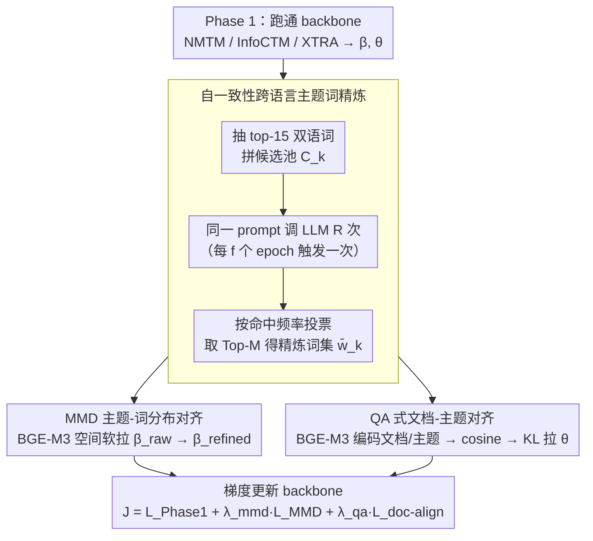

# LLM-XTM: Enhancing Cross-Lingual Topic Models with Large Language Models

**会议**: ACL 2026  
**arXiv**: [2605.03299](https://arxiv.org/abs/2605.03299)  
**代码**: https://github.com/tienphat140205/LLM-XTM (有)  
**领域**: 多语言 / 主题模型  
**关键词**: 跨语言主题模型, LLM 精炼, 自一致性, MMD 对齐, QA 式文档对齐

## 一句话总结
在已训练好的跨语言主题模型外面套一层"LLM 精炼 + 自一致性投票 + MMD 词分布对齐 + QA 式文档语义对齐"的两段式增强模块，可作为插件挂到 NMTM / InfoCTM / XTRA 等多种 backbone 上，在 EC News、Amazon Review、Rakuten Amazon 三个双语语料上把 CNPMI 涨了 9%–51%、TQ 涨了 6%–44%，同时把 LLM 调用次数降到了"每隔 $f$ 个 epoch 才一次"。

## 研究背景与动机

**领域现状**：跨语言主题模型 (Cross-Lingual Topic Modeling, CLTM) 的目标是在多语言语料里挖出"语义对应"的主题对——同一主题在英文/中文/日文里都对应一组语义一致的高频词。主流做法（MCTA、MTAnchor、NMTM、InfoCTM、XTRA 等）几乎都依赖外部双语资源：平行语料、种子词典、bilingual embeddings、或锚词。

**现有痛点**：双语词典覆盖率低、平行语料里掺着误译/领域漂移/词义歧义，导致"名义上对齐"的主题在语义上会跑偏，论文 Table 1 给了刺眼的例子——InfoCTM 在 EC News 上把英文 `rating/gauge/height/mile/shoe` 跟中文 `投资者/财经/基金/股市/大盘` 配成一对，完全风马牛不相及。

**核心矛盾**：纯靠语料驱动的浅层信号没法刻画跨语言的深层语义一致性，但 LLM 拥有海量多语预训练带来的深层语义先验。已有 LLM 工作有三类毛病：(1) 把 LLM 输出当 ground-truth、按文档独立调用，忽略全局结构、文档级调用又烧钱；(2) LLM 容易幻觉，输出不稳定；(3) 像 LLM-in-the-Loop 这样的白盒方案要 token 概率，闭源模型 (Gemini/Claude) 直接歇菜。

**本文目标**：在尽量少调 LLM 的前提下，把 LLM 的语义知识同时注入**主题-词分布 $\beta$** 和**文档-主题分布 $\theta$**，且要做到 (a) 黑盒可用、(b) 幻觉鲁棒、(c) 不破坏 backbone 已有的语料驱动信号。

**切入角度**：作者从 SelfCheckGPT 的"自一致性即不确定性度量"思想出发——多次采样 LLM 输出、保留高一致词、丢弃低一致词，等于用投票天然过滤幻觉；同时把"文档分到哪个主题"这件事重新解释成"document 是 question、refined topic word set 是 answer 候选"，用多语 encoder (BGE-M3) 算 cosine 相似度做 QA 式匹配。

**核心 idea**：把 LLM 精炼包装成一个"周期性、自一致投票"的黑盒过程，输出用 MMD 跟原 $\beta$ 对齐 + 用 KL 把 $\theta$ 拉向 BGE-M3 算出的语义目标 $\hat{\theta}$，让 backbone 在不动其原始 loss 的情况下被"软引导"到更连贯、更跨语言对齐的解上。

## 方法详解

### 整体框架
LLM-XTM 是个 **两阶段后处理增强**：
- **Phase 1**：跑现成的 VAE-based CLTM backbone（NMTM / InfoCTM / XTRA），照搬其原始 loss $\mathcal{L}_{\text{Phase 1}}$ 训到收敛，得到 $\beta^{(\ell)}$ 和 $\theta_d$。
- **Phase 2**：在收敛模型上再训 30 个 epoch，每隔 $f$ 个 epoch 触发一次 LLM 精炼，把精炼结果转成两个外部 loss 注入 backbone：

总目标是 $\mathcal{J}(\phi, \psi) = \mathcal{L}_{\text{Phase 1}} + \lambda_{\text{mmd}} \mathcal{L}_{\text{MMD}} + \lambda_{\text{qa}} \mathcal{L}_{\text{doc-align}}$。一个 epoch 内的流程是：抽 top-15 双语词 → 调 LLM 投票得 $\bar{w}_k$ → 算 $\mathcal{L}_{\text{MMD}}$ → BGE-M3 编码文档/主题 → 算 KL 形式的 $\mathcal{L}_{\text{doc-align}}$ → 梯度更新 backbone。整个 LLM 模块对 backbone 完全是黑盒，不要求 token 概率，所以 Gemini API 直接可用。

### 关键设计

**1. 自一致性跨语言主题词精炼：用多次投票把 LLM 的幻觉过滤掉**

单次调用 LLM 来"清洗"主题词有个致命问题——输出会抖动，这次保留的词下次可能就被换掉，把这种不稳定的结果直接当监督信号会把幻觉灌进 backbone。作者的做法是把 backbone 给的 top-15 英文词和 top-15 中文词拼成候选池 $C_k = w_k^{(\text{en})} \cup w_k^{(\text{zh})}$，让 LLM 删噪声、补缺失、保留共同主题词，但关键是同一个 prompt 重复跑 $R$ 次得到 $\tilde{w}_k^{(1)}, \dots, \tilde{w}_k^{(R)}$，再统计每个词的命中频率 $f_k(v) = \frac{1}{R}\sum_{r=1}^R \mathbf{1}\{v \in \tilde{w}_k^{(r)}\}$，取 Top-$M$ 高频词作为最终精炼集 $\bar{w}_k$。这一步借的是 SelfCheckGPT 的判断——"同一问题多次采样的一致性"本身就是幻觉的强信号：一致性高的词大概率是真核心，一致性低的多半是 LLM 现编。于是在拿不到 logits 的黑盒 setting 下，投票一致性等效替代了 LLM-ITL 那种 token-prob 不确定性估计。为了控成本，作者还加了"精炼频率"超参 $f$：每 $f$ 个 epoch 才调一次 LLM 而非每 step，直接把调用量砍掉一个数量级。

**2. MMD 主题-词分布对齐：把 backbone 软拉向 LLM，但不让它彻底塌过去**

精炼出 $\bar{w}_k$ 之后还要把它注回 backbone 的 $\beta$，难点是既要让 backbone 的原始分布 $\beta_k^{(\text{raw})}$ 靠近 LLM 给的目标 $\beta_k^{(\text{refined})}$，又不能让它完全塌到 LLM 那边、丢掉语料驱动的 reconstruction 信号。作者对每个主题 $k$ 构造两组分布——raw 来自 decoder 输出的 top-$N$ 词概率、refined 来自 $R$ 轮投票计数，两者都做语言平衡 + 归一化，然后在 BGE-M3 词嵌入空间用 Gaussian 核（核宽取 median heuristic）算平方 MMD：

$$\mathcal{L}_{\text{MMD}} = \frac{1}{K}\sum_{k=1}^{K} \text{MMD}^2(\beta_k^{\text{(raw)}}, \beta_k^{\text{(refined)}}).$$

核作用在 cosine 距离上，等于在 RKHS 里把两组分布拉近，而不是逼模型做 one-hot 硬匹配。这恰好是它比 OT 更优的原因：核方法天然把"同义词替换"（如英文 song↔album）也算成匹配，而 OT 的 transport plan 对词 identity 更敏感、惩罚更重——实验里 MMD 的 CNPMI 0.016 直接压过 OT 的 0.013。换句话说 MMD 提供的是"分布软对齐"，比硬替换温和，不会把 backbone 已经学到的语料信号一把覆盖掉。

**3. QA 式文档-主题对齐：把"文档归到哪个主题"重写成"问题检索答案"**

主题词对齐好了，文档-主题分布 $\theta_d$ 仍可能跑偏——同一语义的英文和中文文档本该有相近的 $\theta_d$，但 BoW 在跨语言下根本不可比（英文 "investment" 和中文 "投资" 是两个完全独立的维度）。作者的破局点是换个空间来比：把文档当成 question、把 refined 主题当成 candidate answer，用多语 sentence encoder BGE-M3 把文档编码成 $h_d$、把 $\bar{w}_k$ 编码成主题向量 $t_k = \text{Enc}(\bar{w}_k)$，算 cosine 相似度 $s_{d,k} = \frac{h_d^\top t_k}{\|h_d\|_2 \|t_k\|_2}$，再用带温度 $\tau$ 的 softmax 得到目标分布 $\hat{\theta}_{d,k} = \frac{\exp(s_{d,k}/\tau)}{\sum_j \exp(s_{d,j}/\tau)}$，最后用 KL 把 backbone 的 $\theta_d$ 拉过去：$\mathcal{L}_{\text{doc-align}} = \sum_{d=1}^D \text{KL}(\theta_d \| \hat{\theta}_d)$。妙处在于 BGE-M3 在多语 embedding 空间里能让 "investment" 和 "投资" 距离很近，于是它充当了跨语言桥梁，把"语义相似度"变成 $\theta$ 的外部监督，强迫 backbone 学出跨语言一致的文档表示。这是全文最有原创性的一招——把 IR 里 QA retrieval 的范式直接搬到了主题模型的分布对齐上，也是消融里贡献最大的组件（去掉它 CNPMI 直接掉回 backbone 水平）。

### 一个完整示例：一次精炼 epoch 怎么修好 Music 主题

拿 NMTM 在一个含乐评的双语语料上训到第 $f$ 个 epoch 触发精炼为例。backbone 给的 Music 主题候选池里，中文侧混进了 `嫁`、`誓言`、`挚爱` 这种 romantic 误标词，英文侧是 `vocals`、`lyrics`、`album`：

- **投票精炼**：同一 prompt 跑 $R=5$ 次，`音乐`/`专辑`/`歌手` 几乎每次都被 LLM 保留（$f_k(v)$ 接近 1），而 `嫁`/`挚爱` 只在个别采样里出现（$f_k(v)$ 很低），取 Top-$M$ 后被自然淘汰，得到干净的 $\bar{w}_k$。
- **MMD 对齐**：把这组 refined 分布和 backbone 的 raw 分布在 BGE-M3 空间算 MMD，梯度把 $\beta_{\text{Music}}$ 往"音乐/专辑/歌手"方向软推，但因为是核空间软对齐，`song`↔`album` 这类同义波动不会被惩罚。
- **QA 对齐**：一篇中文乐评文档编码成 $h_d$，跟修好的 Music 主题向量 $t_k$ cosine 相似度最高，softmax 后 $\hat{\theta}_{d,k}$ 在 Music 维度上给出高目标值，KL 把它的 $\theta_d$ 拉过去；对应的英文乐评文档同理被拉到同一主题，于是中英文档在 $\theta$ 上自动对齐。

跑完这一个 epoch，Music 主题就从"音乐混 romantic"清洗成中英语义一致的干净主题，对齐到英文 `vocals/lyrics/album`——这正是 Table 4 里肉眼可见的那次修正。

### 损失函数 / 训练策略
Phase 2 总目标 $\mathcal{J} = \mathcal{L}_{\text{Phase 1}} + \lambda_{\text{mmd}} \mathcal{L}_{\text{MMD}} + \lambda_{\text{qa}} \mathcal{L}_{\text{doc-align}}$，实验中 $\lambda_{\text{mmd}} = 20{,}000$、$\lambda_{\text{qa}} \in \{100, 200, 300\}$、$f \in \{8, 10\}$、$R = 5$。LLM 端调用 Gemini API（也可换 Llama-3.3-70B / Qwen3 等），整个 Phase 2 在单卡 NVIDIA P100 上 30 epoch 完成。

## 实验关键数据

### 主实验
在 EC News (EN-ZH 新闻)、Amazon Review (EN-ZH 商品评论)、Rakuten Amazon (JA-EN 商品评论) 三个公开 CLTM benchmark 上，以 CNPMI（跨语言主题连贯度）、TU（主题独特性）、TQ = max(0, CNPMI) × TU 作为指标，把 LLM-XTM 当插件挂到 3 个 backbone 上：

| Backbone | 数据集 | CNPMI (base→+LLM-XTM) | TQ 提升 | 备注 |
|----------|--------|----------------------|---------|------|
| XTRA | EC News | 0.078 → 0.088 | +10.5% | TU 微降 2.5% |
| XTRA | Amazon Review | 0.053 → 0.072 | +32.7% | CNPMI +35.8% |
| InfoCTM | EC News | 0.041 → 0.062 | +43.6% | CNPMI +51.2% |
| InfoCTM | Amazon Review | 0.037 → 0.050 | +38.2% | TU 反而 +0.3% |
| NMTM | Amazon Review | 0.043 → 0.056 | +34.6% | CNPMI +30.2% |
| NMTM | Rakuten Amazon | 0.012 → 0.016 | +37.5% | CNPMI +33.3% |

跨 3 个 backbone × 3 个数据集 9 个组合里，CNPMI 一致正向、TU 波动不超过 ±5%，证明 LLM-XTM 是**通用增强层**而不是某个 backbone 的特调。在长文档 benchmark Airiti Thesis (英中学术摘要) 上，XTRA + LLM-XTM 的 TQ 涨了 +121.3%、InfoCTM + LLM-XTM 涨了 +61.3%，泛化到长文本也成立。文档分类下游任务上 (Table 5)，cross-lingual accuracy (-C) 在 Rakuten Amazon 上从 0.734 → 0.788 (InfoCTM)、0.682 → 0.728 (NMTM)，intra-lingual 几乎没掉，证明对齐不是"牺牲单语换跨语"。

### 消融实验
在 NMTM backbone + Rakuten Amazon (50 topics) 上拆解每个组件：

| 配置 | CNPMI | TU | EN-C | JA-C | 说明 |
|------|-------|-----|------|------|------|
| NMTM (base) | 0.012 | 0.633 | 0.610 | 0.681 | Backbone |
| Full LLM-XTM | 0.016 | 0.666 | 0.621 | 0.728 | 全部组件 |
| w/o $\mathcal{L}_{\text{doc-align}}$ | 0.012 | 0.679 | 0.611 | 0.723 | CNPMI 掉回 base，跨语对齐崩 |
| w/o $\mathcal{L}_{\text{MMD}}$ | 0.012 | 0.641 | 0.621 | 0.723 | TU 掉 0.025，主题-词连贯度受损 |
| w/o self-consistency | 0.011 | 0.654 | 0.619 | 0.720 | CNPMI 跌破 base，LLM 幻觉直接污染 |
| MMD → OT | 0.013 | 0.664 | 0.620 | 0.720 | OT 比 MMD 差 18.7% CNPMI |

### 关键发现
- **$\mathcal{L}_{\text{doc-align}}$ 是跨语言对齐的核心**：去掉它 CNPMI 直接掉回 backbone 水平，说明仅靠主题词对齐不足以约束文档级语义一致——QA 式机制贡献最大。
- **自一致性不可省**：去掉投票 CNPMI 反而比 base 还低 (0.011 < 0.012)，单次 LLM 输出的幻觉会**反噬** backbone，证明黑盒 setting 下"多次采样取共识"是刚需。
- **MMD > OT**：在多语 embedding 空间里核方法对同义词替换更宽容，OT 把 transport plan 算得太严反而丢分。
- **超参数敏感性 (Sec 4.6)**：精炼轮数 $R \in [5, 7]$ 是甜点 ($R=5$ 比 $R=1$ CNPMI 涨 16.6%，再加到 $R=13$ 只多涨 1.4%，但成本翻倍)；精炼频率 $f$ 越小 (调用越频) CNPMI 越高但 TU 下降——存在 coherence/diversity trade-off，作者推荐 $R=5, f=8$。
- **质性分析**：Table 4 的对比里，LLM-XTM 能把 NMTM 在 Music topic 错混进来的 `嫁/誓言/挚爱` 这种"romantic"误标修成 `音乐/专辑/歌手`，对齐到英文 `vocals/lyrics/album`，肉眼可见的语义清洗。

## 亮点与洞察
- **"周期性 + 自一致投票"双管齐下控成本和幻觉**：每 $f$ epoch 调一次 + 每次调 $R$ 轮投票，让 LLM 从"每文档独立 oracle"降级成"周期性专家咨询"。在不要求 token 概率的黑盒 setting 下，仅靠"采样一致性"就替代了 LLM-ITL 的白盒不确定性估计，这是该工作能 plug-and-play 接 Gemini 等闭源模型的关键。
- **MMD 而不是 KL/OT 做 $\beta$ 对齐**：在词 embedding 空间用 Gaussian 核 MMD，能识别"同义词替换"为可接受的扰动，不会把 backbone 的 reconstruction 信号强行覆盖，做到"软引导"。换成 OT 立刻掉点，说明对齐目标的"松紧度"选型至关重要。
- **QA 范式重构 $\theta$ 对齐**：把"文档归类到哪个主题"重写成"question 检索 answer"，让多语 sentence encoder (BGE-M3) 自动承担跨语言桥梁角色，避开 BoW 跨语言不可比的死结。这个 trick 可以迁移到任何需要把生成模型的隐变量对齐到外部语义空间的场景，比如跨语言文档聚类、跨模态主题挖掘。
- **真·插件**：3 个 backbone × 3 数据集 9 个组合一致涨点，说明这种"后处理增强"范式可能比"重新设计 backbone"更经济——直接复用社区现成模型 + 一个外挂 LLM 模块，研究成本极低。

## 局限与展望
- **天花板由 backbone 决定**：作者明确承认 LLM-XTM "能精炼、但不能从一个完全失败的初始化里凭空创造合理主题"，对垃圾 backbone 救不了——这意味着它本质是"refinement"而非"replacement"。
- **多次 LLM API 调用的延迟和成本**：虽然引入 $f$ 控制了频率，但 $R=5$ 的投票仍要 5 次 API call × $K$ 个 topic × $N/f$ 个 refinement epoch，大语料/大 $K$ 场景下还是会贵；实时/资源受限场景不适用。
- **只在英-中、英-日两对语言验证**：低资源语言对（如中文-斯瓦希里语）BGE-M3 的多语对齐质量直接决定 $\mathcal{L}_{\text{doc-align}}$ 的有效性，泛化到 typologically distant 语言对的效果未知。
- **依赖 BGE-M3 一种 encoder**：QA 式对齐对 encoder 质量极度敏感，没做不同 encoder 的对比实验；未来可以用 embedding distillation (作者引用了 Truong et al. 2025) 把 BGE-M3 蒸到更小的 encoder 上降本。
- **没考虑动态 $\bar{w}_k$ 缓存**：相邻 epoch 的精炼输出大概率高度相似，但作者每次都重新调用 LLM 全量精炼，理论上可以做增量缓存进一步省钱。

## 相关工作与启发
- **vs LLM-ITL (Yang et al. 2025b)**: 都把 LLM 嵌入主题模型训练循环，但 LLM-ITL 要 token 概率做不确定性估计 (白盒)、LLM-XTM 用多次采样投票做不确定性 (黑盒)，后者更通用且支持闭源 API。
- **vs TopicGPT (Pham et al. 2024a) / 文档级 LLM topic modeling**: 这类方法把 LLM 当 ground-truth 按文档独立调用，成本不可扩展且无全局结构；LLM-XTM 只在 topic level 调 LLM，调用次数 = $K$ × refinement epochs，跟语料大小解耦。
- **vs XTRA (Nguyen et al. 2025b)**: XTRA 用对比学习在 $\theta$ 和 $\beta$ 两个空间做双对齐，是当前最强 backbone；LLM-XTM 不是要取代它，而是叠在它头上再涨 +10.5% TQ，说明对比学习捕获的对齐 + LLM 语义先验是**互补**的。
- **vs SelfCheckGPT (Manakul et al. 2023)**: 直接借用了"自一致性即幻觉检测信号"的思路，但 SelfCheckGPT 用于评估单次 LLM 输出的可靠性，LLM-XTM 把它从"评估"升级成"训练信号"——用 voting frequency 直接构造 supervision distribution，这是该工作对自一致性范式的扩展。
- **启发**：MMD + QA 范式可推广到"用 LLM 后处理优化任意生成模型的某个隐分布"——比如用 LLM 精炼推荐系统的 item embedding、用多语 encoder 做跨模态对齐 (image topic ↔ text topic) 等。

## 评分
- 新颖性: ⭐⭐⭐⭐ 自一致性投票 + MMD + QA 三个 trick 单独不算原创，但组合成黑盒可用的 plug-in 范式确实新；QA 式 $\theta$ 对齐是真正的创新点。
- 实验充分度: ⭐⭐⭐⭐ 3 个 backbone × 3 个数据集 + 长文档泛化 + 下游分类 + 4 个组件消融 + 2 个超参敏感性 + LLM 评估，密度很高；唯一遗憾是只在英-中/英-日上验证。
- 写作质量: ⭐⭐⭐⭐ Method 写得清楚，公式齐全，Table 1 / Table 4 的对比例子很有说服力；Phase 1 / Phase 2 的拆分让方法易于复用。
- 价值: ⭐⭐⭐⭐ 给跨语言主题模型社区提供了一个"无脑加 +10–50% CNPMI"的插件，工程上立即可用；范式 (黑盒 LLM + 自一致 + MMD + QA 对齐) 可迁移到其他对齐任务。

<!-- RELATED:START -->

## 相关论文

- [\[ACL 2026\] Efficient Training for Cross-lingual Speech Language Models](efficient_training_for_cross-lingual_speech_language_models.md)
- [\[ACL 2026\] LaoBench: A Large-Scale Multidimensional Lao Benchmark for Large Language Models](laobench_a_large-scale_multidimensional_lao_benchmark_for_large_language_models.md)
- [\[ACL 2026\] Evaluating Robustness of Large Language Models Against Multilingual Typographical Errors](evaluating_robustness_of_large_language_models_against_multilingual_typographica.md)
- [\[ACL 2025\] Cross-Lingual Optimization for Language Transfer in Large Language Models](../../ACL2025/multilingual_mt/cross-lingual_optimization_for_language_transfer_in_large_language_models.md)
- [\[ACL 2026\] Language Models Entangle Language and Culture](language_models_entangle_language_and_culture.md)

<!-- RELATED:END -->
