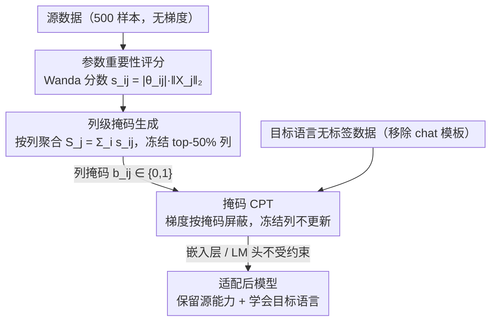

# Mitigating Catastrophic Forgetting in Target Language Adaptation of LLMs via Source-Shielded Updates

**会议**: ACL 2026  
**arXiv**: [2512.04844](https://arxiv.org/abs/2512.04844)  
**代码**: [GitHub](https://github.com/gucci-j/ssu)  
**领域**: LLM评测  
**关键词**: 灾难性遗忘, 语言适配, 选择性参数更新, 列级冻结, 源知识保护

## 一句话总结
提出 Source-Shielded Updates (SSU)，一种基于源数据驱动参数重要性评分的列级冻结策略，在仅使用无标签目标语言数据进行持续预训练时，将源语言性能退化从全量微调的 20.3% 降低至 3.4%，同时保持与全量微调相当甚至更优的目标语言性能。

## 研究背景与动机

**领域现状**：扩展 LLM 的语言覆盖对全球可及性至关重要。标准做法是在目标语言数据上进行持续预训练（CPT），但这往往导致灾难性遗忘，尤其损害指令遵循模型的核心聊天和安全能力。

**现有痛点**：(1) 低资源语言缺乏指令微调数据，机器翻译数据效果不稳定，因此只能使用无标签文本进行适配；(2) 全量微调在 7B 模型上导致源语言性能平均下降 20.3%，13B 下降 22.3%；(3) 后处理方法（如模型合并、任务向量）大多无法有效缓解遗忘问题。

**核心矛盾**：无标签原始文本缺少 chat 模板，与指令遵循模型的训练格式不兼容。现有基于目标数据信号的选择性更新方法会根据这种不兼容格式优化，反而可能破坏模型的基础能力。

**本文目标**：在 CPT 阶段主动保护源知识，使模型既学会目标语言又保留原有的指令遵循、聊天和安全能力。

**切入角度**：从源数据出发而非目标数据出发——先识别对源知识关键的参数，在 CPT 之前冻结它们，从根源上阻止遗忘。

**核心 idea**：用少量源数据（500 样本）计算参数重要性分数，按列聚合后冻结最重要的 50% 列，保证完整的特征变换通路不被破坏。

## 方法详解

### 整体框架
SSU 分三个阶段：(1) 用源数据和 Wanda 评分方法计算每个参数的重要性分数；(2) 按列聚合分数并生成列级冻结掩码；(3) 在目标语言无标签数据上进行 CPT，梯度更新时应用掩码冻结关键列。

### 关键设计

**1. 参数重要性评分（Parameter Importance Scoring）：从源数据出发找出"动不得"的权重**

现有选择性更新方法大多盯着目标数据的信号，可无标签原始文本根本没有 chat 模板，按这种不兼容的格式去优化反而会破坏模型的基础能力。SSU 反其道而行，直接从源数据出发判断哪些参数对维持源语言能力最关键。它借用 Wanda 剪枝的重要性分数 $s_{ij} = |\theta_{ij}| \cdot \|X_j\|_2$，即权重绝对值乘以对应输入激活的 L2 范数，只需 500 条源数据样本就能算出，全程不涉及梯度计算。同时结合权重大小和激活频率两个信号，比单看权重更可靠——消融里 SSU-Mag 仅用权重大小时性能就明显下滑，说明激活这一路信息不能丢。

**2. 列级掩码生成（Column-wise Masking）：冻整列而非冻散点，保住完整的特征变换通路**

逐元素地冻结关键参数听起来更精细，实际却会把特征变换的通路打散，反而引发灾难性遗忘。SSU 的做法是把逐元素分数沿列聚合：对权重矩阵 $\theta \in \mathbb{R}^{d_{out} \times d_{in}}$ 的每列 $j$ 求和得到 $S_j = \sum_i s_{ij}$，按 $S_j$ 排序后冻结 top-$k$%（默认 50%）的列，冻结列掩码置 0、其余置 1。冻整列意味着对应的输出维度完全不被改写，就像建筑翻新时保留承重柱——结构完整地留住，源知识才不会塌。实验也证实了结构化冻结与逐元素冻结之间差距巨大。

**3. 掩码 CPT（Masked Continual Pre-training）：在标准持续预训练里挂一层静态掩码**

有了掩码之后，训练本身仍是标准的因果语言建模，只在反向传播时按掩码屏蔽梯度：

$$\theta_{ij} \leftarrow \theta_{ij} - \eta \cdot b_{ij} \cdot \nabla_{\theta_{ij}} L$$

其中 $b_{ij} \in \{0, 1\}$ 是掩码值，被冻结的列梯度直接清零；嵌入层和 LM 头则不受掩码约束、全部更新，保证目标语言的新词表征能正常学到。这层掩码是静态的，不必在训练中动态重算，开销几乎可忽略，还能与正则化、回放等其他缓解手段正交叠加。

### 损失函数 / 训练策略
使用标准因果语言建模损失在 200M tokens 的目标语言数据上训练。训练前移除 chat 模板以支持无标签数据。

## 实验关键数据

### 主实验（7B 模型，源语言指标平均）

| 方法 | IFEval | AlpacaEval2 | MT-Bench | GSM8K | 安全性 | 源退化(%) |
|------|--------|-------------|----------|-------|--------|-----------|
| Source | 0.675 | 32.6 | 3.98 | 0.796 | 0.851 | 0.0 |
| FFT | 0.456 | 10.4 | 3.48 | 0.608 | 0.797 | -20.3 |
| HFT | 0.621 | 17.6 | 3.83 | 0.677 | 0.826 | -8.0 |
| **SSU** | **0.669** | **27.0** | **3.96** | **0.752** | **0.850** | **-3.4** |

### 消融实验

| 配置 | IFEval | 说明 |
|------|--------|------|
| SSU-Wanda | 0.669 | 完整方法（源数据+Wanda评分+列级冻结） |
| SSU-Rand | 0.608 | 随机列冻结，无源数据引导 |
| SSU-Mag | 0.570 | 仅用权重大小评分，缺少激活信号 |
| 逐元素冻结 | ~0.45 | 破坏特征变换，性能崩溃 |

### 关键发现
- SSU 在所有核心指令遵循和安全任务上一致超越所有基线，是唯一在源语言保持和目标语言提升上同时表现优秀的方法
- 目标语言性能方面，SSU 在 7B 上所有基准均优于 FFT，13B 上大部分基准优于 FFT
- 列级冻结 vs 逐元素冻结的差异巨大，验证了结构化保护的重要性
- SSU 避免了 HFT 等方法出现的语言混码（code-mixing）问题

## 亮点与洞察
- "源聚焦"而非"目标聚焦"的参数选择范式是核心洞察——保护已有知识比选择要更新什么更重要
- 列级冻结的类比非常形象："建筑翻新中保留承重柱"——保护完整的特征通路而非孤立的参数点
- 仅需 500 条源数据即可完成重要性评分，开销极小，实用性强

## 局限与展望
- 当前仅在 OLMo 2 系列验证，更多架构仍需进一步验证
- 固定 50% 冻结比例可能不是所有语言的最优选择，自适应冻结比例值得探索
- 未探索与 LoRA 等参数高效方法的组合

## 相关工作与启发
- **vs HFT**: HFT 随机冻结子层组件，缺乏原则性保护；SSU 源数据驱动评分精确定位关键参数
- **vs GMT**: GMT 基于目标数据梯度动态选择，无标签文本梯度信号不可靠；SSU 源聚焦策略更稳健
- **vs AdaLoRA**: AdaLoRA 保持好但目标提升有限；SSU 平衡了两端

## 评分
- 新颖性: ⭐⭐⭐⭐ 源聚焦的列级冻结策略新颖且有理论支撑
- 实验充分度: ⭐⭐⭐⭐⭐ 5种语言、2种模型规模、多维度评估
- 写作质量: ⭐⭐⭐⭐⭐ 逻辑清晰、动机推导严密
- 价值: ⭐⭐⭐⭐⭐ 直接解决低资源语言适配的核心痛点

<!-- RELATED:START -->

## 相关论文

- [\[ACL 2026\] Efficient Low-Resource Language Adaptation via Multi-Source Dynamic Logit Fusion](efficient_low-resource_language_adaptation_via_multi-source_dynamic_logit_fusion.md)
- [\[ACL 2025\] Registering Source Tokens to Target Language Spaces in Multilingual Neural Machine Translation](../../ACL2025/multilingual_mt/registering_source_tokens_to_target_language_spaces_in_multilingual_neural_machi.md)
- [\[ACL 2026\] Exploring Two-Phase Continual Instruction Fine-tuning for Multilingual Adaptation in Large Language Models](exploring_continual_fine-tuning_for_enhancing_language_ability_in_large_language.md)
- [\[ICML 2026\] Toward Robust Multilingual Adaptation of LLMs for Low-Resource Languages](../../ICML2026/multilingual_mt/toward_robust_multilingual_adaptation_of_llms_for_low-resource_languages.md)
- [\[ACL 2026\] TLPO: Token-Level Policy Optimization for Mitigating Language Confusion in Large Language Models](tlpo_token-level_policy_optimization_for_mitigating_language_confusion_in_large_.md)

<!-- RELATED:END -->
