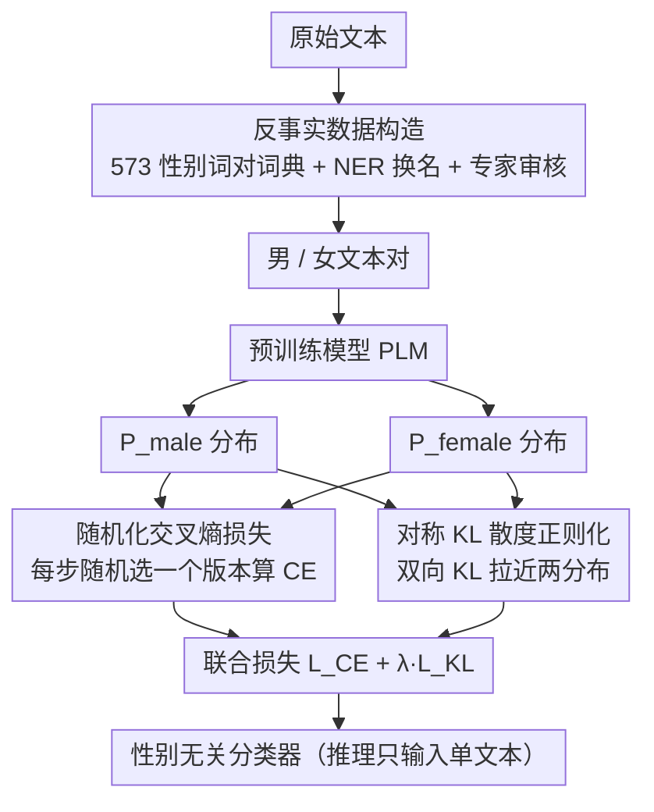

# Mitigating Extrinsic Gender Bias for Bangla Classification Tasks

**会议**: ACL 2026 Findings  
**arXiv**: [2411.10636](https://arxiv.org/abs/2411.10636)  
**代码**: [GitHub](https://github.com/sajib-kumar/Mitigating-Bangla-Extrinsic-Gender-Bias)  
**领域**: 多语言/公平性  
**关键词**: 性别偏见缓解、孟加拉语NLP、KL散度正则化、反事实数据增强、分类公平性

## 一句话总结
针对孟加拉语预训练模型在下游分类任务中的外在性别偏见，提出 RandSymKL 方法，通过随机化交叉熵损失和对称 KL 散度联合优化，在保持分类准确率的同时有效缩小性别间预测差异。

## 研究背景与动机

**领域现状**：大模型虽然能力强，但在孟加拉语等低资源语言中部署成本过高，因此实际应用中更多使用 BERT、ELECTRA 等任务特定的预训练语言模型（PLM）进行情感分析、仇恨言论检测等分类任务。

**现有痛点**：这些 PLM 对男性相关和女性相关文本会产生不一致的预测结果——即"外在性别偏见"（extrinsic gender bias）。例如，一个仇恨言论检测模型可能将女性中心的句子正确分类为"辱骂"，却将语义完全等价的男性中心句子误判为"正常"。

**核心矛盾**：现有的偏见研究主要聚焦在英语和内在偏见（模型嵌入层面），对孟加拉语的外在偏见（下游任务预测层面）几乎没有系统性研究。此外，孟加拉语的性别编码方式更加隐式（通过社会角色、亲属称谓、人名体现），模型更难处理反事实替换后的语义一致性。

**本文目标**：(1) 构建孟加拉语性别偏见评估基准；(2) 提出一种通用的去偏训练策略，在保持分类性能的同时降低性别间预测差异。

**切入角度**：作者观察到，如果在训练时随机选择男性或女性版本计算交叉熵损失，同时用对称 KL 散度拉近两个版本的输出分布，模型可以学到性别无关的分类表征。

**核心 idea**：用随机化交叉熵 + 对称 KL 散度联合优化（RandSymKL），在输出分布层面对齐性别变体的预测，无需依赖 token 级别的性别标记。

## 方法详解

### 整体框架
训练时同时输入男性中心文本和对应的女性中心文本，分别获得输出概率分布 $P_{\text{male}}$ 和 $P_{\text{female}}$，然后通过联合损失函数同时优化分类准确率和分布对齐。推理时只需输入单个文本，无需生成性别对。

### 关键设计

**1. 反事实数据构造：用语言学词典造出语义等价、性别相反的文本对**

孟加拉语没有语法性别，性别信息藏在社会角色、亲属称谓和人名里，简单的逐词替换既覆盖不全，又会被一词多义和拼写变体绊倒——比如 dada 既能指"哥哥"也能指"爷爷"。为此作者构建了一个包含 573 个性别词对的孟加拉语词典（如"儿子/女儿""哥哥/姐姐"），再结合 NER 替换文本中的人名，最后经语言学专家人工审核确保替换后的句子语义一致。这样得到的男/女文本对既用于偏见评估，也作为训练时的成对输入，构成整个去偏流程的数据基础。

**2. 随机化交叉熵损失：每步随机挑一个性别版本算 CE，避免模型偏向某一性别的表达分布**

如果训练时总是固定用男性版本的 logits 计算交叉熵，模型会隐式地把男性文本的分布当成"默认"，从而对女性文本产生系统性偏差。这里的做法是每个训练步随机在男性版本 $\mathbf{z}_1$ 和女性版本 $\mathbf{z}_2$ 之间二选一来算标准交叉熵，而不是钉死某一个版本。随机化把"哪个性别参与监督"变成了无偏的事件，模型也就学不到对单一性别的偏好。

**3. 对称 KL 散度正则化：显式把两个性别版本的预测分布往一起拉**

光靠随机化只能让监督信号无偏，却不能保证模型对同一句话的男女版本给出一致预测。于是作者在损失里加一项对称 KL，惩罚两个方向上的分布不对称：

$$\mathcal{L}_{\text{KL}} = \text{KL}(P_{\text{male}} \| P_{\text{female}}) + \text{KL}(P_{\text{female}} \| P_{\text{male}})$$

之所以用双向求和而非单向 KL，是因为单向 KL 本身不对称、会偏袒被当作参考的那一侧；对称形式确保模型不向任何一个性别方向倾斜，在输出概率层面把性别变体真正对齐。

### 损失函数 / 训练策略
总损失为 $\mathcal{L}_{\text{total}} = \mathcal{L}_{\text{CE}} + \lambda \cdot \mathcal{L}_{\text{KL}}$，其中 $\lambda$ 控制去偏强度。训练使用 batch size 4，学习率 $1 \times 10^{-4}$，Adam 优化器，15 个 epoch 后根据验证集调整 dropout 再微调 3-5 个 epoch。

## 实验关键数据

### 主实验

| 任务 | 方法 | 平均准确率 | 准确率差距(AG) | FairScore |
|------|------|-----------|---------------|-----------|
| 全部4任务 | OSI (未微调) | 56.17% | 3.39% | 22.06% |
| 全部4任务 | FOD (仅微调) | 91.10% | 2.50% | 5.97% |
| 全部4任务 | Token Masking | 87.46% | 0.00% | 0.00% |
| 全部4任务 | FOA (数据增强) | 90.46% | 0.32% | 3.16% |
| 全部4任务 | CSD (余弦相似) | 90.58% | 1.10% | 3.31% |
| 全部4任务 | RandSymKL (本文) | 90.66% | **0.29%** | **1.69%** |

### 消融实验

| 配置 | 平均FairScore | 平均AG | 说明 |
|------|-------------|--------|------|
| RandSymKL (完整) | 1.69% | 0.29% | 完整模型 |
| NonRandSymKL_M (不随机化) | 2.31% | 0.52% | 去掉随机化，CE只用男性版本 |
| AvgSymKL_MF (平均logits) | 2.30% | 0.33% | 用平均logits替代随机选择 |
| Token Masking | 0.00% | 0.00% | 完全去偏但准确率降3% |

### 关键发现
- RandSymKL 在排除 Token Masking 的情况下，FairScore 最低（1.69%），比最强基线 AvgSymKL_MF 低 0.61 个百分点，且整体统计显著（$p = 0.012$）
- Token Masking 虽然可以完全消除偏见（FairScore = 0），但准确率代价过大（87.46% vs 90.66%）
- 随机化是关键——去掉随机化（NonRandSymKL_M）后 FairScore 从 1.69% 升至 2.31%
- 在 EOD 和 SPD 等群组公平性指标上，RandSymKL 同样表现最优

## 亮点与洞察
- **随机化+对称KL的组合简洁有效**：不需要修改模型结构或引入额外模型，仅通过训练策略改变即可实现去偏，方法可以直接迁移到其他语言和分类任务
- **573个性别词对词典**：这是孟加拉语性别偏见研究的重要资源，考虑了一词多义和文化特定的性别角色表达
- **输出分布对齐而非嵌入对齐**：相比 CSD 在嵌入空间做余弦相似度约束，RandSymKL 在输出概率层面对齐更直接有效

## 局限与展望
- 仅在4个二分类任务上验证，未涉及多分类、序列标注等更复杂场景
- 孟加拉语的性别编码很大程度依赖上下文（如亲属关系链），当前词典方法可能遗漏部分隐式性别信息
- 实验仅使用 BERT 和 ELECTRA 级别模型，未验证在更大模型上的效果
- 未来可以扩展到其他低资源语言（如印地语、泰米尔语），验证方法的跨语言泛化性

## 相关工作与启发
- **vs CSD (Igbaria & Belinkov 2024)**: CSD 在嵌入空间用余弦相似度对齐，本文在输出概率空间用对称KL对齐，后者更直接且效果更好（FairScore 3.31% vs 1.69%）
- **vs FOA (数据增强)**: FOA 简单翻倍训练数据但效果有限（FairScore 3.16%），本文通过损失函数设计更有效地利用了反事实数据
- **vs Patel & Kisku 2024**: 他们用 KL 散度将预测拉向均匀分布，本文则在性别对之间做对称 KL，更有针对性

## 评分
- 新颖性: ⭐⭐⭐ 方法组件都不新，但组合和应用场景（孟加拉语去偏）有价值
- 实验充分度: ⭐⭐⭐⭐ 4个任务、多个基线、统计显著性检验和消融实验
- 写作质量: ⭐⭐⭐⭐ 问题动机清晰，方法描述详细
- 价值: ⭐⭐⭐ 对低资源语言公平性研究有参考价值，方法可迁移

<!-- RELATED:START -->

## 相关论文

- [\[ACL 2026\] FairQE: Multi-Agent Framework for Mitigating Gender Bias in Translation Quality Estimation](fairqe_multi-agent_framework_for_mitigating_gender_bias_in_translation_quality_e.md)
- [\[ACL 2026\] Enhancing BiGRU with a KAN Block for Legal Document Classification and Summarization](enhancing_bigru_with_a_kan_block_for_legal_document_classification_and_summariza.md)
- [\[ACL 2026\] MORPHOGEN: A Multilingual Benchmark for Evaluating Gender-Aware Morphological Generation](morphogen_a_multilingual_benchmark_for_evaluating_gender-aware_morphological_gen.md)
- [\[ACL 2026\] Mitigating Catastrophic Forgetting in Target Language Adaptation of LLMs via Source-Shielded Updates](mitigating_catastrophic_forgetting_in_target_language_adaptation_of_llms_via_sou.md)
- [\[ACL 2026\] TLPO: Token-Level Policy Optimization for Mitigating Language Confusion in Large Language Models](tlpo_token-level_policy_optimization_for_mitigating_language_confusion_in_large_.md)

<!-- RELATED:END -->
