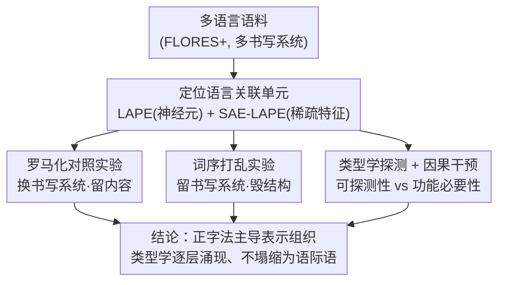

# Multilingual Language Models Encode Script Over Linguistic Structure

**会议**: ACL 2026  
**arXiv**: [2604.05090](https://arxiv.org/abs/2604.05090)  
**代码**: [GitHub](https://github.com/loadthecode0/multilingual-interpretability)  
**领域**: 人类理解 / 多语言可解释性  
**关键词**: 多语言表示, 书写系统, 正字法, 语言关联神经元, 稀疏自编码器

## 一句话总结

本文通过 LAPE 指标和稀疏自编码器系统分析多语言 LM 中的语言关联单元，发现这些单元主要由正字法（书写系统）驱动而非抽象语言结构：罗马化转写激活几乎完全不重叠的神经元集合，词序打乱影响甚微，类型学信息仅在深层逐渐可访问，因果干预表明功能重要性与表面形式不变性相关。

## 研究背景与动机

**领域现状**：多语言语言模型（如 Llama、Gemma）将多种语言的表示压缩到共享参数空间中，但这种内部组织的本质仍不明确——是基于抽象语言身份还是表面形式线索。

**现有痛点**：(1) 已有工作（Tang et al., 2024）通过 LAPE 指标定位了语言关联神经元并证明可以因果操控，但未回答这些神经元到底编码了什么语言属性；(2) "语际语"（interlingua）假说认为多语言模型形成统一的语言无关表示空间，但直接证据不足；(3) 双语认知研究表明理解和产出可共享语义表示但分离表面加工，LM 中是否存在类似现象未知。

**核心矛盾**：语言关联单元的存在已被确认，但其编码的是抽象语言身份还是正字法等表面线索？

**本文目标**：系统性回答四个研究问题：(i) 语言 vs 书写系统——语言关联单元编码什么？(ii) 结构扰动鲁棒性——词序打乱如何影响？(iii) 类型学对齐——与谱系、音韵、句法特征的关系？(iv) 层级组织——这些属性如何随深度变化？

**切入角度**：设计对照实验——罗马化转写（改变书写系统保持内容不变）和词序打乱（改变结构保持表面形式不变）——分离正字法和语言结构的贡献。

**核心 idea**：多语言 LM 围绕表面形式（书写系统）组织表示，语言抽象逐层涌现但永远不会塌缩为统一的语际语。

## 方法详解

### 整体框架

在 Llama-3.2-1B、Llama-3-8B、Gemma-2-2B、Gemma-2-9B 四个模型上，分析跨拉丁、西里尔、天城体、阿拉伯-波斯、表意文字等书写系统的语言。使用 LAPE（Language Activation Probability Entropy）定位原始神经元级别的语言关联单元，使用 SAE-LAPE 在稀疏自编码器的潜在空间中定位语言关联特征。在这套共享的"定位"基础上，通过罗马化实验、词序打乱实验、类型学探测和因果干预四类实验回答研究问题。

### 关键设计

**1. 罗马化对照实验：把"书写系统"和"语言身份"两个变量正交拆开**

如果语言关联单元编码的是抽象的语言身份，那么把同一种语言换个书写系统写出来，它激活的神经元本应基本不变；反之若它们主要锚定正字法，换书写系统就会让整套单元重组。为把这两种可能区分开，作者对 FLORES+ 里的非拉丁语言用 ICU Transliterator 生成罗马化版本（含变音符号与不含变音符号两档），对原始文字和罗马化文字分别用 LAPE 识别语言关联单元，再用 Jaccard 相似度衡量两套单元的重叠度。

结果一边倒地支持"正字法主导"：印地语的原始天城体、含变音符号罗马化、不含变音符号罗马化三种写法，激活的神经元集合几乎完全不相交（Jaccard < 0.1），而且罗马化后的表示既不向原始文字靠拢，也不向英语靠拢，而是落进了一个孤立的"第三子空间"。这说明模型并没有为"印地语"维护一份与写法无关的统一表示，而是为每种书写变体各自开辟了一块容量。

**2. 词序打乱实验：检验语言关联单元到底依不依赖句法结构**

罗马化是"换表面、留内容"，词序打乱则正好相反——"留表面、毁结构"，两者构成一组干净的正交对照。作者对评估语料做词级随机打乱，重新跑 SAE-LAPE 识别语言关联单元，同样用打乱前后的 Jaccard 相似度衡量稳定性。

如果这些单元编码的是句法层面的语言结构，打乱词序本应让它们大幅漂移；但实测大多数语言在打乱后仍保留了大量单元（重叠度 >0.7），其中用独特书写系统的语言（中文、日文、泰文）最稳。强扰动（换书写系统）导致巨变、弱扰动（打乱词序）几乎无影响，这一反差直接坐实了表面形式优先于结构——语言关联单元更多是在记词汇与字符层面的统计规律，而非句法。

**3. 类型学探测 + 因果干预：区分"能被探测到"和"对生成必要"**

表面形式主导不代表深层就没有语言学结构，问题是这种结构存在哪一层、又是否真的被模型用上。作者一方面用线性探针去解码 lang2vec 的类型学特征（谱系、音韵、句法），另一方面用跨语言均值替换做因果干预，把"可探测性"和"功能必要性"分开看。

探测发现，恰恰是那批跨书写系统不变的"重叠"神经元承载了最强的类型学信号，且谱系特征浅层就能解码、音韵特征要到最深层才涌现——说明抽象的语言结构是随深度逐渐变得可访问的。而干预给出了更关键的因果证据：消融书写系统不变的神经元只带来温和的困惑度变化，消融书写系统特异的神经元却导致灾难性退化（PPL 增大到 7.74 倍，并伴随语言切换）。两条线索合起来表明，锚定语言身份和表面实现的是那批书写系统特异单元，而"能被探测到类型学信息"并不等于"该信息对生成是必要的"。

### 损失函数 / 训练策略

本文为分析性工作，无训练。使用预训练的 Top-K SAE（Llama 系列）和 JumpReLU SAE（Gemma 系列），聚焦 MLP 子层激活。

## 实验关键数据

### 主实验

**罗马化后语言关联单元重叠度（Jaccard 相似度，Llama-3.2-1B）**

| 语言 | 原始 vs 罗马化 (原始神经元) | 原始 vs 罗马化 (SAE特征) | 罗马化 vs 英语 |
|------|--------------------------|------------------------|---------------|
| 印地语 | ~0.05 | ~0.02 | ~0.00 |
| 中文 | ~0.05 | ~0.03 | ~0.00 |
| 俄语 | ~0.08 | ~0.04 | ~0.00 |
| 西班牙语 | ~0.40 | ~0.30 | ~0.05 |

**因果干预：跨语言均值替换（Llama-3.2-1B）**

| 语言 | 神经元集合 | PPL ratio (target) | PPL ratio (random) |
|------|----------|-------------------|-------------------|
| English | overlap | 0.95 | 0.99 |
| English | only-native | 1.50 | 0.96 |
| Hindi | overlap | 1.05 | 0.98 |
| Hindi | only-native | 0.31 | 0.97 |

### 消融实验

**词序打乱后单元稳定性（Jaccard 相似度）**

| 语言类型 | 原始神经元重叠度 | SAE特征重叠度 |
|----------|----------------|-------------|
| 独特书写系统（中日泰韩） | >0.70 | >0.70 |
| 拉丁书写系统语言 | ~0.60 | ~0.40-0.60 |
| 西里尔书写系统语言 | ~0.65 | ~0.65 |

### 关键发现

- 罗马化导致语言关联单元几乎完全重组（Jaccard < 0.1），证实正字法是主要驱动因素
- 罗马化后的表示既不与原始书写系统对齐，也不与英语对齐，形成孤立的第三子空间
- 词序打乱仅导致轻微的单元变化，表明语言关联单元依赖词汇统计而非句法结构
- 跨书写系统不变的神经元编码最强的类型学信号；谱系特征浅层可解码，音韵特征深层涌现
- 因果干预中，书写系统特异神经元消融导致灾难性退化（语言切换），而不变神经元消融影响温和
- 上述模式在 1B-9B 规模的 Llama 和 Gemma 模型上一致复现

## 亮点与洞察

- 实验设计极为精巧：罗马化改变表面保持内容，词序打乱改变结构保持表面，两者正交对照干净利落地分离了正字法和语言结构的贡献
- "容量碎片化"概念有深远意义——模型为同一语言的不同书写变体分配独立的内部特征，浪费了表示容量。这对多语言模型的效率优化有直接启示
- 区分"可探测性"和"功能必要性"是重要的方法论贡献——很多可解释性工作止步于探测，本文通过因果干预进一步验证

## 局限与展望

- 分析聚焦 MLP 子层，未覆盖注意力头中的语言关联模式
- 罗马化依赖 ICU Transliterator，某些语言的转写质量可能影响结论
- 仅分析了 4 个模型家族，对其他架构（如 Mistral、Qwen）的适用性未知
- 未探索如何利用发现来改善多语言模型——例如通过显式对齐减少容量碎片化

## 相关工作与启发

- **vs Tang et al. (2024)**: Tang 定位了语言关联神经元但未分析其编码内容；本文从定位扩展到解释，揭示了正字法的主导作用
- **vs Wendler et al. (2024)**: 支持语际语假说的工作强调语义对齐的可实现性；本文指出即使语义对齐可实现，表示空间仍因书写系统而深度碎片化
- **vs Andrylie et al. (2025)**: 在 SAE 层面扩展了 LAPE 分析但未做对照实验；本文通过罗马化和打乱实验提供了因果级别的证据

## 评分

- 新颖性: ⭐⭐⭐⭐⭐ 首次系统性回答"语言关联单元编码什么"，实验设计精巧
- 实验充分度: ⭐⭐⭐⭐⭐ 4个模型 × 多种语言 × 探测+干预+对照，极为全面
- 写作质量: ⭐⭐⭐⭐⭐ 研究问题清晰，逻辑链条紧密，结论有力
- 价值: ⭐⭐⭐⭐ 对多语言模型设计和可解释性研究有重要启示

<!-- RELATED:START -->

## 相关论文

- [\[ACL 2026\] Structure-Guided Entity Resolution: Fine-Tuning LLMs for Robust Name Matching in Complex Linguistic Contexts](structure-guided_entity_resolution_fine-tuning_llms_for_robust_name_matching_in_.md)
- [\[ACL 2025\] LangSAMP: Language-Script Aware Multilingual Pretraining](../../ACL2025/multilingual_mt/langsamp_multilingual_pretraining.md)
- [\[ACL 2026\] Language Models Entangle Language and Culture](language_models_entangle_language_and_culture.md)
- [\[ACL 2026\] Evaluating Robustness of Large Language Models Against Multilingual Typographical Errors](evaluating_robustness_of_large_language_models_against_multilingual_typographica.md)
- [\[ACL 2026\] LLM-XTM: Enhancing Cross-Lingual Topic Models with Large Language Models](llm-xtm_enhancing_cross-lingual_topic_models_with_large_language_models.md)

<!-- RELATED:END -->
