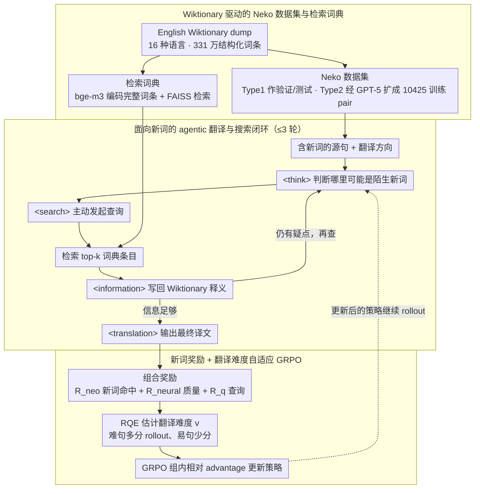

# NeoAMT: Neologism-Aware Agentic Machine Translation with Reinforcement Learning

**会议**: ACL2026  
**arXiv**: [2601.03790](https://arxiv.org/abs/2601.03790)  
**代码**: https://github.com/gpgg/neoamt  
**领域**: 多语言机器翻译 / Agent / 强化学习  
**关键词**: 新词翻译、机器翻译、检索增强、强化学习、Wiktionary  

## 一句话总结
NeoAMT 把新词翻译从单纯依赖模型参数知识的问题，改造成“先推理、再查词典、再翻译”的 agentic MT 问题，并用面向新词命中率、整体译文质量和翻译难度的 GRPO 训练，让 8B 模型在 Neko 新词翻译基准上显著超过 SFT、无检索 RL 和多种通用/翻译专用 LLM。

## 研究背景与动机
**领域现状**：近年来 LLM 机器翻译越来越多地借鉴 reasoning model 和 RL 的训练范式。MT-R1-Zero、DeepTrans、SSR-Zero 等工作主要通过奖励设计，让模型在翻译前进行思考，或用神经评价器、格式奖励、自评奖励来提升整体翻译质量。这样的路线默认模型已经具备足够的语言知识，训练重点在于如何把这些知识调动出来。

**现有痛点**：新词翻译恰好挑战了这个默认前提。网络词、亚文化词、技术词、政治/社群新表达会不断出现，而 LLM 的参数知识在训练完成后基本冻结。源句里出现“给她爱”“长草”“铁胶”这类词时，模型即使会推理，也可能只根据字面含义误译，或把新词当作普通短语处理。论文指出，已有 Neo-bench 虽然包含新词相关任务，但机器翻译子集只有 240 条、语言对单一且不公开，缺少一个能系统训练和评估新词翻译 agent 的数据基础。

**核心矛盾**：新词翻译同时需要两类能力：一是知道新词在当前语境中的真实含义，二是把这个含义自然地融入目标语言句子。只做 SFT 会被小规模训练数据限制，只做 reasoning RL 仍然受限于参数知识，只做普通 RAG 又容易把词典条目塞进 prompt 后干扰指令遵循和译文流畅度。

**本文目标**：作者把任务拆成三个子问题。第一，构造一个覆盖多语言、多方向、带新词定义和例句的新词翻译数据集。第二，构造一个可被翻译 agent 调用的词典检索工具，而不是把检索当作一次性的 prompt augmentation。第三，设计 RL 训练方式，让模型学会在什么时候查、查什么、如何利用检索结果，并在奖励上同时优化新词命中和整体翻译质量。

**切入角度**：本文的观察是，新词翻译更像“遇到陌生术语时查词典”的人工翻译流程，而不是一般问答式 RAG。翻译 agent 不应该被动接收检索结果，而应该先判断句子里哪里可能是新词，再主动发起查询，读回词典信息后修正译文。

**核心 idea**：用 Wiktionary 构建新词数据集和词典检索工具，再用 GRPO 训练一个会交替推理与检索的新词翻译 agent，使模型从“背知识翻译”转向“查证新词后翻译”。

## 方法详解
NeoAMT 的方法可以分成两层：数据与工具层解决“哪里有新词知识”，RL 训练层解决“模型怎样学会使用这些知识”。论文并不是简单把词典内容拼到输入后面，而是让模型输出 `<think>`、`<search>`、`<information>`、`<translation>` 这样一套交互轨迹。模型可以先分析源句，决定查询陌生词或关键词；检索系统返回 Wiktionary 条目；模型继续推理，最后只在 `<translation>` 中给出译文。

### 整体框架
输入是一条包含新词的源语言句子和目标语言方向。系统首先使用统一 prompt 要求模型先在 `<think>` 中推理，必要时用 `<search>` 包住查询词。搜索工具从基于 Wiktionary 清洗记录构建的词典中检索 top-k 条目，并把结果写回 `<information>`。模型可以重复推理和搜索，最多搜索 3 轮，最后在 `<translation>` 标签中输出最终译文。

训练数据来自作者构建的 Neko 数据集。Neko 从 2025-08-23 版本 English Wiktionary dump 中清洗约 1000 万条记录，保留 16 种语言的 3,312,877 条结构化词条，其中 3,606 个词条带有 neologism 标签。作者把词条分成三类：Type 1 是有新词标签、例句和人工翻译的词条；Type 2 是有新词标签和例句但没有翻译的词条；Type 3 是其他词条，包括普通词和没有完整例句的新词词条。

验证集和测试集主要来自 Type 1，因为这些例句翻译经过 Wiktionary 编辑者检查，质量较高。对于 English-to-other-language 方向，由于其他语言 Wiktionary 中可用的新词平行例句很少，作者从 Type 2 中抽取 270 条，提供新词定义后做 reference-free LLM-as-a-judge 评估。训练集则从 Type 2 中抽取 700 条英文例句，用 GPT-5 按新词定义翻译到其他 15 种语言，同时标注目标句中新词对应 span，最终形成 10,425 条训练 pair。

词典检索工具使用同一份 Wiktionary 清洗数据，但角色不同。每个词定义不仅包含 headword，还包含词性、词源、senses/glosses 和可选的跨语言词翻译。作者用 bge-m3 编码完整词条，而不是只编码词面，因为同形词往往需要通过 gloss 和 etymology 才能区分语义。检索后端用 FAISS 做 cosine similarity 搜索，返回的条目被插入到模型轨迹中。

训练阶段以 Qwen3-4B 和 Qwen3-8B 为基座，使用 verl/vLLM 实现 GRPO。NeoAMT 与普通 GRPO 的关键区别在于：它优化的不是单纯“最终译文分数”，而是包含新词命中、神经质量评价、格式约束和可选过程奖励的组合奖励；同时 rollout 数量不是固定分给每个样本，而是根据“翻译难度”动态调整。

### 关键设计

**1. Wiktionary 驱动的 Neko 数据集与检索词典：把训练样本和外部知识都建在同一份可复现的词典上**

新词翻译的真正瓶颈不在一般语义建模，而在模型缺少最新、细粒度、上下文化的新词释义；而现有的新词 MT 基准（如 Neo-bench 的 MT 子集）只有 240 条、语言对单一且不公开，连训练的地基都没有。作者从 2025-08-23 版 English Wiktionary dump 清洗约 1000 万条记录，保留 16 种语言的 3,312,877 条结构化词条（其中 3,606 条带 neologism 标签），按可用信息分三类构建 Neko：Type 1 有新词标签、例句和人工翻译，质量最高，用作验证/测试 pair；Type 2 有标签和例句但无翻译，作者用 GPT-5 在新词定义约束下把 700 条英文例句翻到其余 15 种语言、并标注目标句中新词对应的 span，扩出 10,425 条训练 pair；Type 3 是普通词和信息不全的词条。

词典侧用的是同一份 Wiktionary 数据，但角色不同：作者用 bge-m3 把每个词条的 headword、词性、词源、senses/glosses 和跨语言翻译一起编码成 dense vector，而不是只编码词面——因为同形新词往往得靠 gloss 和 etymology 才能把语义区分开。检索后端用 FAISS 做 cosine similarity。把数据集和知识库都钉在 Wiktionary 上，既保证了训练/评估来源可复现，也让 agent 推理时拿到的外部知识和任务强相关。

**2. 面向新词的 agentic translation prompt 与搜索闭环：让模型像译者一样先判断陌生词、再主动查证、最后融进译文**

普通 RAG 把检索结果一次性拼进 prompt，模型容易迷失在大量定义里，甚至顺着假定义生成伪词条；而新词翻译更像人工译者遇到生词时“查词典—读释义—据上下文定译法”的过程，检索动作本身应该是可学习的。NeoAMT 因此把模型输出组织成一条可交互轨迹：`<think>` 里做初步语义判断，`<search>` 里提出查询（可以是陌生词、相关关键词，也可以是整条例句），搜索系统从 Neko 词典取 top-k 条目写回 `<information>`，模型继续推理，最多搜 3 轮，最后只在 `<translation>` 里给出译文。比如源句里出现“长草”这种网络新义，模型会先在 `<think>` 里察觉字面“长出草”讲不通，于是 `<search>` 查“长草”，读回 Wiktionary 给出的“被种草、产生购买欲望”释义后，才在 `<translation>` 里译出贴合语境的说法。训练时检索返回的文本不参与策略损失——作者用 loss mask 只优化模型自己生成的 token，避免把外部返回内容也当成模型行为学进去。

**3. 新词奖励与基于翻译难度的自适应 GRPO：同时管住新词命中、整体质量和算力预算的分配**

只奖励句子级流畅度，模型会把新词翻成“看着通顺但语义全错”的普通短语；只奖励术语命中，又会牺牲整句的自然度。NeoAMT 的 outcome reward 因此由三块组成、并用格式指示器把门：新词奖励 $R_{neo}$ 借鉴 WMT Terminology Translation Track 的术语成功率思想，检查译文里是否出现目标语言新词 span 的 lemmatized 形式；神经质量奖励混合 XCOMET-XL 和 CometKiwi-DA-XL，$R_{neural}=0.5s_{XCOMET}+0.5s_{CometKiwi-DA}$；若开启过程奖励，模型的 search query 里是否包含新词 span 还会拿到 $R_q$。总奖励写作 $R=1_{format}(\lambda R_{neo}+\sigma R_q+(1-\lambda-\sigma)R_{neural})$，默认 $\lambda=0.1$、开过程奖励时 $\sigma=0.1$。

另一半是把算力花在刀刃上。作者用 CometKiwi 的相对质量估计定义翻译难度 $v=\Phi(x,y^{ref})-\Phi(x,\hat{y})$：$v>0$ 说明当前译文还差于参考，就给这条样本多分 rollout 让模型多探索；$v<0$ 说明已经译得不错，就减少 rollout。困难句子拿到更多采样预算、容易句子省下来，GRPO 的探索就集中到了最需要学的地方。

### 损失函数 / 训练策略
NeoAMT 使用 GRPO 做 policy optimization。每个源句根据当前策略采样多条输出轨迹，在组内用相对 reward 计算 advantage，再用 PPO-style clipping 更新策略。与标准 GRPO 不同，NeoAMT 的组大小 $g$ 不是固定值，而由翻译难度控制：初始 rollout 数为 4，最小值为 4，最大组大小为 8；当 $v>0$ 表示模型当前译文差于参考时，采样数按 $g=g_{initial}\exp(\alpha v+\psi)$ 增大；当 $v<0$ 表示当前译文质量已经较好时，按 $g=g_{initial}\exp(\gamma v+\psi)$ 调整。论文使用 $\alpha=10$、$\gamma=-5$、$\psi=0$，并把 batch 的剩余 rollout 预算继续按正难度比例分配给困难样本。

训练硬件为 8 张 A100 80GB。NeoAMT 训练 1 个 epoch，train batch size 为 32，PPO mini-batch size 为 16，每 GPU micro-batch size 为 2。最大 prompt 长度 1024，最大 response 长度 4096，最大搜索轮数 3，每次返回 5 条检索结果，单条检索结果最多 2000 字符。作者还缓存检索结果来降低训练开销。

## 实验关键数据

### 主实验
论文的主实验关注 other-language-to-English 方向，测试集中有 743 条非英语到英语样本。评价被分成两类：新词专项质量使用 EXACT、FUZZY、LEM-EXACT、LEM-FUZZY 四个术语命中率指标；整体质量使用 GEMBA(GPT5) 和带新词定义的 LJ(GPT5)。下面表格保留最关键的模型对比。

| 模型 | EXACT | LEM-FUZZY | GEMBA(GPT5) | LJ(GPT5) | 主要结论 |
|------|------:|----------:|------------:|---------:|----------|
| Qwen3-4B | 13.19 | 18.57 | 65.24 | 51.94 | 4B 基座对新词掌握有限 |
| SFT-4B | 13.73 | 18.84 | 66.92 | 54.00 | SFT 提升整体质量，但新词命中改善很小 |
| GRPO-4B | 13.73 | 18.98 | 71.29 | 55.34 | 无检索 RL 提升整体翻译，但仍缺新词知识 |
| NeoAMT-4B | 17.63 | 21.53 | 72.93 | 58.16 | 加入搜索闭环后，新词和整体质量一起提升 |
| NeoAMT-4B + process reward | 19.25 | 27.19 | 74.06 | 64.43 | 过程奖励对 4B 特别有效 |
| Qwen3-8B | 17.36 | 21.13 | 71.24 | 58.13 | 更大基座已经更强，但仍有新词短板 |
| GRPO-8B | 17.63 | 22.75 | 72.84 | 61.11 | 只用 RL reasoning 仍不如带词典 agent |
| NeoAMT-8B | 22.34 | 28.67 | 78.28 | 66.40 | 主模型在新词命中和整体质量上均显著领先 |
| NeoAMT-8B + process reward | 18.57 | 26.78 | 79.50 | 67.58 | 整体评价更高，但专项 EXACT 不如无过程奖励版本 |

从主表可以看到，SFT 对新词专项指标几乎没有解决根问题：4B 的 EXACT 只从 13.19 到 13.73，LEM-FUZZY 只从 18.57 到 18.84。GRPO 能提高 GEMBA/LJ，但由于没有外部知识，新词命中仍然有限。NeoAMT-8B 把 EXACT 提到 22.34，LEM-FUZZY 提到 28.67，同时 LJ(GPT5) 达到 66.40，说明检索动作确实补上了参数知识缺口。

### 消融实验
作者做了两组很有信息量的消融：一组比较 RAG 和 agentic search，另一组比较是否使用 RQE 自适应采样。RAG 在新词专项指标上有时很强，但整体翻译质量会下降，这正好支撑了本文“不能只把词典塞进 prompt”的动机。

| 配置 | 新词专项结果 | 整体质量结果 | 说明 |
|------|--------------|--------------|------|
| Qwen3-4B + RAG | EXACT 30.95 / LEM-FUZZY 31.22 | GEMBA 65.30 / LJ 52.88 | 术语命中高，但整体译文质量低于 NeoAMT-4B |
| NeoAMT-4B | EXACT 17.63 / LEM-FUZZY 21.53 | GEMBA 72.93 / LJ 58.16 | agent 学会选择性使用检索，整体质量更稳 |
| Qwen3-8B + RAG | EXACT 23.68 / LEM-FUZZY 25.43 | GEMBA 69.57 / LJ 56.14 | 8B RAG 仍被检索条目干扰 |
| NeoAMT-8B | EXACT 22.34 / LEM-FUZZY 28.67 | GEMBA 78.28 / LJ 66.40 | 专项和整体质量取得更好平衡 |
| NeoAMT-8B w/o RQE | EXACT 20.19 / LEM-FUZZY 25.17 | GEMBA 77.65 / LJ 64.50 | 固定 rollout 训练，困难样本学习不足 |
| NeoAMT-8B | EXACT 22.34 / LEM-FUZZY 28.67 | GEMBA 78.28 / LJ 66.40 | RQE 自适应采样带来稳定提升 |

English-to-other-language 的 reference-free 结果也支持泛化性。对 en-ja，NeoAMT-8B 的 LJ(GPT5) 为 68.80，高于 SFT-8B 的 60.27 和 GRPO-8B 的 64.96；对 en-zh，NeoAMT-8B 为 76.84，加入 process reward 后进一步到 78.27。也就是说，虽然词典来自 English Wiktionary，NeoAMT 不只适用于把其他语言翻译成英语，也能帮助英语新词翻到中文和日文。

| 方向 | SFT-8B | GRPO-8B | NeoAMT-8B | NeoAMT-8B + process reward |
|------|-------:|--------:|----------:|----------------------------:|
| en-ja LJ(GPT5) | 60.27 | 64.96 | 68.80 | 68.36 |
| en-zh LJ(GPT5) | 69.86 | 70.51 | 76.84 | 78.27 |

### 关键发现
- SFT 不是解决新词翻译的核心答案。即使有 10,425 条训练 pair，SFT 主要提高一般翻译适配，对新词命中率的提升很有限，说明模型需要外部知识而不仅是更多示例。
- RAG 可以提高词面命中，但会伤害整体译文。论文观察到，增强 prompt 后模型可能不跟随指令，甚至继续生成假的词典条目。这解释了为什么 NeoAMT 的 agentic search 比一次性 RAG 更适合翻译。
- RQE 自适应采样有效。去掉 RQE 后 NeoAMT-8B 的 EXACT 从 22.34 降到 20.19，LEM-FUZZY 从 28.67 降到 25.17，LJ(GPT5) 从 66.40 降到 64.50，说明把 rollout 预算倾斜给困难句子是有用的。
- 推理检索的成本可接受。NeoAMT-8B 在 743 条样本上的平均推理时间为 0.77 秒/句，直接翻译模型为 0.33 秒/句，延迟约翻倍但仍处于可部署范围。
- 人类评价支持自动评价结论。在 100 条中文到英文样本上，NeoAMT 有 85.00% 的输出被排为第一，平均排名 1.18；Qwen3-8B 只有 3.33% 第一，平均排名 2.68；Hunyuan-MT-7B 为 11.67% 第一，平均排名 2.14。

## 亮点与洞察
- 把新词翻译定义成 agentic MT 很自然。人类译者遇到陌生词不会只靠“想一想”，而是查词典、看释义、再根据上下文决定译法。NeoAMT 把这个流程做成可训练轨迹，比传统 RAG 更贴近实际翻译行为。
- 数据集和工具同源，但用途区分清楚。Neko 用 Wiktionary 做训练/评估来源，搜索工具也用 Wiktionary 做知识库；这让任务、评价和工具知识保持一致。同时，作者没有简单把 Type 1/Type 2 全混在一起，而是把人工验证 pair 用作验证/测试，把可定义但无翻译的新词用于训练扩展。
- 奖励设计抓住了新词任务的关键失败模式。一般 MT 指标可能认为“句子流畅但新词错了”的译文还不错，NeoAMT 用新词 span 命中率显式惩罚这种情况；但它又保留 XCOMET/CometKiwi，避免模型只堆术语而牺牲句子自然度。
- 过程奖励的结果很有启发。4B 模型加入 process reward 后 LEM-FUZZY 从 21.53 到 27.19，LJ 从 58.16 到 64.43，说明小模型更需要明确监督“查询应该围绕新词”。8B 上 process reward 提高整体 LJ 但降低 EXACT，提示过程奖励可能改变查询策略，需要更细的权重或阶段式训练。
- RAG 消融给后续工作提供了清晰警示。检索结果本身不是越多越好，翻译系统需要学会过滤和整合词典知识。这个结论可以迁移到术语翻译、文化负载词翻译、低资源语言翻译和专业领域翻译。

## 局限与展望
- 检索器仍是瓶颈。作者使用的是通用多语言 embedding 模型 bge-m3，虽然覆盖语言多，但并非专门为词典释义、词源消歧或 MT 检索训练。人工分析显示，相关新词 query 中只有 76.71% 的检索结果包含真正的新词定义，说明更强的 dictionary-specific retriever 可能直接提升 NeoAMT 上限。
- 输出格式约束还不完整。奖励主要约束最终 `<translation>` 标签，模型在思考过程中不一定严格遵循 prompt 指定格式。对实际系统来说，如果中间轨迹要被工具解析或审计，后续需要加入更细粒度的过程格式奖励或结构化 action schema。
- Neko 的数据来源有语言和社区偏差。English Wiktionary 是多语言词典，但 gloss 主要是英文，且新词覆盖受编辑者群体影响。对于非英语社区中出现但英语 Wiktionary 未收录的新词，NeoAMT 的知识库会缺口明显。
- 训练翻译中有合成数据依赖。训练集由 GPT-5 根据定义生成译文并标注 span，作者用人类抽样验证了 en-ja 94.5%、en-zh 97.5% 的 pass rate，但其他语言方向的合成质量和 span 准确率仍可能存在未充分暴露的问题。
- 自动评价仍需谨慎。LJ(GPT5) 加入新词定义后更适合任务，但它仍是 LLM-as-a-judge；对亚文化、政治、讽刺、双关类新词，人工评价覆盖面还可以扩大。
- 未来可以把词典从静态 Wiktionary 扩展到多源动态知识库，例如 Urban Dictionary、社媒语料、术语库、开源项目文档和领域百科，并训练专门的查询重写器或检索重排器。

## 相关工作与启发
- **vs MT-R1-Zero / DeepTrans / SSR-Zero**: 这些工作主要证明 reasoning 和 RL 可以提升 LLM 翻译，但依赖模型已有知识。NeoAMT 的区别是把外部词典作为可交互工具引入训练过程，专门解决参数知识缺失导致的新词误译。
- **vs TAT-R1**: TAT-R1 更偏 terminology-aware translation，用词对齐设计术语相关奖励。NeoAMT 面对的是新词和新义，除了奖励术语命中，还要求模型主动查找新词定义，因此更强调 agentic search。
- **vs Neo-bench**: Neo-bench 提供了新词鲁棒性评测，其中有机器翻译子任务，但规模小、语言对少且不公开。Neko 的贡献在于公开可复现地扩展到 16 种语言、75 个翻译方向，并提供训练、验证、测试和检索工具链。
- **vs 普通 RAG**: 普通 RAG 把检索结果直接拼接到输入，NeoAMT 把检索变成模型轨迹中的 action。实验显示 RAG 虽能提高部分新词命中率，但整体质量较差；NeoAMT 的优势在于让模型学会何时相信检索、如何把释义转成译文。
- **vs Search-R1 / ARPO**: Search-R1、ARPO 主要面向 QA 或数学推理，用搜索增强事实性或推理路径。NeoAMT 把类似 agentic RL 思路迁移到机器翻译，并针对翻译任务加入新词 span 奖励、质量估计奖励和翻译难度采样。

## 评分
- 新颖性: ⭐⭐⭐⭐⭐ 将新词翻译、词典检索 agent 和 GRPO 结合得很完整，不只是把 RAG 套到 MT 上。
- 实验充分度: ⭐⭐⭐⭐☆ 主实验、RAG 对照、RQE 消融、方向泛化、延迟和人工评价都比较扎实，但合成训练数据的跨语言人工验证还可以更广。
- 写作质量: ⭐⭐⭐⭐☆ 论文结构清楚，数据构建和奖励公式交代充分；附录信息很全，不过主文表格密度较高，部分结果需要来回查附录。
- 价值: ⭐⭐⭐⭐⭐ 新词、术语、文化表达和社媒语言都是真实 MT 系统的痛点，NeoAMT 给出了数据、工具和训练框架三件套，后续可复用空间很大。

<!-- RELATED:START -->

## 相关论文

- [\[ACL 2026\] CLewR: Curriculum Learning with Restarts for Machine Translation Preference Learning](clewr_curriculum_learning_with_restarts_for_machine_translation_preference_learn.md)
- [\[ACL 2026\] Reinforcement Learning with Semantic Rewards Enables Low-Resource Language Expansion without Alignment Tax](reinforcement_learning_with_semantic_rewards_enables_low-resource_language_expan.md)
- [\[ACL 2026\] PEAR: Pairwise Evaluation for Automatic Relative Scoring in Machine Translation](pear_pairwise_evaluation_for_automatic_relative_scoring_in_machine_translation.md)
- [\[ACL 2026\] Selective Contrastive Learning For Gloss Free Sign Language Translation](selective_contrastive_learning_for_gloss_free_sign_language_translation.md)
- [\[ACL 2025\] GrammaMT: Improving Machine Translation with Grammar-Informed In-Context Learning](../../ACL2025/multilingual_mt/grammamt_improving_machine_translation_with_grammar-informed_in-context_learning.md)

<!-- RELATED:END -->
