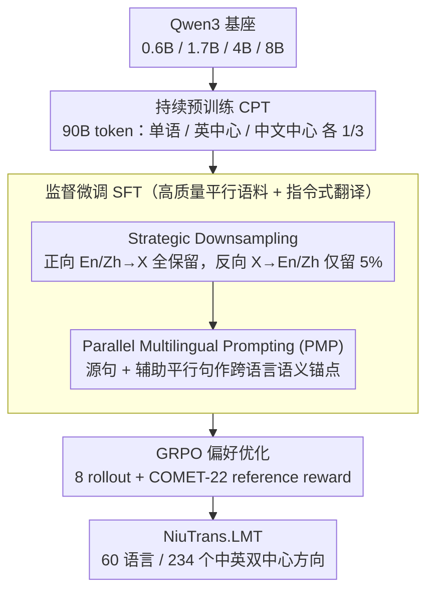

# NiuTrans.LMT: Toward Inclusive and Scalable Multilingual Machine Translation with LLMs

**会议**: ACL 2026  
**arXiv**: [2511.07003](https://arxiv.org/abs/2511.07003)  
**代码**: <https://github.com/NiuTrans/LMT>  
**领域**: 机器翻译 / 多语言 / LLM适配  
**关键词**: 多语言机器翻译、方向退化、Strategic Downsampling、Parallel Multilingual Prompting、GRPO

## 一句话总结
本文发布 NiuTrans.LMT，一个覆盖 60 种语言、234 个中英双中心翻译方向、0.6B/1.7B/4B/8B 四种规模的开源 LLM 机器翻译套件，并指出多路平行数据在对称 SFT 中会造成 X→中/英方向退化，再用 Strategic Downsampling、Parallel Multilingual Prompting 和 COMET 奖励的 GRPO 把质量拉回到强开源 MMT 系统水平。

## 研究背景与动机

**领域现状**：LLM 机器翻译已经从“单独训练一个 encoder-decoder MT 模型”转向“在通用基座 LLM 上做 CPT + SFT + 偏好优化”。ALMA、TowerInstruct、X-ALMA、GemmaX2、Hunyuan-MT、Seed-X 等系统都证明了这条路有效，但大多数系统要么语言覆盖有限，要么偏英语中心，要么没有充分解决中英以外长尾语种的双向质量问题。

**现有痛点**：多语言 SFT 最想用的是高质量人工平行语料，但低资源语言里这种数据极少，所以 FLORES-200、NTREX-128 这类 multi-way 语料会被反复复用。直觉上，多路语料可以从一个小语料集合构造很多方向；问题是当同一个英语或中文句子被几十个源语言反复映射为目标时，模型可能学到“看到某些训练模式就背目标句”的捷径，而不再认真读取源句语义。

**核心矛盾**：多路平行数据一方面是覆盖长尾语言最可靠的高质量监督来源，另一方面对称复用它会制造大量 many-to-one 目标重复。模型在 pivot→X 方向生成多种目标语言时确实受益，但在 X→pivot 方向会出现流畅却不忠实的 hallucination，这正是本文命名的 Directional Degeneration。

**本文目标**：作者想同时解决三个问题：(i) 解释为什么大规模 multilingual SFT 会在反向方向崩掉；(ii) 在不额外依赖新 SFT 数据的情况下修复这个问题；(iii) 训练并发布一个中文-英文双中心、覆盖足够广、不同参数规模都可用的多语言翻译模型族。

**切入角度**：论文不是先发明复杂架构，而是把问题归因到数据使用方式：同一个 pivot 目标被对称复用太多次，导致源语义被 shortcut 覆盖。这个角度很实用，因为如果病因在数据配比上，那么一个简单的采样策略就可能比模型级手术更稳定、更便宜。

**核心 idea**：用“反向少量保留、正向完整保留”的 Strategic Downsampling 打断 many-to-one 目标重复，再用带辅助平行句的 Parallel Multilingual Prompting 显式提供跨语言语义锚点，最后把两者放进 90B-token CPT + 高质量 SFT + GRPO 的完整 LMT 训练流水线。

## 方法详解

### 整体框架
LMT 以 Qwen3 为基座，训练 0.6B、1.7B、4B、8B 四个模型，覆盖 English ↔ 59 种语言和 Chinese ↔ 58 种语言，共 234 个翻译方向。整体 pipeline 有三阶段：第一阶段是 Continued Pre-training，用单语、英语中心双语、中文中心双语数据各占三分之一的 90B token 混合语料补强多语言能力；第二阶段是 SFT，在 FLORES/NTREX/SMol/WMT/IWSLT 等高质量语料上做 instruction-style 翻译监督，同时加入 SD 和 PMP；第三阶段是 GRPO，用同一批 SFT prompt 采样多个候选译文，并用 COMET-22 作为 reference-based reward 做偏好优化，不额外构造人工偏好数据。

### 关键设计

**1. Directional Degeneration 诊断与 Strategic Downsampling：揪出多路语料对称复用导致的反向方向崩塌，再用一刀采样止血**

作者先用 Qwen3-4B-Base 跑标准双向 SFT，结果撞见一个反直觉的现象：En/Zh→X 方向大幅提升，X→En/Zh 反而掉到 base 以下，错误形态是语法通顺却事实不忠实——这正是本文命名的 Directional Degeneration。病根在于 multi-way 语料被对称复用时，同一个 pivot 目标句被几十个源语言反复映射，模型于是学到“看到某些训练模式就背目标句”的捷径，不再认真读源句语义。为坐实这一归因，作者沿三条轴做对照：把反向数据替换成不重叠的 bilingual CPT 子集来打破对称、把 multi-way 反向样本保留率从 0% 逐步升到 100%、并在 Qwen3 0.6B/1.7B/4B/8B、Llama-3.1-8B、Gemma-2-9B 以及 10-50 种语言规模上复现。性能随保留率呈倒 V 形，约 $p=5\%$ 时最优，接近 100% 对称复用时坍塌最重。

据此 Strategic Downsampling 的做法非常简单：En/Zh→X 样本全部保留，而 multi-way 语料里的 X→En/Zh 样本只以 $p=5\%$ 独立采样。相比方向感知训练、模型合并这类模型级手术，SD 是纯数据级修复——不改架构、不加推理开销，也不牺牲 pivot→X 的监督密度，却把“curse of multilinguality”落到了 many-to-one 目标重复这个具体病因上。

**2. Parallel Multilingual Prompting（PMP）：给源句配一个辅助平行句，让语义多一个语言视角当锚点**

multi-way 数据不只有 many-to-one 的风险，也藏着跨语言对齐的价值，关键是怎么把它显式用起来。标准翻译 prompt 学的是 $P_\theta(T\mid S;\tau_{L_S\to L_T})$；PMP 把输入扩成源句 $S$ 加一个辅助语言句子 $A$，改学 $P_\theta(T\mid S,A;\tau_{L_S\to L_A\to L_T})$。辅助语言不是乱挑：En↔X 时选与 X 类型接近、模型又掌握较好的邻近语言（如德语配荷兰语、波兰语配捷克语），Zh↔X 时统一用英语做稳定语义锚，因为英语通常是模型最熟、也最容易自生成的中间语。

PMP 的巧妙在于把“多路平行”从隐式的数据结构变成显式的 prompt 条件：SFT 阶段 STP（标准 prompt）和 PMP 混合训练，默认推理仍可用普通 STP，一旦手上有外部或自生成的辅助译文就切到 PMP prompt。这样模型学到的是“何时该借另一个语言视角”，而不是训练里盲目把所有方向都对称展开；它也顺带给了 LMT 一个 test-time enhancement 接口——可以外接高质量 MT、检索翻译记忆，或先自译出英语锚点再译目标语言。

**3. 面向中英双中心的可扩展训练流水线：把两项策略落进一条可发布、可比较、覆盖长尾语言的完整 recipe**

低资源翻译从来不是一个 prompt trick 能搞定的，真正的瓶颈在数据规模、数据质量、方向平衡和训练阶段衔接，所以本文把整条链路工程化。CPT 数据先从 SlimPajama、Skywork、CulturaX、OpenDataLab、Wikimedia、OPUS 等来源收集，再用开源 MT 做伪平行扩增以补中文中心缺口，过滤链包括 OpusFilter 的长度与错配清洗、FastText LID 分层阈值、CometKiwi 质量打分，最终得到约 2.1B 英语中心、2.9B 中文中心句对；CPT 用显式方向 tag 和目标语言 separator 训练。SFT 用约 567K 高质量 pair、覆盖 117 个中心语言对，正向 STP/PMP 各 50%，反向经 SD 后总保留 5%（STP 2.5%、PMP 2.5%）。

最后一阶段是 GRPO：沿用 SFT 的 prompt，每条用 8 个 rollout、temperature 1.0、KL 系数 0.001 采样多个候选，再用 COMET-22 作为 reference-based reward 选更好的译文，不额外构造人工偏好数据。同一套 recipe 训练 0.6B/1.7B/4B/8B 四个尺寸，既证明策略不依赖某个特定模型规模，也让 LMT 的系统价值落在“既给模型、又给可复用的数据配比与 prompt 训练流程”上。

### 损失函数 / 训练策略
CPT 和 SFT 都使用标准语言模型目标，区别在于 CPT 主要学习多语言文本与双语格式，SFT 只对目标译文部分计算 loss。SFT forward 方向使用 50% STP + 50% PMP；reverse 方向使用 SD 后只保留 5%，其中 STP 2.5%、PMP 2.5%。GRPO 阶段沿用 SFT prompt，模型采样候选翻译，COMET-22 根据 reference 给 reward；这相当于把自动 MT 质量评估器转成偏好优化信号，额外提升 0.3-0.8 COMET 左右。

## 实验关键数据

### 主实验
第一张表看训练组件逐步打开时的 COMET-22，重点选 4B 模型最能说明问题的方向。可以看到，普通 SFT 在低资源 En/Zh→X 上收益巨大，但 X→Zh 全线坍塌；SD 一加，反向方向马上恢复并超过 base；CPT 继续给低资源方向带来最大增益。

| 4B 配置 | 高资源 X→Zh | 中资源 X→Zh | 低资源 X→Zh | 低资源 En→X | 低资源 Zh→X |
|---------|-------------|-------------|-------------|-------------|-------------|
| Qwen3-4B-Base | 85.44 | 84.55 | 75.35 | 56.81 | 53.33 |
| SFT | 73.60 | 72.18 | 67.94 | 77.51 | 73.68 |
| + SD | 86.55 | 85.87 | 79.13 | 78.68 | 75.15 |
| + CPT | 87.39 | 87.06 | 84.74 | 87.14 | 84.17 |
| + PMP | 87.53 | 87.20 | 84.90 | 87.06 | 84.08 |
| + GRPO | **88.19** | **87.97** | **85.81** | **87.85** | **84.92** |

第二张表看 LMT 和已有 MMT/多语言 LLM 的重叠语言平均分。LMT-60-4B 很多时候已经追平或超过 7B-54B 级别系统，8B 只是在 4B 基础上小幅提高，说明本文 recipe 的参数效率相当强。

| 对比系统 | 重叠语言数 | Baseline Avg. | LMT-60-4B Avg. | LMT-60-8B Avg. | 结论 |
|----------|------------|---------------|----------------|----------------|------|
| TowerInstruct-13B | 10 | 87.63 | 88.34 | **88.43** | LMT 小模型胜过 13B |
| Aya-expanse-8B | 23 | 87.36 | 88.26 | **88.36** | LMT 稳定领先 |
| Seed-X-PPO-7B | 27 | **89.07** | 88.86 | 88.94 | LMT 接近强 PPO 系统 |
| GemmaX2-28-9B | 28 | 87.57 | 87.73 | **87.83** | LMT 覆盖更广且略优 |
| Hunyuan-MT-7B | 35 | 85.71 | 87.50 | **87.63** | LMT 明显领先 |
| X-ALMA-13B | 40 | 88.92 | 88.96 | **89.06** | LMT 4B 已基本持平 |
| Aya-101-13B | 54 | 83.85 | 87.42 | **87.55** | 长尾语言优势很大 |
| NLLB-54B | 59 | 84.79 | 87.43 | **87.56** | 远小于 54B 仍明显领先 |

### 消融实验

| 分析对象 | 设置 | 关键结果 | 说明 |
|----------|------|----------|------|
| Directional Degeneration | 反向 multi-way 保留率从 0% 到 100% | 约 $p=5\%$ 附近达到峰值，100% 对称复用明显下滑 | 反向样本不是越多越好，过多重复 pivot target 会诱发 shortcut |
| Symmetry-breaking | 用不重叠 bilingual CPT 子集替换 X→En/Zh | 虚线设置避免了完全对称复用下的崩塌 | 退化来自数据复用结构，不是 X→pivot 本身更难 |
| PMP inference | DT vs PMP-S vs PMP-O | X→En/Zh 上自生成辅助句常可达到或超过 oracle；Zh→X 主要依赖 oracle 辅助句 | 译入高资源 pivot 时锚点噪声容忍度更高，译入 X 时辅助句质量更关键 |
| PMP zero-shot | In-Group 方向无 PMP vs 有 PMP | COMET 从 85.20 提升到 86.11 | PMP 训练不只服务显式 anchor pair，也改善跨语言迁移 |
| GRPO | 复用 SFT pair，无新增偏好数据 | 各资源层平均再涨约 0.3-0.8 COMET | 自动 reward 仍能从候选生成中挖出额外质量 |

### 关键发现
- **Directional Degeneration 是系统性问题**：在 Qwen3 多个尺寸、Llama-3.1-8B、Gemma-2-9B 以及不同语言规模下都出现同类非对称退化，说明它不是某个基座或某个语言对的偶发 bug。
- **SD 的收益非常集中但关键**：它几乎不改变 En/Zh→X 的监督密度，却把 X→Zh 这类最受伤方向从 SFT 后的 67-73 COMET 拉回到 79-87 COMET 区间，是整条 pipeline 的“止血阀”。
- **CPT 对低资源语言最重要**：从 +SD 到 +CPT，低资源 En→X 从 78.68 涨到 87.14，Zh→X 从 75.15 涨到 84.17，说明 base LLM 原始低资源知识不足，SFT 只能教格式和方向，CPT 才补语言能力。
- **PMP 不是主增益来源但提供迁移能力**：主表里 PMP 的直接提升较小，主要体现在 X→En/Zh 与 zero-shot transfer；它更像一个让模型会读辅助锚点的能力开关。
- **文档级翻译仍是短板**：WMT24++ 上 LMT 很多方向保持竞争力，但在若干 subset 落后 Hunyuan-MT；作者也指出 sentence-level SFT 缺少 discourse signal，会影响跨句一致性。

## 亮点与洞察
- **把“多语言诅咒”具体化为数据复用病因**：论文最有价值的不是发布一个大模型，而是发现 multi-way SFT 的对称展开会制造 many-to-one target repetition。这个诊断能直接指导其他 multilingual instruction tuning 任务，比如跨语言摘要、问答、语音翻译。
- **SD 是低成本高回报的工程策略**：很多多语种系统遇到低资源反向方向退化时会先想模型结构或专家路由，本文说明先看数据方向配比往往更有效。5% 这个保留率也给了后续工作一个很强的默认起点。
- **PMP 把 multi-way 数据从“训练集结构”变成“可控推理接口”**：一旦模型学会用辅助平行句，推理时就可以外接高质量 MT、检索翻译记忆，或先自译出英语锚点再译目标语言。这让 LMT 不只是一个静态模型，也有 test-time enhancement 的接口。
- **中英双中心很现实**：很多开源 MMT 模型覆盖英语方向不错，但中文中心方向缺口明显。LMT 专门补 Zh↔X，且用中文中心伪平行扩增和过滤，符合中文用户和亚洲语言社区的真实需求。

## 局限与展望
- 主要评测仍以 FLORES-200 Devtest 和 COMET-22 为核心，虽然覆盖广，但句子级 benchmark 不能完全代表真实业务中的领域迁移、术语一致性、长文档篇章连贯性和用户偏好。
- Chinese-English-centric 是从 English-only 往前一步，但仍不是真正的多中心翻译架构。对阿语、西语、法语、印地语等区域中心语言，未来可能需要 tri-centric 或更一般的 multi-centric 设计。
- 60 种语言对开源 LLM-MT 已经很大，但相对全球语言多样性仍很有限。极低资源语言不只是数据少，很多还存在书写资源稀缺、LID/QE 模型校准差、合成数据难评估等问题。
- PMP 的 test-time 效果依赖辅助句质量，尤其是 Zh→X 方向自生成 anchor 不一定可靠。实际部署时可能需要外部 MT、检索式 translation memory 或 confidence gating。
- GRPO 使用 COMET-22 作为 reward，容易继承 COMET 对低资源和非英语中心方向的偏差。未来可以考虑多指标 reward、人类偏好校准或 reference-free + reference-based 混合优化。

## 相关工作与启发
- **vs NLLB / M2M-100**：NLLB 和 M2M-100 是传统 encoder-decoder 大规模多语种 MT 的代表，覆盖面强但不具备 LLM instruction-following 的统一接口。LMT 用 decoder-only Qwen3 做中英双中心适配，在 59 个重叠语言上用 4B/8B 明显超过 NLLB-54B 的平均 COMET。
- **vs ALMA / TowerInstruct / X-ALMA**：这些工作证明 LLM post-training 可以做高质量 MT，但语言数和中心方向更偏英语。LMT 的区别是系统研究了 multi-way SFT 的方向退化，并把 60 语言、234 方向作为发布目标。
- **vs GemmaX2 / Hunyuan-MT / Seed-X**：这些是更近的中文或多语言 LLM-MT 系统。LMT 与 Seed-X-PPO 接近，超过 GemmaX2 和 Hunyuan-MT 多数组合；更重要的是它公开了 SD/PMP 这类可复用 recipe，而不仅是报告模型效果。
- **vs 多路平行数据和辅助翻译 prompt 研究**：前人更多在 CPT 或 inference 侧证明 multi-way/auxiliary translation 有帮助。本文把它推进到 SFT 设计：一方面警告对称复用会伤害反向方向，另一方面用 PMP 把辅助句纳入可训练的 prompt 行为。

## 评分
- 新颖性: ⭐⭐⭐⭐ Directional Degeneration 的数据级归因和 SD 很有启发，PMP 概念简单但落在 SFT+推理双接口上有新意；模型套件本身偏系统工程创新。
- 实验充分度: ⭐⭐⭐⭐⭐ 覆盖 4 个模型尺寸、60 语言、234 方向、FLORES/WMT24++、多类强 baseline、方向退化诊断和 PMP 分析，证据链非常扎实。
- 写作质量: ⭐⭐⭐⭐ 主线清楚，先讲 failure mode 再讲 mitigation 和系统发布；但表格很多且 appendix 信息密集，读者需要在主文和附录间来回定位细节。
- 价值: ⭐⭐⭐⭐⭐ 对开源多语言 MT 社区很实用：既给模型，又给数据配比和 prompt 训练 recipe，尤其适合作为中文中心和低资源方向的强 baseline。

<!-- RELATED:START -->

## 相关论文

- [\[ACL 2026\] Alexandria: A Multi-Domain Dialectal Arabic Machine Translation Dataset for Culturally Inclusive and Linguistically Diverse LLMs](alexandria_a_multi-domain_dialectal_arabic_machine_translation_dataset_for_cultu.md)
- [\[ACL 2026\] Evaluating the Impact of Verbal Multiword Expressions on Machine Translation](evaluating_the_impact_of_verbal_multiword_expressions_on_machine_translation.md)
- [\[ACL 2026\] CLewR: Curriculum Learning with Restarts for Machine Translation Preference Learning](clewr_curriculum_learning_with_restarts_for_machine_translation_preference_learn.md)
- [\[ACL 2026\] LQM: Linguistically Motivated Multidimensional Quality Metrics for Machine Translation](lqm_linguistically_motivated_multidimensional_quality_metrics_for_machine_transl.md)
- [\[ACL 2026\] Language on Demand, Knowledge at Core: Composing LLMs with Encoder-Decoder Translation Models for Extensible Multilinguality](language_on_demand_knowledge_at_core_composing_llms_with_encoder-decoder_transla.md)

<!-- RELATED:END -->
