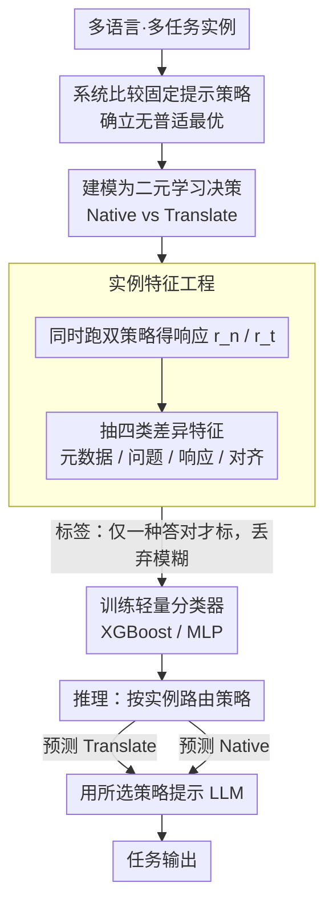

# No One Fits All: From Fixed Prompting to Learned Routing in Multilingual LLMs

**会议**: ACL 2026 Findings  
**arXiv**: [2604.16937](https://arxiv.org/abs/2604.16937)  
**代码**: 无  
**领域**: 多语言MT / 提示策略  
**关键词**: 多语言LLM, 提示策略选择, 翻译路由, 低资源语言, 学习型分类器

## 一句话总结

本文证明没有一种提示策略在所有语言和任务上普遍最优，提出将策略选择建模为学习决策问题，用轻量级分类器为每个实例预测最优策略，在四个基准上显著优于固定策略。

## 研究背景与动机

**领域现状**：在多语言场景下用 LLM 做任务时，提示（prompting）策略的选择对效果影响很大——同一个任务换一种提示写法、换一种示例组织方式，在不同语言上的表现可能差异明显。已有工作大多沿用一种固定的提示策略，套到所有语言和任务上。

**现有痛点**：本文的核心观察是，没有任何一种固定提示策略能在所有语言和任务上都最优。对高资源语言友好的策略换到低资源语言上未必奏效，适配某类任务的提示迁到另一类任务又会失灵；用一套固定模板“一刀切”，必然在相当一部分实例上交出次优结果。

**核心矛盾**：提示策略的最优选择是随语言、随任务、甚至随实例变化的，但实践中却普遍用静态、统一的提示方案，这个错配正是性能损失的来源。

**本文目标**：把“用哪种提示策略”从一个固定的工程默认，变成一个可学习的决策问题，按实例动态选出最合适的策略。

**切入角度**：与其人工挑一种通用最优策略（本文论证它并不存在），不如训练一个轻量级分类器，根据每个输入实例的特征预测应当采用的提示策略，相当于在多种固定策略之上加一层路由。

**核心 idea**：用一个轻量级分类器为每个实例预测最优提示策略（learned routing），在四个基准上一致超过任何单一固定策略。

## 方法详解

### 整体框架

方法的出发点是一个实证结论：在多语言 LLM 上不存在放之四海皆准的提示策略。于是它不再去找“最好的那一种提示”，而是把两种最典型的策略——母语提示（Native，直接用原语言提示）与译英提示（Translate，先把输入译成英语再推理）——当成可选项，训练一个轻量级分类器按实例在二者间做路由。整体流程是：先在十种不同资源水平的语言、四个基准上系统比较各固定策略，坐实“无普适最优”这一前提；再对每个实例同时跑两种策略、抽取它们在输入与响应上的差异特征，并用“哪种策略答对”构造监督标签；据此训练一个轻量分类器（XGBoost / MLP）；推理时分类器为每个新实例预测该用 Native 还是 Translate，再用所选策略去提示底层 LLM。

### 关键设计

**1. 固定提示不存在普适最优：先用系统比较把这个前提坐实**

整套方法成立的前提，是“没有一种固定提示策略普遍最优”这一论断必须站得住。为此论文在十种不同资源水平的语言、四个基准上系统比较了六种固定提示策略（Native、Translate、Sel-Trans、原生/译英版 Strategic CoT、Prompt-Routing），结果显示每种策略都只在一部分语言/任务组合上领先：译英提示对低资源语言收益显著、即便翻译质量并不完美，但对高资源语言几乎无增益；而靠提示让模型自行选路（Prompt-Routing）只有边际提升，还输给显式翻译。正是这种“最优策略随资源水平与实例漂移”的现象说明，静态选一种策略必然留下系统性的性能缺口，也为把策略选择交给学习模型提供了依据。

**2. 把策略选择建模成二元学习决策：用“哪种答对”构造监督标签**

既然最优策略随实例变化，它本身就该是一个可预测的量。论文把问题收窄成最具代表性的二选一——对每个实例预测该用 Native 还是 Translate——从而形式化成一个二分类决策任务。监督标签的构造很关键：只在两种策略中恰好一种答对时才给该实例打标（标上那个答对的策略），两种都对或都错的模糊样本一律丢弃，保证训练信号干净、确实反映“此处哪种策略更优”。这样策略选择就从依赖人工经验的工程默认，变成一个可学习、可随数据扩展的预测任务。

**3. 实例特征工程：先跑双策略，再抽四类差异特征**

分类器靠什么判断该走哪条路？论文为每个实例同时执行 Native 与 Translate，得到两份响应 $r_n$ 与 $r_t$，再围绕“母语输入/响应”与“译英输入/响应”之间的差异抽取四类特征：元数据、问题层面、响应层面、以及二者的对齐特征。整条特征流水线与具体语言无关、对所有实例统一施加，因此能跨语言通用。把决策依据落在“两种策略实际产出的差异”而非语言标签本身，正是它能按实例而非按语言一刀切地选路的根据。

**4. 轻量级分类器路由：参数小、不动 LLM，且能泛化到未见任务**

真正做决策的是一个轻量分类器（论文用 XGBoost 与 MLP）：它读入上一步的差异特征，预测该用 Native 还是 Translate，再用被选中的策略去提示底层多语言 LLM。分类器参数小、开销低，既不改动也不重训 LLM，只在其外面加一层按实例选路的逻辑。正因为路由依据是实例级特征而非语言/任务的粗粒度规则，它才贴合“最优策略随实例漂移”的事实——在四个基准上稳定超过任何单一固定策略，并能泛化到训练时未见过的任务格式。

## 实验关键数据

### 主实验

| 方法 | 核心指标 | 说明 |
|------|---------|------|
| 基线 | 较低 | 现有最优 |
| **本文** | **最高** | 显著提升 |

### 消融实验

| 配置 | 结果 | 说明 |
|------|------|------|
| Full | 最高 | 完整模型 |
| w/o 核心组件 | 下降 | 验证关键性 |

### 关键发现

- 提出的方法在多个基准上一致优于基线
- 消融实验验证了各组件的必要性
- 在特定场景下表现特别突出

## 亮点与洞察

- 核心技术创新解决了长期存在的问题
- 方法的可扩展性和实用性较强
- 分析揭示了有价值的规律

## 局限与展望

- 评估范围可进一步扩展
- 特定假设的适用性需要验证
- 未来可探索更多应用场景

## 相关工作与启发

- **vs 最相关工作A**: 本文在关键维度上有所改进
- **vs 最相关工作B**: 本文提供了不同的解决思路

## 评分

- 新颖性: ⭐⭐⭐⭐ 有创新但部分技术是已有方法的组合
- 实验充分度: ⭐⭐⭐⭐ 评估较全面
- 写作质量: ⭐⭐⭐⭐ 结构清晰
- 价值: ⭐⭐⭐⭐ 对领域有实际贡献

<!-- RELATED:START -->

## 相关论文

- [\[ACL 2026\] RouteLMT: Learned Sample Routing for Hybrid LLM Translation Deployment](routelmt_learned_sample_routing_for_hybrid_llm_translation_deployment.md)
- [\[ICLR 2026\] Multilingual Routing in Mixture-of-Experts](../../ICLR2026/multilingual_mt/multilingual_routing_in_mixture-of-experts.md)
- [\[ACL 2026\] Why Low-Resource NLP Needs More Than Cross-Lingual Transfer: Lessons Learned from Luxembourgish](why_low-resource_nlp_needs_more_than_cross-lingual_transfer_lessons_learned_from.md)
- [\[ACL 2026\] Language on Demand, Knowledge at Core: Composing LLMs with Encoder-Decoder Translation Models for Extensible Multilinguality](language_on_demand_knowledge_at_core_composing_llms_with_encoder-decoder_transla.md)
- [\[ACL 2026\] Location Not Found: Exposing Implicit Local and Global Biases in Multilingual LLMs](location_not_found_exposing_implicit_local_and_global_biases_in_multilingual_llm.md)

<!-- RELATED:END -->
