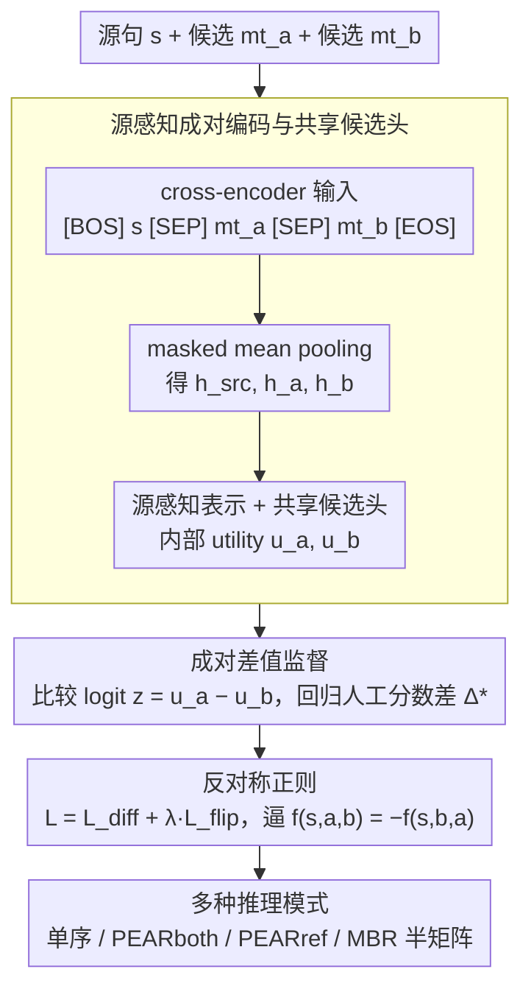

# PEAR: Pairwise Evaluation for Automatic Relative Scoring in Machine Translation

**会议**: ACL2026  
**arXiv**: [2601.18006](https://arxiv.org/abs/2601.18006)  
**代码**: https://github.com/prosho-97/pear  
**领域**: 机器翻译评估 / 质量估计  
**关键词**: 成对评估、机器翻译、质量估计、MQM、MBR 解码

## 一句话总结
PEAR 将无参考机器翻译质量估计从“给单个译文打绝对分”改成“直接比较两个候选译文的相对差值”，在 WMT24 MQM 评测中以更小模型超过匹配的单候选 QE 基线和部分大规模指标。

## 研究背景与动机
**领域现状**：机器翻译系统通常依赖自动指标做系统选择、模型调参与候选排序。传统 learned metric 或 QE metric 大多输入源句、可选参考译文和一个候选译文，输出一个绝对质量分，再通过两个分数相减来比较两个系统。

**现有痛点**：当现代 MT 系统质量已经很高时，强系统之间的差异往往很细。单候选打分需要模型在孤立上下文里估计绝对质量，比较时还会把两个独立预测的误差一起带入差值。已有二分类式排序方法虽然直接比较两个译文，但通常只能给出“谁更好”，不能表达偏好强度，也默认不存在平局。

**核心矛盾**：MT 评估的实际用途高度比较化，但主流监督信号和模型结构仍然偏向单样本回归。人类相对判断通常比绝对分数更稳定，而自动指标却常把比较问题绕回两个绝对分的差。

**本文目标**：作者希望构造一个 reference-free 的成对 QE 指标，使它同时预测偏好方向和偏好幅度，并能在系统级评测、非平局段级比较、参考锚定评测和 MBR 解码中保持效率与稳定性。

**切入角度**：论文把人工 MQM 等段级分数转成成对差值监督，让模型直接学习 $s_h(s,mt_a)-s_h(s,mt_b)$。这样输出天然对应比较任务，不必先学习一个绝对分数标尺。

**核心 idea**：用共享上下文中的成对相对回归替代两个单候选绝对分数相减，并用顺序翻转正则让模型接近反对称打分。

## 方法详解
PEAR 的关键不是换一个更大的 backbone，而是把 MT 评估的监督目标、输入格式和推理接口一起改成相对比较。它接收同一个源句和两个候选译文，输出一个带符号实数：正值表示第一个候选更好，负值表示第二个候选更好，绝对值越大说明模型认为差距越明显。

### 整体框架
整体流程分为四步。首先，把源句和两个候选译文串成一个 cross-encoder 输入，让模型在同一上下文中同时观察二者。其次，对源句和两个候选分别做 masked mean pooling，得到源句表示和两个候选表示。第三，用共享的候选打分头得到两个候选的内部 utility，再相减得到比较 logit。最后，用人工分数差训练这个相对分数，并在训练时加入候选顺序翻转的正则项。

训练数据来自 WMT 人工评测。第一阶段使用 WMT16 到 WMT23 的 DA 和 DA+SQM 判断做广覆盖预训练，第二阶段用 WMT20 到 WMT23 的 MQM 监督微调，并加入 IndicMT Eval MQM。附录还报告了数据规模：第一阶段约 7M translation pairs、覆盖 51 个语言方向，第二阶段约 6M pairs、覆盖 10 个语言方向；KD 版本额外使用 GPT-4.1-mini 蒸馏出的 2M MQM 风格标注。

### 关键设计
**1. 成对差值监督：直接把质量估计建成两个候选之间的相对差，而不是两个绝对分相减**

系统比较、候选排序、MBR utility 这些 MT 评估的真实用途本来都是相对任务，可主流监督信号却偏要模型在孤立上下文里估一个绝对质量分，比较时再把两个独立预测的误差一起带进差值——当强系统之间差异已经很细时，这种绕路尤其吃亏。PEAR 干脆让模型直接学相对差：对源句 $s$ 和候选 $mt_a, mt_b$，预测 $\hat{\Delta}_{ab}=f_\theta(s,mt_a,mt_b)$，监督目标由人工段级分数构造为 $\Delta^*_{ab}=s_h(s,mt_a)-s_h(s,mt_b)$。这样输出天然对应比较任务，既不必先学一个绝对分数标尺，又能保留平局附近的细粒度强弱，而不像二分类排序那样把偏好压成“谁更好”。

**2. 源感知成对编码与共享候选头：把两个译文放进同一上下文里比较，并用同一套参数打分以免标尺漂移**

要做相对比较，两个候选必须站在同一把尺子上，否则两路独立打分各自漂移，差值就不可靠。PEAR 把输入串成 $[BOS]\ s\ [SEP]\ mt_a\ [SEP]\ mt_b\ [EOS]$ 的 cross-encoder 序列，让模型在同一上下文里同时观察二者；再对 source、candidate A、candidate B 分别做 masked mean pooling，得到 $h_{src},h_a,h_b$。每个候选构造 $[h_k;h_k\odot h_{src};|h_k-h_{src}|]$ 这样的源感知表示，经过共享投影和 FFN 得到内部 utility $u_a,u_b$，最后用 $z=u_a-u_b$ 形成比较 logit。共享候选头保证两个候选用的是同一套参数、处在同一内部标尺上，显式相减则把输出牢牢限制在“比较”而非“绝对质量分”。

**3. 反对称正则与多种推理模式：让候选顺序翻转时预测符号也翻转，顺带砍掉一半成对计算**

一个理想的比较函数应当满足 $f(s,a,b)=-f(s,b,a)$，但纯回归并不会自动保证这点。PEAR 在 Huber 差值回归之外加一个顺序翻转项，总损失 $\mathcal{L}=\mathcal{L}_{diff}+\lambda_{flip}\mathcal{L}_{flip}$，其中 $\mathcal{L}_{flip}=(\hat{\Delta}_{ab}+\hat{\Delta}_{ba})^2$，逼模型逼近反对称打分。这条约束不仅提高比较函数的一致性，还直接换来推理上的灵活：可以只跑单顺序图快，也可以用 PEARboth 取 $\frac{1}{2}(\hat{\Delta}_{ab}-\hat{\Delta}_{ba})$ 求稳；有参考译文时还能用 PEARref 把参考当固定 anchor。在 MBR 解码里，反对称性更意味着 $N\times N$ 的 utility 矩阵只需算一半，另一半用符号翻转补全。

### 损失函数 / 训练策略
PEAR 使用 Huber loss 回归人工质量差，作者在附录中将其与 MSE 对比，Huber 在 SPA、段级 acc 和 Avg Corr 上都有小幅稳定收益。模型有 InfoXLM Large 的 PEAR 版本和 XLM-RoBERTa-XL 的 PEAR-XL 版本；默认 PEAR 约 560M 参数，PEAR-XL 约 3.5B 参数。KD 版本在第二阶段加入 GPT-4.1-mini 蒸馏 MQM 标注，目的是测试额外监督下成对框架是否仍然优于单候选 QE。

## 实验关键数据

### 主实验
| 设置 | 模型 | 参数量 | SPA | acc*eq | Avg Corr | 结论 |
|------|------|--------|-----|--------|----------|------|
| 匹配单候选 QE | Single-QE | 560M | 80.0 | 57.2 | 68.6 | 同 backbone 绝对打分基线 |
| 成对 QE | PEAR | 560M | 80.9 | 57.9 | 69.4 | 相对建模带来提升 |
| 匹配单候选 QE + KD | Single-QE-KD | 560M | 80.6 | 57.4 | 69.0 | 加蒸馏后仍低于 PEAR-KD |
| 成对 QE + KD | PEAR-KD | 560M | 81.8 | 58.2 | 70.0 | 小模型达到更高平均相关 |
| 匹配单候选 QE-XL + KD | Single-QE-XL-KD | 3.5B | 80.9 | 57.9 | 69.4 | 大 backbone 单候选基线 |
| 成对 QE-XL + KD | PEAR-XL-KD | 3.5B | 82.0 | 58.2 | 70.1 | 成对框架在大模型上也有效 |

### 消融实验
| 分析项 | 配置 A | 配置 B | 关键指标 | 说明 |
|--------|--------|--------|----------|------|
| 非平局成对准确率 | MT-RANKER-XXL 5.7B | PEAR-KD 560M | Avg Pair Acc: 65.8 vs 68.9 | PEAR 参数少得多，但在去掉人工平局的 WMT24 MQM pairs 上更准 |
| 反对称正则 | $\lambda_{flip}=0$ | $\lambda_{flip}=0.1$ | $\rho_{as}$: 0.196→0.014；$\rho_{tr}$: 0.561→0.189 | 翻转正则显著减少反对称和传递性偏差 |
| 回归损失 | MSE | Huber | Avg Corr: 69.1→69.4 | Huber 对重尾差值更稳 |
| MBR utility | COMET-22 / BLEURT-20 | PEAR full / PEAR sym. | En-De XCOMET-XL: 0.844/0.842 vs 0.855/0.854 | PEAR 用反对称矩阵近似几乎不损失质量 |

### 关键发现
- 在严格匹配训练数据、backbone 和超参的设置下，PEAR 全面高于 Single-QE，说明收益主要来自成对相对建模，而不是参数量或训练数据差异。
- PEAR-XLboth 在 WMT24 上的 Avg Corr 为 70.2，高于 MetricX-24-Hybrid-QE-XL 的 69.9 和 XCOMET-QE 的 69.5；PEARboth 560M 也达到 70.1，明显高于 CometKiwi 560M 的 64.0。
- PEARref 的 anchor 不必是人工参考。作者把 anchor 换成多个 MT 输出后，排名仍然稳定，说明 reference-anchored 模式更多是计算技巧，而非依赖参考译文质量。
- PEAR 与其他强指标的段级差值相关性更低，例如与 MetricX-24-Hybrid-QE 在 En-De 约 0.71、En-Es 约 0.51、Ja-Zh 约 0.26，暗示它提供了不同的评价信号。

## 亮点与洞察
- PEAR 把“指标如何被使用”和“指标如何被训练”对齐了。MT 研究中常见的问题是比较两个系统，而不是给单个译文一个绝对分；这篇论文正是从这个错位处切入。
- 反对称约束是一个小但很实用的设计。它既提高比较函数的一致性，又直接带来 MBR 解码时的计算节省。
- 论文的控制实验做得比较干净。Single-QE 和 PEAR 使用相同 backbone、训练数据与超参，使“pairwise formulation 是否有用”这个问题可以被直接检验。
- PEAR 不只是一个评测指标，也可以作为 decoding utility。相对打分天然适合候选间比较，这比把参考式指标硬套到 candidate-to-candidate MBR 更一致。

## 局限与展望
- 作者没有测试超过 3.5B 的 PEAR checkpoint，因此还不清楚成对框架在更大模型上是否继续扩大收益、趋于饱和，还是被模型容量本身掩盖。
- PEAR 目前输出一个标量相对分，不能指出具体错误 span；作者也提到可进一步扩展到 MQM sequence tagging，让 side-by-side 评估给出更可解释的错误定位。
- 完全成对系统比较在系统数很多时仍有 $N(N-1)/2$ 成本，虽然 PEARref 和 MBR 反对称近似能缓解，但不同使用场景仍需要权衡精度与计算。
- PEAR 与其他指标相关性较低是优点也是开放问题。它到底捕捉了哪些翻译现象、是否可能偏向某些语言对或错误类型，还需要更细的现象级分析。

## 相关工作与启发
- **vs COMET / BLEURT / MetricX / XCOMET**: 这些指标通常对单个候选输出绝对分，再通过分数差比较；PEAR 直接预测两个候选之间的相对差，比较任务更原生，但输出解释性仍不如 MQM span-level 标注。
- **vs MT-RANKER**: MT-RANKER 也输入两个候选，但做的是二分类偏好，不能表示平局或偏好强度；PEAR 做 graded relative scoring，因此更适合 MQM 差值、系统级平均和 MBR utility。
- **vs COMET-poly**: COMET-poly 在推理时利用其他候选上下文来评价单个候选；PEAR 则把比较本身作为输出目标，结构上更简洁。
- **启发**: 许多生成任务的评估都在实际使用时变成比较问题，例如摘要、对话、代码生成和多模态回答。PEAR 的设计提示我们，与其把所有候选映射到绝对分，不如直接学习“候选 A 相对候选 B 好多少”。

## 评分
- 新颖性: ⭐⭐⭐⭐ 成对 MT QE 并非完全空白，但把 graded difference、反对称正则、多推理模式和 MBR utility 系统化得很完整。
- 实验充分度: ⭐⭐⭐⭐⭐ 有匹配基线、WMT24 主评测、MT-RANKER 对比、Huber/反对称消融、相关性分析和 MBR 应用。
- 写作质量: ⭐⭐⭐⭐ 论文逻辑清楚，控制变量意识强；部分表格信息密集，读者需要来回对照。
- 价值: ⭐⭐⭐⭐⭐ 对机器翻译评估和候选选择都很实用，也给其他生成任务的 pairwise metric 设计提供了直接模板。

<!-- RELATED:START -->

## 相关论文

- [\[ACL 2025\] AskQE: Question Answering as Automatic Evaluation for Machine Translation](../../ACL2025/multilingual_mt/askqe_question_answering_as_automatic_evaluation_for_machine_translation.md)
- [\[ACL 2026\] NeoAMT: Neologism-Aware Agentic Machine Translation with Reinforcement Learning](neoamt_neologism-aware_agentic_machine_translation_with_reinforcement_learning.md)
- [\[ACL 2026\] CLewR: Curriculum Learning with Restarts for Machine Translation Preference Learning](clewr_curriculum_learning_with_restarts_for_machine_translation_preference_learn.md)
- [\[ACL 2025\] M-MAD: Multidimensional Multi-Agent Debate for Advanced Machine Translation Evaluation](../../ACL2025/multilingual_mt/m-mad_multidimensional_multi-agent_debate_for_advanced_machine_translation_evalu.md)
- [\[ACL 2026\] Alexandria: A Multi-Domain Dialectal Arabic Machine Translation Dataset for Culturally Inclusive and Linguistically Diverse LLMs](alexandria_a_multi-domain_dialectal_arabic_machine_translation_dataset_for_cultu.md)

<!-- RELATED:END -->
