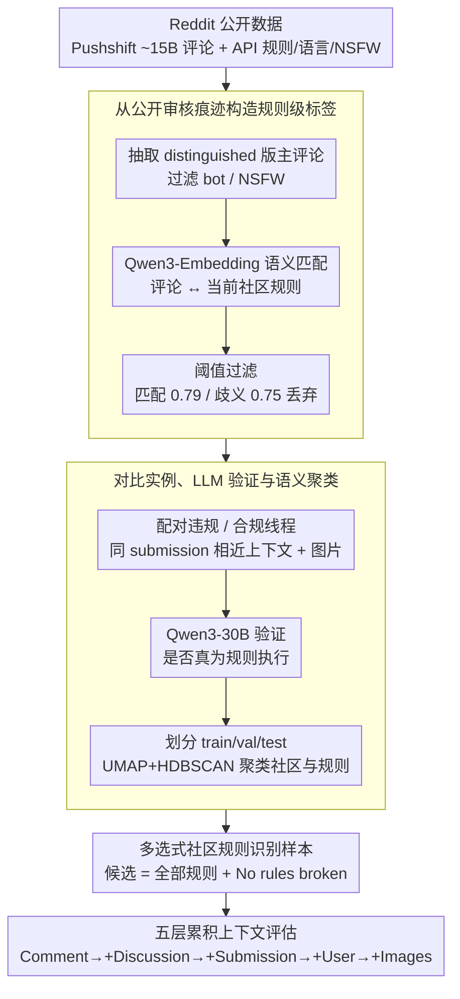

# PluRule: A Benchmark for Moderating Pluralistic Communities on Social Media

**会议**: ACL2026  
**arXiv**: [2605.17187](https://arxiv.org/abs/2605.17187)  
**代码**: https://github.com/osome-iu/PluRule  
**领域**: 多语言内容治理 / 社交媒体审核  
**关键词**: 内容审核、社区规则、多语言基准、多模态 VLM、Reddit

## 一句话总结
PluRule 把 Reddit 社区审核建模为“给定评论和上下文，选择违反了哪条本社区规则或没有违规”的多选题，构建了覆盖 1,989 个社区、2,885 条规则和 9 种语言的基准，并显示 GPT-5.2 high reasoning 全上下文也只有约 57.6% 准确率。

## 研究背景与动机
**领域现状**：社交平台长期依赖人工审核和自动检测系统来处理违法内容、仇恨、骚扰、低质内容等问题。许多自动化数据集把审核视为全局统一标签，例如 toxicity、hate speech 或 harassment。

**现有痛点**：社区治理平台的规则并不是全局统一的。同一句话在 r/RoastMe 可能是被鼓励的玩笑，在其他社区却可能违反 civility；自我推广在多数社区是 spam，在作品展示社区却可能是必要内容。统一 moderation 模型容易把主流规范强加给少数社区或非英语社区。

**核心矛盾**：社区审核要求模型理解本地规则、讨论上下文、社区目的和隐含规范，而现有模型更擅长识别跨社区通用违规类型。模型能检测“普遍不礼貌”不代表能判断“这条评论是否违反这个 subreddit 的第 4 条规则”。

**本文目标**：作者希望构建一个 pluralistic moderation benchmark，让模型在数千个社区、数千条规则和多语言多模态上下文中做细粒度规则识别，并衡量现有 VLM 是否真的能辅助社区自治。

**切入角度**：论文利用 Reddit 中公开的 moderator comment。许多管理员会在删除或提醒时说明违反了哪条规则，作者用这些评论和当前规则文本做语义匹配，再配对同一 submission 下未被审核的 compliant comment，形成对比式多选样本。

**核心 idea**：把内容审核从“是否违规”的二分类升级为“违反哪条社区规则”的多选任务，并要求模型同时看规则、评论、讨论链、原帖、用户匿名标识和图片。

## 方法详解
PluRule 不是提出一个新 moderation 模型，而是提出一个更贴近真实社区审核决策空间的 benchmark。每个样本包含一个违反规则的评论和一个合规评论，两者来自同一 submission 的相似上下文。模型看到社区规则列表和上下文后，需要从所有规则加“No rules broken”中选择答案。

### 整体框架
数据构建分五阶段。第一阶段从 Pushshift Reddit archives 中抽取 moderator comments，并通过 Reddit API 收集 subreddit 规则、语言和 NSFW 信息。第二阶段用多语言 embedding 把 moderator comment 匹配到当前 subreddit 规则。第三阶段构建违反线程和合规线程，并下载 submission 图片作为多模态上下文。第四阶段用 LLM 验证匹配是否真的是规则执行。第五阶段按 subreddit 实例数量划分 train/val/test，并对 subreddit 和 rule 做语义聚类。

评估时，模型逐步获得五个累积上下文层级：Comment Only、+Discussion、+Submission、+User、+Images。所有层级都包含 subreddit 描述和完整规则集。输出先自由生成，再追加 “Final Choice:” 抽取最终选项。

### 关键设计

**1. 多选式社区规则识别：把审核从「坏不坏」改成「违反了哪一条本地规则」**

传统数据集只问一句话是否 toxic，但真实版主面对的不是二分类——他要在本社区的几十条规则里指认具体哪一条被违反，才能给出删除理由、执行操作和申诉依据。PluRule 因此把每条评论的候选项设为该 subreddit 的全部规则再加一个「No rules broken」，违规评论的正确答案是某条具体规则，合规评论的正确答案是无违规。为防止模型靠选项位置投机，选项顺序用 comment ID 派生的 deterministic seed 打乱，既保证可复现又消除位置偏差。这样一来，模型必须真正读懂本地规则文本与评论的关系，而不是套用一个跨社区通用的「不礼貌」分类器。

**2. 从公开审核痕迹构造规则级标签：用版主自己留下的解释当监督信号**

规则级标签很难标，但 Reddit 版主在删评时常会公开说明「违反了第几条规则」，这正是天然的弱监督。作者从约 15B 条评论、40k 个 subreddit 中抽取 distinguished moderator comments，过滤掉 bot 和 NSFW 后得到 17,468 个 subreddit、131,400 条规则和约 9M 条版主评论。难点在于规则会随时间改写、重编号，直接正则匹配版主话里的规则编号并不可靠，所以改用 Qwen3-Embedding-8B 把评论和规则编码后算语义相似度，对同社区规则取相似度最高者作为匹配；匹配阈值定在 99.2 百分位（0.79），歧义阈值定在 98 百分位（0.75），相似度落在歧义区间、可能同时指向多条规则的样本被丢弃。语义匹配吸收了规则表述的变化，歧义过滤则压住了「一条评论对应多条规则」的噪声。

**3. 对比实例、LLM 验证与语义聚类：逼模型区分相似讨论，并支持按类型剖析难度**

如果只给违规评论，模型可能靠 submission 主题或社区标签就能猜个八九不离十。为堵住这条捷径，每个 violating thread 都配一个来自同一 submission、却没有任何 moderator action 的 compliant thread，配对时优先挑共享祖先多、深度相近、分数较低的分支，让两条评论的上下文尽量接近、只在「是否违规」上有差别。配好后再用 Qwen3-30B-A3B-Instruct 验证匹配是否确实在「陈述一次违规执行」，验证通过率 82.1%，把误匹配剔除。最后用 UMAP + HDBSCAN 对 subreddit 和 rule 的 embedding 做聚类，由 Qwen3-30B-A3B-Thinking 生成候选类别标签再人工校正——聚类不只是为了好看，它让后续分析能回答「哪类社区、哪类规则最难」，也提出了能否跨相似社区迁移审核能力的问题。

### 损失函数 / 训练策略
PluRule 是 benchmark，不训练新模型。评估模型包括 Qwen3-VL-4B/8B/30B 的 Instruct 和 Thinking 版本，以及 GPT-5.2 的 low/high reasoning。Qwen 模型使用 temperature 0 和 seed 0。指标为 test accuracy，并用 100k 次 bootstrap resampling 计算 95% 置信区间；论文报告所有 accuracy 的 95% CI 不超过 ±1.3%，violating/compliant recall 表的 CI 不超过 ±1.9%。

## 实验关键数据

### 主实验
| Split | Instances | Comments | Images | Subreddits / Clusters | Rules / Clusters | Languages |
|-------|-----------|----------|--------|------------------------|------------------|-----------|
| Train | 9,155 | 51,968 | 2,077 | 861 / 25 | 1,336 / 27 | 9 |
| Val | 1,382 | 7,631 | 376 | 537 / 25 | 586 / 27 | 9 |
| Test | 2,834 | 13,076 | 1,190 | 1,989 / 25 | 2,039 / 27 | 9 |
| Total | 13,371 | 72,675 | 3,643 | 1,989 / 25 | 2,885 / 27 | 9 |

### 消融实验
| 模型 / 变体 | Comment Only | +Discussion | +Submission | +User | +Images | 说明 |
|-------------|--------------|-------------|-------------|-------|---------|------|
| Qwen3-VL-4B Instruct | 49.6 | 49.2 | 48.3 | 48.9 | 48.4 | 基本低于或接近 50% baseline |
| Qwen3-VL-8B Instruct | 51.0 | 50.7 | 49.2 | 50.0 | 49.8 | 放大到 8B 没有稳定提升 |
| Qwen3-VL-30B Instruct | 50.2 | 51.0 | 51.1 | 52.4 | 52.3 | 最大 Qwen 也只略高于 baseline |
| GPT-5.2 Low | 54.1 | 55.3 | 56.8 | 57.4 | 57.4 | 强闭源模型明显更好但仍有限 |
| GPT-5.2 High | 55.0 | 56.2 | 57.3 | 57.7 | 57.6 | 全上下文仅比 comment-only 高 2.6 左右 |
| Baseline | 50.0 | 50.0 | 50.0 | 50.0 | 50.0 | 总是预测 No rules broken |

### 关键发现
- GPT-5.2 high reasoning 全上下文准确率约 57.6%，只比 50% baseline 高 7.6 个点；从 comment-only 到 full context 只提升约 2.6 到 2.7 个点，说明上下文没有被充分利用。
- Qwen Thinking 变体经常低于 Instruct 变体，GPT-5.2 high 与 low 的差异也不显著，说明“更多推理”并不自动解决社区规则理解。
- 按规则类型看，模型更擅长普遍规则：civility 约 69%、language 约 66%、self-promotion 约 63%；低于 baseline 的包括 low-effort 43%、relevance 44%、evidence-based 47%。
- 加权准确率把 violating:compliant 设为 2:1 后全面下降。GPT-5.2 high full context 从 57.6% 掉到 52.6%，因为模型更擅长回忆合规评论，而不是召回违规评论。
- 标签质量有人工验证：100 个英文样本中，pipeline 与人工 established ground truth 的整体一致率为 96%，全员一致样本 85/85 正确，多数一致样本 8/12 正确，仲裁样本 3/3 正确。

## 亮点与洞察
- PluRule 的任务定义抓住了内容审核的核心难点：规则是社区本地的，违规不是内容本身的固定属性，而是内容、规则和上下文的关系。
- paired violating/compliant thread 很巧妙。它减少了模型靠 submission 主题或社区标签投机的空间，逼模型区分相似讨论中的具体评论。
- 结果对“用更强 VLM 自动审核社区规则”泼了冷水。即使 GPT-5.2 能处理多模态上下文，也很难理解大量本地规范，尤其是 relevance、low-effort、evidence-based 这类依赖社区语境的规则。
- 语义聚类不仅用于分析，也提供了迁移学习问题：能否从相似社区或相似规则迁移 moderation 能力，而不是每个 subreddit 从零学习。

## 局限与展望
- 数据只覆盖公开留下 moderator comment 的审核行为。私信审核、静默删除、shadow-ban 和严重违规的快速移除不可见，因此数据可能偏向较轻违规或更愿意公开解释的社区。
- Reddit 英语社区占主导，虽然 benchmark 统计 9 种语言，但结论未必能泛化到不同平台、不同治理结构或非英语主导社区。
- 历史 moderator comments 覆盖 2005 到 2023，而规则文本来自 2025 年 11 月 Reddit API。语义匹配能缓解规则改写，但无法完全处理规则新增、删除或意义改变。
- 一些违规需要数据集中没有的信息，例如 ban evasion、重复违规历史或跨帖行为。出于隐私考虑不收集这些历史是合理的，但也限制了 benchmark 的完整性。

## 相关工作与启发
- **vs toxicity / hate speech datasets**: 传统内容审核数据集关注全局不可接受内容；PluRule 关注社区规则和上下文，因此更适合 pluralistic moderation。
- **vs Park et al. 规则类型数据**: 先前工作会把大量社区规则折叠成少数 coarse categories；PluRule 保留具体 subreddit 规则，让模型必须在本地规则集中选择。
- **vs He et al. binary rule judgment**: 二分类只判断某条规则是否被违反；PluRule 同时给出所有规则和 no-violation 选项，更接近版主实际工作流。
- **启发**: 自动审核系统如果要服务自治社区，可能需要检索历史审核案例、学习本社区 precedent，并对规则解释给出证据，而不是只依赖通用安全分类器。

## 评分
- 新颖性: ⭐⭐⭐⭐⭐ 将 pluralistic moderation 形式化为社区规则多选识别，并构建多语言多模态 Reddit 基准，任务定义很有价值。
- 实验充分度: ⭐⭐⭐⭐ 数据构建、标签验证、上下文层级、模型尺寸和 reasoning 变体都覆盖到；缺少人类版主在完整任务上的直接上限对比。
- 写作质量: ⭐⭐⭐⭐ 数据管线和结果解释清楚，局限写得诚实；附录结果较多，主文只能展示部分细分分析。
- 价值: ⭐⭐⭐⭐⭐ 对内容治理、社区自治和 AI moderation 的评估都很重要，也提醒自动审核不能简单套用统一规范。

<!-- RELATED:START -->

## 相关论文

- [\[ACL 2026\] Cross-Cultural Transfer of Emoji Semantics and Sentiment in Financial Social Media](cross-cultural_transfer_of_emoji_semantics_and_sentiment_in_financial_social_med.md)
- [\[CVPR 2025\] SMTPD: A New Benchmark for Temporal Prediction of Social Media Popularity](../../CVPR2025/multilingual_mt/smtpd_a_new_benchmark_for_temporal_prediction_of_social_media_popularity.md)
- [\[ACL 2026\] MORPHOGEN: A Multilingual Benchmark for Evaluating Gender-Aware Morphological Generation](morphogen_a_multilingual_benchmark_for_evaluating_gender-aware_morphological_gen.md)
- [\[ACL 2026\] The GaoYao Benchmark: A Comprehensive Framework for Evaluating Multilingual and Multicultural Abilities of Large Language Models](the_gaoyao_benchmark_a_comprehensive_framework_for_evaluating_multilingual_and_m.md)
- [\[ACL 2026\] TransLaw: A Large-Scale Dataset and Multi-Agent Benchmark Simulating Professional Translation of Hong Kong Case Law](translaw_a_large-scale_dataset_and_multi-agent_benchmark_simulating_professional.md)

<!-- RELATED:END -->
