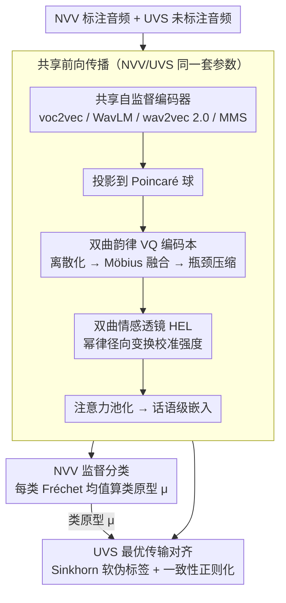

# Prosody as Supervision: Bridging the Non-Verbal–Verbal for Multilingual Speech Emotion Recognition

**会议**: ACL 2026  
**arXiv**: [2604.17647](https://arxiv.org/abs/2604.17647)  
**代码**: [Project Page](https://helixometry.github.io/NOVA-ARC---ACL26/)  
**领域**: 多语言翻译  
**关键词**: 非语言语音监督, 双曲表示学习, 最优传输对齐, 韵律编码本, 跨语言情感迁移

## 一句话总结

本文提出 NOVA-ARC，首次将多语言语音情感识别（SER）建模为从标注的非语言发声（NVV）到未标注的语言语音（UVS）的无监督迁移问题，通过双曲空间中的韵律向量量化编码本、双曲情感透镜和最优传输原型对齐实现跨模态情感迁移，在 6 个数据集上验证了非语言→语言迁移的可行性和优越性。

## 研究背景与动机

**领域现状**：SER 的监督信号几乎完全依赖标注的语言语音，但标注在低资源语言中极其稀缺。非语言发声（笑声、叹气、哭泣）蕴含丰富的情感信号，且因不包含词汇内容而天然跨语言。

**现有痛点**：(1) 语言语音中的情感标签不可避免地与词汇/音系纠缠——在不同语言间迁移时这些相关性会失效；(2) 现有 UDA 方法仍假设情感监督来自标注的语言语音；(3) 非语言发声的情感识别仅最近才受到关注，从未被用作跨语言 SER 的监督源。

**核心矛盾**：需要语言无关的情感监督信号——语言语音中的情感与语言特定的表达习惯混合，非语言发声提供了更纯净的替代。

**本文目标**：验证非语言发声能否作为更强、更可迁移的情感监督源，用于多语言 SER。

**切入角度**：非语言发声（笑声/啜泣/叹息）源于共同的生理机制，主导特征是韵律层面的——发声/频谱倾斜/强度动态/时间调制——这些特征天然跨语言。

**核心 idea**：在双曲空间中建模情感的层次结构（粗粒度情感族→细粒度类别→强度），通过双曲 VQ 编码本离散化韵律模式，用最优传输将 NVV 的情感原型对齐到 UVS 的表示上。

## 方法详解

### 整体框架

输入 NVV/UVS 音频通过共享的自监督编码器（voc2vec/WavLM/wav2vec 2.0/MMS）提取帧级特征，投影到 Poincaré 球。经双曲 VQ 编码本离散化韵律→Möbius 加法融合连续+离散→瓶颈压缩→双曲情感透镜校准强度→注意力池化得到话语级嵌入。NVV 标注数据训练分类器+计算类原型，UVS 通过最优传输对齐到原型+一致性正则化。

### 关键设计

**1. 双曲韵律向量量化编码本：把连续韵律离散成 NVV 和 UVS 共享的「情感词汇表」**

要让非语言发声（NVV）的监督迁移到语言语音（UVS），前提是两者得说同一种「韵律语言」。如果各自用连续特征，分布很难对齐。本文在 Poincaré 球中维护一个大小 $K=256$ 的编码本 $\mathcal{C}$，把每个帧 $\mathbf{x}_t$ 用 Poincaré 距离分配到最近的码字 $\mathbf{q}_t$，再通过 Möbius 加法把连续帧与离散 token 融合、经瓶颈投影压缩。离散化的好处是 NVV 和 UVS 被迫共用同一套韵律码字，跨模态的对齐就有了公共词表；而选双曲空间而非欧几里得，是因为情感本身是「大类→子类→强度」的树状层次，双曲空间能用更少维度容纳这种指数膨胀的层次结构。

**2. 双曲情感透镜（HEL）+ 最优传输原型对齐：校准强度差异并完成无监督迁移**

NVV 的情感往往比 UVS 表达得更夸张——笑声远比一个微笑的语调强烈，直接对齐会因强度错位而失真。HEL 用一个可学习的幂律径向变换 $\alpha$ 调整嵌入在 Poincaré 球中的径向位置（越靠近球边界代表强度越高），把两侧的强度尺度拉到可比。对齐则走原型路线：在有标注的 NVV 上对每类算 Fréchet 均值作为类原型 $\mu^{(c)}$，对无标注的 UVS 批次用 Sinkhorn 迭代求解熵正则化的最优传输计划 $\Pi^*$，再由它诱导软伪标签 $q_{cj} = n\,\Pi^*_{cj}$ 来训练。相比把每个 UVS 话语硬指派到单一类的聚类，最优传输允许一句话以不同权重匹配多个情感原型，既更贴合情感的模糊性，也让伪标签更平滑、噪声更小。

**3. 共享前向传播 + 一致性正则化：用同一条网络路径强制两种输入落在同一空间**

即便有了共享码字和原型对齐，如果 NVV 和 UVS 走不同的编码路径，两边的表示空间仍可能各自漂移、对不齐。本文让 NVV 和 UVS 共享全部参数——编码器、投影层、编码本、分类器都是同一套，从根上保证两种输入被映射进同一个几何空间。在此之上对无标签 UVS 加一致性正则化，约束其在扰动下的预测稳定，抑制最优传输伪标签早期的噪声，让无监督那一支训练得更稳。

### 损失函数 / 训练策略

总目标：$\mathcal{L} = L_S(\mathcal{B}_S) + \lambda_{\text{OPT}} L_{\text{OPT}}(\mathcal{B}_T) + \lambda_{\text{OT}} L_{\text{OT-CE}}(\mathcal{B}_T)$。$L_S$ 是 NVV 上的监督交叉熵，$L_{\text{OPT}}$ 鼓励几何对齐，$L_{\text{OT-CE}}$ 用传输诱导的软标签训练分类器。AdamW 30 epochs，余弦衰减+10% warmup。

## 实验关键数据

### 主实验

**NVV→UVS 迁移（NOVA-ARC + voc2vec）**

| 目标数据集 | 语言 | NOVA-ARC Acc | 直接迁移基线 |
|-----------|------|-------------|-----------|
| ASVP-ESD (V) | 多语言 | 62.23 | 32.67 |
| MESD | 西班牙语 | ~55 | 49.02 |
| AESDD | 希腊语 | ~42 | 35.86 |
| RAVDESS | 英语 | ~43 | 36.51 |
| Emo-DB | 德语 | ~50 | 44.69 |

### 消融实验

- 双曲 vs 欧几里得对比显示双曲空间始终优于欧几里得对应物
- voc2vec（专为非语言预训练）在 NVV 源域最强，WavLM/MMS 在 UVS 目标域更强
- NOVA-ARC 在 V→V（语言→语言）迁移设置中也表现最佳

### 关键发现

- 非语言→语言迁移是可行的——NOVA-ARC 显著优于直接迁移基线（+15-30pp），证明 NVV 包含有效的跨语言情感信号
- voc2vec 在 NVV 上最强而在 UVS 上最弱——说明专用编码器捕获了 NVV 特有的模式
- 双曲空间的优势在低资源目标域上更明显——层次结构编码在数据稀缺时提供更好的归纳偏置

## 亮点与洞察

- 将 SER 重新定义为 NVV→UVS 迁移是一个范式级的创新——完全改变了情感监督的来源假设
- 双曲空间用于情感建模非常合理——情感有明确的粗到细层次结构（正/负→具体情感→强度）
- 共享参数设计是简洁而关键的——确保 NVV 和 UVS 在同一表示空间中

## 局限与展望

- NVV 数据集（ASVP-ESD）规模有限
- 仅统一为 5 类情感，更细粒度的分类未验证
- 韵律编码本大小等超参数的敏感性分析不够
- 在更多语言和更大规模场景下的验证需要

## 相关工作与启发

- **vs 标准 UDA SER**: 仍假设情感监督来自语言语音，NOVA-ARC 用 NVV 作为更纯净的源
- **vs Mote et al.**: 用 KNN 语音转换做跨语言适应，NOVA-ARC 用最优传输做原型对齐
- **vs Phukan et al.**: 关注 NVV 识别本身，NOVA-ARC 用 NVV 作为迁移学习的桥梁

## 评分

- 新颖性: ⭐⭐⭐⭐⭐ 首次提出NVV→UVS迁移范式，双曲韵律编码本设计独特
- 实验充分度: ⭐⭐⭐⭐ 6数据集+4编码器+双曲vs欧几里得消融
- 写作质量: ⭐⭐⭐⭐ 动机令人信服，理论框架完整
- 价值: ⭐⭐⭐⭐⭐ 对低资源SER研究开辟了全新方向

<!-- RELATED:START -->

## 相关论文

- [\[ACL 2026\] Evaluating the Impact of Verbal Multiword Expressions on Machine Translation](evaluating_the_impact_of_verbal_multiword_expressions_on_machine_translation.md)
- [\[ACL 2026\] Beyond Literal Mapping: Benchmarking and Improving Non-Literal Translation Evaluation](beyond_literal_mapping_benchmarking_and_improving_non-literal_translation_evalua.md)
- [\[ACL 2026\] EMCEE: Improving Multilingual Capability of LLMs via Bridging Knowledge and Reasoning with Extracted Synthetic Multilingual Context](emcee_improving_multilingual_capability_of_llms_via_bridging_knowledge_and_reaso.md)
- [\[ACL 2026\] Hierarchical Policy Optimization for Simultaneous Translation of Unbounded Speech](hierarchical_policy_optimization_for_simultaneous_translation_of_unbounded_speec.md)
- [\[ACL 2026\] Efficient Training for Cross-lingual Speech Language Models](efficient_training_for_cross-lingual_speech_language_models.md)

<!-- RELATED:END -->
