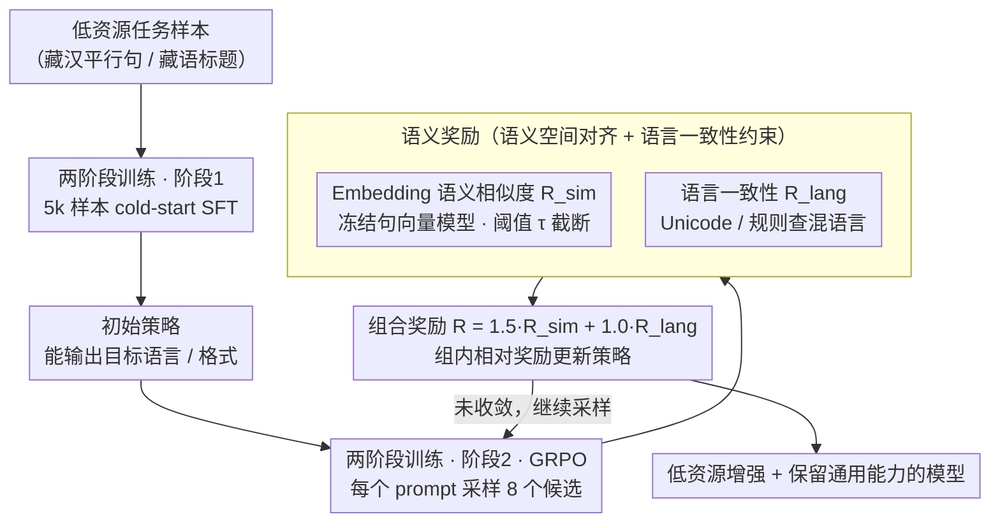

# Reinforcement Learning with Semantic Rewards Enables Low-Resource Language Expansion without Alignment Tax

**会议**: ACL2026  
**arXiv**: [2605.14366](https://arxiv.org/abs/2605.14366)  
**代码**: 未公开  
**领域**: multilingual_mt  
**关键词**: 低资源语言、语义奖励、GRPO、对齐税、藏汉翻译

## 一句话总结
本文把低资源语言扩展从 token 级模仿改写为语义空间对齐问题，用 GRPO 和 embedding 语义奖励训练 Qwen3-4B，在藏汉翻译和藏语标题生成上获得低资源能力，同时比强 SFT 更好地保留中文 CMRC 等主导语言能力。

## 研究背景与动机
**领域现状**：大语言模型在高资源语言上表现强，但对藏语等低资源语言支持不足。常见做法是继续预训练、指令微调或在低资源平行语料上做 SFT，把模型拉向目标语言数据分布。

**现有痛点**：低资源语料通常规模小、领域窄、分布偏，token 级 teacher forcing 会鼓励模型强行模仿参考表面形式。这可以提高 BLEU 或 ROUGE，却容易让参数过度适配狭窄数据，造成高资源语言和通用能力下降，也就是论文所说的 alignment tax。

**核心矛盾**：低资源扩展既要学会目标语言，又不能破坏预训练中已有的通用表示。SFT 把“对齐”定义成 token 分布匹配，而真实语言能力更接近“语义等价的多种表达都可以”。表面模仿越强，遗忘风险越大。

**本文目标**：作者希望回答三个问题：语义奖励 RL 是否能有效学习低资源任务；它与强 SFT 在任务性能和通用能力保留之间的 trade-off 如何；语义对齐得到的表示能否更好迁移到下游少样本任务。

**切入角度**：论文把语言扩展看成 sparse supervision 下的 alignment，而不是简单 adaptation。模型不再被要求复现唯一参考句，而是通过 embedding 相似度学习保留语义，并通过受约束的策略优化减少参数漂移。

**核心 idea**：用 embedding-level semantic reward 代替 token-level likelihood，让模型学习“意思对即可”的低资源语言能力，同时用 GRPO 的受控更新降低灾难性遗忘。

## 方法详解
方法由一个两阶段训练范式和一个语义奖励函数组成。第一阶段用少量低资源数据让模型具备基本输出能力，第二阶段从这个冷启动模型出发，用 GRPO 按语义奖励继续优化。与强 SFT 相比，它不追求完全贴合参考文本，而是允许多种表面表达，只要语义与参考一致且语言保持在目标低资源语言空间内。

### 整体框架
输入是低资源语言任务样本，例如藏汉平行句或藏语标题生成样本。模型先在 5k 低资源样本上做 cold-start SFT，得到能输出目标语言/目标格式的初始策略。随后在剩余数据上进行 GRPO：每个 prompt 采样一组候选输出，用冻结的多语句向量模型计算候选与参考的语义相似度，并叠加语言一致性奖励，最后根据组内相对奖励更新策略。输出是一个面向低资源语言增强但较少损害原有能力的模型。

### 关键设计

**1. 语义空间对齐目标：把训练信号从「复现参考 token」换成「保持参考语义」**

低资源数据的参考文本往往覆盖不全、领域偏窄，token 级 teacher forcing 会逼模型逐字贴合这唯一一句参考，结果把数据偏差也一并放大，正是 alignment tax 的根源。本文转而判断生成句和参考句是否在句向量空间里语义接近——只要意思对，词序和措辞不同也算有效答案。这把翻译与生成中「一义多表」的本性显式化：模型不再被锁死在狭窄参考分布上，而是可以在保持语义的前提下自由探索多个合理表达，从而少受参考噪声的牵引。

**2. 两阶段 cold-start + GRPO 训练：先让模型「能说」，再用受控 RL 让它「说得有意义且别漂太远」**

直接在低资源语言上做 RL，早期策略连正确文字都吐不稳，探索基本是浪费；可直接堆 SFT 又会遗忘。于是分两阶段：先用 5k 低资源样本做小规模 cold-start SFT，让模型至少能输出目标语言、目标格式的合格句子；再从这个 checkpoint 出发跑 GRPO，对每个 prompt 采样 8 个候选，按组内相对奖励更新策略。选 GRPO 是因为它不需要显式 value model，省去额外网络，又保留了 PPO 类方法限制策略漂移的稳定性——这恰好对应「保留通用能力、别更新太猛」的诉求。

**3. Embedding 奖励 + 语言一致性约束：既奖励语义正确，又堵住「混语言刷分」的奖励黑客**

主奖励是生成输出与参考文本的 cosine similarity，但裸用相似度有个漏洞：相似度低于最低语义充分性时仍给正分会鼓励敷衍，所以经阈值 $\tau$ 做截断重标定——低于阈值奖励直接归 0，高于阈值才线性放大。另一个隐患是多语 embedding 可能给「中藏混写」的输出打出虚高语义分，因此再加一个用 Unicode/规则检查输出是否混入其他语言的一致性奖励，把优化硬约束在目标低资源语言空间内。两者按 $R=\lambda_{sim}R_{sim}+\lambda_{lang}R_{lang}$ 组合，其中 $\lambda_{sim}=1.5$、$\lambda_{lang}=1.0$，让「语义够不够」和「是否还在目标语言里」这两个核心条件都被显式约束。

### 损失函数 / 训练策略
实验使用 Qwen3-4B，并通过 LoRA 对注意力和 MLP 的线性层做参数高效微调，LoRA rank 为 64、$\alpha=128$、dropout 为 0.05。SFT 使用 AdamW、学习率 $2\times10^{-5}$、batch size 32 和 cosine schedule；GRPO 从 cold-start checkpoint 出发训练 1 epoch，学习率 $5\times10^{-7}$，每个 prompt 采样 8 个候选，temperature 0.8、top-p 0.9。语义奖励模型基于 CINO/XLM-R，用中藏平行数据适配为 SentenceTransformer，并在 RL 时冻结。

## 实验关键数据

### 主实验
第一组实验比较 cold-start SFT 和语义奖励 RL，证明 RL 确实能在最小监督初始化之后继续提升低资源能力，尤其是 semantic similarity。

| 任务 | 模型 | 任务指标 | 语义相似度 | 主要结论 |
|------|------|----------|------------|----------|
| 藏汉翻译 | Cold-start SFT | BLEU-4 0.3953 | 0.5593 | 5k 样本冷启动具备基本翻译能力 |
| 藏汉翻译 | RL (Ours) | BLEU-4 0.4519 | 0.7164 | 语义奖励带来明显语义提升 |
| 藏语标题生成 | Cold-start SFT | ROUGE-L 0.2204 | 0.5774 | 基线可生成但语义不足 |
| 藏语标题生成 | RL (Ours) | ROUGE-L 0.2530 | 0.6404 | 生成任务上同样提升 |

### 消融实验
与强 SFT 的 trade-off 说明：SFT 更擅长追求参考重合度，但在通用能力保留和开放生成偏好上不一定更好。

| 任务 | 方法 | 任务指标 | Similarity | CMRC Avg | CMRC F1 | LLM-Judge Win |
|------|------|----------|------------|----------|---------|---------------|
| 藏汉翻译 | Strong SFT | 0.6006 | 0.8282 | 41.82 | 62.99 | 59.2% |
| 藏汉翻译 | RL (Ours) | 0.4519 | 0.7164 | 46.97 | 65.79 | 33.5% |
| 藏语标题生成 | Strong SFT | 0.3095 | 0.6499 | 44.20 | 65.30 | 35.1% |
| 藏语标题生成 | RL (Ours) | 0.2530 | 0.6404 | 45.10 | 65.20 | 51.2% |

奖励消融进一步表明，提升不是“用了 RL”本身带来的，而是语义 reward 设计起关键作用。

| 奖励配置 | MT Similarity | 说明 |
|----------|---------------|------|
| Embedding + LC (Ours) | 0.7164 | 最佳，兼顾语义和目标语言一致性 |
| BLEU + LC | 0.6375 | token overlap 奖励限制语义探索 |
| BLEU + Embedding + LC | 0.6175 | 混合 BLEU 反而拉低表现 |
| BLEU + Embedding | 0.2312 | 缺少语言一致性后容易混合语言 |

### 关键发现
- 语义 RL 能从 cold-start SFT 继续提升低资源任务，藏汉翻译 similarity 从 0.5593 提升到 0.7164，标题生成 similarity 从 0.5774 提升到 0.6404。
- Strong SFT 在藏汉翻译上 BLEU 和 similarity 更高，但 CMRC Avg 比 RL 低 5.15，说明表面模仿的指标收益伴随更大 alignment tax。
- 在开放式标题生成中，RL 的 ROUGE 较低，但 LLM-Judge win rate 达 51.2%，比 SFT 高 16.1 个百分点，说明 n-gram 指标会低估语义多样表达。
- Few-shot transfer 中，MT-RL 初始化在 1,000 条标题生成样本上得到更高 similarity（0.5690 vs. MT-SFT 的 0.5456），支持“语义对齐表示更可迁移”的论点。
- OOD 机制分析显示，RL 的 CMRC mean NLL 增幅为 +0.24，而 SFT 为 +0.64；P90 NLL 增幅也从 SFT 的 +1.43 降到 RL 的 +0.62，说明遗忘更多发生在 SFT 的困难样本尾部。

## 亮点与洞察
- 论文最强的观点是把低资源语言扩展定义为 alignment，而不是普通 fine-tuning。这个视角自然解释了为什么 token 级学习会引发对齐税，也给出了用 RL 控制更新幅度的理由。
- Embedding reward 加语言一致性约束的组合很简洁。它没有引入复杂 teacher 或偏好标注，却把“语义够不够”和“是否还在目标语言里”两个核心条件显式化。
- 实验对 reference-based metrics 的反思有价值：低资源任务里 BLEU/ROUGE 可能奖励狭窄参考模仿，而不是更稳健的语言能力。对机器翻译和生成系统评估都有启发。
- 该方法可迁移到其他弱支持语言、方言或专业域文本扩展：先用少量数据冷启动，再用语义奖励扩大表达空间，同时用规则或检测器防止输出漂移。

## 局限与展望
- 实验主要围绕藏语，且藏汉翻译数据来自内部 VLM 预训练构建管线，领域分布较窄，外部可复现性和跨语言泛化还需要更多公开 benchmark 验证。
- 语义奖励模型本身基于中藏平行数据训练，如果 reward model 对某些语义细粒度差异不敏感，RL 可能优化到错误的语义近邻。
- LLM-as-a-Judge 用于偏好评价，虽然能补充 ROUGE/BLEU，但仍不是人工评测，尤其在低资源语言上可能存在偏见或识别错误。
- 方法牺牲部分 reference-based 指标来换取能力保留，实际部署时需要根据任务类型决定是否接受这种 trade-off。

## 相关工作与启发
- **vs 低资源 SFT / continued pretraining**: 这些方法继续使用 token-level likelihood，本文则改变目标函数，用语义一致性替代表面分布匹配，因此更关注减少灾难性遗忘。
- **vs LoRA/参数高效防遗忘方法**: LoRA 等主要限制更新位置或参数量，本文限制的是优化目标和策略漂移，两者可以互补。
- **vs RLHF / DPO**: 常规对齐 RL 优化人类偏好或规则奖励，本文把 reward 设计成跨语义空间的任务奖励，适合没有人工偏好数据的低资源语言场景。

## 评分
- 新颖性: ⭐⭐⭐⭐☆ “语义空间对齐 + GRPO”用于低资源语言扩展很有想法，核心组件本身借鉴已有 RL 和 embedding 方法。
- 实验充分度: ⭐⭐⭐☆☆ 主实验、trade-off、迁移和消融较完整，但语言范围、数据公开性和人工评价不足。
- 写作质量: ⭐⭐⭐⭐☆ 论证主线清晰，尤其对 alignment tax 的解释比较连贯。
- 价值: ⭐⭐⭐⭐☆ 对低资源语言扩展、灾难性遗忘缓解和参考指标反思都有较高实践启发。

<!-- RELATED:START -->

## 相关论文

- [\[ACL 2026\] NeoAMT: Neologism-Aware Agentic Machine Translation with Reinforcement Learning](neoamt_neologism-aware_agentic_machine_translation_with_reinforcement_learning.md)
- [\[ACL 2026\] Efficient Low-Resource Language Adaptation via Multi-Source Dynamic Logit Fusion](efficient_low-resource_language_adaptation_via_multi-source_dynamic_logit_fusion.md)
- [\[ACL 2026\] Why Low-Resource NLP Needs More Than Cross-Lingual Transfer: Lessons Learned from Luxembourgish](why_low-resource_nlp_needs_more_than_cross-lingual_transfer_lessons_learned_from.md)
- [\[ICML 2026\] Toward Robust Multilingual Adaptation of LLMs for Low-Resource Languages](../../ICML2026/multilingual_mt/toward_robust_multilingual_adaptation_of_llms_for_low-resource_languages.md)
- [\[ACL 2026\] Selective Contrastive Learning For Gloss Free Sign Language Translation](selective_contrastive_learning_for_gloss_free_sign_language_translation.md)

<!-- RELATED:END -->
