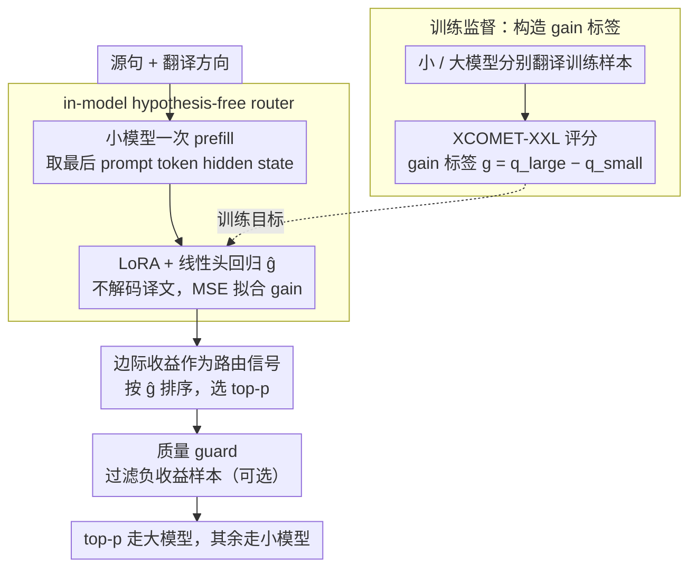

# RouteLMT: Learned Sample Routing for Hybrid LLM Translation Deployment

**会议**: ACL2026  
**arXiv**: [2604.22520](https://arxiv.org/abs/2604.22520)  
**代码**: 未在论文中提供公开代码  
**领域**: 机器翻译 / LLM部署 / 样本路由  
**关键词**: 混合翻译部署, 边际收益预测, in-model router, 预算分配, XCOMET

## 一句话总结
RouteLMT 将混合 LLM 翻译中的路由问题形式化为固定大模型预算下的边际收益分配，并用小翻译模型最后 prompt token 的内部表示预测“大模型相对小模型能带来多少提升”，在四个翻译方向上比长度、质量估计和外部路由器获得更好的质量-预算 Pareto 前沿。

## 研究背景与动机
**领域现状**：大语言模型在机器翻译上表现很强，但生产部署不能把所有请求都交给大模型，因为成本、尾延迟和算力容量都会迅速失控。常见工程方案是 hybrid deployment：大部分请求由小模型处理，只有一部分高价值或高难度请求交给大模型。

**现有痛点**：路由策略看似简单，实际很容易错配预算。按长度、罕见词或熵等启发式方法路由，可能把大模型调用浪费在大模型也提升不大的样本上；按小模型绝对质量或困难度路由，也不一定等价于“大模型会有显著提升”。一些后路由 QE 方法还需要先让小模型解码再评分，增加延迟和计算。

**核心矛盾**：混合翻译的目标不是找“最难的句子”，而是在有限大模型调用预算下，找“大模型相对小模型提升最大”的句子。困难样本可能两个模型都翻不好，简单样本也可能因成语、缩写或代码切换而被大模型显著修正。

**本文目标**：作者希望提出一个轻量、无外部模型、无需小模型先生成译文的路由器，直接预测边际收益，并证明边际收益是预算化路由的正确优化信号。

**切入角度**：论文利用小翻译模型在 prompt prefill 阶段的最后 token hidden state。这个表示已经编码了源句、翻译方向和模型对输入的内部判断，因此可以用一个简单回归头预测大模型升级的收益。

**核心 idea**：与其预测小模型质量或输入难度，不如直接预测 `g(x;d)=q_large(x;d)-q_small(x;d)`，然后把固定预算分配给预测收益最高的样本。

## 方法详解
RouteLMT 的方法核心是把路由视为一个预算分配问题。系统有小模型 `M_s` 和大模型 `M_l`。对每个源句和方向，小模型与大模型都有各自翻译质量分数。若大模型调用比例最多为 `p`，最优策略就是选择边际收益 `g=q_l-q_s` 最大的 top-p 样本。因此训练目标不应是绝对质量，而应是边际收益回归。

### 整体框架
训练阶段，作者先让小模型和大模型分别翻译训练样本，用 XCOMET-XXL 与人工参考计算两个质量分数，然后得到 gain label。RouteLMT 运行小翻译模型的一次 prefill，从翻译 prompt 的最后 token hidden state 提取表示，并通过轻量线性头预测 gain。模型使用 LoRA 适配小翻译模型，同时训练回归头。

推理阶段，系统不需要先生成小模型译文，也不需要外部 QE。对于离线批处理，按预测 gain 排序并选择 top-p 样本交给大模型；对于流式部署，可在 held-out traffic 上校准阈值 `tau_p`，让约 p 比例请求触发大模型。

### 关键设计

**1. 边际收益作为路由信号：把路由目标和预算优化目标对齐**

难度、长度、罕见词、小模型绝对质量这些常见路由依据都只是 proxy，未必和"大模型真正能带来多少提升"一致——一个难句可能两个模型都翻不好，升级它纯属浪费预算。RouteLMT 把混合翻译的总质量拆开看：它等于"所有样本都用小模型"的常数项，加上被路由到大模型那部分样本的 gain 期望。当大模型调用比例固定为 $p$ 时，前一项不变，要最大化总质量就只能去最大化被选样本的 gain 之和。于是最优策略很干净：按 $g=q_l-q_s$ 从高到低排序，挑 top-$p$ 交给大模型。这也直接解释了为什么按难度/长度路由会失效——它们优化的根本不是这个目标。

**2. in-model hypothesis-free router：在小模型内部、不解码就预测增益**

外部路由器只看源句的外部表示，忽略了小翻译模型自己对输入的判断；后路由 QE 方法虽然准，却要先让小模型把译文整句解码出来再打分，延迟和算力都吃不消。RouteLMT 走第三条路：对源句和翻译方向拼成翻译 prompt，只跑小模型的一次 prefill、**不解码任何译文**，取最后一个 prompt token 的 hidden state，过一个轻量线性头直接回归出 $\hat{g}$。这个表示在 prefill 阶段就已经编码了源句、翻译方向和模型对输入难点的内部感知，信号质量接近 post-route QE，但开销只有一次前向。因为翻译方向写在 prompt 里，同一个路由器天然 direction-aware，四个方向共用一套。

**3. 质量 guard 控制负收益风险：在平均收益之外再压住"越升级越差"的尾部**

gain ranking 拉高了平均收益，却不能完全消除负收益样本——大模型有时会做错实体消歧、过度意译，反而比小模型翻得差。RouteLMT 因此在 gain 选择之上叠一层可选的质量过滤器：轻量版 Quality predict 直接用 in-model 质量预测把关，不增加解码；重量版 Quality hypo 则先解码小模型译文、用质量评分器过滤掉那些小模型本就翻得好、升级反而有风险的样本。这是一个现实折中——平时用 in-model pre-routing 控成本，高风险场景再用 post-route verifier 换更低的严重退化率（实验里 severe loss 从 8.19% 降到 5.69%）。

### 损失函数 / 训练策略
训练标签来自 `g(x;d)=Phi(x,y_l,y*)-Phi(x,y_s,y*)`，其中 `Phi` 为 XCOMET-XXL 参考质量评分。RouteLMT 用 MSE 损失回归 `g_hat` 与真实 gain。实验中小模型为 LMT-60-0.6B，大模型为 LMT-60-8B，LoRA 作用于小模型所有线性层，rank 为 8，alpha 为 32。评估方向包括 En-Zh、En-Ru、Zh-En、Ru-En。

## 实验关键数据

### 主实验
固定大模型预算 `p=0.3` 时，RouteLMT 在 Spearman、HitRate@p 和 MeanDelta@p 上都是实用路由器里最强。

| 方法 | Spearman | HitRate@p Avg. | MeanDelta@p Avg. | 说明 |
|------|----------|----------------|------------------|------|
| Gain Oracle | 1.00 | 100.00 | 19.48 | 理想上界，按真实 gain 路由 |
| Quality Oracle | 0.67 | 75.10 | 16.73 | 说明质量上界也不等价于 gain 上界 |
| Random | 0.00 | 30.00 | 5.83 | 随机使用 30% 大模型预算 |
| Length | 0.24 | 46.39 | 9.35 | 最强启发式之一 |
| Entropy | 0.09 | 37.25 | 7.45 | 小模型不确定性不够可靠 |
| sentinel-src-24 | 0.34 | 55.00 | 11.27 | 外部 QE/难度估计强基线 |
| XLM-R-Delta | 0.32 | 53.59 | 11.02 | 外部模型预测 gain |
| RouteLMT-Q | 0.37 | 56.04 | 11.77 | in-model 预测小模型质量 |
| RouteLMT | 0.40 | 57.33 | 12.13 | in-model 预测边际收益，实用方法最佳 |

### 消融实验

| 配置 | Severe loss | MeanDelta@p | 说明 |
|------|-------------|-------------|------|
| Random | 7.10% | 5.83 | 随机路由收益低 |
| Gain | 8.19% | 12.13 | 平均收益高，但仍有严重负收益 |
| Gain + Quality predict | 8.19% | 12.24 | 预测质量 guard 改善有限 |
| Gain + Quality hypo | 5.69% | 16.73 | 解码后质量 guard 明显降低严重损失并提高收益 |

### 关键发现
- RouteLMT 的 MeanDelta@p 为 12.13，比最强启发式 Length 的 9.35 高 2.78，也超过 Random 的两倍，说明边际收益预测更贴近预算目标。
- RouteLMT 优于 RouteLMT-Q，证明“预测大模型会带来多少提升”比“预测小模型翻得好不好”更有效。
- in-model 方法优于 XLM-R 等外部路由器，说明小翻译模型内部 prompt 表示包含对翻译方向和输入难点的有用信号。
- 严重负收益并未因学习路由完全消失，约 8-9% 仍存在；案例分析显示错误实体消歧和过度意译是大模型退化的重要来源。

## 亮点与洞察
- 论文最好的地方是把部署问题形式化清楚：预算化混合翻译优化的是边际收益，不是难度。这个数学重写直接解释了很多启发式路由为什么会失效。
- 只用 prefill hidden state 做路由很实用。它避免了小模型先翻译再判定的额外延迟，也避免部署一个额外 QE 模型，比较符合生产系统对简单性的要求。
- 质量 oracle 仍明显低于 gain oracle，这个结果很有说服力：即便知道小模型绝对质量，也不一定知道大模型是否值得调用。
- Guarded routing 提供了一个现实折中：平时用轻量 pre-routing 控制成本，高风险场景再用 post-route verifier 降低严重退化。

## 局限与展望
- 训练监督来自 XCOMET-XXL 参考指标，可能继承自动指标偏差，未必完全代表用户偏好或特定业务效用。
- 实验只研究两个模型的 hybrid 设置和固定 route-to-large budget，多层级 cascade、动态预算、延迟约束和成本波动尚未深入处理。
- 模型组合固定为 LMT-60-0.6B 与 LMT-60-8B，不同模型家族、不同能力差距和更大规模模型是否有相同规律还需要验证。
- 语言方向只覆盖 En-Zh、En-Ru、Zh-En、Ru-En，低资源语言、形态丰富语言和多脚本场景可能呈现不同路由行为。

## 相关工作与启发
- **vs QE-based deferral**: 后路由 QE 需要先生成小模型译文再判断，延迟更高；RouteLMT 在生成前就做路由，更适合低延迟部署。
- **vs external router**: XLM-R 和 sentinel 类方法只看源句外部表示，RouteLMT 使用小翻译模型内部表示，因此能捕捉模型自身对输入的翻译难点感知。
- **vs difficulty routing**: 难句不一定值得大模型处理，因为两个模型都可能失败；RouteLMT 直接预测大模型相对收益，目标更准确。
- **启发**: 在 LLM 系统部署中，路由器不应只问“这个请求难不难”，而应问“升级模型能多赚多少质量”。这种 gain-aware 思路可迁移到摘要、客服回复、代码生成等混合模型服务。

## 评分
- 新颖性: ⭐⭐⭐⭐☆ 预算化 gain routing 的形式化很清晰，in-model 表示预测也实用；整体问题设定延续已有 routing 方向。
- 实验充分度: ⭐⭐⭐⭐☆ 四个方向、多个路由器和风险分析充分，但缺少更广语言覆盖和人工偏好验证。
- 写作质量: ⭐⭐⭐⭐☆ 动机和公式推导很顺，实验表格能直接支撑结论。
- 价值: ⭐⭐⭐⭐☆ 对机器翻译生产部署很有参考价值，尤其适合已有小/大翻译模型组合的系统。

<!-- RELATED:START -->

## 相关论文

- [\[ACL 2026\] No One Fits All: From Fixed Prompting to Learned Routing in Multilingual LLMs](no_one_fits_all_from_fixed_prompting_to_learned_routing_in_multilingual_llms.md)
- [\[ACL 2026\] Unlocking the Edge: Multi-LoRA On-Device Deployment and Acceleration](unlocking_the_edge_deployment_and_ondevice_acceleration_of_multi-lora_enabled_on.md)
- [\[ACL 2026\] Why Low-Resource NLP Needs More Than Cross-Lingual Transfer: Lessons Learned from Luxembourgish](why_low-resource_nlp_needs_more_than_cross-lingual_transfer_lessons_learned_from.md)
- [\[ICLR 2026\] Multilingual Routing in Mixture-of-Experts](../../ICLR2026/multilingual_mt/multilingual_routing_in_mixture-of-experts.md)
- [\[ICLR 2026\] From Utterance to Vividity: Training Expressive Subtitle Translation LLM via Adaptive Local Preference Optimization](../../ICLR2026/multilingual_mt/from_utterance_to_vividity_training_expressive_subtitle_translation_llm_via_adap.md)

<!-- RELATED:END -->
