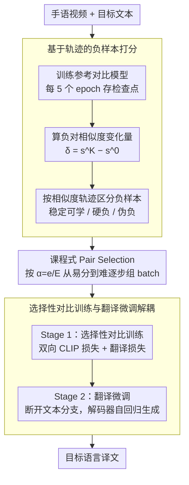

# Selective Contrastive Learning For Gloss Free Sign Language Translation

**会议**: ACL2026  
**arXiv**: [2604.22374](https://arxiv.org/abs/2604.22374)  
**代码**: 未公开  
**领域**: 多模态VLM / 手语翻译  
**关键词**: 光泽无关手语翻译、选择性对比学习、负样本选择、课程学习、跨模态对齐

## 一句话总结
这篇论文发现手语翻译中随机 in-batch 负样本经常是不可靠或语义冲突的监督信号，因此用参考模型的相似度轨迹筛选更有信息量的负样本，并通过从易到难的课程式对比学习提升 gloss-free 手语翻译质量。

## 研究背景与动机
**领域现状**：光泽无关手语翻译直接把连续手语视频映射到自然语言句子，不依赖 gloss 这种词级中间标注。近年的强方法通常在视频编码器和文本编码器之间加入 CLIP 式视觉-语言预训练，让匹配的视频-文本对靠近、非匹配对远离，再把对齐后的视觉表示送入翻译解码器。

**现有痛点**：标准对比学习把同一个 mini-batch 里除正例之外的所有文本都当作负样本，但手语视频建模开销大，batch size 往往较小，导致每次更新看到的负样本覆盖率很低。更麻烦的是，PHOENIX14T 这类窄领域数据和 CSL-Daily 这类存在重复目标句的数据里，很多“负样本”其实语义相近甚至文本完全相同，被强行推远会给跨模态对齐带来冲突监督。

**核心矛盾**：手语翻译需要更强的视频-文本对齐，但随机负样本既覆盖不足又包含伪负样本；简单扩大 batch 或加入外部标注会提高成本，而继续依赖随机对比会把一部分本应靠近的样本推远。

**本文目标**：作者希望回答两个问题：第一，in-batch 负样本在训练过程中是否真的都被有效推远；第二，能否只利用训练动态本身挑出更有价值的负样本，从而改善对齐而不引入额外标注或大语言模型辅助。

**切入角度**：论文先训练一个普通对比模型，并每隔 5 个 epoch 跟踪所有视频-文本负对的相似度轨迹。作者观察到只有 35.9% 的负样本符合“高相似到低相似”的理想趋势，31.9% 长期保持高相似，17.8% 甚至越训越相似，说明负样本贡献高度不均匀。

**核心 idea**：用参考对比模型的相似度变化量为负样本打分，再用课程学习从稳定可分的负样本逐步过渡到更难区分的负样本，替代完全随机的 in-batch 对比。

## 方法详解

### 整体框架
SCL-SLT 的流程可以拆成三步。第一步，沿用常规 CLIP 式训练，在手语视频和目标文本上训练一个参考对比模型，并保存多个训练检查点。第二步，用这些检查点计算任意视频-文本负对的相似度变化，把“训练过程中如何变化”作为负样本难度和信息量的代理信号。第三步，在目标 SLT 模型训练时，不再随机组成 mini-batch，而是按照课程比例构造包含特定负样本结构的 batch，并先做选择性对比训练，再进行翻译微调。

模型本身包含 Sign Embedding、Visual Encoder、Text Encoder 和 Decoder。Sign Embedding 用 ImageNet 预训练 ResNet-18 提取空间特征，再用两层 Conv1D/BN/ReLU 建模时间序列；Visual Encoder、Text Encoder 和 Decoder 都初始化自 mBART-large-50，其中文本编码器在对比阶段冻结，视觉编码器和解码器通过 LoRA 适配。对齐阶段用 CiCo 风格的细粒度视频-文本相似度计算双向对比损失，同时保留翻译损失；翻译微调阶段断开文本分支，只优化自回归翻译目标。

### 关键设计

**1. 基于轨迹的负样本打分：用训练动态而非单次相似度判断一个负样本值不值得学**

标准对比学习只看当前 batch 里的瞬时相似度，分不清一个负对到底是“真的难、值得学”还是“其实是伪负样本、根本不该推远”。本文换一个视角：先训练一个参考对比模型，每隔几个 epoch 存一次检查点，对视频 $V_i$ 和非匹配文本 $T_j$ 用早末两个检查点的相似度差 $\delta_{i,j}=\hat{s}^{K}(V_i,T_j)-\hat{s}^{0}(V_i,T_j)$ 刻画这个负对在训练中“怎么变”，一个 batch 的分数则是其中所有非对角视频-文本负对变化量之和。这样三类负样本就被区分开：H→L 说明模型有能力把它们推开（稳定可学），L→H 说明越训越难分（硬负样本），H→H 则很可能是语义近邻或伪负样本。把训练历史引进样本选择，更新就不容易被噪声负样本主导。

**2. 课程式 Pair Selection：从易分的负样本起步，逐步过渡到更难区分的**

如果一上来就只喂最难的负样本，伪负样本和语义近邻会直接把训练带偏；可要是一直只喂容易样本，对齐又停在表层。本文因此不再随机组 batch，而是按课程比例 $\alpha=e/E$（$e$ 为当前 epoch、$E$ 为总 epoch 数）逐步调难度：先随机选一个正例作 batch 种子，再对每个候选样本算它加入当前 batch 后带来的增量分数 $\Delta(s_u;\mathcal{C})$，把候选按分数排序后取对应分位的样本。训练早期偏稳定可分的负样本让模型先把边界学牢，后期再转向相似度高、难区分的负样本去抠细粒度差异。消融里 Log 形课程（最平滑的难度过渡）拿到最高 BLEU-4 25.30，而 Hard-Only 直接崩到 12.41，正说明这种从易到难的过渡是必需的。

**3. 选择性对比训练与翻译微调解耦：先把跨模态对齐学好，再专注生成译文**

视频-文本对齐和句子生成是两个不同目标，附录显示把普通对比损失直接并进端到端翻译训练会严重掉点。本文因此分两阶段：选择性对比阶段同时算视频→文本和文本→视频两个方向的 CLIP 式损失，并保留权重 1.0 的翻译损失，避免学出来的表示只会做检索不会生成；随后的 SLT 微调阶段干脆移除辅助文本编码器和对齐模块，让解码器只依据视频表示自回归生成目标句。把对比学习当作预训练式的对齐阶段、再单独做翻译微调，比硬把两个目标揉在一起更稳。

### 损失函数 / 训练策略
训练分为两个阶段：Stage 1 做 80 个 epoch 的选择性对比训练，Stage 2 做 200 个 epoch 的翻译微调。优化器为 AdamW，学习率 $1\times10^{-4}$，cosine decay，label smoothing 为 0.2；Stage 1 和 Stage 2 的 batch size 分别为 16 和 8。推理时使用 beam size 8。视觉编码器和解码器采用 LoRA，rank 为 16，scale 为 32；文本编码器冻结以提供稳定语言先验。

## 实验关键数据

### 主实验
论文在 PHOENIX14T 和 CSL-Daily 两个 gloss-free SLT 基准上报告 ROUGE 与 BLEU。PHOENIX14T 包含 7,096/519/642 个训练/验证/测试样本，CSL-Daily 包含 18,401/1,077/1,076 个样本。

| 设置 | 方法 | PHOENIX14T R | PHOENIX14T B4 | CSL-Daily R | CSL-Daily B4 |
|------|------|--------------|---------------|-------------|--------------|
| w/o VLP | SignLLM | 44.49 | 23.40 | 39.91 | 15.75 |
| w/o VLP | SCL-SLT | 46.33 | 25.30 | 48.53 | 21.41 |
| w/ VLP | LLAVA-SLT | 50.44 | 23.43 | 51.26 | 20.42 |
| w/ VLP | C2RL | 50.96 | 26.75 | 48.21 | 21.61 |
| w/ VLP | MMSLT | 47.97 | 25.73 | 48.92 | 21.11 |
| w/ VLP | SCL-SLT | 47.02 | 26.00 | 51.08 | 23.25 |

SCL-SLT 在 CSL-Daily 上的提升最显著，w/ VLP 设置下 BLEU-4 达到 23.25，比 C2RL 的 21.61 高 1.64，比 LLAVA-SLT 的 20.42 高 2.83。PHOENIX14T 上它没有超过 C2RL 的 26.75，但在不借助复杂辅助任务的情况下达到 26.00，说明负样本选择本身已经能带来强对齐收益。

### 消融实验

| 配置 | PHOENIX14T R | PHOENIX14T B4 | CSL-Daily R | CSL-Daily B4 | 说明 |
|------|--------------|---------------|-------------|--------------|------|
| BaseLine End-to-End | 41.81 | 21.97 | 41.04 | 16.31 | 直接训练翻译模型 |
| w/ CL | 43.55 | 22.03 | 47.77 | 20.59 | 普通随机对比学习 |
| w/ SCL | 46.33 | 25.30 | 48.53 | 21.41 | 加入选择性负样本 |
| CL-SLT | 46.13 | 25.01 | 48.34 | 20.70 | 普通对比预训练后微调 |
| SCL-SLT | 47.02 | 26.00 | 51.08 | 23.25 | 选择性对比预训练后微调 |

| 分析项 | 设置 | PHOENIX14T B4 | 关键结论 |
|--------|------|---------------|----------|
| 课程调度 | Hard-Only | 12.41 | 只用困难负样本会严重干扰训练 |
| 课程调度 | Easy-Only | 24.00 | 稳定但缺少后期细粒度挑战 |
| 课程调度 | Linear | 24.59 | 动态课程优于静态策略 |
| 课程调度 | Sqrt | 24.54 | 与 Linear 接近 |
| 课程调度 | Log | 25.30 | 最优，说明更平滑的难度过渡更稳 |
| 轨迹采样间隔 | 1 epoch | 24.68 | 过密采样引入训练噪声 |
| 轨迹采样间隔 | 5 epochs | 25.30 | 趋势和噪声之间最均衡 |
| 轨迹采样间隔 | 10 epochs | 6.26 | 过稀采样会误判负样本动态 |

### 关键发现
- 标准 CL 在 CSL-Daily 上提升很大，但在 PHOENIX14T 上几乎不涨，因为天气领域文本高度同质，随机负样本更容易包含语义近邻；SCL 对 PHOENIX14T 的提升更明显，说明它确实在处理伪负样本问题。
- CSL-Daily 中大量目标句对应多个不同视频，文本重复导致的 false negative 非常突出；Pair Selection 能显式避开一部分重复文本冲突。
- CiCo 聚合远优于 CLS Pooling 和 Mean Pooling，PHOENIX14T BLEU-4 为 25.30，而 CLS Pooling 和 Mean Pooling 分别只有 14.85 和 12.44，说明细粒度跨模态聚合是选择性对比学习的必要基础。

## 亮点与洞察
- 这篇论文最好的地方是把“负样本是否有用”从静态语义相似度问题改成了训练动态问题。相似度轨迹天然包含模型是否能学会区分某个负对的信息，比单次相似度更适合做课程学习。
- 方法没有依赖额外 gloss、动作描述或大语言模型，而是从已有训练数据内部挖掘更干净的对比信号。这对标注稀缺的手语数据很有价值。
- 对比学习在生成任务里并不是越多越好。论文的结果提醒我们，跨模态对齐目标和翻译目标最好阶段化处理，否则对齐损失可能会压制生成能力。
- Pair Selection 的思想可以迁移到图文检索、视频字幕和医学影像报告生成等场景，只要数据里存在语义近邻或重复文本，随机 in-batch negatives 都可能带来类似问题。

## 局限与展望
- 方法需要先训练一个参考对比模型来计算负样本轨迹，数据准备阶段增加了额外训练和计算开销。作者也指出未来可以考虑用现成预训练模型近似语义相似度以简化流程。
- 负样本选择仍然依赖训练集内部动态，不能从根本上识别所有语义等价样本；如果数据标注本身噪声较大，轨迹信号也可能被错误目标句影响。
- 实验集中在 PHOENIX14T 和 CSL-Daily，二者都是较受控的数据集。真实手语场景中的方言、签名者差异、遮挡和非标准表达可能带来更复杂的跨域问题。
- 当前课程策略是手工设定的分位调度，未来可以探索基于验证集对齐质量或翻译质量的自适应调度。

## 相关工作与启发
- **vs GFSLT-VLP**: GFSLT-VLP 首先把 CLIP 式预训练引入 gloss-free SLT，本文则指出普通 in-batch negatives 的质量不稳定，并在同一思路上改进负样本构造。
- **vs CiCo**: CiCo 改善的是视频-文本相似度聚合方式，SCL-SLT 借用 CiCo 计算相似度矩阵，但核心贡献在于如何选择参与对比的样本。
- **vs LLAVA-SLT / SignLLM**: 这些方法强调借助大语言模型的语言先验，SCL-SLT 则展示了不引入大模型辅助时，仅优化数据内部对比信号也能取得很强结果。
- **vs C2RL / MMSLT**: C2RL 和 MMSLT 依赖额外辅助目标或描述监督，本文的优势是简洁和可插拔，劣势是仍需要额外参考模型训练。

## 评分
- 新颖性: ⭐⭐⭐⭐ 相似度轨迹驱动的 pair-level 负样本课程学习很有针对性，问题定义清楚。
- 实验充分度: ⭐⭐⭐⭐ 主实验、课程调度、聚合方式、采样间隔都有覆盖，但跨域和真实场景验证还不够。
- 写作质量: ⭐⭐⭐⭐ 动机和负样本轨迹分析很清晰，部分表格在 HTML 中排版略拥挤。
- 价值: ⭐⭐⭐⭐⭐ 对手语翻译和其他存在伪负样本的跨模态任务都有直接启发。

<!-- RELATED:START -->

## 相关论文

- [\[ACL 2026\] Think in Latent Thoughts: A New Paradigm for Gloss-Free Sign Language Translation](think_in_latent_thoughts_a_new_paradigm_for_gloss-free_sign_language_translation.md)
- [\[ACL 2026\] CLewR: Curriculum Learning with Restarts for Machine Translation Preference Learning](clewr_curriculum_learning_with_restarts_for_machine_translation_preference_learn.md)
- [\[ACL 2026\] NeoAMT: Neologism-Aware Agentic Machine Translation with Reinforcement Learning](neoamt_neologism-aware_agentic_machine_translation_with_reinforcement_learning.md)
- [\[ACL 2026\] Structure-Guided Entity Resolution: Fine-Tuning LLMs for Robust Name Matching in Complex Linguistic Contexts](structure-guided_entity_resolution_fine-tuning_llms_for_robust_name_matching_in_.md)
- [\[ACL 2026\] TLPO: Token-Level Policy Optimization for Mitigating Language Confusion in Large Language Models](tlpo_token-level_policy_optimization_for_mitigating_language_confusion_in_large_.md)

<!-- RELATED:END -->
