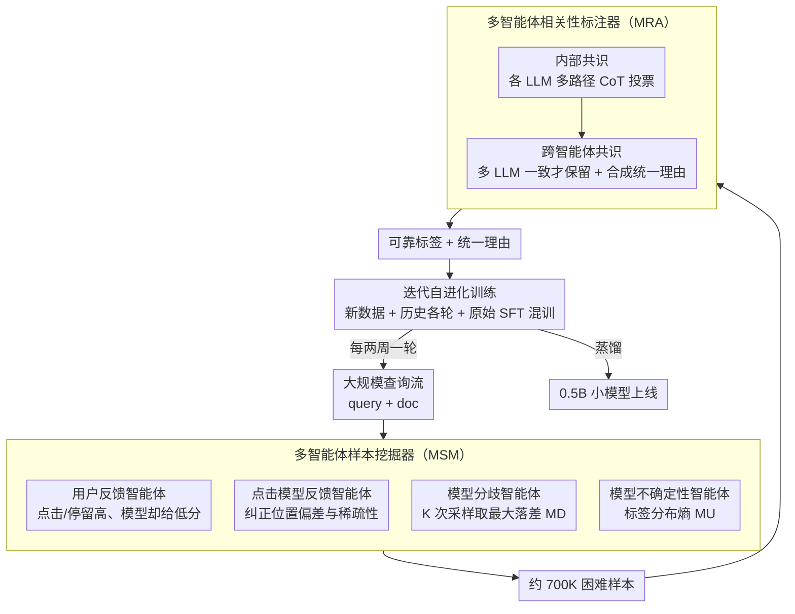

# SERM: Self-Evolving Relevance Model with Agent-Driven Learning from Massive Query Streams

**会议**: ACL 2026  
**arXiv**: [2601.09515](https://arxiv.org/abs/2601.09515)  
**代码**: 无  
**领域**: 多语言翻译  
**关键词**: 搜索相关性, 自进化模型, 多智能体标注, 查询流适应, 分布偏移

## 一句话总结

提出 SERM 框架，通过多智能体样本挖掘器和多智能体相关性标注器，从大规模真实查询流中持续自进化搜索相关性模型，经三轮迭代在工业搜索平台上实现 NDCG@1 提升 +2.99，并在在线 A/B 测试中显著提升用户留存率。

## 研究背景与动机

**领域现状**：搜索相关性建模是信息检索的核心，目标是对给定查询的候选文档进行排序。传统方法采用判别式建模（编码器+打分函数），近期研究利用 LLM 的生成能力直接生成相关性判断和理由。标准训练流程是"持续预训练+监督微调"两阶段。

**现有痛点**：真实世界的查询分布是动态持续演化的——用户不断引入新表达、新文化引用和新兴语言模式。静态训练数据无法覆盖这些变化，导致模型泛化能力不足。例如"remember me pets arriving on 10/27"这类查询包含了模型难以捕获的细微语义（纪念已故宠物 vs 通用的宠物回家）。

**核心矛盾**：自进化（self-evolution）是一个有前景的方向，但在工业级大规模查询流上面临两个挑战：(C1) 信息量大的样本在海量查询中极其稀疏，难以识别；(C2) 模型自身生成的伪标签可能不可靠，导致错误累积。

**本文目标**：设计一个能从大规模查询流中持续自进化的搜索相关性模型，同时解决样本发现和标签可靠性两个挑战。

**切入角度**：使用多智能体框架——多个角色各司其职：环境反馈智能体利用用户点击/停留信号发现困难样本，内省反馈智能体利用模型自身的不一致性和不确定性识别弱点，多智能体标注器通过两级共识机制生成可靠标签。

**核心 idea**：用多智能体样本挖掘器从海量查询流中高效筛选出模型最需要学习的困难样本，再用多智能体标注器（多 LLM + 内外共识）为这些样本生成可靠标签，实现迭代自进化。

## 方法详解

### 整体框架

SERM 想解决的是一个工业搜索里很现实的问题：查询分布每天都在变，但相关性模型一旦训完就停在原地。它建立在一个 LLM 生成式相关性模型之上——输入 query+doc，模型先生成判断理由、再吐出 0-3 的相关性分数。在这个底座之上，SERM 套了一个每两周转一圈的自进化循环：先让"多智能体样本挖掘器"从新一批查询流里捞出约 700K 个模型最该学的困难样本，再让"多智能体标注器"给这些样本打上可靠标签，最后把新数据混进历史 SFT 数据一起重训，既吸收新分布又不忘旧知识。整个闭环的两个难点——困难样本太稀疏、伪标签不可靠——正好由挖掘器和标注器分别接管。

### 关键设计

**1. 多智能体样本挖掘器（MSM）：在海量查询里把"模型最该补课"的样本捞出来**

困难样本在工业级查询流里极其稀疏，单靠任何一种信号都会漏掉一大片——用户行为有位置偏差和稀疏性，模型内部信号又看不到外部世界的新需求。MSM 因此并行部署四类互补的智能体，用它们的并集去覆盖不同类型的"难"。前两类盯外部信号：用户反馈智能体专挑"用户点击多、停留久，模型却给低分"这类人机矛盾对；点击模型反馈智能体则用一个预训练点击模型去补偿原始点击的位置偏差和稀疏性。后两类盯模型自身的动摇：模型分歧智能体对同一个 query-doc 用温度采样跑 K 次，取判断之间的最大落差

$$MD(q,d) = \max_{i,j} |f^i(q,d) - f^j(q,d)|$$

落差越大说明模型越没主意；模型不确定性智能体则直接算标签分布的熵 $MU(q,d) = -\sum_y \Pr(y|q,d) \log \Pr(y|q,d)$，熵高同样意味着模型在这条样本上摇摆。外部矛盾捕获模型不知道的世界变化，内部动摇暴露模型自己的认知空白，两边合起来才是一份既全面又精准的"补课清单"。

**2. 多智能体相关性标注器（MRA）：用跨模型共识把伪标签的噪声层层滤掉**

挖出来的困难样本如果还是让模型自己打标，就会落进自训练的老坑——错误标签反复喂回去、越滚越偏。MRA 改用一套两级共识来产出可信标签。第一级是内部共识：每个 LLM（如 GPT-4o、Gemini 2.5 Pro）先检索外部知识补足背景，再用多路径 CoT 生成若干条独立推理链，对这些链做多数投票，把单次输出的随机性压下去。第二级是跨智能体共识：只保留多个不同 LLM 都打成同一标签的样本，并把所有支持该标签的推理路径整合成一条统一理由。这样一来，内部投票治的是"同一个模型每次说法不一样"，跨模型一致治的是"某个模型自带的系统偏差"，两道关卡叠在一起才能过滤掉自训练里最致命的噪声标签——这也是 MRA 和单向知识蒸馏的根本区别：它是会随迭代越变越强的进化性反馈，而非固定教师的一次性传授。

**3. 迭代自进化训练：每轮混合新旧数据重训，让模型跟着分布一起长**

有了可靠标签，最后一步是怎么把它喂回模型而不翻车。SERM 每轮迭代都把新生成数据、历史各轮迭代数据和原始 SFT 数据混在一起重训，用旧数据当锚防止灾难性遗忘，用新数据追分布漂移。迭代周期定在两周一次，是为了确保两次之间查询分布已经攒够了足够的偏移、值得重训。训练好的大模型还可以蒸馏到 0.5B 小模型上线，以满足搜索场景的延迟约束——而且因为标签本身更干净，蒸馏到小模型后的效果也比自训练蒸馏更好。

### 一个完整示例：一条查询样本如何走完一圈

以查询 "remember me pets arriving on 10/27" 为例。这是一条难样本：用户其实在找"纪念已故宠物"的服务，但字面又像"宠物在 10/27 到家"。在挖掘阶段，用户反馈智能体发现用户大量点击了纪念类结果、停留很久，而模型却给这些结果打了低分——一条典型的人机矛盾对被捞出；与此同时模型分歧智能体跑 K 次采样，发现模型在 1 分和 3 分之间反复横跳，$MD$ 很高，进一步坐实它是难样本。进入标注阶段，GPT-4o 和 Gemini 2.5 Pro 各自检索"remember me pets"相关背景、各跑多条 CoT，内部投票后都判定纪念类文档为高相关；两个模型跨模型一致，于是这条样本被保留，推理路径被合成统一理由。最后这条带可靠标签的样本和历史 SFT 数据一起进入第 N 轮重训，下一轮里模型就能正确处理这类语义细微的查询了。

### 损失函数 / 训练策略

生成式建模目标 $\mathcal{L}_g = -\mathbb{E} \log \Pr_\theta(y|q,d)$，模型生成理由后输出 0-3 的相关性分数。迭代训练时混合三类数据以防遗忘。蒸馏使用 KL 散度损失。

## 实验关键数据

### 主实验

| 方法 | 模型 | Germanic NDCG@1 | Romance NDCG@1 | Minor Lang NDCG@1 |
|--------|------|------|----------|------|
| CT+SFT | 7B | 84.74 | 85.61 | 82.02 |
| Self-Training Iter3 | 7B | 84.78 | 85.58 | 82.20 |
| SERM Iter3 | 7B | 87.56 | 88.14 | 84.99 |
| CT+SFT | 1.5B | 84.59 | 85.99 | 81.75 |
| SERM Iter3 | 1.5B | 87.30 | 87.83 | 84.75 |

### 在线 A/B 测试

| 指标 | 提升 | P值 |
|------|---------|------|
| 14天留存率 | +0.0359% | 0.0278 |
| 用户负面反馈 | -1.2081% | 0.0001 |
| 换词查询率 | -0.0839% | 0.0023 |
| 换词查询率(长尾) | -0.1312% | 0.0015 |

### 关键发现

- SERM 三轮迭代后 NDCG@1 提升 +2.82（7B）/ +2.71（1.5B），而自训练仅 +0.04 / +0.45，且自训练在第三轮出现退化（错误传播）
- 蒸馏效果：SERM 蒸馏到 0.5B 的效果优于自训练蒸馏，说明更可靠的标签传递到了小模型
- 在线 A/B 测试显示显著的用户体验改善——负面反馈减少 1.2%、14 天留存提升 0.036%，在日均数十亿请求的平台上这是非常显著的
- 自训练的不稳定性在第三轮尤为明显（Germanic NDCG@1 从 84.95 回落到 84.78），验证了伪标签错误累积的问题

## 亮点与洞察

- **多智能体协作的精巧设计**：环境反馈（用户信号）和内省反馈（模型不确定性）互补覆盖——前者捕获模型不知道的外部信息，后者发现模型自身的认知空白。这种设计可迁移到任何需要从数据流持续学习的系统
- **两级共识标注机制**：内部多路径投票+跨模型共识，层层过滤噪声。相比简单的知识蒸馏或自训练，这种机制从根本上解决了伪标签不可靠的问题
- **工业级验证**：在日均数十亿请求的真实搜索平台上进行了在线 A/B 测试，结果具有很强的说服力

## 局限与展望

- 依赖 GPT-4o 和 Gemini 2.5 Pro 作为标注器，API 调用成本高昂，且标注器自身也可能有偏差
- 每两周一次的迭代频率可能跟不上突发热点事件导致的查询分布剧变
- 当前仅在文档搜索上验证，扩展到视频/图像搜索等多模态场景需要额外适配
- 可探索：降低对外部 LLM 的依赖（用自身模型作为标注者之一形成混合共识）、引入主动学习策略更高效地选择标注样本

## 相关工作与启发

- **vs 自训练（Self-Training）**：自训练直接用模型自身预测作为伪标签，在三轮迭代后出现退化；SERM 通过外部 LLM 多智能体共识提供可靠标签，持续稳定提升
- **vs 知识蒸馏**：蒸馏是从固定教师到学生的单向知识传递；SERM 是迭代进化反馈——每轮的模型都比上轮更强，标注质量也随之提升

## 评分

- 新颖性: ⭐⭐⭐⭐ 多智能体样本挖掘和两级共识标注的组合新颖，针对工业场景设计合理
- 实验充分度: ⭐⭐⭐⭐⭐ 离线多语言评测+在线 A/B 测试，工业级验证极具说服力
- 写作质量: ⭐⭐⭐⭐ 问题动机和方法描述清晰，但公式符号略多
- 价值: ⭐⭐⭐⭐⭐ 直接解决工业搜索中的核心痛点，已在大规模平台上线验证

<!-- RELATED:START -->

## 相关论文

- [\[ACL 2026\] Scripts Through Time: A Survey of the Evolving Role of Transliteration in NLP](scripts_through_time_a_survey_of_the_evolving_role_of_transliteration_in_nlp.md)
- [\[ACL 2026\] CLewR: Curriculum Learning with Restarts for Machine Translation Preference Learning](clewr_curriculum_learning_with_restarts_for_machine_translation_preference_learn.md)
- [\[ACL 2026\] FairQE: Multi-Agent Framework for Mitigating Gender Bias in Translation Quality Estimation](fairqe_multi-agent_framework_for_mitigating_gender_bias_in_translation_quality_e.md)
- [\[ACL 2026\] From Fragments to Facts: A Curriculum-Driven DPO Approach for Generating Hindi News Veracity Explanations](from_fragments_to_facts_a_curriculum-driven_dpo_approach_for_generating_hindi_ne.md)
- [\[NeurIPS 2025\] MERIT: Multilingual Semantic Retrieval with Interleaved Multi-Condition Query](../../NeurIPS2025/multilingual_mt/merit_multilingual_semantic_retrieval_with_interleaved_multi-condition_query.md)

<!-- RELATED:END -->
