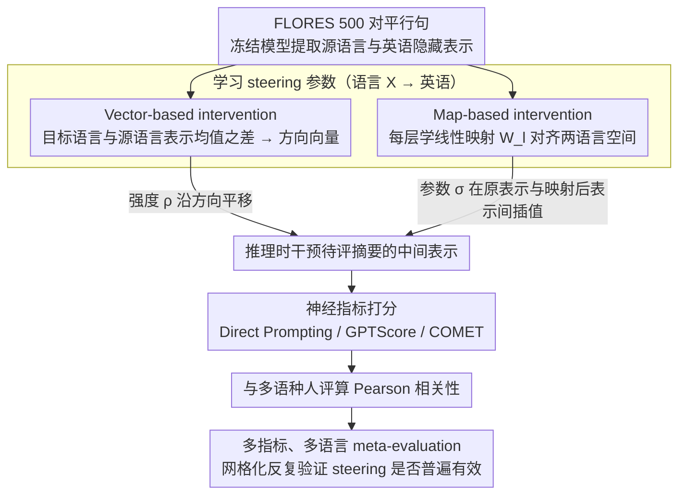

# SteerEval: Inference-time Interventions Strengthen Multilingual Generalization in Neural Summarization Metrics

**会议**: ACL2026  
**arXiv**: [2601.15809](https://arxiv.org/abs/2601.15809)  
**代码**: 论文未提供公开仓库链接  
**领域**: 多语种评测 / 机器翻译与摘要评估  
**关键词**: activation steering、多语种摘要评测、LLM-as-a-judge、COMET、英文枢轴语言

## 一句话总结
SteerEval 研究在推理时把多语种评测模型的隐藏表示向高资源枢轴语言对齐，发现向英语或法语方向 steering 能普遍提高多语种摘要自动指标与人工评分的相关性，尤其能改善低基线语言和 encoder-based COMET 指标。

## 研究背景与动机
**领域现状**：摘要和自然语言生成任务长期依赖自动指标来替代昂贵的人评。从 BLEU、ROUGE 到 COMET、BERTScore，再到 LLM-as-a-judge，模型型指标在英文任务上越来越常见，也逐渐被用于多语种评测。

**现有痛点**：多语种场景下，模型指标与人工判断的相关性并不稳定。尤其在 Yoruba、Hebrew、Turkish 等语言上，一些 LLM 评分器甚至出现接近零或负相关。这意味着直接把英文评测范式迁移到低资源语言，会给系统比较和研究进展带来噪声。

**核心矛盾**：多语种 LLM 常被认为内部使用英语作为 pivot language。这个内部几何结构有助于跨语种泛化，但当目标语言表示没有很好对齐到这个枢轴空间时，下游生成或评测质量会下降。问题是：这种表示错位是否也会影响自动评测指标？

**本文目标**：作者想验证一个简单假设：如果在推理时把低资源或非英语输入的内部表示 steering 到英语方向，是否能让神经摘要评测指标更接近人工判断。

**切入角度**：论文不是重新训练指标，而是在冻结的模型内部做 test-time intervention。它同时覆盖 decoder-based LLM-as-a-judge 和 encoder-based COMET，观察 steering 是否是更通用的多语种评测修正工具。

**核心 idea**：用 FLORES 平行句学习“语言 X 到英语”的向量或线性映射，在评测时对模型隐藏表示做可控插值/偏移，再看 Pearson correlation 是否提高。

## 方法详解

### 整体框架
SteerEval 不重训任何评测指标，而是想验证一件事：如果多语种 LLM 内部确实拿英语当枢轴空间，那么把低资源输入的隐藏表示往英语方向"推一推"，评测指标和人评的相关性会不会变好。整个 pipeline 分三步。第一步在冻结模型上用 FLORES 的 500 对平行句提取源语言和英语的隐藏表示，从中学出"语言 X → 英语"的 steering 方向或线性映射。第二步在评测推理时，按一个强度参数把待评摘要的中间表示朝英语方向调整。第三步用调整后的神经指标给系统摘要打分，再和多语种人工评分算 Pearson correlation，看是否真的提高。

作者把这套干预同时挂在三类指标上检验通用性：Direct Prompting 让 LLM 直接输出 1-5 分；GPTScore 用条件生成概率给摘要打分；COMET 用 wmt22-comet-da，并把它从机器翻译改作摘要评估——source 留空、系统摘要当 hypothesis、人工摘要当 reference。

### 关键设计
**1. Vector-based intervention：用一个语言方向向量把表示平移到英语方向**

如果"英语枢轴"在表示空间里真对应某个近似线性的方向，那最轻的办法就是直接沿这个方向平移，连训练新指标都省了。具体做法是对同一批平行句，算出目标语言表示均值与源语言表示均值之差，得到每一层的语言方向向量，评测时把这个方向乘以强度 $\rho$ 加到源语言输入的隐藏状态上。对 LLM 类指标是逐层施加方向，对 COMET 则只在 pooled representation 上动一刀。参数少、最直接，但也因为方向和距离都没归一化，$\rho$ 的数值含义在不同语言间并不一致——这也是后面分析里正负强度表现迥异的根源。

**2. Map-based intervention：学一个线性映射，把源语言表示整体投到目标语言空间**

向量差只能建模平移，可不同语言之间的表示错位往往还带着旋转和缩放，单靠平移盖不住。于是这一支为每层学一个矩阵 $W_l$，最小化源语言表示经线性变换后与目标语言表示的距离；推理时再用参数 $\sigma$ 在原表示和映射后的目标表示之间做插值，$\sigma$ 越大越靠近目标语言。比起向量平移，线性映射能吃下更复杂的几何变换，代价是参数更多、需要平行句做最小二乘式对齐。

**3. 多指标、多语言 meta-evaluation：把 steering 放进一个交叉网格里反复验，防止偶然结论**

多语种评测的坑在于语言、模型、prompt 和评价维度会互相纠缠，只在一个模型或一种语言上看到提升，很容易是运气。为此作者把 LLM backbone 铺到 Llama-3-8B Instruct、Bloom-7B、Aya-expanse-8B 和 Aya-expanse-32B，语言铺到 Arabic、Spanish、Hebrew、Japanese、Turkish、Ukrainian、Yoruba、Chinese，评价维度覆盖 coherence 和 completeness，再在这整张网格上系统比较 steering 前后。只有当提升在多数格子里都成立，才敢说 steering 是个通用的多语种评测修正工具，而不是某个 backbone 的偶然现象。

### 损失函数 / 训练策略
本文没有重新训练评测模型，steering 参数全部来自冻结模型的隐藏表示：vector 方法算均值差，map 方法用平行句做最小二乘式对齐。由于没有语言特定开发集，主结果报告的是每种语言和设置下"最佳 steering 强度"的 oracle 结果；作者在分析部分另行系统扫描 $\sigma$ 和 $\rho$，并讨论真实部署时需要靠验证集来选参，而非直接套用 oracle 强度。

## 实验关键数据

### 主实验
未 steering 的 baseline 显示，多语种神经评测指标本身并不稳定。最高 Pearson correlation 只有 0.34，且多个语言、模型和维度出现负相关。

| 指标 / 模型 | 代表性强项 | 代表性弱项 | 结论 |
|-------------|------------|------------|------|
| COMET wmt22-comet-da | Arabic completeness 0.27，Japanese completeness 0.23 | Yoruba coherence -0.05，Yoruba completeness -0.04 | 小型 encoder 指标在部分语言上有竞争力，但低资源语言不稳 |
| Direct Prompting Bloom-7B | Chinese coherence 0.08 | 多个语言为负，如 Arabic completeness -0.14 | 直接打分对模型和语言非常敏感 |
| Direct Prompting Llama3-8B | Japanese coherence 0.24，Japanese completeness 0.29 | Hebrew coherence -0.05，Hebrew completeness -0.08 | Llama3 是 direct prompting 中较稳的 backbone |
| GPTScore Aya-exp 32B | Japanese completeness 0.34 | Yoruba completeness -0.07 | GPTScore 通常比直接 prompting 更稳定 |
| GPTScore Llama3-8B | Spanish coherence 0.23，Chinese coherence 0.22 | Yoruba coherence -0.06 | 中高资源语言相关性更好 |

steering 后，整体趋势是绝大多数设置相关性提升，低 baseline 设置收益更大。

| 现象 | 关键数字或例子 | 含义 |
|------|----------------|------|
| steering 近乎普遍有效 | 多数语言、指标和维度提升，部分相对提升超过 100% | 表示对齐能改善评测指标和人评的一致性 |
| 低 baseline 语言收益更明显 | Hebrew、Turkish、Yoruba 常有更大相对提升 | 原本表示错位更严重的语言更需要 intervention |
| Direct Prompting 可大幅改善但绝对值仍有限 | Bloom-7B Japanese coherence 从接近 0 提升到 0.18 | 百分比提升可能受低分母影响，直接 prompting 仍不是最稳指标 |
| 中等 baseline 也能提升 | Llama3-8B Spanish coherence 从 0.15 提升到 0.20 | steering 不只是在修复崩坏设置，也能带来稳健增益 |
| COMET 对 steering 很敏感 | 多个语言/维度相对提升超过 +50% | encoder-based metric 也能从隐藏表示 intervention 获益 |

### 消融实验
论文的分析实验围绕 steering 方法、强度参数和目标语言展开。

| 分析项 | 发现 | 解释 |
|--------|------|------|
| Vector vs Map | 两者通常都有提升，Vector 在 COMET 和低 baseline 设置中常有更大增益 | 向量法参数少但强度更语言特定，可能更激进 |
| Map 强度 $sigma$ | 更大的 $sigma$ 通常带来更高平均相对提升，$sigma=1$ 平均最好 | 完全靠近目标语言表示有时最有利，但不保证所有语言都涨 |
| Vector 强度 $rho$ | $rho=-5$ 平均相对提升最高，约 60% 设置优于无 steering；正 $rho$ 平均有害 | 方向与距离未归一化，数值含义跨语言不一致 |
| 语言向量相似性 | 除 Yoruba 外，多数 Language X 到 English 向量在中间层相似度较高 | 支持跨语言共享几何结构，但 Yoruba 是明显 outlier |
| 法语作为目标 | 多数设置也有显著提升 | 高资源且与英语空间对齐良好的语言也可作为 pivot |

### 关键发现
- 多语种摘要评测的瓶颈不仅是数据少，也可能是评测模型内部表示没有对齐到其偏好的高资源枢轴空间。
- Direct Prompting 的方差最大，GPTScore 更稳定，COMET 在 steering 下意外地有较大提升空间。
- steering factor 的选择非常敏感；没有开发集时 oracle 结果只能说明潜力，不能直接等价于实际部署性能。
- 语言向量的跨语言相似性支持“共享语言几何”假设，但 Yoruba 这类 outlier 提醒我们不能把所有语言当作同一方向处理。

## 亮点与洞察
- 论文把 activation steering 从生成质量控制扩展到“评测指标校准”，这是很有意思的应用转向。
- 对 COMET 的实验尤其有启发：即使是 encoder-based metric，也可以通过 pooled representation intervention 改善多语种人评相关性。
- 方法不需要重新训练指标，适合在已有评测 pipeline 中作为轻量 test-time 修正模块探索。
- 结果也提醒 LLM-as-a-judge 的多语种可靠性不能只看英文或高资源语言，低资源语言上可能出现负相关。

## 局限与展望
- 主结果使用 oracle steering strength，因为数据缺少语言特定开发集；真实系统需要验证集或无监督准则选 $rho$ / $sigma$。
- 人评数据每种语言样本数和标注人数有限，部分相关性估计可能方差较大。
- 任务集中在摘要评估的 coherence 和 completeness，尚未覆盖事实一致性、风格、问答或开放式生成评价。
- steering 的收益和目标语言相关，英语和法语都有效，但不同源-目标组合的最优选择仍需系统研究。
- Direct Prompting 的绝对相关性仍偏低，steering 不能替代更好的指标设计和多语种标注数据。

## 相关工作与启发
- **vs BLEU / ROUGE**: 传统 overlap 指标简单可复现，但跨语言和语义层面不足；SteerEval 面向模型型指标的内部表示校准。
- **vs COMET**: COMET 本来是机器翻译指标，本文将其适配到摘要评估并证明 encoder 指标也可被 steering 改善。
- **vs LLM-as-a-judge**: 直接提示 LLM 打分可用但不稳定；SteerEval 说明评分前的隐藏表示对齐也会影响 judge 行为。
- **vs Wang et al. multilingual steering**: 既有工作把语言映射用于改善生成任务；本文把同一思想迁移到自动评测，目标从生成质量变为与人评相关性。
- **启发**: 多语种评测可能需要“指标校准层”，未来可以把 activation steering、语言特定 prompt、少量人评开发集结合起来。

## 评分
- 新颖性: ⭐⭐⭐⭐☆ 把推理时表示 intervention 用于多语种评测指标校准，视角新且问题重要。
- 实验充分度: ⭐⭐⭐⭐☆ 覆盖多指标、多模型、多语言和参数分析，但 oracle 选参削弱了部署层面的说服力。
- 写作质量: ⭐⭐⭐⭐☆ 动机清楚，实验结果解释细致；部分图表依赖相对提升，阅读时需要注意低 baseline 的放大效应。
- 价值: ⭐⭐⭐⭐☆ 对多语种 NLG 评测和 LLM-as-a-judge 可靠性研究有明显启发。

<!-- RELATED:START -->

## 相关论文

- [\[ACL 2025\] Beyond N-Grams: Rethinking Evaluation Metrics and Strategies for Multilingual Abstractive Summarization](../../ACL2025/multilingual_mt/beyond_n-grams_rethinking_evaluation_metrics_and_strategies_for_multilingual_abs.md)
- [\[ACL 2026\] Enhancing BiGRU with a KAN Block for Legal Document Classification and Summarization](enhancing_bigru_with_a_kan_block_for_legal_document_classification_and_summariza.md)
- [\[ACL 2025\] Bridging the Language Gaps in Large Language Models with Inference-Time Cross-Lingual Intervention](../../ACL2025/multilingual_mt/bridging_the_language_gaps_in_large_language_models_with_inference-time_cross-li.md)
- [\[ACL 2026\] Scripts Through Time: A Survey of the Evolving Role of Transliteration in NLP](scripts_through_time_a_survey_of_the_evolving_role_of_transliteration_in_nlp.md)
- [\[ACL 2026\] LQM: Linguistically Motivated Multidimensional Quality Metrics for Machine Translation](lqm_linguistically_motivated_multidimensional_quality_metrics_for_machine_transl.md)

<!-- RELATED:END -->
