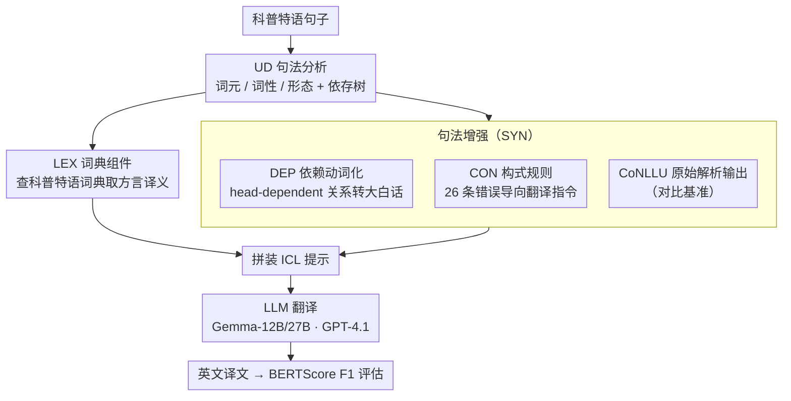

# Syntax as a Rosetta Stone: Universal Dependencies for In-Context Coptic Translation

**会议**: ACL 2026  
**arXiv**: [2604.18758](https://arxiv.org/abs/2604.18758)  
**代码**: [GitHub](https://github.com/gucorpling/in-context-coptic-translation)  
**领域**: 低资源机器翻译 / 多语言NLP  
**关键词**: 低资源机器翻译, 科普特语, Universal Dependencies, 上下文学习, 句法增强

## 一句话总结

本文首次探索将 Universal Dependencies 句法信息作为上下文学习的增强源用于低资源科普特语到英语的机器翻译，发现虽然句法信息单独不如词典有效，但将词典与句法信息结合（LEX+SYN）在所有模型上取得最佳效果，Gemma-27B 的 BERTScore F1 达到 0.8746（+0.0361）。

## 研究背景与动机

**领域现状**：LLM 在高资源语言翻译上已接近实用水平，但低资源语言（LRL）几乎没有受益——模型对这些语言缺乏基本的语言建模能力。利用双语词典增强 ICL 提示已被证明有效，但词典只能提供逐词翻译，无法编码语法关系。

**现有痛点**：(1) 科普特语是一种黏着语，语法构造（如助动词系统、延后主语）承载的意义差异仅从内容词无法推断；(2) 即使是 GPT-4.1 这样的大模型，在无增强的情况下也会产生流畅但根本错误的科普特语翻译；(3) 简单词汇表存在信息天花板——无法告知模型语法结构。

**核心矛盾**：词典增强只覆盖词汇维度，语法维度的信息鸿沟限制了翻译质量的上限。需要一种方式将语法信息注入上下文提示。

**本文目标**：验证 UD 句法信息能否在 ICL 设置下为低资源翻译提供词典之外的互补增益。

**切入角度**：利用科普特语已有的 UD 树库（60K tokens，2387 句），设计多种句法信息表示方式（原始 CoNLL-U、自然语言动词化、基于错误分析的构式规则），测试其与词典的组合效果。

**核心 idea**：句法信息和词典信息是正交互补的——词典解决"每个词是什么意思"，句法解决"词与词之间的关系如何"。将两者组合可以突破词典增强的信息天花板。

## 方法详解

### 整体框架

这篇论文要回答的问题很聚焦：在纯 ICL（不训练）的设定下，UD 句法信息能不能给低资源的科普特语→英语翻译带来词典之外的互补增益。整套流程是：先对输入句做 UD 句法分析（拿到词元、词性、形态和依存树），再从分析结果派生出四个可以塞进提示的信息组件——LEX（双语词典映射）、DEP（UD 依赖关系的自然语言动词化）、CON（基于错误分析的 26 条构式规则）、CoNLLU（原始 UD 解析输出），把它们按设置拼进 ICL 提示喂给 LLM 翻译，最后以 BERTScore F1 为主指标系统比较单组件和组合，看"词典 + 句法"能否突破词典单独使用的天花板。

### 关键设计

**1. LEX 词典组件：把每个科普特词的意思先喂给模型当底座**

低资源翻译里 LLM 连基本词汇都摸不准，所以最先要补的是"每个词是什么意思"。LEX 利用句法分析给出的词性和形态信息（词元和分词），到科普特语词典里检索方言特定的英文翻译，再做一道过滤、只保留最相关的层级条目以控制提示长度。它本身已被既有工作证明对低资源翻译有效，在本文里既是一个实打实的增强组件，也充当后续所有句法增强的比较基准——句法到底有没有用，全看它能不能在 LEX 之上再加分。

**2. CON 构式规则组件：针对模型实际犯的错，定点提供语法翻译指令**

词典补得了词义，却补不了语法构造承载的意义——科普特语是黏着语，助动词系统、延后主语这类结构差异光看内容词根本推不出来。CON 走的是"以错误为导向"的路子：作者人工分析 GPT-4.1 mini 在开发集上的翻译错误，结合句法分析归纳出 26 个常见错误模式，再用 DepEdit 模板去匹配依赖子树，从简单规则（如祈使句识别）到复杂规则（如延后主语构造）自动检测命中并生成对应的翻译指导。和泛泛提供所有语法信息不同，它只在模型真正会栽跟头的地方塞进定向提示，因此是四个组件里最具定制性、也最贴模型弱点的一个。

**3. DEP 依赖动词化组件：把 UD 结构翻成大白话，让模型真能用上词间关系**

原始 CoNLL-U 格式 LLM 因为见过训练数据可能"眼熟"，但眼熟不等于真懂里头的语义关系。DEP 因此把每个句子的 head-dependent 关系提取出来，动词化成一句句纯英文陈述（如 "n is the case marking of you"），让结构信息以 LLM 更容易消化的自然语言形式进入提示。动词化过程有几个可控旋钮：选哪套 UD 标签集、选哪些词性、以及对重复 token 怎么消歧——这些决定了注入信息的粒度和噪声。本质上它和 CON 互补，CON 管"典型错误怎么救"，DEP 管"一般句法关系怎么读"。

### 损失函数 / 训练策略

纯 ICL 设置，无训练。使用 Gemma-12B/27B 和 GPT-4.1 三个模型。评估使用 UD 树库的标准 dev（380 句）和 test（405 句）集。

## 实验关键数据

### 主实验

**Test 集 BERTScore F1**

| 设置 | Gemma-12B | Gemma-27B | GPT-4.1 |
|------|----------|----------|---------|
| Baseline | 0.8363 | 0.8385 | 0.9012 |
| LEX | 0.8551 (+0.019) | 0.8565 (+0.018) | 0.9152 (+0.014) |
| LEX+SYN | **0.8707 (+0.034)** | **0.8746 (+0.036)** | **0.9195 (+0.018)** |

### 消融实验

| 设置 | BERTScore Δ (Gemma-27B test) | 说明 |
|------|---------------------------|------|
| Baseline | 0.0000 | 无增强 |
| DEP alone | +0.0033 | 仅依赖动词化，提升微弱 |
| CON alone | +0.0133 | 构式规则单独有效 |
| CoNLLU alone | +0.0162 | 原始解析输出效果不错 |
| LEX alone | +0.0181 | 词典最有效的单组件 |
| LEX+SYN | +0.0361 | 组合效果远超单组件 |

### 关键发现

- 句法信息单独不如词典，但组合后提供了超越词典的显著增益（LEX+SYN 比 LEX alone 在 Gemma-27B 上多提升 0.018）
- 组合效果是累加的——LEX 和 SYN 各自的增益叠加接近 LEX+SYN 的总增益
- 自动解析与金标准解析的差距很小，说明句法增强对解析器错误具有鲁棒性
- 在非圣经文本上的增益更大，说明句法信息在模型无法通过记忆识别经文时更有价值

## 亮点与洞察

- 将 UD 句法信息用于 ICL 翻译是首创——证明了语法知识可以作为"另一种参考资料"注入提示
- CON 组件的设计体现了"以错误为导向"的工程哲学——不是泛化地提供所有语法信息，而是针对模型实际犯的错误提供定向指导
- 在LRL翻译的实际应用场景中，这种方法有明确的价值——可以减少专家校正译文的工作量

## 局限与展望

- 仅限科普特语到英语的单一方向
- 段落级翻译限制了对篇章级现象的评估
- CON 组件需要语言专家参与错误分析
- 未探索利用平行例句（few-shot examples）的效果

## 相关工作与启发

- **vs Dictionary-only ICL**: LEX 是基线，本文证明句法增强提供了词典无法覆盖的互补信息
- **vs Grammar excerpt approaches**: 从语法书提取的规则是通用的，CON 是针对模型弱点定制的
- **vs Fine-tuning approaches**: 微调需要平行数据且效果仍不理想，ICL+增强更灵活

## 评分

- 新颖性: ⭐⭐⭐⭐ 首次将UD句法信息用于ICL翻译，CON组件设计巧妙
- 实验充分度: ⭐⭐⭐⭐ 多模型+多组件消融+金标准vs自动解析+圣经vs非圣经分析
- 写作质量: ⭐⭐⭐⭐⭐ 论文结构清晰，语言学背景介绍充分
- 价值: ⭐⭐⭐⭐ 对低资源翻译研究有明确贡献，方法可迁移到其他LRL

<!-- RELATED:START -->

## 相关论文

- [\[ACL 2025\] Exploring In-context Example Generation for Machine Translation](../../ACL2025/multilingual_mt/exploring_in-context_example_generation_for_machine_translation.md)
- [\[ACL 2025\] Understanding In-Context Machine Translation for Low-Resource Languages: A Case Study on Manchu](../../ACL2025/multilingual_mt/understanding_in-context_machine_translation_for_low-resource_languages_a_case_s.md)
- [\[ACL 2025\] GrammaMT: Improving Machine Translation with Grammar-Informed In-Context Learning](../../ACL2025/multilingual_mt/grammamt_improving_machine_translation_with_grammar-informed_in-context_learning.md)
- [\[ACL 2026\] EMCEE: Improving Multilingual Capability of LLMs via Bridging Knowledge and Reasoning with Extracted Synthetic Multilingual Context](emcee_improving_multilingual_capability_of_llms_via_bridging_knowledge_and_reaso.md)
- [\[ACL 2025\] THOR-MoE: Hierarchical Task-Guided and Context-Responsive Routing for Neural Machine Translation](../../ACL2025/multilingual_mt/thor-moe_hierarchical_task-guided_and_context-responsive_routing_for_neural_mach.md)

<!-- RELATED:END -->
