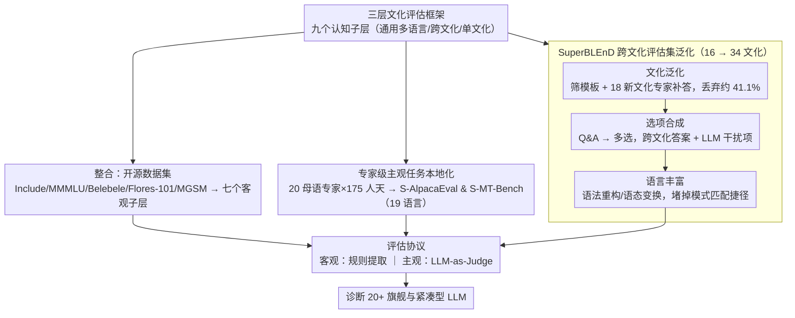

# The GaoYao Benchmark: A Comprehensive Framework for Evaluating Multilingual and Multicultural Abilities of Large Language Models

**会议**: ACL 2026  
**arXiv**: [2604.20225](https://arxiv.org/abs/2604.20225)  
**代码**: [github.com/lunyiliu/GaoYao](https://github.com/lunyiliu/GaoYao)  
**领域**: 人类理解 / 多语言评估  
**关键词**: 多语言基准、多文化评估、LLM评估、语言公平性、文化理解

## 一句话总结
本文提出GaoYao基准，包含182.3K样本、26种语言和51个国家/地区，通过三层文化评估框架（通用多语言/跨文化/单文化）和九个认知子层，结合人工本地化的主观测试集和专家验证的跨文化合成数据集SuperBLEnD，深度诊断20+旗舰与紧凑型LLM的多语言能力，揭示了显著的地理数字鸿沟和任务能力分层。

## 研究背景与动机

**领域现状**：LLM正在服务全球用户，多语言能力已成为衡量其包容性的关键指标。现有多语言评估基准数量众多，涵盖知识问答、阅读理解、翻译等任务，但各自覆盖单一方面。

**现有痛点**：当前基准面临三个关键限制：(1) 评估维度碎片化——多数基准聚焦于语言能力的单一方面（如知识或阅读理解），忽视深层文化细微差别，将多语言能力视为孤立的评估点而非根植于文化认知的互联维度；(2) 主观任务的语言覆盖不足——指令遵循和多轮对话等关键任务主要在英语中评估，多语言扩展依赖低质量的机器翻译（如"列出以字母A开头的词"直译到无字母A的语言后无意义）；(3) 分析缺乏诊断深度——现有研究止步于肤浅的排行榜排名，未揭示性能差异背后的地理、任务类型或模型架构关联。

**核心矛盾**：表面上的语言流利度不等于深层文化理解（如"龙"在东西方文化中的含义截然不同），但现有基准主要评估冰山一角的通用语言能力，无法诊断模型在文化敏感性上的真实水平。

**本文目标**：构建一个系统性、高质量、具有深度诊断分析能力的多语言多文化评估基准。

**切入角度**：基于文化冰山模型和Bloom认知分类法，设计分层评估框架；通过175人/天的专家本地化确保主观测试集的原生质量；通过三阶段半自动化流程将跨文化评估从16个文化扩展到34个。

**核心 idea**：将多语言评估分为三个文化深度层次（通用多语言→跨文化→单文化），结合九个认知子层构成评估矩阵，通过人工本地化而非机器翻译来确保主观任务的原生质量。

## 方法详解

### 整体框架
GaoYao采用"整合+扩展+泛化"三叉策略构建基准：先用三层文化评估框架（搭配九个认知子层）确定要测哪些维度，再分三条数据构建轨填充这张评估矩阵——对七个客观认知子层整合已有高质量开源数据集（如Include、MMMLU、Belebele、Flores-101、MGSM等）；对两个关键主观任务子层（指令遵循和多轮对话）进行专家级本地化扩展至19种语言；对跨文化评估层通过人-机协作的三阶段流程从16个文化泛化至34个文化。三条轨汇入统一的评估协议——客观任务用规则提取、主观任务用LLM-as-Judge——最终诊断20+旗舰和紧凑型模型。

### 关键设计

**1. 三层文化评估框架 + 九个认知子层：把"多语言能力"按文化深度拆成可分别诊断的维度**

以往基准把多语言能力当成一个孤立的分数，掩盖了"语言流利"和"文化理解"之间的鸿沟。GaoYao 借文化冰山模型和 Bloom 认知分类法把任务切成三个文化深度层：通用多语言能力对应跨语言一致的通用概念（推理、知识问答），跨文化能力对应共享概念但文化变体不同的情形（"龙"在东西方含义迥异），单文化能力对应某个文化独有的概念（中国"春运"、印度"Namaste"）。每一层再纵向铺开九个认知子层，从记忆/理解（知识问答、阅读理解、翻译）到应用/分析（推理、数学），再到评估/创造（指令遵循、多轮对话、跨文化、单文化评估），构成一张评估矩阵。

这样分层的价值在实验里得到直接验证：从通用多语言排名转移到单文化排名时，Spearman 相关性 $\rho$ 从 0.74 降到 0.61，说明单一总分会把"通用能力强但文化敏感性弱"的模型掩盖掉，而三层框架恰好把这种能力解耦显式暴露出来。

**2. 专家级主观任务本地化（S-AlpacaEval & S-MT-Bench）：用本地化而非机器翻译换来主观题的原生质量**

指令遵循、多轮对话这类主观任务过去几乎只在英语上评测，扩展到其他语言时依赖机器翻译，但机器翻译在主观题上会产生"翻译腔"、无法反映原生表达——典型如"列出以字母 A 开头的词"直译到无 A 字母的语言后完全失去意义。GaoYao 因此从顶级企业语言服务中心招募 20 名母语专家，投入 175 人/天，把这两个子层扩展到 19 种语言。关键动作不是翻译而是认知等效的本地化重构：上面那道题会按目标语言的语音与书写特征手动改写成等价难度的任务，并配一套审核-反馈循环，由第三方审查员持续抽检、争议样本进入讨论阶段。

机器翻译在判断题这类客观任务上影响有限，但在主观评估上是有害的，因此本地化成本虽高却必要。Fig. 7 显示，正是这套原生测试集让不同 LLM 的能力层级被更清晰地区分开。

**3. SuperBLEnD 跨文化评估集泛化：用半自动流程把跨文化覆盖翻倍，同时堵掉模式匹配捷径**

跨文化评估的原始数据集 BLEnD 只覆盖 16 个文化，且题目容易被简单模式匹配攻破。直接翻译只会保留源文化概念，纯人工创建又成本高昂，GaoYao 用三阶段半自动流程在覆盖广度和质量之间折中：先做**文化泛化**，从 BLEnD 筛高质量模板、招募母语专家为 18 个新文化补充基于生活经验的答案，经严格人工验证后丢弃约 41.1% 的原始数据；再做**选项合成**，把 Q&A 对转成多选题，用其他文化的答案加 LLM 生成的干扰项构成选项；最后做**语言丰富**，让 LLM 对题干和选项做语法重构、语态变换，逼模型真正理解而非套模板。

最终覆盖从 16 个文化扩到 34 个。语言丰富这一步的效果在消融里很直观：丰富化后 Qwen3-8B 准确率从 78.06% 掉到 57.25%（−20.81%），说明此前的高分有相当部分来自被堵掉的捷径。

### 损失函数 / 训练策略
GaoYao是评估基准而非训练方法。客观任务使用规则提取评估，主观任务使用DeepSeek-v3.1作为LLM-as-Judge，以Qwen3-235B-A22B作为参考锚点。所有分数归一化到0-100。

## 实验关键数据

### 主实验（跨三层的模型排名变化）

| 模型 | 通用多语言排名 | 跨文化排名 | 单文化排名 |
|------|---------------|-----------|-----------|
| Gemini-2.5-Pro | #1 | #1 | #8 |
| Doubao-Seed-1.6 | #2 | #14 | #6 |
| Qwen3-235B-A22B | #9 | #11 | #1 |
| DeepSeek-V3.1 | #15 | #16 | #4 |

### SuperBLEnD消融实验（语言丰富化效果）

| 模型 | 原始BLEnD | SuperBLEnD | Δ |
|------|-----------|------------|---|
| Qwen3-235B-A22B | 72.57 | 68.06 | -4.51 |
| Qwen3-8B | 78.06 | 57.25 | -20.81 |
| GPT-5-chat | 78.45 | 70.38 | -8.07 |

### 关键发现
- **排名解耦**：通用多语言到跨文化的Spearman相关性为0.74，到单文化仅为0.61。Gemini-2.5-Pro在通用多语言排名第一但单文化降至第八，Qwen3-235B从第九升至第一——强调了分层评估的必要性
- **数字鸿沟**：西欧语言一致得分最高，南亚和非洲低资源语言显著落后。性能与资源水平强相关（高>中>低）
- **基准饱和**：Belebele等成熟基准上紧凑模型接近旗舰水平，但在GaoYao新构建的主观测试集上差距显著，暴露了真实能力差距
- **思考模式**：对旗舰模型是选择性增益（仅在高认知层有效），对紧凑模型是普遍增益（在所有层级都有帮助）

## 亮点与洞察
- **文化分层评估框架**：将"多语言能力"拆解为三个文化深度层次，揭示了单一分数无法体现的能力解耦。这个框架思路可以迁移到其他需要多维度评估的任务（如代码能力、推理能力的分层评估）。
- **本地化而非翻译**：175人/天的专家本地化看似"昂贵"，但实验证明机器翻译在主观任务中严重失真。这为评估基准的构建树立了质量标杆。
- **SuperBLEnD的语言丰富化**：通过语法重构和语态变换让基准从"知识检索"升级为"文化推理"，有效去除了快捷方式。Qwen3-8B原本"意外"超过Qwen3-235B，丰富化后恢复了正确的能力层级。

## 局限与展望
- 未覆盖垂直领域（法律、医疗、金融）和Agent能力（工具使用、API调用）
- 人工流程限制了扩展性，难以高效扩展到数百种低资源语言
- 任务和语言分布存在不平衡（如MGSM仅覆盖10种语言，SAGE/CultureScope仅覆盖2种语言/文化）
- 静态基准不可避免地滞后于最新模型，计划推出动态排行榜

## 相关工作与启发
- **vs Include/MMMLU**：聚焦知识和推理的客观基准，缺乏主观和文化维度。GaoYao通过整合+扩展+泛化提供全面覆盖
- **vs WMT/Flores**：翻译导向，GaoYao将翻译作为九个子层之一纳入更大框架
- **vs BLEnD**：仅覆盖16个文化且易被模式匹配攻破，SuperBLEnD扩展到34个文化并通过语言丰富化提高区分度

## 评分
- 新颖性: ⭐⭐⭐⭐ 三层文化框架和专家本地化的主观测试集设计有系统性创新
- 实验充分度: ⭐⭐⭐⭐⭐ 20+模型、26种语言、完整的消融和诊断分析，证据充分
- 写作质量: ⭐⭐⭐⭐ 框架清晰、实验详尽，略显冗长
- 价值: ⭐⭐⭐⭐⭐ 填补多语言主观评估和文化评估的重要空白，对社区具有持续价值
- 综合: ⭐⭐⭐⭐⭐ 框架设计、数据质量和分析深度俱佳的顶级基准工作

<!-- RELATED:START -->

## 相关论文

- [\[ACL 2026\] Evaluating Robustness of Large Language Models Against Multilingual Typographical Errors](evaluating_robustness_of_large_language_models_against_multilingual_typographica.md)
- [\[ACL 2026\] LaoBench: A Large-Scale Multidimensional Lao Benchmark for Large Language Models](laobench_a_large-scale_multidimensional_lao_benchmark_for_large_language_models.md)
- [\[ACL 2026\] MORPHOGEN: A Multilingual Benchmark for Evaluating Gender-Aware Morphological Generation](morphogen_a_multilingual_benchmark_for_evaluating_gender-aware_morphological_gen.md)
- [\[ACL 2026\] Language Models Entangle Language and Culture](language_models_entangle_language_and_culture.md)
- [\[ACL 2025\] Disentangling Language and Culture for Evaluating Multilingual Large Language Models](../../ACL2025/multilingual_mt/disentangle_language_culture.md)

<!-- RELATED:END -->
