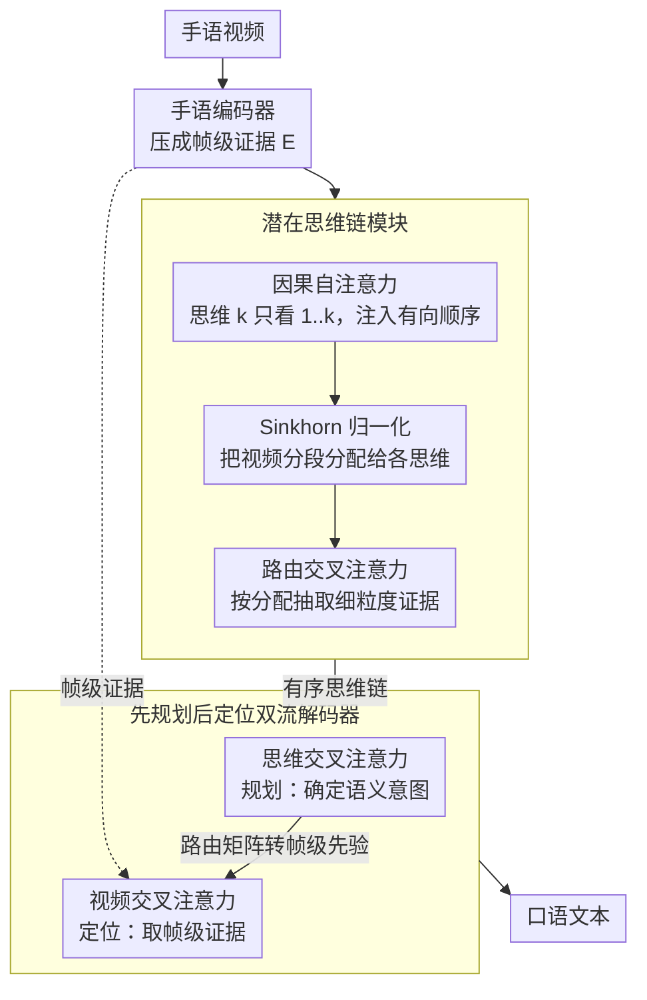

# Think in Latent Thoughts: A New Paradigm for Gloss-Free Sign Language Translation

**会议**: ACL 2026  
**arXiv**: [2604.15301](https://arxiv.org/abs/2604.15301)  
**代码**: [GitHub](https://github.com/fletcherjiang/SignThought)  
**领域**: LLM评测  
**关键词**: 手语翻译, 无注释翻译, 潜在思维链, 跨模态推理, 双流解码器

## 一句话总结

提出 SignThought，一种推理驱动的无注释手语翻译框架：引入可学习的潜在思维槽作为视频和文本之间的显式中间语义层，通过"先规划后定位"的双流解码器实现语义规划与视觉证据检索的解耦，在多个基准上超越现有无注释方法。

## 研究背景与动机

**领域现状**：手语翻译从基于 gloss 的级联方法逐步发展到无 gloss 的端到端视频到文本方法。

**现有痛点**：现有模型隐含假设手语视频片段可直接映射到口语词汇，但手语中大量含义是通过分类词、空间语法和运动调节动态生成的（productive forms），不存在固定词汇对应。

**核心矛盾**：SLT 本质上是跨模态推理问题而非简单对齐——含义分散在连续视频流中，需要跨时间推理才能正确理解。

**本文目标**：引入显式的中间语义表示（潜在思维链），在视频编码和文本解码之间建立可追溯的推理桥梁。

**切入角度**：类比 CoT，但在连续潜在空间而非离散文本空间中实现——用可学习的思维槽从视频中蒸馏语义。

**核心 idea**：K 个有序潜在思维槽通过因果自注意力+Sinkhorn路由交叉注意力迭代提取语义，形成有向思维链；双流解码器先查询思维链规划语义，再回到视频检索证据。

## 方法详解

### 整体框架

SignThought 想解决的核心问题是：手语里大量含义靠分类词、空间语法和运动调节动态生成（productive forms），并没有固定词汇对应，所以"把视频片段直接映射成词"的隐含假设站不住，翻译本质上是跨时间的推理。它的做法是在视频和文本之间插一层显式的中间语义。整条管线分三段：手语编码器先把视频压成帧级证据 $\mathbf{E}$；潜在思维链模块（latent CoT）再从 $\mathbf{E}$ 里蒸馏出一条有序的思维链 $\mathbf{C}$（因果自注意力定顺序 → Sinkhorn 归一化做分配 → 路由交叉注意力取证据）；最后双流解码器先查这条思维链规划要说什么，再回到视频里取证据落地成文本。数据层面，作者另外构建并开源了一个上下文依赖更强的无 gloss 数据集，为这套推理式建模提供训练土壤。

### 关键设计

**1. 潜在思维链模块：把密集视频特征蒸馏成一串有序的语义推理状态**

直接拿帧级特征去解码，模型得在连续视频流里同时完成"理解"和"生成"，含义容易被冲散。SignThought 引入 $K$ 个可学习的思维槽，经过 $L$ 层迭代细化：每层先做因果自注意力，让思维 $k$ 只能看到 $1..k$，从而给思维链注入有向结构；再用 Sinkhorn 归一化把视频分段分配给各个思维，避免注意力退化成均匀或塌缩；最后做路由交叉注意力，按这个分配去抽取细粒度证据。因果约束提供顺序、Sinkhorn 守住分配的"硬度"，两者一起让 $K$ 个槽形成一条像 CoT 那样可逐步推进的语义链，而不是一堆无序的 slot。

**2. "先规划后定位"双流解码器：把语义决策和证据检索拆成两步**

如果解码时直接对所有帧做交叉注意力，注意力会扩散到整段视频、难以聚焦。双流解码器在每层把这件事拆开：先自注意力，再做思维交叉注意力（规划，确定这一步要表达什么语义意图），最后做视频交叉注意力（定位，到帧里取证据）。关键衔接是把思维注意力的权重通过路由矩阵转成帧级先验，用它去引导视频注意力——也就是先用思维链锁定"该看哪一段"，再去看。先定意图再检索比一上来就在全帧里找更可控，这也是消融里去掉双流后掉 2.1 BLEU 的原因。

**3. 大规模无 gloss 数据集：用上下文依赖更强的数据撑起推理式翻译**

推理式建模需要足够多含 productive forms、上下文依赖强的样本，而现有手语数据集这方面偏弱。作者据此构建并开源了一个新的无 gloss 数据集，刻意纳入更多需要跨时间推理才能解出的表达，为上面两个模块提供训练和评估的土壤。

### 损失函数 / 训练策略

标准序列级交叉熵 + 思维连续性损失。端到端训练，仅需句子级标注。

## 实验关键数据

### 主实验

| 方法 | PHOENIX14T B@4 | ROUGE |
|------|---------------|-------|
| SLTUNET | 28.47 | 52.11 |
| SignThought | **31.2** | **54.8** |

### 消融实验

| 配置 | B@4 Δ | 说明 |
|------|-------|------|
| 去除思维链 | -2.5 | 直接解码退化 |
| 去除因果约束 | -1.3 | 思维无序 |
| 去除 Sinkhorn | -1.8 | 注意力退化 |
| 去除双流 | -2.1 | 规划定位耦合 |

### 关键发现

- 潜在思维链比直接解码提升 2-3 BLEU
- 思维链可作为可追溯锚点对齐文本与视频时间区域

## 亮点与洞察

- "手语翻译是推理而非对齐"改变了领域建模范式
- 潜在思维链作为跨模态接口可迁移到其他连续-离散跨模态任务
- Sinkhorn 防止注意力退化的技巧在其他 slot attention 场景也适用

## 局限与展望

- 思维槽数 K 需预设，不同视频长度最优 K 可能不同
- 仅在受限数据集验证
- 编码器使用 Inception 特征，更强编码器可能进一步提升

## 相关工作与启发

- **vs Gloss-based**: 需昂贵标注，本文完全无 gloss
- **vs 直接视频到文本**: 缺乏中间推理层，性能受限

## 评分

- 新颖性: ⭐⭐⭐⭐⭐ 首次将潜在 CoT 引入手语翻译
- 实验充分度: ⭐⭐⭐⭐ 多基准+充分消融
- 写作质量: ⭐⭐⭐⭐ 动机充分但符号密集
- 价值: ⭐⭐⭐⭐⭐ 对手语翻译和跨模态推理都有重要贡献

<!-- RELATED:START -->

## 相关论文

- [\[ACL 2026\] Selective Contrastive Learning For Gloss Free Sign Language Translation](selective_contrastive_learning_for_gloss_free_sign_language_translation.md)
- [\[ACL 2026\] Language on Demand, Knowledge at Core: Composing LLMs with Encoder-Decoder Translation Models for Extensible Multilinguality](language_on_demand_knowledge_at_core_composing_llms_with_encoder-decoder_transla.md)
- [\[ACL 2026\] Language Models Entangle Language and Culture](language_models_entangle_language_and_culture.md)
- [\[ACL 2026\] Hierarchical Policy Optimization for Simultaneous Translation of Unbounded Speech](hierarchical_policy_optimization_for_simultaneous_translation_of_unbounded_speec.md)
- [\[ACL 2026\] Efficient Training for Cross-lingual Speech Language Models](efficient_training_for_cross-lingual_speech_language_models.md)

<!-- RELATED:END -->
