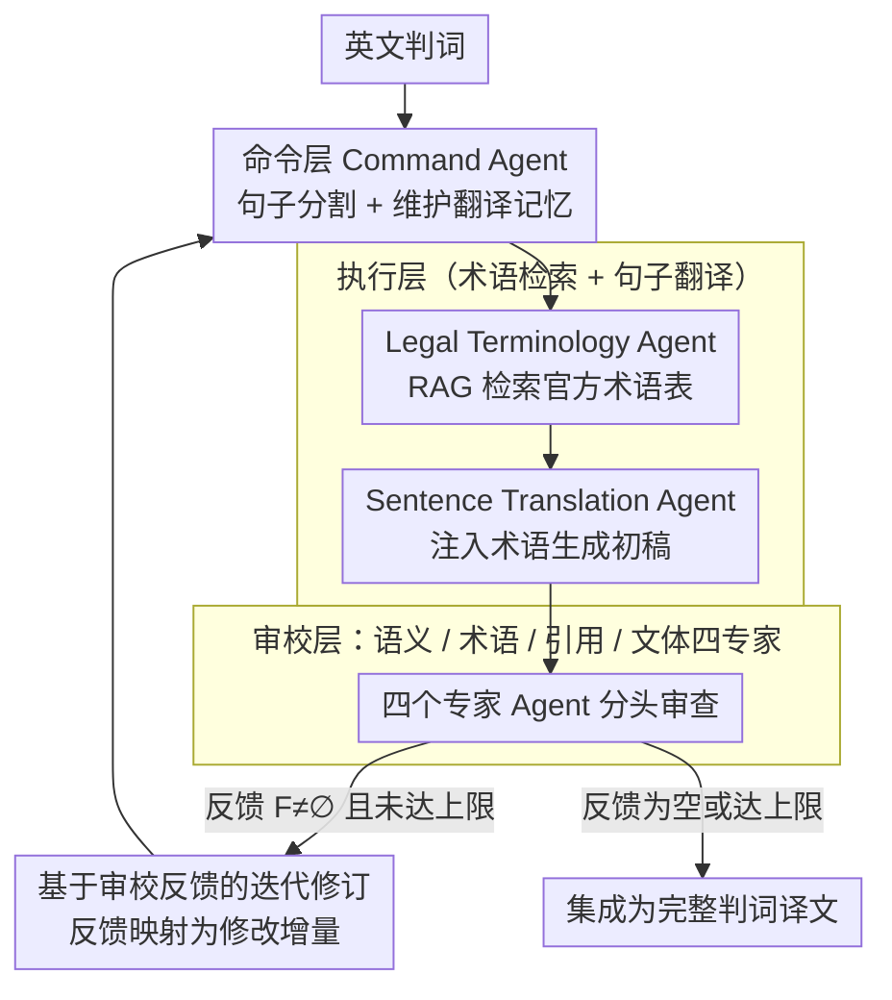

# TransLaw: A Large-Scale Dataset and Multi-Agent Benchmark Simulating Professional Translation of Hong Kong Case Law

**会议**: ACL2026  
**arXiv**: [2507.00875](https://arxiv.org/abs/2507.00875)  
**代码**: 未公开代码链接（论文称释放 HKCFA Judgement 97-22 数据集）  
**领域**: 信息检索 / 法律机器翻译 / 多智能体  
**关键词**: 法律翻译, 香港判例法, 多智能体, RAG术语检索, 人工评测

## 一句话总结
这篇论文构建了首个面向香港终审法院判词英中翻译的句级平行数据集 HKCFA Judgement 97-22，并提出模拟专业法律翻译流程的 TransLaw 多智能体系统，在自动指标、人类法律译者评测和成本分析上都显著优于单一翻译 agent。

## 研究背景与动机
**领域现状**：法律机器翻译已经从通用 MT 逐渐走向 LLM 辅助翻译，但多数评测仍停留在普通法律文本或跨语种通用语料上。香港判例法有独特的中英双语制度、普通法术语、判词结构和引用格式，翻译质量不仅要求语义对齐，还要求术语、判例引用和司法文风都符合本地规范。

**现有痛点**：公开数据层面，缺少专门覆盖香港终审法院判词的高质量英中句级平行语料；系统层面，单个 LLM 翻译器通常把术语理解、句子翻译、引用检查、风格润色都塞进一次生成里，容易出现术语误译、事实遗漏、引用格式不合规和跨段落不一致。

**核心矛盾**：法律翻译本质上是专业流水线，而不是单次文本生成。一个译者需要查官方术语表、参考上下文、校对法律含义、检查引文格式，再做司法文体润色；单 agent 即使模型很强，也很难稳定覆盖这些互相制约的质量维度。

**本文目标**：作者要同时补齐两个基础设施：一是构造可评测的香港判例法双语数据集；二是建立一个能复现专业法律翻译分工的多 agent benchmark，让不同 LLM 在不同翻译角色中被系统比较。

**切入角度**：论文没有只做 prompt engineering，而是把专业翻译流程拆成 command、execution、review 三层。这样既能让术语检索和句子翻译分离，也能让审校反馈形成迭代闭环，减少单点错误放大。

**核心 idea**：用“项目经理 + 术语专家 + 法庭译者 + 多维审校专家”的角色化多智能体协作，替代单个 LLM 直接翻译整段判词。

## 方法详解
TransLaw 的贡献可以分成数据集和系统两条线。数据集 HKCFA Judgement 97-22 提供真实、高质量的中英判词对齐材料；系统 TransLaw 则把一段英文判词切成可管理的句子或段落单元，每个单元先经过术语解析和翻译，再进入语义、术语、引用、风格四类审校，最后由 command agent 汇总成完整译文。

### 整体框架
输入是一份英文香港终审法院判词，系统先按语义结构拆分为句子序列 $J=\{s_i\}$。Translation Command Agent 负责维护全局流程和前文翻译记忆；Translation Execution Module 中的 Legal Terminology Agent 先从香港律政司官方法律术语表检索候选术语，Sentence Translation Agent 再结合术语和上下文生成初稿；Expert Review Module 用多个专家 agent 检查语义、术语、引用和风格。如果审校发现问题，反馈会被映射为修改建议并进入下一轮翻译，直到反馈为空或达到迭代上限。

### 关键设计

**1. HKCFA Judgement 97-22 句级平行数据集：用官方判词解决“参考答案本身不可信”的评测难题**

法律翻译评测最怕的不是模型弱，而是参考答案本身质量不稳——一旦 gold reference 的术语或引文有误，再精确的指标也在量噪声。作者绕开自动句对齐工具，直接从 1997-2022 年香港终审法院的中英双语判词里抽取 344 份高质量官方翻译，并借助政府网页本身的段落与句子结构来做对齐。这批数据规模远小于通用语料，但术语、判例引文和司法文风都来自官方，可信度足以当成高精度 benchmark；对长法律句和带编号的条款，结构化对齐也比自动句对齐少了一大类噪声。

**2. 三层七角色多智能体翻译流水线：把“术语—翻译—审校”混在一次生成里的单 agent 拆成可分别检查的工序**

单个 LLM 翻译器通常把术语理解、句子翻译、引用检查、风格润色全塞进一次生成，结果是术语误译、事实遗漏、引用格式不合规和跨段落不一致混在一起，连错在哪一步都难定位。TransLaw 按真实译员工作流把流程切成协调、执行、审校三层：command agent 负责句子分割、任务派发、维护前文翻译记忆并集成结果；execution module 里的 Legal Terminology Agent 先用 RAG 从 Combined DOJ Glossaries of Legal Terms 检索候选译名，Sentence Translation Agent 再把确认的术语注入译文；review module 则由语义对齐、术语复核、引用检查、司法文体润色四个专家 agent 分头审查。每个 agent 只盯一个可检查的维度，错误因此被隔离在某一道工序里，也让审校能产出结构化、可执行的反馈，而不是一句笼统的“翻得不好”。

**3. 基于审校反馈的迭代修订机制：让初稿在多轮专家反馈里逐步收敛到可发布质量**

法律译文要同时满足语义准确、篇章连贯和格式合规，单次生成几乎不可能一步到位。系统因此让每个句子单元走一个闭环：第 $k$ 轮审校汇总出反馈集合 $\mathcal{F}_i^{(k)}$ 后，command agent 把它映射成具体的文本修改增量，再把译文从 $\hat{s}_i^{(k)}$ 更新为

$$\hat{s}_i^{(k+1)}=\hat{s}_i^{(k)}\oplus\Psi(\mathcal{F}_i^{(k)})$$

其中 $\Psi$ 把审校意见转成修改操作、$\oplus$ 表示把修改施加到当前译文；直到反馈为空或达到迭代上限才停。相比单次生成，这套闭环更贴近真实翻译社的“译—审—改”节奏，也把错误控制在句级局部，不让某一处术语误译沿着段落扩散。

### 一个完整示例：一句英文判词怎么走完流水线

以一句含普通法术语的判词为例，看状态如何逐轮变化。command agent 先把整份判词按语义切成句子序列 $J=\{s_i\}$，取出当前句 $s_i$ 连同前文翻译记忆派发下去。execution module 里 Legal Terminology Agent 从官方术语库检索出候选译名（例如某个判例引用术语的标准中文写法），Sentence Translation Agent 据此产出初稿 $\hat{s}_i^{(0)}$。初稿进入 review module：语义对齐 agent 发现某个法律含义被弱化，术语复核 agent 指出一个术语没用官方译名，引用检查 agent 标记引文格式不合规，风格润色 agent 提示文体不够正式——这些汇成 $\mathcal{F}_i^{(0)}$。command agent 把它映射为修改增量、更新出 $\hat{s}_i^{(1)}$，再送回审校；若这一轮四个 agent 都无意见（$\mathcal{F}_i^{(1)}=\varnothing$）或已到迭代上限，就定稿并写入翻译记忆，供后续句子保持术语和文风一致。最终 command agent 把所有句级译文集成为完整判词译文。

### 损失函数 / 训练策略
本文不是训练新模型，而是构建评测数据和 agent workflow。核心“优化”体现在流程控制上：术语候选来自官方术语库检索，翻译初稿受全局上下文记忆约束，审校反馈以迭代方式修订译文。自动评测使用 xCOMET-XL 与 wmt22-unite-da，并用 1,000 次 bootstrap 报告约 95.45% 置信区间；人工评测使用法律 ACS 指标 $I=0.6A+0.3C+0.1S$，其中 A 是法律含义准确性，C 是结构连贯性，S 是司法文体适切性。

## 实验关键数据

### 主实验
论文首先比较同一 LLM 作为 TransLaw 多 agent 系统和作为 Single Translator Agent 的效果。所有模型在多 agent 框架下都有大幅提升，说明收益不是某个闭源模型特有，而是流程分工带来的。

| 模型 | TransLaw xCOMET-XL | TransLaw Avg. | 单 agent Avg. | Avg. 提升 |
|------|-------------------:|--------------:|--------------:|----------:|
| GPT-4o | 85.12 | 88.45 | 72.65 | +15.80 |
| GPT-4 | 84.24 | 87.15 | 71.17 | +15.98 |
| ChatGPT | 82.29 | 85.41 | 69.12 | +16.29 |
| DeepSeek-V3 | 83.53 | 86.55 | 70.45 | +16.10 |
| Qwen-14B-Chat | 81.86 | 84.49 | 68.67 | +15.82 |
| ChatLaw-13B | 76.26 | 79.43 | 61.65 | +17.78 |

### 消融实验
论文还分析了数据集规模、agent 角色分配、人工评测和成本。最关键的观察是：强模型做 command / review 时收益更稳，但即便换成较弱开源模型，多 agent 流程也明显优于单 agent。

| 分析项 | 关键数据 | 说明 |
|--------|----------|------|
| 数据集规模 | 344 份判词，11,099 个句级样本，811,653 个英文 token，1,314,282 个中文 token | 覆盖 1997-2022 年香港终审法院判词，依赖官方 HTML 结构对齐 |
| agent 分配 | GPT-4o 同时作 execution / review 时 xCOMET-XL 为 85.12；GPT-4/GPT-4o 交叉组合仍在 84.87-84.88 | 高质量 command agent 加强流程稳定性，弱模型替换某些角色会逐步降分 |
| 人工评测 | 200 个段落级样本，10 位认证法律译者，0-10 分 ACS 评分 | TransLaw 在法律含义准确性和不同 ACS 权重下领先；官方人工译文在连贯性和文体上仍更强 |
| 成本分析 | FACC 1/2021 人工翻译约 1,390.20 美元；GPT-4o API 约 0.39 美元；TransLaw API 约 0.35 美元 | TransLaw API 成本比人工低近 4,000 倍；若加入人工编辑，总成本约 463.75 美元，仍节省约 926.45 美元 |

### 关键发现
- 多 agent 不是只提升 GPT-4o：从 GPT-4、DeepSeek、Qwen 到 ChatLaw，TransLaw 相对单 agent 的 Avg. 提升大多在 15-18 分之间，说明流程分工本身具有泛化性。
- 法律专用 LLM 不一定优于通用强模型。ChatLaw 系列在该 benchmark 上落后于 GPT、DeepSeek 和 Qwen，提示“法律语料继续预训练”不等于具备精细法律翻译能力。
- 人工翻译仍然在文体和篇章连贯上保有优势。TransLaw 主要优势是准确性和成本，真正发布级场景仍需要人工审校闭环。

## 亮点与洞察
- 这篇论文把法律翻译评测从“模型是否会翻译”推进到“模型能否完成专业流程”。术语检索、引用检查和文体润色这些细节，比单纯 BLEU/COMET 分数更接近真实法律服务需求。
- 数据集构建很务实：利用香港官方双语判词的结构化 HTML 对齐，避免了自动句对齐在长法律句和编号条款上的噪声问题。
- 最有启发的是角色化 agent 的边界划分。它不是泛泛地堆多个 agent，而是按专业译员工作流划分责任，因此每个 agent 的输出都能被下一步检查和利用。
- 成本分析让论文更接近落地讨论。TransLaw 的 API 成本极低，但作者没有忽略人工编辑成本，这个口径比只报模型调用价格更诚实。

## 局限与展望
- 论文聚焦香港判例法，术语表、引用格式和司法文体都高度本地化，直接迁移到其他司法辖区、语种或法律文本类型可能需要重建知识库和审校规则。
- 自动指标仍不能完全覆盖法律风险。xCOMET-XL 和 wmt22-unite-da 能反映语义质量，但未必能识别细粒度法律后果，例如一个引用格式错误是否会造成法律解释偏差。
- 人工评测规模只覆盖一个 FACC 1/2021 测试集，虽然段落数不少，但案件类型、争点和文风多样性仍有限。
- 未来可以把专家反馈从“评测后分析”变成训练或偏好优化信号，让系统学习哪些审校反馈最值得优先采纳。

## 相关工作与启发
- **vs 通用机器翻译评测**: 通用 MT 通常关注句子语义和流畅性，TransLaw 把术语、引用和司法文体纳入系统设计，更适合法律场景。
- **vs 单 agent 法律翻译**: 单 agent 依赖一次 prompt 同时完成所有任务，TransLaw 把错误检查显式外置为多个审校 agent，因此更容易定位和修正失败环节。
- **vs 法律专用 LLM**: 法律专用模型试图把领域知识内化到参数里，TransLaw 通过官方术语库 RAG 和流程化审校外化知识，短期内更可控。
- **可迁移启发**: 医学报告翻译、专利翻译、财务审计摘要等高风险文本也可以采用“术语检索 + 初稿生成 + 多维审校 + 迭代修订”的流程，而不是只提升底座模型。

## 评分
- 新颖性: ⭐⭐⭐⭐☆ 数据集和法律翻译 agent workflow 结合紧密，但核心多 agent 思想本身不是全新。
- 实验充分度: ⭐⭐⭐⭐☆ 自动评测覆盖 13 个模型并有人类评测和成本分析，但人工评测案件范围仍偏窄。
- 写作质量: ⭐⭐⭐⭐☆ 方法分工清楚、表格信息丰富，部分 agent 公式化描述略显形式化。
- 价值: ⭐⭐⭐⭐⭐ 对法律 NLP、低成本专业翻译和高风险文档 agent 设计都有直接参考价值。

<!-- RELATED:START -->

## 相关论文

- [\[ACL 2026\] LaoBench: A Large-Scale Multidimensional Lao Benchmark for Large Language Models](laobench_a_large-scale_multidimensional_lao_benchmark_for_large_language_models.md)
- [\[ACL 2026\] FairQE: Multi-Agent Framework for Mitigating Gender Bias in Translation Quality Estimation](fairqe_multi-agent_framework_for_mitigating_gender_bias_in_translation_quality_e.md)
- [\[ACL 2026\] Alexandria: A Multi-Domain Dialectal Arabic Machine Translation Dataset for Culturally Inclusive and Linguistically Diverse LLMs](alexandria_a_multi-domain_dialectal_arabic_machine_translation_dataset_for_cultu.md)
- [\[ACL 2025\] Towards Global AI Inclusivity: A Large-Scale Multilingual Terminology Dataset (GIST)](../../ACL2025/multilingual_mt/towards_global_ai_inclusivity_a_large-scale_multilingual_terminology_dataset_gis.md)
- [\[ACL 2025\] M-MAD: Multidimensional Multi-Agent Debate for Advanced Machine Translation Evaluation](../../ACL2025/multilingual_mt/m-mad_multidimensional_multi-agent_debate_for_advanced_machine_translation_evalu.md)

<!-- RELATED:END -->
