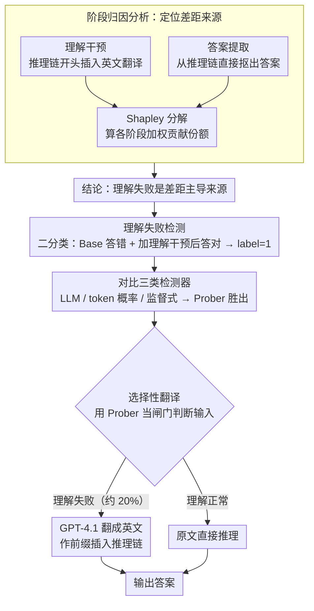

# Why Do Multilingual Reasoning Gaps Emerge in Reasoning Language Models?

**会议**: ACL 2026 Findings  
**arXiv**: [2510.27269](https://arxiv.org/abs/2510.27269)  
**代码**: [GitHub](https://github.com/deokhk/multilingual-reasoning-gap)  
**领域**: Multilingual / Reasoning  
**关键词**: 多语言推理差距, 理解失败检测, 选择性翻译, 推理语言模型, 阶段归因分析

## 一句话总结

本文首次系统分析了推理语言模型(RLMs)中多语言推理差距的来源，发现**语言理解失败**是主要原因，并提出通过检测理解失败后进行选择性翻译(Selective Translation)来高效弥补差距。

## 研究背景与动机

**领域现状**：推理语言模型(RLMs)如 DeepSeek-R1、Qwen3 等通过生成长推理链(reasoning traces)在复杂推理任务上取得了显著进展。然而，这些模型在处理不同语言的输入时表现差异巨大——高资源语言（如英语）的表现远优于低资源语言（如斯瓦希里语）。

**现有痛点**：已有工作尝试通过表示编辑、提示工程、前缀调优等方法缩小多语言差距，但都未深入探究差距产生的**根本原因**。缺乏对问题成因的系统理解，导致现有方案要么效果有限，要么计算开销过大（如对所有输入进行全量翻译）。

**核心矛盾**：RLMs 的推理链主要以英语为主导语言进行思考，当输入为低资源语言时，模型需要先将输入"翻译"为英语再进行推理。这个隐式的理解过程可能失败，但此前没有人系统量化过这种失败对最终性能的影响。

**本文目标**：系统回答"多语言推理差距从何而来？"这一关键问题，并基于分析结果提出高效的缓解策略。

**切入角度**：将多语言推理过程分解为三个阶段——理解(Understanding)、推理(Reasoning)、生成(Generation)，通过阶段归因分析(stage-wise attribution)量化各阶段对差距的贡献，进而针对性地解决主要瓶颈。

**核心idea**：理解失败是可检测的，只需对检测出理解失败的输入进行翻译即可，无需全量翻译，从而在效率与效果之间取得最优平衡。

## 方法详解

### 整体框架

本文的工作分为三个层次递进的部分：(1) 通过阶段归因分析定位多语言推理差距的来源；(2) 系统评估多种理解失败检测方法；(3) 提出选择性翻译(Selective Translation)策略，仅在检测到理解失败时介入翻译。整个流程不需要修改模型参数，是一种推理时的即插即用方案。

### 关键设计

**1. 阶段归因分析：把"差距到底卡在哪一步"拆成可量化的份额**

此前所有缓解工作都绕开了一个前提问题——多语言差距究竟来自理解、推理还是生成？本文把这三个阶段当成可以单独"关掉失败"的开关来做归因。对理解阶段，设计**理解干预**：在推理链开头直接塞进输入的英文翻译 $\pi(x_{\mathrm{dom}})$，相当于人为消除理解失败；对生成阶段，设计**答案提取**，直接从推理链里抠出答案，绕过把答案写成目标语言时可能引入的错误。推理阶段无法直接干预，于是把它当作"扣除理解和生成后剩下的那部分"。

为了让归因不依赖干预的施加顺序，本文用 Shapley 分解算各阶段的加权贡献份额，例如理解阶段为

$$\phi_U(l) = \max\Big\{0,\ \tfrac{1}{2}\big[(S_U(l)-S_0(l))+(S_{UT}(l)-S_T(l))\big]\Big\}$$

其中 $S_0,S_U,S_T,S_{UT}$ 分别是无干预、单独理解干预、单独答案提取、两者都施加时的准确率。取两种叠加次序的平均，正是 Shapley 值保证的"顺序无关"性质，让"理解贡献了多少差距"这个结论不至于因为实验设计的先后而变样。

**2. 理解失败检测：把模型"有没有读懂"变成一个可训练的二分类信号**

要做选择性干预，前提是能在不施加任何干预的 Base 设定下，提前判断模型是不是没读懂输入。本文把它建模成二分类：如果一个样本在 Base 下答错、但加了理解干预(w/ U)后答对，就给它打上理解失败(label=1)的标签——这正好把"差距的可修复部分"圈了出来。围绕这个标签，论文系统比了三类检测器：基于 LLM 的（GPT-4.1-mini 判断再加一轮自我反思）、基于 token 概率的（平均/最小置信度、输入 NLL），以及监督式的（以 query+推理链微调的 mmBERT 检测器，和以推理链末尾 token 隐状态喂进两层 MLP 的 Prober）。

之所以基于推理链来检测，是因为模型读不懂输入时常会在思考过程里露出马脚（典型如 "This is confusing..."），这些信号让监督检测器有迹可循。实验也证实监督方法（Prober、mmBERT）明显优于 LLM 判断和概率信号，并且只看前 4096 个 token 的早期片段就能达到与全链检测相当的可靠性。

**3. 选择性翻译：只对真正读不懂的输入花翻译预算**

全量翻译虽然有效，但对 100% 的输入都调一次外部翻译，开销过大且对本来就读得懂的样本是浪费。选择性翻译用训练好的 Prober 当闸门：先判断输入是否理解失败，只有判为失败时才调 GPT-4.1 把输入翻成英文、作为前缀插进推理链；判为正常的输入直接拿原文推理。

这样做的代价控制非常划算——实测只对约 20% 的输入触发翻译，却能把准确率拉到接近全量翻译的水平。检测越准，预算就越精准地花在刀刃上：低资源语言（如斯瓦希里语）触发率高、提升幅度大，高资源语言几乎不触发，整体效率因此远高于一刀切的全量翻译。

### 损失函数 / 训练策略

监督检测器的训练使用标准二分类交叉熵损失。mmBERT 检测器以 query 和推理链为输入进行微调；Prober 以推理链最后一个 token 的最终层隐状态为输入，训练两层感知机。校准数据使用 MGSM（对 Polymath-Low）和 MMLU-ProX-Lite 验证集。

## 实验关键数据

### 主实验

| 数据集 | 指标 | Base | Selective Trans. | Full Trans. | 翻译使用率 |
|--------|------|------|------------------|-------------|------------|
| Polymath-Low | Avg Acc | 81.1 | 88.0 | 89.4 | 19.3% |
| MMLU-ProX-Lite | Avg Acc | 72.7 | 74.3 | 76.5 | 20.8% |

**低资源语言效果突出**：斯瓦希里语(sw)在 Polymath-Low 上从 29.3 → 81.3（翻译使用率86.4%），泰卢固语(te)从 69.9 → 77.1（翻译使用率37.9%）。

### 消融实验

| 配置 | 关键指标 | 说明 |
|------|---------|------|
| 阶段归因 | U-share 占主导 | 理解失败贡献了多语言差距的大部分，生成阶段贡献极小 |
| 理解干预后推理性能比 | ≈0.95-0.99 | 解决理解失败后，各语言性能接近最佳语言 |
| 翻译质量 vs 推理性能 | r=0.951 | 翻译能力与多语言推理能力强正相关 |
| 早期检测(4096 tokens) | 与全链检测性能相当 | 无需等待完整推理链即可做出可靠检测 |
| 非英语翻译目标 | 性能下降 | 使用低资源语言作为翻译目标会引入额外理解失败 |

### 关键发现
- 理解失败是多语言推理差距的**主导来源**，且该结论在不同模型规模(1.7B-14B)和推理难度(Low/Medium/High)上一致成立
- 监督方法（Prober、mmBERT）在理解失败检测上显著优于 LLM-based 和 token 概率方法
- 检测器可泛化到未见过的语言（法语、马拉地语、沃洛夫语），表现稳健
- 仅用约20%的翻译开销即可达到接近全量翻译的效果

## 亮点与洞察
- **分析框架的系统性**：将多语言推理分解为三阶段并用 Shapley 分解进行归因，方法论严谨且可推广
- **"理解是瓶颈"的洞察**：颠覆了"推理能力本身是跨语言差距主因"的直觉，揭示了问题的真正根源在于输入理解
- **翻译能力与推理能力的强相关性**(r=0.951)为改进多语言推理提供了清晰的优化方向
- **选择性翻译的实用性**：无需修改模型，仅通过推理时干预即可显著提升低资源语言性能，工程落地门槛低
- **早期检测**的发现意味着可以在生成初期就做出干预决策，进一步提升效率

## 局限与展望
- 实验主要集中在数学和 STEM 推理任务，尚未验证在常识推理等其他领域的适用性
- 语言覆盖范围为10种，未覆盖所有语言家族，更多极低资源语言仍需进一步验证
- 分析聚焦于英语主导推理的场景，对于以其他语言（如俄语）进行推理的模型尚未探索
- 选择性翻译依赖外部翻译系统(GPT-4.1)，引入了额外的延迟和成本
- 未来方向：将理解失败检测与缓解机制直接集成到模型训练中

## 相关工作与启发
- **vs 全量翻译(Full Translation)**：选择性翻译以20%的翻译开销达到约98%的全量翻译效果，效率大幅提升
- **vs 语言强制推理(Language-forcing)**：强制模型以目标语言推理会降低准确率或需要昂贵的训练数据，本文方案更经济
- **vs 表示编辑(Representation Editing)**：Zhao et al. (2025) 的方法需要修改模型内部表示，而本文方法完全无需模型修改
- **vs Cross-lingual Collapse (Park et al., 2025)**：该工作通过语言一致性奖励缓解问题，但需要训练；本文方案是纯推理时方法

## 评分
- 新颖性: ⭐⭐⭐⭐ 首次系统归因多语言推理差距来源，Shapley 分解框架和选择性翻译思路新颖
- 实验充分度: ⭐⭐⭐⭐⭐ 多模型、多语言、多难度级别的全面实验，含泛化性验证和早期检测分析
- 写作质量: ⭐⭐⭐⭐⭐ 结构清晰，从分析到检测到缓解的递进逻辑流畅，图表信息丰富
- 价值: ⭐⭐⭐⭐ 为多语言推理研究提供了明确的方向指引，选择性翻译具有实用价值

<!-- RELATED:START -->

## 相关论文

- [\[AAAI 2026\] Mitigating Content Effects on Reasoning in Language Models through Fine-Grained Activation Steering](../../AAAI2026/multilingual_mt/mitigating_content_effects_on_reasoning_in_language_models_through_fine-grained_.md)
- [\[ACL 2026\] EMCEE: Improving Multilingual Capability of LLMs via Bridging Knowledge and Reasoning with Extracted Synthetic Multilingual Context](emcee_improving_multilingual_capability_of_llms_via_bridging_knowledge_and_reaso.md)
- [\[ACL 2025\] CruxEval-X: A Benchmark for Multilingual Code Reasoning, Understanding and Execution](../../ACL2025/multilingual_mt/cruxeval-x_a_benchmark_for_multilingual_code_reasoning_understanding_and_executi.md)
- [\[ACL 2026\] Lost in Translation: Do LVLM Judges Generalize Across Languages?](lost_in_translation_do_lvlm_judges_generalize_across_languages.md)
- [\[CVPR 2026\] MMTIT-Bench: A Multilingual and Multi-Scenario Benchmark with Cognition-Perception-Reasoning Guided Text-Image Machine Translation](../../CVPR2026/multilingual_mt/mmtit-bench_a_multilingual_and_multi-scenario_benchmark_with_cognition-perceptio.md)

<!-- RELATED:END -->
