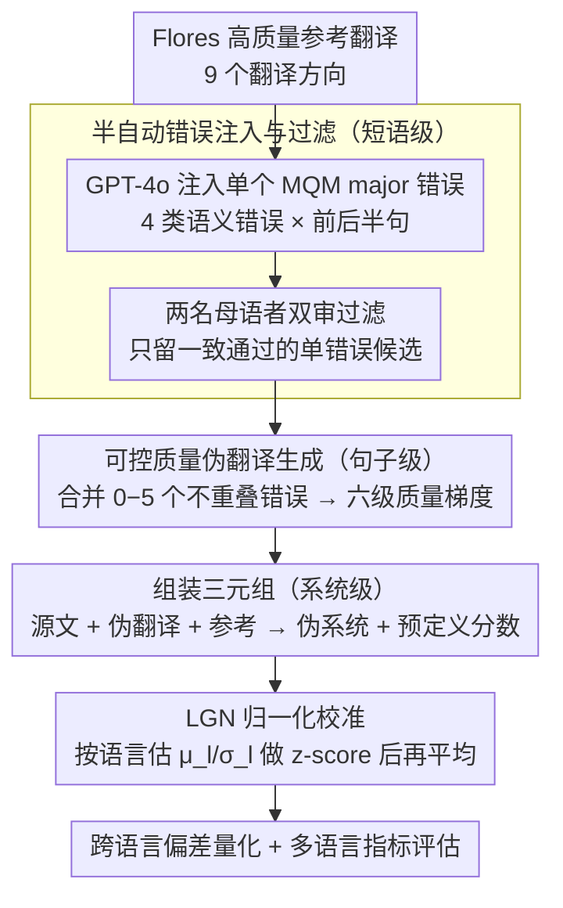

# XQ-MEval: A Dataset with Cross-lingual Parallel Quality for Benchmarking Translation Metrics

**会议**: ACL 2026  
**arXiv**: [2604.14934](https://arxiv.org/abs/2604.14934)  
**代码**: [GitHub](https://github.com/zhiqu22/XQ-MEval)  
**领域**: AI安全  
**关键词**: 翻译评估指标, 跨语言评分偏差, MQM错误注入, 多语言基准, 指标校准

## 一句话总结
构建首个具有跨语言平行质量的翻译评估基准 XQ-MEval，通过半自动注入 MQM 错误生成可控质量的伪翻译，首次实证揭示自动评估指标的跨语言评分偏差，并提出 LGN 归一化策略有效校准多语言指标评估。

## 研究背景与动机

**领域现状**：多语言翻译系统的评估通常依赖自动指标（COMET、MetricX 等），标准做法是对各语言方向的指标分数取平均作为系统级分数。MQM 人工评估通过标准化错误类别和层级扣分实现了跨语言可比性。

**现有痛点**：平均策略隐含假设不同语言对相似错误的评分处于同一尺度，但实际上指标可能存在跨语言评分偏差——相同质量的翻译在不同语言中获得不同分数。例如同样包含一个 major 错误的翻译，COMET 在不同语言上给出差异显著的分数。

**核心矛盾**：没有提供跨语言平行质量实例的基准数据集，无法系统性地量化和验证评分偏差。专家标注成本极高，限制了语言覆盖范围。

**本文目标**：(1) 构建跨语言平行质量基准；(2) 量化跨语言评分偏差；(3) 提出校准策略改善多语言评估公平性。

**切入角度**：将 MQM 定义的错误自动注入到高质量参考翻译中，通过控制错误数量生成可控质量的伪翻译，母语者过滤确保可靠性。

**核心 idea**：通过在 Flores 高质量翻译中注入可控数量的 MQM 错误，构建跨语言质量平行的三元组（源文、伪翻译、参考），使得跨语言比较建立在相同错误基础上。

## 方法详解

### 整体框架
三阶段构建 pipeline：(1) 短语级——用 GPT-4o 在参考翻译中注入单个 MQM major 错误，母语者过滤；(2) 句子级——合并 0-5 个错误生成六种质量等级的伪翻译；(3) 系统级——组装三元组（源文+伪翻译+参考）构建伪系统，用预定义分数评估自动指标。评估阶段进一步用 LGN（语言级全局归一化）把各语言分数拉到同一尺度再平均，校准跨语言偏差。整套流程覆盖 9 个翻译方向。

### 关键设计

**1. 半自动错误注入与过滤：用"同一种错误"在不同语言里造出可比的单错误候选**

要量化指标的跨语言偏差，前提是手里得有"质量严格对齐"的翻译，可专家逐语言标注成本高到无法覆盖多语言。本文改用 GPT-4o 在 Flores 每个翻译实例的高质量参考里注入单个 MQM major 错误：错误类型限定为四种纯语义性的（Addition、Omission、Mistranslation、Untranslated），分别在句子前半和后半各注一次，每个实例最多产生 8 个候选；再由两名母语者独立审核，只保留两人一致通过的候选。

只选纯语义错误、而不碰流畅性这类语言相关错误，是为了让"一个 major 错误"在不同语言之间语义等价、真正可比；LLM 注入加人工过滤的组合，则在成本和可靠性之间取了一个比纯专家标注经济得多的折中，正是这一点让基准覆盖到 9 个翻译方向成为可能。

**2. 可控质量伪翻译生成：用错误的"个数"造出跨语言对齐的质量梯度**

有了单错误候选还不够——要测指标对质量变化的反应，需要一条从满分到最差的连续质量阶梯，而且各语言的阶梯必须刻度一致。本文从错误池里挑出互不重叠的错误段，合并 $0$ 到 $5$ 个生成伪翻译：$0$ 个错误对应满分（扣 $0$ 分），$5$ 个错误对应最差（每个 major 扣 $5$ 分，共 $-25$ 分），中间形成六种质量等级。

关键在于每种语言、每个质量等级都有平行实例，质量层级在语言之间严格对齐。这样"同质量"的翻译在不同语言里就建立在相同的错误基础上，跨语言比较才有意义——指标若给它们打出不同分，差异就只能归因于指标自身的跨语言偏差，而非翻译质量本身不同。

**3. LGN 归一化校准策略：把各语言的分数先拉到同一尺度再平均**

直接对各语言方向的指标分数取平均，隐含假设了不同语言的分数处在同一尺度上，但跨语言偏差恰恰打破了这个假设——高资源语言的高分会掩盖低资源语言的低分，平均出来的系统分并不公平。LGN（Language-specific Global Normalization）的做法是：对每个语言方向，先用 XQ-MEval 里那批已知质量的伪翻译分数估出该语言下指标分数的分布（均值 $\mu_l$ 和标准差 $\sigma_l$），再对实际评估分数做 z-score 归一化 $z = (s-\mu_l)/\sigma_l$，把所有语言映射到同一尺度后才求平均。

因为各语言的分布参数是从"质量已对齐"的伪翻译估出来的，归一化等于用同一把尺子重新量每种语言，从而让原本不可比的分数变得可比，显著缩小了语言间的分数范围差异。

### 损失函数 / 训练策略
XQ-MEval 是评估基准而非训练方法，不涉及模型训练。LGN 是测试时校准策略，仅需用 XQ-MEval 数据估计各语言的分数分布参数。

## 实验关键数据

### 主实验

| 指标 | 平均策略一致性 | LGN 一致性 | 说明 |
|------|---------------|-----------|------|
| COMET-22 | 较低 | 显著提升 | 跨语言偏差最严重的回归指标之一 |
| MetricX-23 | 较低 | 提升 | 类似的偏差问题 |
| BLEU | 中等 | 提升 | 序列指标偏差较小 |
| chrF | 中等 | 提升 | 字符级指标相对稳健 |

### 消融实验

| 分析维度 | 发现 |
|----------|------|
| 偏差表现1：相同质量不同分数 | 同包含1个major错误，COMET在en-zh和en-ja上分数差异超过0.1 |
| 偏差表现2：质量下降速率不一致 | 错误数从0增到5时，不同语言的分数下降斜率差异显著 |
| LGN vs 直接平均 | LGN 显著缩小语言间分数范围差异 |

### 关键发现
- 首次实证证明自动翻译指标存在系统性跨语言评分偏差，偏差在回归指标（COMET、MetricX）上最严重
- 偏差有两种表现：(1) 同质量不同分数；(2) 质量衰减速率跨语言不一致
- 直接平均策略与 MQM 人工评估之间存在明显不一致性
- LGN 归一化有效缓解偏差，改善多语言评估的公平性和可靠性
- 低资源语言（lo、si）的偏差通常更严重

## 亮点与洞察
- 提出了一个此前被忽视但极其重要的问题——翻译指标的跨语言评分偏差直接影响多语言系统选型的公平性。这对 NMT 竞赛排名和产品决策有实际影响
- 半自动构建方法（LLM 注入+人工过滤）是一个巧妙的折中方案，使得覆盖 9 种语言成为可能。这种 pipeline 可推广到构建其他跨语言质量对齐的基准
- LGN 策略虽然简单，但效果显著，实施成本低，可直接应用到现有评估流程中

## 局限与展望
- 伪翻译是合成的，与真实翻译系统输出存在分布差异
- 仅覆盖 4 种 MQM 错误类型（占总错误的 46.3%），流畅性等其他类型未涵盖
- 部分低资源语言仅有 1 名审核者，可靠性稍弱
- Flores 每方向仅 102 个实例，规模有限
- 未来可扩展到更多语言和错误类型，探索更复杂的校准方法

## 相关工作与启发
- **vs WMT MQM**: WMT MQM 是单语言方向专家标注，无法提供跨语言平行质量；本文通过合成实现平行
- **vs COMET/MetricX**: 本文揭示了这些 SOTA 指标的系统性偏差，指出直接平均分数可能误导系统选型
- **vs Von Däniken et al. 2025**: 发现指标在单方向上也可能不一致，本文将分析扩展到跨语言维度

## 评分
- 新颖性: ⭐⭐⭐⭐ 首次系统化研究和量化翻译指标跨语言偏差
- 实验充分度: ⭐⭐⭐⭐ 9 种语言 × 9 种指标，覆盖广泛
- 写作质量: ⭐⭐⭐⭐⭐ 问题动机清晰，pipeline 设计严谨
- 价值: ⭐⭐⭐⭐ 对 NMT 评估公平性有直接实践指导意义

<!-- RELATED:START -->

## 相关论文

- [\[ACL 2026\] LQM: Linguistically Motivated Multidimensional Quality Metrics for Machine Translation](lqm_linguistically_motivated_multidimensional_quality_metrics_for_machine_transl.md)
- [\[ACL 2026\] Beyond Literal Mapping: Benchmarking and Improving Non-Literal Translation Evaluation](beyond_literal_mapping_benchmarking_and_improving_non-literal_translation_evalua.md)
- [\[ACL 2026\] FairQE: Multi-Agent Framework for Mitigating Gender Bias in Translation Quality Estimation](fairqe_multi-agent_framework_for_mitigating_gender_bias_in_translation_quality_e.md)
- [\[ACL 2026\] Efficient Training for Cross-lingual Speech Language Models](efficient_training_for_cross-lingual_speech_language_models.md)
- [\[ACL 2026\] IndoTabVQA: A Benchmark for Cross-Lingual Table Understanding in Bahasa Indonesia Documents](indotabvqa_a_benchmark_for_cross-lingual_table_understanding_in_bahasa_indonesia.md)

<!-- RELATED:END -->
