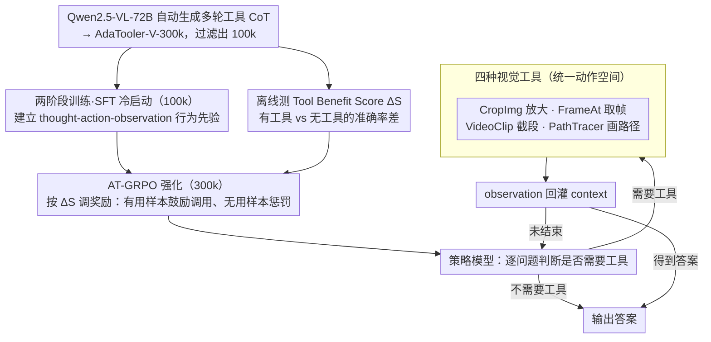

# AdaTooler-V: Adaptive Tool-Use for Images and Videos

**会议**: ACL 2026 Findings  
**arXiv**: [2512.16918](https://arxiv.org/abs/2512.16918)  
**代码**: https://github.com/CYWang735/AdaTooler-V  
**领域**: 多模态 VLM / 工具调用 / 强化学习  
**关键词**: 多模态推理, 自适应工具调用, AT-GRPO, Tool Benefit Score, V* bench

## 一句话总结
本文指出现有"thinking with images" MLLM 普遍存在**盲目工具调用**问题——所有视觉问题都强行 zoom-in/抽帧，反而 overthinking 降准、增推理成本；为此提出 AdaTooler-V，引入 AT-GRPO 强化学习算法用样本级 Tool Benefit Score 动态调节奖励尺度（工具有效时鼓励、无效时惩罚），让 7B 模型在 V* 高分辨率基准上达到 89.8%，超过 GPT-4o 与 Gemini 1.5 Pro。

## 研究背景与动机

**领域现状**：多模态 LLM 推理领域近来流行 "thinking with images" 范式——在思维链中插入对视觉工具（裁剪、抽帧、画路径）的调用，让模型反复 ground 到细节像素，显著提升对高分辨率、长视频等复杂视觉任务的表现（如 OpenThinkIMG、PixelReasoner、VITAL）。开源代表如 Vision-R1、Video-R1、OneThinker 都把 R1 风格的 RL 推广到 VLM。

**现有痛点**：作者观察到一个被忽略的核心问题——**盲目工具调用**。具体表现为：(a) 现有训练 reward 往往隐式鼓励工具使用，导致模型对所有问题都 zoom-in/抽帧；(b) 大量视觉问题其实纯文本 CoT 即可解（如"两幅图哪只钟显示几点"），强制工具调用反而触发 overthinking，让模型偏离正确推理路径；(c) 重复无意义的工具调用会逐步削弱模型对原始视觉输入的依赖，让模型更难聚焦关键视觉线索；(d) 在不需要工具的任务上每次冗余调用都增加 inference 成本。论文图 1 展示了一个分布——在他们的 300k 数据集上，约一半样本是 tool-helpful（$\Delta S > 0$），另一半是 tool-unhelpful 甚至 tool-harmful。

**核心矛盾**：模型缺少"判断这个问题是否需要工具"的显式机制；现有 RL 框架的 reward 信号一刀切，无法在样本级别区分"该用工具"和"不该用工具"。

**本文目标**：(1) 让 VLM 学会**自适应**决定每个问题是否调用视觉工具；(2) 在 RL 训练中引入样本级的工具收益信号，让奖励能感知"这次工具调用是否真的提升了性能"。

**切入角度**：作者定义 Tool Benefit Score $\Delta S$ = 同一样本用工具 vs 不用工具的平均准确率差，把样本明确分为 tool-helpful（$\Delta S > 0$）和 tool-unhelpful（$\Delta S \leq 0$）两类，然后改造 GRPO 的奖励尺度让其感知样本类型。

**核心 idea**：用 AT-GRPO（Adaptive Tool-use GRPO）——对 tool-helpful 样本放大调用工具的奖励、对 tool-unhelpful 样本惩罚不必要调用，配合两阶段（SFT 冷启动 + RL）训练，让模型自主学习何时调用工具。

## 方法详解

### 整体框架
AdaTooler-V 把多模态推理建模成 thought-action-observation 循环。给定 query + 图/视频，policy 模型先决定是否要工具：不需要则直接产出 thought $T$ 给出答案；需要则迭代生成 $(T_i, C_i)$，每个 action $C_i$ 调用 4 种视觉工具之一（CropImg / FrameAt / VideoClip / PathTracer），返回 observation $E_i$，回灌到 context 继续推理直到答案或达到 context/turn 上限。训练两阶段：(1) **SFT 冷启动**——在 AdaTooler-V-CoT-100k（多轮 tool-interaction trajectory）上 fine-tune，建立基础推理模式与 tool 调用行为先验；(2) **RL with verifiable rewards**——用 AT-GRPO 在 AdaTooler-V-300k 上 RL 训练，让模型自主探索"何时调工具"。

### 关键设计

**1. AT-GRPO：用样本级 Tool Benefit Score $\Delta S$ 让奖励学会"该不该用工具"**

标准 GRPO 的 reward 只看最终答案对不对，对"推理路径里有没有冗余工具调用"完全无感；而工具调用本身会带来 overthinking 和额外 inference 开销，模型很容易学到"无脑调用都能拿高分"的偷懒策略。AdaTooler-V 的破局点是给每个训练样本预先算一个 Tool Benefit Score $\Delta S = \text{Acc}(\text{with tool}) - \text{Acc}(\text{without tool})$——用 Qwen2.5-VL-72B 对同一样本分别跑 N 次"用工具"和"不用工具"的版本、取平均准确率之差（论文图 1 给出 300k 样本的 $\Delta S$ 分布）。RL 训练时再按 $\Delta S$ 改写 reward 尺度：对 $\Delta S > 0$ 的 tool-helpful 样本，调用工具的 trajectory 拿到更高 reward；对 $\Delta S \leq 0$ 的 tool-unhelpful 样本，调工具反而被惩罚、鼓励纯文本 CoT。这样策略梯度就能感知到"这个样本到底需不需要工具"的元信号，逐步学会自适应。它比单纯加一个全局 step penalty 精确得多——penalty 是一刀切的，而 $\Delta S$ 是逐样本测出来的，相当于把"工具调用必要性"作为样本级先验显式注入到 reward 里。

**2. 四种视觉工具构成统一动作空间：让 image 与 video 的局部交互可组合**

"thinking with images" 要求模型能在中间结果上反复 ground 到细节，AdaTooler-V 把这种能力收敛成 4 个语义清晰的工具：**CropImg**（按 bbox 裁剪/缩放图像，对应"zoom in"看细节）、**FrameAt**（按时间戳从视频取单帧）、**VideoClip**（按起止时间截一段视频）、**PathTracer**（在图上画两点间轨迹/连接，辅助空间推理）。四个工具的输入输出统一都是 image patch，回灌 context 后可以被后续工具继续操作——比如视频问题先 FrameAt 取关键帧、再 CropImg 放大其中某块区域。之所以把工具空间限定为"只返回视觉 observation"、不掺文本工具（搜索、计算器），是为了不让训练信号分散；这 4 个动作恰好覆盖图像 zoom、视频时间锚定、片段聚焦、空间路径追踪这几种 thinking-with-image 的核心模式。

**3. 两阶段训练 + 多模态联合数据：先学会调工具，再学会何时调**

多模态 long-trajectory 的探索空间巨大，纯 RL 冷启动几乎无法收敛，所以 AdaTooler-V 走"SFT 冷启动 + RL refine"的两阶段路线。数据侧先用 Qwen2.5-VL-72B 在数学、视觉计数、逻辑推理、空间理解、视频时序等任务（图 3 的分布）上自动生成 multi-turn 的 tool-interaction CoT，构成 AdaTooler-V-300k，再经规则过滤得到 100k 高质量 SFT 数据（AdaTooler-V-CoT-100k）。SFT 阶段直接 fine-tune，让模型先学会产出连贯的 (thought, action, observation) 循环、建立"会调工具"的行为先验；RL 阶段再用 AT-GRPO 在 verifiable rewards 任务上强化（多选用 exact match、numerical 用精确匹配、OCR 用 WER、free-form 用 ROUGE 均值），把模型从 SFT 的模式匹配里拽出来、学到"何时该调"的自适应策略。single-image / multi-image / video 三种模态联合训练，则让模型在单图上学到的细节聚焦能力能迁移到视频选帧等场景。

### 一个例子：两个样本如何被 $\Delta S$ 区别对待

- 一道 V\* 高分辨率题"图中右下角招牌上写了什么字"：纯文本 CoT 几乎必错（字太小看不清），用 CropImg 放大那块区域后正确率大幅上升，于是这个样本 $\Delta S > 0$。训练时模型生成"先 CropImg 放大 → 再读字"的 trajectory 会拿到更高 reward，强化"这类题该调工具"。
- 一道简单题"两幅图里哪只钟显示的时间更晚"：模型直接看图做文本 CoT 就能答对，强行 zoom-in 反而容易 overthinking 跑偏，于是 $\Delta S \leq 0$。训练时若模型还去调 CropImg，这条 trajectory 会被倒扣，逼它学会直接走文本推理。
- 两类样本在 300k 数据里近似各占一半（图 1 分布近对称），正是这种"逐样本"的奖励区分，让 7B 模型最终在 V\* 上做到 89.8%、反超 GPT-4o 的 65.2%。

### 损失函数 / 训练策略
SFT 阶段：标准 next-token 预测 loss on AdaTooler-V-CoT-100k 的 multi-turn trajectory（thought + action + observation 全部纳入 loss）。RL 阶段：AT-GRPO，base 是 GRPO 的 group-relative advantage estimation，关键改造在 reward 计算时引入 $\Delta S$ 缩放因子（具体公式论文未在 abstract/intro 给出但思路是"$\Delta S > 0$ 时工具调用得正向加 bonus，$\Delta S \leq 0$ 时倒扣"）。模型基于 Qwen2.5-VL-7B-Instruct。

## 实验关键数据

### 主实验
覆盖 12 个 benchmark，分单图（V*、MME、InfoVQA、MMBench、MathVista）、多图（MMSI-Bench、SPAR-Bench）、视频等。

| 模型 | Params | V* | MME | MathVista | MMSI-Bench |
|------|--------|------|------|-----------|------------|
| GPT-4o (闭源) | – | 65.2 | 2328 | 63.8 | 30.3 |
| Gemini 1.5 Pro (闭源) | – | 71.7 | – | 63.9 | 36.9 |
| InternVL3-8B | 8B | – | 2415 | 71.6 | 25.7 |
| Qwen2.5-VL-7B (base) | 7B | – | – | – | – |
| **AdaTooler-V-7B** | 7B | **89.8** | – | – | – |

(V* 89.8% 超过 GPT-4o 65.2% 和 Gemini 1.5 Pro 71.7%，论文重点宣传指标)

### 消融实验

| 配置 | V* | 说明 |
|------|------|------|
| Qwen2.5-VL-7B base | ~– | 无工具基线 |
| + 多模态 interleaved CoT（无 AT-GRPO）| ~– | 工具调用但盲调，存在 overthinking |
| + AT-GRPO（无 $\Delta S$ 区分，普通 GRPO）| ~– | 自适应 reward 关闭 |
| + Full AT-GRPO with $\Delta S$ | **89.8** | 完整模型 |

(具体消融数字论文未在前 2000 行给出，需查后文)

### 关键发现
- **V* 上 +24.6 大幅超越 GPT-4o**：高分辨率视觉细节任务恰恰是"工具是否帮上忙"差异最大的场景，AT-GRPO 在这上面收益最显著。
- **避免盲调显著降低推理成本**：论文 motivation 强调 unnecessary tool 调用浪费算力，AT-GRPO 让模型对简单题直接走文本 CoT。
- **多模态联合训练有益**：single-image / multi-image / video 数据混合训练让模型学到的"工具决策"能力跨模态迁移。
- **$\Delta S$ 分布近似对称**（图 1）：约一半样本工具有用，一半无用，证实"盲调"在数据层面就是普遍现象——这也是为什么样本级自适应 reward 比全局 hyperparameter 更优。

## 亮点与洞察
- **"$\Delta S$ 作为样本级元信号"是个简单但有效的设计**：用同一模型有/无工具的准确率差异定义工具收益，绕开了"如何判断该不该用工具"的元问题——直接经验性测出来，再喂回 RL reward。这种"先离线测元信号再用它调 reward"的思路可推广到其它 agentic 训练场景（如代码生成中"是否该执行 sandbox 验证"）。
- **首次明确指出 "blind tool-use" 是当前 thinking-with-image 范式的核心瓶颈**：之前工作都默认"工具越多越好"，本文用 motivation 数据说服读者一半样本工具反而有害，是个有价值的范式 critique。
- **统一 image 与 video 的工具空间**：CropImg + FrameAt + VideoClip + PathTracer 四个工具语义清晰、可组合（如视频问题"先 FrameAt 取关键帧再 CropImg 放大某区域"），避免了文献中工具空间过度专门化的问题。
- **7B 超越闭源 GPT-4o 的 V* 结果**：证明在精心设计的 thinking-with-image + 自适应工具决策下，开源中等规模模型也能在 specific 高分辨率视觉任务上做到 SOTA，对 deployable agentic VLM 有实际意义。

## 局限与展望
- $\Delta S$ 的离线测量依赖另一个"裁判模型"（Qwen2.5-VL-72B），生成 300k 数据集的成本可观；如果换 domain，需要重新跑一次有/无工具的对比，无法 zero-shot。
- 论文摘要/前文未给出 AT-GRPO 中 $\Delta S$ 如何精确缩放 reward 的数学公式，工程实现细节需要看代码确认；不同的缩放函数对训练稳定性影响应该不小。
- 4 个视觉工具仍较有限——未涵盖文本工具（OCR、搜索、计算器）、3D 操作、对比工具等，对更复杂的真实 agentic 场景覆盖不足。
- 仅在 7B 上验证，缺乏 scaling law 分析；大模型上 $\Delta S$ 分布可能向 tool-unhelpful 一侧倾斜（大模型本身视觉能力强了不需要工具），AT-GRPO 是否仍有效是个开放问题。
- benchmark 上的"工具该不该用"由数据决定，对于真实应用中"用户问题分布偏向需要/不需要工具"的不均衡情况，模型可能需要在线适应而非固定策略。

## 相关工作与启发
- **vs PixelReasoner / OpenThinkIMG / VITAL**：他们提出 thinking-with-images 范式但 reward 隐式鼓励调用工具，AdaTooler-V 第一次把"是否调用"作为显式优化目标。
- **vs Video-R1 / OneThinker**：他们扩展 R1 范式到视频/多模态但仍单一 reward signal，AT-GRPO 把样本级先验融入 GRPO。
- **vs Vision-R1**：早期 R1 风格 VLM，纯文本 CoT，AdaTooler-V 在其上引入多模态 interleaved CoT 并解决 over-tool 问题。

## 评分
- 新颖性: ⭐⭐⭐⭐ "$\Delta S$ 驱动自适应 reward" 是个清晰简洁的设计，首次系统化攻击 blind tool-use 问题。
- 实验充分度: ⭐⭐⭐⭐ 12 benchmark 跨单/多图/视频 + 工具调用分析 + V* 上对 GPT-4o 的反超，前 2000 行未见完整消融数字，整体充分性需查全文。
- 写作质量: ⭐⭐⭐⭐ motivation 图 1 + 数据分布讲得清晰，痛点诊断到位，case study 直观。
- 价值: ⭐⭐⭐⭐ 开源 7B 在 V* 上超闭源大模型，方法对所有 thinking-with-image VLM 训练有直接借鉴价值。

<!-- RELATED:START -->

## 相关论文

- [\[ICLR 2026\] VTool-R1: VLMs Learn to Think with Images via Reinforcement Learning on Multimodal Tool Use](../../ICLR2026/multimodal_vlm/vtool-r1_vlms_learn_to_think_with_images_via_reinforcement_learning_on_multimoda.md)
- [\[AAAI 2026\] VipAct: Visual-Perception Enhancement via Specialized VLM Agent Collaboration and Tool-use](../../AAAI2026/multimodal_vlm/vipact_visual-perception_enhancement_via_specialized_vlm_age.md)
- [\[CVPR 2026\] Thinking With Videos: Multimodal Tool-Augmented Reinforcement Learning for Long Video Reasoning](../../CVPR2026/multimodal_vlm/thinking_with_videos_multimodal_tool-augmented_reinforcement_learning_for_long_v.md)
- [\[CVPR 2026\] ARM-Thinker: Reinforcing Multimodal Generative Reward Models with Agentic Tool Use and Visual Reasoning](../../CVPR2026/multimodal_vlm/arm-thinker_reinforcing_multimodal_generative_reward_models_with_agentic_tool_us.md)
- [\[CVPR 2026\] CodeV: Code with Images for Faithful Visual Reasoning via Tool-Aware Policy Optimization](../../CVPR2026/multimodal_vlm/codev_code_with_images_for_faithful_visual_reasoning_via_tool-aware_policy_optim.md)

<!-- RELATED:END -->
