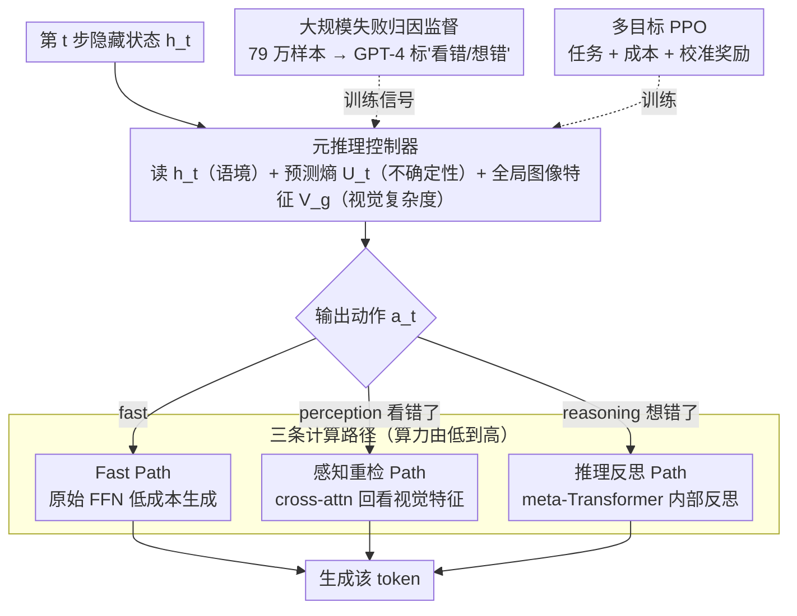

# Addressing Overthinking in Large Vision-Language Models via Gated Perception-Reasoning Optimization

**会议**: ACL 2026  
**arXiv**: [2601.04442](https://arxiv.org/abs/2601.04442)  
**代码**: 无  
**领域**: Multimodal VLM / Adaptive Computation  
**关键词**: 过度思考, 感知-推理分离, 元推理控制器, 自适应计算, 多目标强化学习

## 一句话总结

提出GPRO框架，通过元推理控制器在每个token生成步动态路由计算到三条路径（快速/感知重检/推理反思），解决LVLM的过度思考问题，同时提升精度和效率。

## 研究背景与动机

**领域现状**：大型视觉语言模型（LVLM）通过chain-of-thought机制展现了强大的推理能力，但这种"慢思考"方法经常导致过度思考——即使对简单问题也生成冗长的推理链。

**现有痛点**：(1) 过度思考不仅浪费计算资源，有时还会引入错误；(2) 现有的自适应推理方法忽略了一个关键瓶颈——视觉感知失败。大规模分析表明，LVLM错误中感知失败的频率是推理错误的两倍以上。

**核心矛盾**：当错误源于"看错了"而非"想错了"时，增加推理深度不仅无用，反而可能引入更多错误。现有方法仅关注推理自适应，完全忽略感知自适应。

**本文目标**：设计一个同时考虑感知不确定性和推理不确定性的自适应计算框架。

**切入角度**：借鉴认知科学中的双系统理论（Kahneman），人类解题时会在快速直觉、视觉重检和深度推理之间灵活切换。

**核心 idea**：通过大规模失败归因监督（79万样本）区分感知错误和推理错误，训练元推理控制器实现三路动态计算分配。

## 方法详解

### 整体框架

GPRO 把标准的"逐 token 慢思考"换成"逐 token 按需思考"。它在 Transformer decoder 的交替层里，把原本的 FFN 替换成 GPR 模块；每个 GPR 模块内装一个元推理控制器和三条计算路径。生成每一个 token 时，控制器先读取当前的内部状态，再决定这一步该走哪条路：要么直接快速吐字，要么回头重看图像，要么停下来做内部反思。三条路的算力开销由低到高，于是简单的 token 顺手带过、容易出错的 token 才额外加码，整体上既省算力又少出错。而控制器"该走哪条路"的判断能力，来自一份在约 79 万样本上构建的失败归因数据：它把每个错误标成"看错"还是"想错"，为路由决策提供了可监督的训练信号。

### 关键设计

**1. 元推理控制器：让模型在每个 token 步自己判断"要不要多想、往哪个方向多想"**

过度思考的本质是"该停不停"，而要做到自适应，关键得有个东西在每一步替模型做决策。控制器是一个 2 层的轻量 Transformer，它同时接收三个互补信号——当前隐藏状态 $h_t$ 反映"现在在想什么"（语义上下文）、预测熵 $U_t$ 反映"有多不确定"、全局图像特征 $V_g$ 反映"视觉输入有多复杂"——据此输出一个离散动作 $a_t \in \{\text{fast}, \text{perception}, \text{reasoning}\}$。三个信号缺一不可：只看熵会把"语言上的犹豫"误当成"需要重看图"，把图像复杂度也喂进去，控制器才能把"看不清"和"想不通"区分开。

**2. 三条计算路径：把"看错了"和"想错了"两类错误分开补救**

现有自适应推理方法只会调节推理深度，但作者的失败归因显示，LVLM 的错误里感知失败的频率是推理错误的两倍以上——当模型其实是"看错了"，再加推理只是雪上加霜。GPRO 因此把补救手段拆成三条专门的路：Fast Path 直接用原始 FFN 低成本生成；Slow Perception Path 用 cross-attention 回头重新审视视觉特征，$\text{Perc}(h_t, V) = \text{CrossAttn}(h_t, V, V)$，对应"重看图像"；Slow Reasoning Path 用一个 meta-Transformer 做内部自我反思，$\text{Reas}(h_t, H_{<t}) = \text{MetaTrans}(h_t, H_{<t})$，对应"重新思考"。分而治之的好处是每条路只解决一类问题，不像统一加深推理那样对感知错误无能为力。

**3. 大规模失败归因监督：给控制器一个"这步该看图还是该推理"的训练信号**

标准 benchmark 只告诉你最终答案对不对，却没说错在"看"还是错在"想"，控制器学不到该路由到哪条路。作者于是在约 79 万样本上运行 Qwen2.5-VL 收集错误案例，再用 GPT-4 把每个错误归因为"视觉感知失败"或"推理错误"，构建出带认知阶段标签的训练集。正是这份大规模归因数据，让"感知 vs 推理"的区分从一句口号变成了可监督的信号，也顺带量化出了"感知是主要瓶颈"这一全文论点。

### 损失函数 / 训练策略

多目标 PPO 训练，奖励函数 $R(\tau) = R_{task} + \alpha_c R_{cost} + \alpha_l R_{cal}$。Task Reward 答对 +1；Cost Reward 惩罚慢路径激活，逼控制器别滥用昂贵路径；Calibration Reward 确保不确定性分数与实际错误对齐（错误前应高、正确前应低），让控制器的"有多不确定"信号真正可信。

## 实验关键数据

### 主实验（Qwen2.5-VL-7B基座）

| 方法 | MathVision Acc | MathVerse Acc | MathVista Acc | 平均响应长度 |
|------|---------------|---------------|---------------|------------|
| Base Qwen2.5-VL-7B | 24.1 | 38.5 | 65.1 | ~350 |
| Mulberry | 比base提升 | 比base提升 | 比base提升 | 较长 |
| GPRO-7B | 显著提升 | 显著提升 | 显著提升 | **大幅缩短** |

### 消融实验

| 配置 | 关键指标 | 说明 |
|------|---------|------|
| 移除Perception Path | 精度下降明显 | 感知重检对纠错至关重要 |
| 移除Reasoning Path | 精度略降 | 推理自反思有辅助作用 |
| 移除Calibration Reward | 路径选择退化 | 不确定性校准是控制器的关键信号 |
| 错误归因分析 | 感知>推理 2:1 | 验证了"感知是主要瓶颈"的核心论点 |

### 关键发现
- GPRO在5个benchmark上同时提升精度和效率（更短响应），打破了"更准=更长"的假设
- 视觉感知失败确实是LVLM错误的主要来源（占比超过2/3），不是推理不足
- 三路控制器学到了有意义的路由策略——简单问题走Fast Path，视觉歧义走Perception Path

## 亮点与洞察
- "过度思考的根源可能不是想得不够，而是看得不清"——这一洞察改变了对LVLM推理优化的思考方向
- 大规模失败归因数据的构建方法可复用——用强模型标注弱模型的错误类型是一种通用的监督生成策略
- 三路计算架构优雅地将认知科学的双系统理论工程化

## 局限与展望
- GPT-4的失败归因可能本身存在偏差，需要更可靠的归因方法
- 元推理控制器增加了模型复杂度，部署时需要额外工程
- 3B和7B模型已验证，但更大规模模型的适用性未测试
- 未来可探索更细粒度的感知路径（如区域级重检vs全图重检）

## 相关工作与启发
- **vs 自适应推理方法（FAST等）**: 首次将感知自适应纳入，不仅调节推理深度还调节感知深度
- **vs Mixture-of-Experts**: MoE在参数维度做选择，GPRO在计算类型维度做选择
- **vs Vision-R1/LMM-R1**: 这些方法通过RL增强推理但不区分感知和推理错误

## 评分
- 新颖性: ⭐⭐⭐⭐⭐ 感知-推理分离的自适应计算是全新范式
- 实验充分度: ⭐⭐⭐⭐ 5个benchmark、消融、归因分析
- 写作质量: ⭐⭐⭐⭐ 动机论证有力，架构描述清晰
- 价值: ⭐⭐⭐⭐⭐ 对LVLM推理优化有范式性影响

<!-- RELATED:START -->

## 相关论文

- [\[ACL 2026\] GeoArena: Evaluating Open-World Geographic Reasoning in Large Vision-Language Models](geoarena_evaluating_open-world_geographic_reasoning_in_large_vision-language_mod.md)
- [\[ACL 2026\] ChemVLR: Prioritizing Reasoning in Perception for Chemical Vision-Language Understanding](chemvlr_prioritizing_reasoning_in_perception_for_chemical_vision-language_unders.md)
- [\[ACL 2026\] A Survey of Multimodal Mathematical Reasoning: From Perception, Alignment to Reasoning](a_survey_of_multimodal_mathematical_reasoning_from_perception_alignment_to_reaso.md)
- [\[ACL 2026\] OMIBench: Benchmarking Olympiad-Level Multi-Image Reasoning in Large Vision-Language Models](omibench_benchmarking_olympiad-level_multi-image_reasoning_in_large_vision-langu.md)
- [\[CVPR 2026\] Breaking the Regional Perception Bottleneck of Multimodal Large Language Models via External Reasoning Framework](../../CVPR2026/multimodal_vlm/breaking_the_regional_perception_bottleneck_of_multimodal_large_language_models_.md)

<!-- RELATED:END -->
